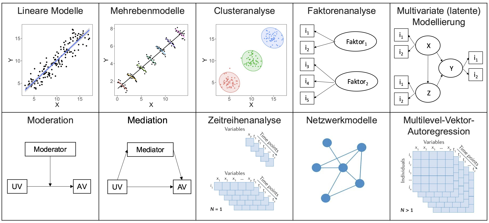

```{r setup, include=FALSE}
options(htmltools.dir.version = FALSE)

library(tidyverse)
library(kableExtra)
library(ggplot2)
library(plotly)
library(htmlwidgets)
library(MASS)
library(ggpubr)
library(xaringanthemer)
library(xaringanExtra)

style_duo_accent(
  primary_color = "#621C37",
  secondary_color = "#EE0071",
  background_image = "blank.png"
)

xaringanExtra::use_xaringan_extra(c("tile_view"))

use_scribble(
  pen_color = "#EE0071",
  pen_size = 4
)

knitr::opts_chunk$set(
  fig.retina = TRUE,
  warning = FALSE,
  message = FALSE,
  comment = NA
)

source(file = "base_functions.R")

Xname = ""
Yname = ""
nudgnumber = 3
my_green = "#EE0071"
```

name: Title slide
class: middle, left
<br><br><br><br><br><br><br>
# Multivariate Verfahren
***
### Einheit 1: Wiederholung und Einführung in multivariate Verfahren
##### Wintersemester 2025 | Prof. Dr. Stephan Goerigk

---
class: top, left
name: Contact Slide

### Kontakt

.pull-left[
Prof. Dr. phil. Stephan Goerigk 

Psychologische Methodenlehre

Infanteriestraße 11a · 80797 München · 

[stephan.goerigk@charlotte-fresenius-uni.de](mailto:stephan.goerigk@charlotte-fresenius-uni.de)

Zoom Sprechstunde (bitte per Email anmelden): 
* Meeting-ID: 284 567 8838  
* Kenncode: 807174

Commitment to Research Transparency
http://www.researchtransparency.org
]

.pull-right[
.center[
<br><br><br>
.bottom[]
]
]

---
class: top, left
### Übersicht Lehrveranstaltung 

Termine:
* Mittwoch 14:45 - 16:15 
* Raum: HS P2 001

Begleitende Übung zur Vorlesung (Blockunterricht):
* Dozentin: Janika Saretzki ([janika.saretzki@charlotte-fresenius-uni.de](mailto:janika.saretzki@charlotte-fresenius-uni.de))

Materialien:
* werden auf [Studynet](https://studynet.hs-fresenius.de/ilias.php?baseClass=ilrepositorygui&ref_id=49744) (https://studynet.hs-fresenius.de/ilias.php?baseClass=ilrepositorygui&ref_id=49744) bereitgestellt

Prüfungsleistung:
* Portfolio (Abgabetermin: März 2026)

---
class: top, left
### Material (bitte mitbringen)

Es werden Berechnungen mit R durchgeführt

* Installation R und RStudio (idealerweise) auf eigenem Laptop

* Material auf Lernplattform Studynet

* Foliensätze

* Wiederholung: R Einführung (Skriptum, Bachelor)

* Installationsskript für relevante R Pakete

* Markdown Code zur Bearbeitung der Prüfungsleistung (Portfolio)

---
class: top, left
### Prüfungsleistung - Portfolio

* Im Verlauf des Semesters angefertigtes Lernportfolio

* Besteht aus mehreren Aufgaben zur Überprüfung der im Modul vermittelten Kompetenzen

* Arbeiten mit Anwendungsbezug (z.B. Studienplanung)

* Analysen und Analyseprotokolle

* grafische Aufbereitungen

* Thesenpapiere und Reflexionen

* Die Aufgaben werden in einem RMarkdown Codebook bearbeitet.

* Aufgaben werden während des Semesters bearbeitet, Codebook wird am Semesterende in studynet abgegeben (Uploadbereich).

---
class: top, left
### Termine

```{r echo = F}
df = readxl::read_xlsx("Multivariate Verfahren Termine.xlsx", sheet = "Tabellenblatt1")[1:15, 1:3]
df$Datum = format(as.Date(df$Datum), "%d.%m.%Y")
df %>%
  kbl() %>%
  kable_classic(full_width = T, position = "left", font_size = 15)
```

---
class: top, left
### Einführung in multivariate Verfahren

**Was sind multivariate Verfahren?**

* Statistische Methoden zur gleichzeitigen Analyse mehrerer Variablen.

* Erfassen komplexer Zusammenhänge zwischen verschiedenen Einflussgrößen.

* Nutzen sowohl in der Hypothesengenerierung (strukturentdeckende Verfahren) als auch in der Hypothesenprüfung (strukturprüfende Verfahren).

**Rolle in der Psychologie**

* Evaluation der Wirksamkeit von Interventionen auf unterschiedliche Maße (Outcomes).

* Vorhersage von Verhaltensweisen oder psychischen Störungen auf Basis mehrerer Prädiktoren.

* Gruppierung von Personen mit ähnlichen Merkmalen oder Symptomen (z.B. in der klinischen Psychologie).

* Evaluation von Theorien durch Analyse der Beziehungen zwischen mehreren Variablen gleichzeitig.

---
class: top, left
### Einführung in multivariate Verfahren

**Multivariate Verfahren - Semesterfahrplan**

.center[
```{r eval = TRUE, echo = F, out.width = "1000px"}

```
]

---
class: top, left
### Wiederholung: Lineare Regressionsmodelle

* Regression ist eines der flexibelsten Modelle der Statistik - Logik des Regressionsmodells: 

.center[

** *Zu Erklärender Teil (AV) = Erklärender Teil (UVs)* **

** *Y = X + $\varepsilon$* **

** *Daten = Modell + Fehler* **

** *Daten = Erklärte Varianz + Unerklärte Varianz* **

** *Daten = Systematischer Anteil + Unsystematischer Anteil* **


]

---
class: top, left
### Wiederholung: Lineare Regressionsmodelle

* Regression ist eines der flexibelsten Modelle der Statistik - Logik des Regressionsmodells: 

.center[

** *Y = X + $\varepsilon$* **

]

<small>

.pull-left[

**Y / Kriterium / Abhängige Variable**

Alle Variablenarten erlaubt - Regressionstyp ändert sich

Allgemeines lineares Modell (LM):

* kontinuierlich numerisch (normalverteile Fehler)

Verallgemeinertes lineares Modell (GLM):

* nominale Variablen / Kategorien (logistische Regression)

* Anzahl Events (z.B. Poisson-Regression, negativ-bionomiale Regression)

* Prozente (Probit-Regression, Beta-Regression)

* Zeit bis Event (Survivalanalyse)

]

.pull-right[

**X / Prädiktor / Unabhängige Variable**

Alle Variablenarten erlaubt - Regressionstyp ändert sich nicht

* $1$ Prädiktor = Einfache Regression

* $>1$ Prädiktoren = Multiple Regression

  * ohne Interaktion

  * mit Interaktion

* Für numerische Prädiktoren wird 1 Steigung geschätzt

* Kategoriale Prädiktoren werden dummy-codiert 

  * es werden k-1 Steigungen geschätzt
  
  * Jede Steigung quantifiziert der Unterschied von Kategorie $k_i$ zur Referenzkategorie $k_0$
]


---
class: top, left
### Wiederholung: Lineare Regressionsmodelle

#### Lineare Regressionsfunktion

```{r include=FALSE}
sampledata = read.csv("sampledata.csv")
model = lm(Y ~ X, data = sampledata)
sampledata$pred = predict(model, newdata = sampledata)
sampledata_long = multilevel::make.univ(sampledata, sampledata[,3:4], outname = "Y")
sampledata_long = sampledata_long[,c(1,2, 4, 5,6)]
names(sampledata_long) = c("ID", "X", "pred", "Predicted", "Y")
sampledata_long$Predicted = factor(sampledata_long$Predicted, levels = 0:1, labels = c("yi Beobachtungswert", "ŷi geschätzter Wert"))
sampledata_long$ID[sampledata_long$Predicted ==  "ŷi geschätzter Wert"] = ""
```

$X \rightarrow Y$ Regressionsfunktion und Beobachtungswerte

.pull-left[
```{r echo = F, out.height = "420px"}
scatterplot = ggplot(data = sampledata_long[sampledata_long$Predicted == "yi Beobachtungswert",], aes(x = X, y = Y, label = ID, colour = Predicted)) +
  geom_point() +
  #geom_text(check_overlap = TRUE, vjust = 0, nudge_y = nudgnumber) +
  scale_color_manual(values = c("yi Beobachtungswert" = "black",
                                "ŷi geschätzter Wert" = my_green)) +
  theme_classic() +
  coord_cartesian(xlim = c(0,100), ylim = c(0,100)) +
  labs(colour = "", x = "Lernaufwand (X)", y = "Klausurerfolg (Y)") +
  theme(rect = element_rect(fill = "transparent"), legend.position = "bottom") 
ggplotly(scatterplot) %>%
  layout(legend = list(x = 0.6, y = 0.1))
```
]

.pull-right[
* Jeder Punkt repräsentiert eine Kombination aus $X$ und $Y$ Werten 

* Wir könnten also sagen, jeder Punkt ist eine Person aus unserem Beispiel 

* Es gilt, in der Regression eine Funktion zu finden, die diese Daten möglichst genau widerspiegelt 
]

---
class: top, left
### Wiederholung: Lineare Regressionsmodelle

#### Lineare Regressionsfunktion

$X \rightarrow Y$ Regressionsfunktion und Beobachtungswerte

.pull-left[
```{r echo = F, out.height = "420px"}
scatterplot = ggplot(data = sampledata_long[sampledata_long$Predicted == "yi Beobachtungswert",], aes(x = X, y = Y, label = ID, colour = Predicted)) +
  geom_point() +
  #geom_text(check_overlap = TRUE, vjust = 0, nudge_y = nudgnumber) +
  scale_color_manual(values = c("yi Beobachtungswert" = "black",
                                "ŷi geschätzter Wert" = my_green)) +
  geom_abline(slope = coef(model)[["X"]], 
              intercept = coef(model)[["(Intercept)"]], colour = my_green) +
  theme_classic() +
  coord_cartesian(xlim = c(0,100), ylim = c(0,100)) +
  labs(colour = "", x = "Lernaufwand (X)", y = "Klausurerfolg (Y)") +
  theme(rect = element_rect(fill = "transparent")) 
ggplotly(scatterplot) %>%
  layout(legend = list(x = 0.6, y = 0.1))
```
]

.pull-right[
* Im Falle der *linearen* Regression wird unterstellt, dass diese Funktion linear, also eine Gerade ist
]

---
class: top, left
### Wiederholung: Lineare Regressionsmodelle

#### Lineare Regressionsfunktion

$X \rightarrow Y$ Regressionsfunktion und Beobachtungswerte

.pull-left[
```{r echo = F, out.height = "420px"}
scatterplot = ggplot(data = sampledata_long[sampledata_long$Predicted == "yi Beobachtungswert",], aes(x = X, y = Y, label = ID, colour = Predicted)) +
  geom_point() +
  #geom_text(check_overlap = TRUE, vjust = 0, nudge_y = nudgnumber) +
  scale_color_manual(values = c("yi Beobachtungswert" = "black",
                                "ŷi geschätzter Wert" = my_green)) +
  geom_smooth(se = F, colour = my_green)+
  theme_classic() +
  coord_cartesian(xlim = c(0,100), ylim = c(0,100)) +
  labs(colour = "", x = "Lernaufwand (X)", y = "Klausurerfolg (Y)") +
  theme(rect = element_rect(fill = "transparent")) 
ggplotly(scatterplot) %>%
  layout(legend = list(x = 0.6, y = 0.1))
```
]

.pull-right[
* Theoretisch wären allerdings auch andere Funktionen denkbar.

* Diese beschreiben die vorliegenden Daten ggf. besser, sind aber nicht so leicht interpretierbar/generalisierbar.
]

---
class: top, left
### Wiederholung: Lineare Regressionsmodelle

#### Lineare Regressionsfunktion

$X \rightarrow Y$ Regressionsfunktion und Beobachtungswerte

.pull-left[
```{r echo = F, out.height = "420px"}
scatterplot = ggplot(data = sampledata_long[sampledata_long$Predicted == "yi Beobachtungswert",], aes(x = X, y = Y, label = ID, colour = Predicted)) +
  geom_segment(aes(x = 0, 
                   xend = 12,
                   y=23,
                   yend= 23), linetype = "dotted", colour = "grey") +
  geom_segment(aes(x = 12, 
                   xend = 12,
                   y=0,
                   yend= 23), linetype = "dotted", colour = "grey") +
  geom_point() +
  # geom_text(check_overlap = TRUE, vjust = 0, nudge_y = nudgnumber) +
  scale_color_manual(values = c("yi Beobachtungswert" = "black",
                                "ŷi geschätzter Wert" = my_green)) +
  geom_abline(slope = coef(model)[["X"]], 
              intercept = coef(model)[["(Intercept)"]], colour = my_green) +
  annotate(geom = "Text",  label = "x<sub>i</sub>", x = 12/2, y = 23+nudgnumber+2) +
  annotate(geom = "Text",  label = "y<sub>i</sub>", x = 12+nudgnumber+2, y = 23/2) +
  theme_classic() +
  labs(colour = "", x = "Lernaufwand (X)", y = "Klausurerfolg (Y)") +
  theme(rect = element_rect(fill = "transparent")) +
  coord_cartesian(xlim = c(0,100), ylim = c(0,100))
ggplotly(scatterplot) %>%
  layout(legend = list(x = 0.6, y = 0.1))
```
]

.pull-right[
* Jeder Beobachtungspunkt hat für den $X$ Wert einen entsprechenden $Y$ Wert.

* Er ist somit eindeutig für die beiden Variablen definiert.

ABER:

* Für jeden gegebenen $X$ Wert lässt sich ein Punkt auf der Geraden finden, der einen anderen $Y$ Wert hat
]

---
class: top, left
### Einfache lineare Regression

#### Wiederholung: Lineare Regressionsmodelle

$X \rightarrow Y$ Regressionsfunktion und Beobachtungswerte

.pull-left[
```{r echo = F, out.height = "420px"}
scatterplot = ggplot(data = sampledata_long, aes(x = X, y = Y, label = ID, colour = Predicted)) +
  geom_segment(aes(x = 0, 
                   xend = 12,
                   y=23,
                   yend= 23), linetype = "dotted", colour = "grey") +
  geom_segment(aes(x = 12, 
                   xend = 12,
                   y=0,
                   yend= 23), linetype = "dotted", colour = "grey") +
  geom_segment(aes(x = 0,
                   xend = 12,
                   y=40.42,
                   yend= 40.42), linetype = "dotted", colour = "grey") +
  geom_segment(aes(x = 12,
                   xend = 12,
                   y=0,
                   yend= 40.42), linetype = "dotted", colour = "grey") +
  geom_point() +
  # geom_text(check_overlap = TRUE, vjust = 0, nudge_y = nudgnumber) +
  scale_color_manual(values = c("yi Beobachtungswert" = "black",
                                "ŷi geschätzter Wert" = my_green)) +
  geom_abline(slope = coef(model)[["X"]], 
              intercept = coef(model)[["(Intercept)"]], colour = my_green) +
  annotate(geom = "Text",  label = "x<sub>i</sub>", x = 12/2, y = 23+nudgnumber+2) +
  annotate(geom = "Text",  label = "y<sub>i</sub>", x = 12+nudgnumber+2, y = 23/2) +
  annotate(geom = "Text",  label = "x<sub>i</sub>", x = 12/2, y = sampledata_long$Y[sampledata_long$X == 12 & sampledata_long$Predicted == "ŷi geschätzter Wert"]+nudgnumber+2) +
  annotate(geom = "Text",  label = "ŷ<sub>i</sub>", x = 12+nudgnumber+2, y = sampledata_long$Y[sampledata_long$X == 12 & sampledata_long$Predicted == "ŷi geschätzter Wert"]/1.333) +
  theme_classic() +
  labs(colour = "", x = "Lernaufwand (X)", y = "Klausurerfolg (Y)") +
  theme(rect = element_rect(fill = "transparent")) +
  coord_cartesian(xlim = c(0,100), ylim = c(0,100))
ggplotly(scatterplot) %>%
  layout(legend = list(x = 0.6, y = 0.1))
```
]

.pull-right[
* Der pinke Punkt ist der gemäß der linearen Funktion geschätzte $Y$ Wert für den Punkt X 

* Es ist also der Wert, den man unter Annahme eines linearen Zusammenhangs **erwarten** würde

* Diese Punkte haben den $X$ Wert gemeinsam aber sind unterschiedlich im $Y$ Wert.
]

---
class: top, left
### Wiederholung: Lineare Regressionsmodelle

#### Lineare Regressionsfunktion

$X \rightarrow Y$ Regressionsfunktion und Beobachtungswerte

.pull-left[
```{r echo = F, out.height = "400px"}
scatterplot = ggplot(data = sampledata_long, aes(x = X, y = Y, label = ID, colour = Predicted)) +
  geom_segment(aes(x = 0, 
                   xend = 12,
                   y=23,
                   yend= 23), linetype = "dotted", colour = "grey") +
  geom_segment(aes(x = 12, 
                   xend = 12,
                   y=0,
                   yend= 23), linetype = "dotted", colour = "grey") +
  geom_segment(aes(x = 0, 
                   xend = 12,
                   y=40.43,
                   yend= 40.43), linetype = "dotted", colour = "grey") +
  geom_segment(aes(x = 12, 
                   xend = 12,
                   y=0,
                   yend= 40.43), linetype = "dotted", colour = "grey") +
  geom_segment(aes(x = 12, 
                   xend = 12,
                   y=23,
                   yend= 40.43), linetype = "dotted", colour = "red") +
  geom_point() +
  #geom_text(check_overlap = TRUE, vjust = 0, nudge_y = nudgnumber) +
  scale_color_manual(values = c("yi Beobachtungswert" = "black",
                                "ŷi geschätzter Wert" = my_green)) +
  geom_abline(slope = coef(model)[["X"]], 
              intercept = coef(model)[["(Intercept)"]], colour = my_green) +
  annotate(geom = "Text",  label = "x<sub>i</sub>", x = 12/2, y = 23+nudgnumber+2) +
  annotate(geom = "Text",  label = "y<sub>i</sub>", x = 12+nudgnumber+2, y = 23/2) +
  annotate(geom = "Text",  label = "x<sub>i</sub>", x = 12/2, y = sampledata_long$Y[sampledata_long$X == 12 & sampledata_long$Predicted == "ŷi geschätzter Wert"]+nudgnumber+2) +
  annotate(geom = "Text",  label = "ŷ<sub>i</sub>", x = 12+nudgnumber+2, y = sampledata_long$Y[sampledata_long$X == 12 & sampledata_long$Predicted == "ŷi geschätzter Wert"]/1.333) +
  theme_classic() +
  labs(colour = "", x = "Lernaufwand (X)", y = "Klausurerfolg (Y)") +
  theme(rect = element_rect(fill = "transparent")) +
  coord_cartesian(xlim = c(0,100), ylim = c(0,100))
ggplotly(scatterplot) %>%
  layout(legend = list(x = 0.6, y = 0.1))
```
]

.pull-right[
* Wie wir aber sehen, gibt es hier einen Unterschied in den beiden $Y$ Werten 

* Dieser Unterschied ist unser sogenannter Vorhersagefehler oder auch **Residuum** 
* Differenz zwischen Beobachtungswert und vorhergesagtem Wert
* Das Residuum wird mit $\varepsilon_i$ bezeichnet

Formel für das Residuum:

$$\varepsilon_i=\hat{y}_i - y_i$$
]

---
class: top, left
### Wiederholung: Lineare Regressionsmodelle

#### Lineare Regressionsfunktion

$X \rightarrow Y$ Regressionsfunktion und Beobachtungswerte

.pull-left[
```{r echo = F, out.height = "420px"}
scatterplot = ggplot(data = sampledata_long, aes(x = X, y = Y, label = ID, colour = Predicted)) +
  geom_segment(x = 0, xend = 10, y = coef(model)[["(Intercept)"]], yend = coef(model)[["(Intercept)"]], colour = "black") +
  geom_segment(x = 10, xend = 10, y = coef(model)[["(Intercept)"]], yend = predict(model, newdata = data.frame(X=10)), colour = "black") +
  geom_point(x = 0, y = coef(model)[["(Intercept)"]], colour = my_green) +
  geom_point() +
  geom_abline(slope = coef(model)[["X"]], 
              intercept = coef(model)[["(Intercept)"]], colour = my_green) +
  theme_classic()+
  scale_color_manual(values = c("yi Beobachtungswert" = "black",
                                "ŷi geschätzter Wert" = my_green)) +
  theme(rect = element_rect(fill = "transparent")) +
  labs(colour = "", x = "Lernaufwand (X)", y = "Klausurerfolg (Y)") +
  annotate(geom = "Text",  label = "a", x = 0, y = coef(model)[["(Intercept)"]] + 5, colour =  "red") +
  annotate(geom = "Text",  label = "b", x = 12, y = predict(model, newdata = data.frame(X=10)) - (predict(model, newdata = data.frame(X=10)) - coef(model)[["(Intercept)"]])/2, colour =  "red") +
  coord_cartesian(xlim = c(0,100), ylim = c(0,100)) #+
#theme(axis.text = element_blank(), axis.ticks = element_blank(), axis.line = element_blank(), axis.title = element_blank())
ggplotly(scatterplot) %>%
  layout(legend = list(x = 0.6, y = 0.1))
```
]

.pull-right[
$$\hat{y}_i=a+b \cdot x_i + \varepsilon_i$$
$a:$ Y-Achsenabschnitt <br>
$b:$ Steigungsparameter

**Interpretation:**

$a:$ Wert, den $Y$ hat, wenn $X=0$ ist <br>
$b:$ Veränderung von Y bei Zunahme von $X$ um 1 Einheit

In dieser Vorlesung nutzen wir oft folgende Notation:

$$Y_i = \beta_0 + \beta_1 \cdot X_i + \varepsilon_i, \quad \varepsilon_i \sim N(0, \sigma^2_{\varepsilon})$$

---
class: top, left
### Wiederholung: Lineare Regressionsmodelle

#### Residuen und Zielfunktion

.pull-left[
```{r echo = F, out.height = "420px"}
scatterplot = ggplot(data = sampledata_long[sampledata_long$Predicted == "yi Beobachtungswert",], aes(x = X, y = Y, label = ID, colour = Predicted)) +
  geom_point() +
  geom_abline(slope = coef(model)[["X"]] - coef(model)[["X"]]*0.8, 
              intercept = coef(model)[["(Intercept)"]], colour = my_green, linetype = "dashed") +
  geom_abline(slope = coef(model)[["X"]]- coef(model)[["X"]]*0.5, 
              intercept = coef(model)[["(Intercept)"]], colour = my_green, linetype = "dashed") +
  geom_abline(slope = coef(model)[["X"]], 
              intercept = coef(model)[["(Intercept)"]], colour = my_green) +
  geom_abline(slope = coef(model)[["X"]]+ coef(model)[["X"]]*0.5, 
              intercept = coef(model)[["(Intercept)"]], colour = my_green, linetype = "dashed") +
  geom_abline(slope = coef(model)[["X"]] + coef(model)[["X"]]*0.8, 
              intercept = coef(model)[["(Intercept)"]], colour = my_green, linetype = "dashed") +
  theme_classic()+
  labs(colour = "", x = "Lernaufwand (X)", y = "Klausurerfolg (Y)") +
  scale_color_manual(values = c("yi Beobachtungswert" = "black",
                                "ŷi geschätzter Wert" = my_green)) +
  theme(rect = element_rect(fill = "transparent")) +
  coord_cartesian(xlim = c(0,100), ylim = c(0,100))
ggplotly(scatterplot)%>%
  layout(legend = list(x = 0.6, y = 0.1))
```
]

.pull-right[
$$\hat{y}_i=a+b \cdot x_i + \varepsilon_i$$
$a:$ Y-Achsenabschnitt <br>
$b:$ Steigungsparameter

* Theoretisch sind endlos viele Geraden denkbar, die die Punktewolke alle an unterschiedlichen Stellen durchschneiden

* Wir wollen aber genau die Gerade finden, welche die Daten am allerbesten beschreibt.
]

---
class: top, left
### Wiederholung: Lineare Regressionsmodelle

#### Residuen und Zielfunktion

.pull-left[
```{r echo = F, out.height = "420px"}
scatterplot = ggplot(data = sampledata_long, aes(x = X, y = Y, colour = Predicted)) +
  geom_segment(aes(xend = X, yend = pred), linetype = "dotted", colour = "red") +
  geom_point() +
  geom_abline(slope = coef(model)[["X"]], 
              intercept = coef(model)[["(Intercept)"]], colour = my_green) +
  theme_classic() +
  theme(rect = element_rect(fill = "transparent")) +
  scale_color_manual(values = c("yi Beobachtungswert" = "black",
                                "ŷi geschätzter Wert" = my_green)) +
  labs(colour = "", x = "Lernaufwand (X)", y = "Klausurerfolg (Y)") +
  coord_cartesian(xlim = c(0,100), ylim = c(0,100))
ggplotly(scatterplot) %>%
  layout(legend = list(x = 0.6, y = 0.1))
```
]

.pull-right[
**Ziel:**

* Y-Achsenabschnitt und Steigung so wählen, dass die lineare Funktion die Punkte möglichst gut widerspiegelt 

* gut widerspiegeln = Abstand zwischen dem Beobachtungswert und dem gemäß linearer Funktion geschätzten Wert möglichst klein halten

**Bildliche Vorstellung: **

Wenn ich die Residuen aller Beobachtungswerte zu einer Schnur aneinanderhänge, soll diese Schnur möglichst kurz sein
]


---
class: top, left
### Wiederholung: Lineare Regressionsmodelle

#### Residuen und Zielfunktion

.pull-left[
```{r echo = F, out.height = "420px"}
scatterplot = ggplot(data = sampledata_long, aes(x = X, y = Y, colour = Predicted)) +
  geom_segment(aes(xend = X, yend = pred), linetype = "dotted", colour = "red") +
  geom_point() +
  geom_abline(slope = coef(model)[["X"]], 
              intercept = coef(model)[["(Intercept)"]], colour = my_green) +
  theme_classic() +
  theme(rect = element_rect(fill = "transparent")) +
  scale_color_manual(values = c("yi Beobachtungswert" = "black",
                                "ŷi geschätzter Wert" = my_green)) +
  labs(colour = "", x = "Lernaufwand (X)", y = "Klausurerfolg (Y)") +
  coord_cartesian(xlim = c(0,100), ylim = c(0,100))
ggplotly(scatterplot) %>%
  layout(legend = list(x = 0.6, y = 0.1))
```
]

.pull-right[
Es liegt ein Optimierungsproblem vor:

* Die Summe der quadrierten Residuen wird über alle Beobachtungswerte minimiert 

* So werden die optimalen Werte für a und b gefunden

* Quadrierung verhindert, dass sich negative und positive Werte ausgleichen

$$\sum\limits _{i=1}^{n}\varepsilon^2_i=\varepsilon^2_1+\varepsilon^2_2...+\varepsilon^2_n \rightarrow \min_{a,b}$$
]

---
class: top, left
### Wiederholung: Lineare Regressionsmodelle

.pull-left[
#### Kategoriale Prädiktoren: Dummy und Effektkodierung

* kategorialer Prädiktor lässt sich mathematisch integrieren, indem Kategorien numerisch kodiert werden

* Bei 0 und 1 spricht man von einer **Dummy-Kodierung** (z.B.: gesund = 0, erkrankt = 1)

* Bei -1 und 1 spricht man von einer **Effekt-Kodierung** (z.B.: gesund = -1, erkrankt = 1)

* Zahlen sind arbiträr (0 und 4 wäre auch möglich), aber Kodierung mit 1 ist leichter zu interpretieren.
]

.pull-right[
```{r echo=FALSE}
set.seed(123)
df = data.frame(Gruppe = c(rep("Gesund", 8),
                           rep("GAD", 8)),
                Codiert = c(rep("0", 8),
                            rep("1", 8)),
                Codiert2 = c(rep("-1", 8),
                             rep("1", 8)),
                Sorgen = round(c(rnorm(8, 4, 1),
                                 rnorm(8, 9, 1)),2))
names(df) = c("UV: Gruppe (nominal dichotom)",
              "UV: Gruppe (Dummy-kodiert)",
              "UV: Gruppe (Effekt-kodiert)",
              "AV: Sorgen (skaliert von 1-12)")
knitr::kable(df,
             booktabs = T,
             longtable = F) %>%
  kable_classic(full_width = T,
                font_size = 12,
                html_font = "Times New Roman")
```
]

---
class: top, left
### Wiederholung: Lineare Regressionsmodelle

.pull-left[
#### Kategoriale Prädiktoren: Dummy und Effektkodierung

* Art der Kodierung ist wichtig für Interpretation von Modellkoeffizienten

* Auswirkung auf Y-Achsenschnittpunkt (Intercept)

* Auswirkung auf Steigungskoeffizient anderer Prädiktoren

]

.pull-right[
```{r echo=FALSE}
set.seed(123)
df = data.frame(Gruppe = c(rep("Gesund", 8),
                           rep("GAD", 8)),
                Codiert = c(rep(0, 8),
                            rep(1, 8)),
                Codiert2 = c(rep(-1, 8),
                             rep(1, 8)),
                Sorgen = round(c(rnorm(8, 4, 1),
                                 rnorm(8, 9, 1)),2))
names(df) = c("UV: Gruppe (nominal dichotom)",
              "UV: Gruppe (Dummy-kodiert)",
              "UV: Gruppe (Effekt-kodiert)",
              "AV: Sorgen (skaliert von 1-12)")

set.seed(555)
df$Grübelzeit[df$`UV: Gruppe (nominal dichotom)` == "Gesund"] = 5 + 0 * df$`AV: Sorgen (skaliert von 1-12)`[df$`UV: Gruppe (nominal dichotom)` == "Gesund"] + rnorm(8, 0, 1)
df$Grübelzeit[df$`UV: Gruppe (nominal dichotom)` == "GAD"] = 1 * df$`AV: Sorgen (skaliert von 1-12)`[df$`UV: Gruppe (nominal dichotom)` == "GAD"] + rnorm(8, 0, 1)
df$Grübelzeit = round(df$Grübelzeit, 2)

names(df) = c("UV: Gruppe (nominal dichotom)",
              "UV: Gruppe (Dummy-kodiert)",
              "UV: Gruppe (Effekt-kodiert)",
              "AV: Sorgen (skaliert von 1-12)",
              "UV: Grübelzeit")

knitr::kable(df,
             booktabs = T,
             longtable = F) %>%
  kable_classic(full_width = T,
                font_size = 12,
                html_font = "Times New Roman")
```
]

---
class: top, left
### Wiederholung: Lineare Regressionsmodelle

.pull-left[
#### Kategoriale Prädiktoren: Dummy und Effektkodierung

* Art der Kodierung ist wichtig für Interpretation von Modellkoeffizienten

* Auswirkung auf Y-Achsenschnittpunkt (Intercept)

* Auswirkung auf Steigungskoeffizient anderer Prädiktoren

]

.pull-right[
```{r echo=FALSE}
ggplot(df, aes(x = `UV: Grübelzeit`, y = `AV: Sorgen (skaliert von 1-12)`, colour = `UV: Gruppe (nominal dichotom)`)) +
  stat_summary() +
  #geom_smooth(method = "lm", se = F) +
  labs(colour = "", y = "Sorgen", x = "Grübelzeit") +
  coord_cartesian(ylim = c(0,12), xlim = c(0,12)) +
  theme(text = element_text(size = 20),
        legend.position = c(0.15,0.95))
```
]

---
class: top, left
### Wiederholung: Lineare Regressionsmodelle

```{r echo=FALSE}
df2 = df

names(df) = names(df) = c("Gruppe",
                          "Gruppe_dummy",
                          "Gruppe_effekt",
                          "Sorgen",
                          "Grübelzeit")
# df$Gruppe_effekt = factor(df$Gruppe_effekt, levels = c(-1,1), labels = c("Gesund", "GAD"))
```


.pull-left[
#### Kategoriale Prädiktoren: Dummy und Effektkodierung

**Dummy-Kodierung** (gesund = 0, erkrankt = 1)

Notation:

$$
Sorgen_i = \beta_0 + \beta_1 Grübeln_i + \beta_2 Gruppe_i + \varepsilon_i
$$
In R:
.code60[
```{r}
mod1 = lm(Sorgen ~ Grübelzeit + Gruppe_dummy, data = df)
coef(mod1)
```
]
]

.pull-right[
```{r echo=FALSE}
ggplot(df2, aes(x = `UV: Grübelzeit`, y = `AV: Sorgen (skaliert von 1-12)`)) +
  stat_summary(aes(colour = `UV: Gruppe (nominal dichotom)`)) +
  geom_abline(slope = coef(mod1)["Grübelzeit"], intercept = coef(mod1)["(Intercept)"],  colour = "#00BFC4") +
  geom_abline(slope = coef(mod1)["Grübelzeit"], intercept = coef(mod1)["(Intercept)"] + coef(mod1)["Gruppe_dummy"],colour = "#F8766D") +
  #geom_smooth(data = df2[df2$`UV: Gruppe (nominal dichotom)` == "Gesund",], method = "lm", se = F) +
  coord_cartesian(ylim = c(0,12), xlim = c(0,12)) +
  labs(colour = "", y = "Sorgen", x = "Grübelzeit") +
  annotate("text", x = 0, y = 2, label = bquote(~beta[0]~"="~.(round(coef(mod1)["(Intercept)"], 2))), color = "black", size = 5, hjust = 0) +
  annotate("text", x = 4, y = 9, label = bquote(~beta[1]~"="~.(round(coef(mod1)["Grübelzeit"], 2))), color = "black", size = 5, hjust = 0) +
  annotate("text", x = 9, y = 4.8, label = bquote(~beta[1]~"="~.(round(coef(mod1)["Grübelzeit"], 2))), color = "black", size = 5, hjust = 0) +
  annotate("text", x = 0, y = 6, label = bquote(~beta[0]+beta[2]~"="~.(round(coef(mod1)["(Intercept)"] + coef(mod1)["Gruppe_dummy"], 2))), color = "black", size = 5, hjust = 0) +
  theme(text = element_text(size = 20),
        legend.position = c(0.15,0.95))
#, colour = `UV: Gruppe (nominal dichotom)`
```
]

---
class: top, left
### Wiederholung: Lineare Regressionsmodelle

.pull-left[
#### Kategoriale Prädiktoren: Dummy und Effektkodierung

**Effekt-Kodierung** (gesund = -1, erkrankt = 1)

Notation:

$$
Sorgen_i = \beta_0 + \beta_1 Grübeln_i + \beta_2 Gruppe_i + \varepsilon_i
$$
In R:
.code60[
```{r}
mod2 = lm(Sorgen ~ Grübelzeit + Gruppe_effekt, data = df)
coef(mod2)
```
]
]

.pull-right[
```{r echo=FALSE}
ggplot(df2, aes(x = `UV: Grübelzeit`, y = `AV: Sorgen (skaliert von 1-12)`)) +
  stat_summary(aes(colour = `UV: Gruppe (nominal dichotom)`)) +
  geom_abline(slope = coef(mod2)["Grübelzeit"], intercept = coef(mod2)["(Intercept)"], colour = "black") +
  geom_abline(slope = coef(mod2)["Grübelzeit"], intercept = coef(mod2)["(Intercept)"] - coef(mod2)["Gruppe_effekt"], colour = "#00BFC4") +
  geom_abline(slope = coef(mod2)["Grübelzeit"], intercept = coef(mod2)["(Intercept)"] + coef(mod2)["Gruppe_effekt"], colour = "#F8766D") +
  #geom_smooth(data = df2[df2$`UV: Gruppe (nominal dichotom)` == "Gesund",], method = "lm", se = F) +
  coord_cartesian(ylim = c(0,12), xlim = c(0,12)) +
  labs(colour = "", y = "Sorgen", x = "Grübelzeit") +
  annotate("text", x = 0, y = 4, label = bquote(~beta[0]~"="~.(round(coef(mod2)["(Intercept)"], 2))), color = "black", size = 5, hjust = 0) +
  annotate("text", x = 4, y = 9, label = bquote(~beta[1]~"="~.(round(coef(mod2)["Grübelzeit"], 2))), color = "black", size = 5, hjust = 0) +
  annotate("text", x = 9, y = 4.8, label = bquote(~beta[1]~"="~.(round(coef(mod2)["Grübelzeit"], 2))), color = "black", size = 5, hjust = 0) +
  annotate("text", x = 0, y = 2, label = bquote(~beta[0]-beta[2]~"="~.(round(coef(mod2)["(Intercept)"] - coef(mod2)["Gruppe_effekt"], 2))), color = "black", size = 5, hjust = 0) +
  annotate("text", x = 0, y = 8, label = bquote(~beta[0]+beta[2]~"="~.(round(coef(mod2)["(Intercept)"] + coef(mod2)["Gruppe_effekt"], 2))), color = "black", size = 5, hjust = 0) +
  
  theme(text = element_text(size = 20),
        legend.position = c(0.15,0.95))
#, colour = `UV: Gruppe (nominal dichotom)`
```
]

---
class: top, left
### Wiederholung: Lineare Regressionsmodelle

#### Inferenz - Regression und Hypothesentests

```{r echo=FALSE}
d = data.frame(
  Hypothesentest = c("Ein-Stichproben z-Test",
                     "Unabhängiger z-Test",
                     "Abhängiger z-Test",
                     "Ein-Stichproben t-Test",
                     "Unabhängiger t-Test",
                     "Abhängiger t-Test",
                     "Einfaktorielle ANOVA",
                     "ANOVA mit Messwiederholung",
                     "Einfache Regression",
                     "Mehrfaktorielle ANOVA",
                     "Multiple Regression",
                     "Mixed ANOVA",
                     "χ²-Test"),
  AV = c(rep("Intervallskaliert (Populationsvarianz bekannt)", 3), rep("Intervallskaliert", 9), "Nominalskaliert (dichotom)"),
  UVs = c("Keine UV, nur Referenzwert",
          "1 kategoriale UV, 2 Stufen",
          "1 UV Messwiederholung, 2 Messungen",
          "Keine UV, nur Referenzwert",
          "1 kategoriale UV, 2 Stufen",
          "1 UV Messwiederholung, 2 Messungen",
          "1 kategoriale UV, ≥2 Stufen",
          "1 UV Messwiederholung, ≥2 Messungen",
          "1 kategoriale UV oder 1 stetige UV",
          "2 kategoriale UVs",
          "2 kategoriale oder stetige UVs",
          "2 UVs, davon 1 kategoriale UV und eine Messwiederholung",
          "1 kategoriale UV, 2 oder mehr Stufen"),
  Fragestellung = c("Unterschied zwischen Stichprobenmittelwert und Referenzwert?",
                    "Unterschied zwischen 2 Gruppen?",
                    "Unterschied zwischen 2 Messzeitpunkten?",
                    "Unterschied zwischen Stichprobenmittelwert und Referenzwert?",
                    "Unterschied zwischen 2 Gruppen?",
                    "Unterschied zwischen 2 Messzeitpunkten?",
                    "Unterschied zwischen ≥2 Gruppen?",
                    "Unterschied zwischen ≥2 Messzeitpunkten?",
                    "Kann UV die AV vorhersagen?",
                    "Unterschiede zwischen der Stufen der Faktoren? Besteht Interaktion?",
                    "Können UVs die AV vorhersagen? Besteht Interaktion?",
                    "Unterschiede zwischen Stufen und Zeitpunkten? Besteht Interaktion?",
                    "Unterschiede in Verteilungen/Häufigkeiten?"),
  Teststatistik = c("z-Wert",
                    "z-Wert",
                    "z-Wert",
                    "t-Wert",
                    "t-Wert",
                    "t-Wert",
                    "F-Wert",
                    "F-Wert",
                    "t-Wert (Steigung) oder F-Wert (Omnibus)",
                    "F-Wert",
                    "t-Wert (Steigung) oder F-Wert (Omnibus)",
                    "F-Wert",
                    "χ²-Wert")
)
knitr::kable(d,
             booktabs = T,
             longtable = F) %>%
  kable_classic(full_width = F,
                font_size = 11,
                html_font = "Times New Roman")
```

---
class: top, left
### Wiederholung: Lineare Regressionsmodelle

.pull-left[
#### Inferenz - Regression und Hypothesentests

.code80[
```{r}
summary(mod1) # Dummy-codiert
```

]
]

.pull-right[
```{r echo=FALSE}
ggplot(df2, aes(x = `UV: Grübelzeit`, y = `AV: Sorgen (skaliert von 1-12)`)) +
  stat_summary(aes(colour = `UV: Gruppe (nominal dichotom)`)) +
  geom_abline(slope = coef(mod1)["Grübelzeit"], intercept = coef(mod1)["(Intercept)"],  colour = "#00BFC4") +
  geom_abline(slope = coef(mod1)["Grübelzeit"], intercept = coef(mod1)["(Intercept)"] + coef(mod1)["Gruppe_dummy"],colour = "#F8766D") +
  #geom_smooth(data = df2[df2$`UV: Gruppe (nominal dichotom)` == "Gesund",], method = "lm", se = F) +
  coord_cartesian(ylim = c(0,12), xlim = c(0,12)) +
  labs(colour = "", y = "Sorgen", x = "Grübelzeit") +
  annotate("text", x = 0, y = 2, label = bquote(~beta[0]~"="~.(round(coef(mod1)["(Intercept)"], 2))), color = "black", size = 5, hjust = 0) +
  annotate("text", x = 4, y = 9, label = bquote(~beta[1]~"="~.(round(coef(mod1)["Grübelzeit"], 2))), color = "black", size = 5, hjust = 0) +
  annotate("text", x = 9, y = 4.8, label = bquote(~beta[1]~"="~.(round(coef(mod1)["Grübelzeit"], 2))), color = "black", size = 5, hjust = 0) +
  annotate("text", x = 0, y = 6, label = bquote(~beta[0]+beta[2]~"="~.(round(coef(mod1)["(Intercept)"] + coef(mod1)["Gruppe_dummy"], 2))), color = "black", size = 5, hjust = 0) +
  theme(text = element_text(size = 20),
        legend.position = c(0.15,0.95))
#, colour = `UV: Gruppe (nominal dichotom)`
```
]

---
class: top, left
### Wiederholung: Lineare Regressionsmodelle

#### Äquivalente Modelle

<small>

* Verschiedene Arten der Zentrierung (bzw. allgemeiner lineare Transformationen) der Prädiktorvariablen resultieren in mathematisch äquivalenten Modellen.

* Die Regressionskoeffizienten unterscheiden sich, jedoch bleiben R², F-Statistik und Residuen unverändert!

</small>

.code60[
.pull-left[
```{r}
summary(mod1) # Dummy-codiert
```
]

.pull-right[
```{r}
summary(mod2) # Effekt-codiert
```
]
]

---
class: top, left
### Wiederholung: Lineare Regressionsmodelle

.pull-left[
#### Interaktion zwischen Prädiktoren

* Wechselwirkung zwischen den Prädiktoren (Grübelzeit x Gruppe)

* Frage: Unterschiedlicher Effekt von Prädiktor 1 in den Stufen von Prädiktor 2?

* Statt Annahme einer einheitlichen Steigung wird eine Steigung pro Gruppe geschötzt .

* Unterschied zwischen Steigungen kann auf Signifikanz geprüft werden:

*"Ist der Effekt der Grübelzeit im Durchschnitt unterschiedliche, je nachdem in welcher Gruppe ich bin?"*

]

.pull-right[
```{r echo=FALSE}
ggplot(df2, aes(x = `UV: Grübelzeit`, y = `AV: Sorgen (skaliert von 1-12)`, colour = `UV: Gruppe (nominal dichotom)`)) +
  stat_summary() +
  #geom_smooth(method = "lm", se = F) +
  labs(colour = "", y = "Sorgen", x = "Grübelzeit") +
  coord_cartesian(ylim = c(0,12), xlim = c(0,12)) +
  theme(text = element_text(size = 20),
        legend.position = c(0.15,0.95))
```
]


---
class: top, left
### Wiederholung: Lineare Regressionsmodelle

.pull-left[
#### Interaktion zwischen Prädiktoren

<small><small>

Interaktion zwischen Prädiktoren:

Notation:

$$
Sorgen_i = \beta_0 + \beta_1 Grübeln_i + \beta_2 Gruppe_i + \beta_3 Grübeln_i \cdot Gruppe_i + \varepsilon_i
$$
In R:
.code60[
```{r}
mod = lm(Sorgen ~ Grübelzeit * Gruppe_dummy, data = df)
coef(mod)
```
]
]


.pull-right[
```{r echo = F}
ggplot(df2, aes(x = `UV: Grübelzeit`, y = `AV: Sorgen (skaliert von 1-12)`)) +
  stat_summary(aes(colour = `UV: Gruppe (nominal dichotom)`)) +
  geom_abline(slope = coef(mod)["Grübelzeit"], intercept = coef(mod)["(Intercept)"],  colour = "#00BFC4") +
  geom_abline(slope = coef(mod)["Grübelzeit"] + coef(mod)["Grübelzeit:Gruppe_dummy"], intercept = coef(mod)["(Intercept)"] + coef(mod)["Gruppe_dummy"],colour = "#F8766D") +
  #geom_smooth(data = df2[df2$`UV: Gruppe (nominal dichotom)` == "Gesund",], method = "lm", se = F) +
  coord_cartesian(ylim = c(0,12), xlim = c(0,12)) +
  labs(colour = "", y = "Sorgen", x = "Grübelzeit") +
  annotate("text", x = 0, y = 5, label = bquote(~beta[0]~"="~.(round(coef(mod)["(Intercept)"], 2))), color = "black", size = 5, hjust = 0) +
  annotate("text", x = 3.5, y = 8.5, label = bquote(~beta[1]+beta[3]~"="~.(round(coef(mod)["Grübelzeit"] + coef(mod)["Grübelzeit:Gruppe_dummy"] , 2))), color = "black", size = 5, hjust = 0) +
  annotate("text", x = 9, y = 4.8, label = bquote(~beta[1]~"="~.(round(coef(mod)["Grübelzeit"], 2))), color = "black", size = 5, hjust = 0) +
  annotate("text", x = 0, y = 2, label = bquote(~beta[0]+beta[2]~"="~.(round(coef(mod)["(Intercept)"] + coef(mod)["Gruppe_dummy"], 2))), color = "black", size = 5, hjust = 0) +
  theme(text = element_text(size = 20),
        legend.position = c(0.15,0.95))
#, colour = `UV: Gruppe (nominal dichotom)`
```
]

---
class: top, left
### Wiederholung: Lineare Regressionsmodelle

.pull-left[
#### Interaktion zwischen Prädiktoren

<small><small>

Interaktion zwischen Prädiktoren:

In R:

.code80[
```{r}
summary(mod)
```
]
]


.pull-right[
```{r echo = F}
ggplot(df2, aes(x = `UV: Grübelzeit`, y = `AV: Sorgen (skaliert von 1-12)`)) +
  stat_summary(aes(colour = `UV: Gruppe (nominal dichotom)`)) +
  geom_abline(slope = coef(mod)["Grübelzeit"], intercept = coef(mod)["(Intercept)"],  colour = "#00BFC4") +
  geom_abline(slope = coef(mod)["Grübelzeit"] + coef(mod)["Grübelzeit:Gruppe_dummy"], intercept = coef(mod)["(Intercept)"] + coef(mod)["Gruppe_dummy"],colour = "#F8766D") +
  #geom_smooth(data = df2[df2$`UV: Gruppe (nominal dichotom)` == "Gesund",], method = "lm", se = F) +
  coord_cartesian(ylim = c(0,12), xlim = c(0,12)) +
  labs(colour = "", y = "Sorgen", x = "Grübelzeit") +
  annotate("text", x = 0, y = 5, label = bquote(~beta[0]~"="~.(round(coef(mod)["(Intercept)"], 2))), color = "black", size = 5, hjust = 0) +
  annotate("text", x = 3.5, y = 8.5, label = bquote(~beta[1]+beta[3]~"="~.(round(coef(mod)["Grübelzeit"] + coef(mod)["Grübelzeit:Gruppe_dummy"] , 2))), color = "black", size = 5, hjust = 0) +
  annotate("text", x = 9, y = 4.8, label = bquote(~beta[1]~"="~.(round(coef(mod)["Grübelzeit"], 2))), color = "black", size = 5, hjust = 0) +
  annotate("text", x = 0, y = 2, label = bquote(~beta[0]+beta[2]~"="~.(round(coef(mod)["(Intercept)"] + coef(mod)["Gruppe_dummy"], 2))), color = "black", size = 5, hjust = 0) +
  theme(text = element_text(size = 20),
        legend.position = c(0.15,0.95))
#, colour = `UV: Gruppe (nominal dichotom)`
```
]

---
class: top, left
### Wiederholung: Lineare Regressionsmodelle

**Annahmen der (multiplen) linearen Regression**

1. Die Zufallsvariablen hängen linear zusammen

2. Die Residuen $(ε_i)$ sind unabhängig voneinander 

* Verletzung dieser Annahme in hierarchischen Datenstrukturen

3. $\varepsilon_i \sim N(0, \sigma_\varepsilon^2)$ $\rightarrow$ d.h. Die Residuen $(ε_i)$... 

* ...sind normalverteilt mit Erwartungswert 0

* ...haben konstante Varianz (Homoskedastizität)

---
class: top, left
### Wiederholung: Lineare Regressionsmodelle

**Annahmen der (multiplen) linearen Regression**

Exkurs zur Normalverteilung der Residuen:

* Modellannahme ist Normalverteilung der Residuen $\rightarrow$ **nicht** der AV und der Prädiktoren

* CAVE: nicht-normalverteilte AVs/UVs können eher zu nicht-normalverteilten Residuen führen

* daher werden nicht-normalverteilte Variablen oft vor der Modellierung transformiert

* NV-Annahme ist für die Modellparameterschätzung i.d.R. irrelevant (Gelman & Hill, 2007)

* Verletzung der NV-Annahme ist für die Standardfehlerschätzung i.d.R. unkritisch 

---
class: top, left
### Zentrierung von Prädiktoren

* Der Y-Achsenabschnitt beschreibt den durchschnittlichen Wert, wenn alle Prädiktorvariablen 0 sind
* Frage: Ist die 0 ein sinnvoller Wert?

.pull-left[
```{r echo=F}
library(ggplot2)
library(gridExtra)

# Set seed for reproducibility
set.seed(123)

# Generate example data: IQ and yearly income (in thousands of euros)
IQ <- rnorm(100, mean = 100, sd = 15)
Einkommen <- 20 + 0.95 * IQ + rnorm(100, mean = 0, sd = 10)  # Positive correlation with slope ~0.95

# Combine into a dataframe
data_iq <- data.frame(IQ = IQ, Einkommen = Einkommen)
```

```{r}
fit <- lm(Einkommen ~ IQ, data = data_iq)
coef(fit)
```

```{r echo=F, fig.height=4}
# Plot 1: Scatter plot with regression line and coefficients
ggplot(data_iq, aes(x = IQ, y = Einkommen)) +
  geom_point(size = 2, color = "black") +
  geom_smooth(method = "lm", se = FALSE, size = 1) +
  coord_cartesian(ylim = c(0,160)) +
  labs(
    x = "IQ",
    y = "Stundenlohn in €"
  ) +
  mytheme +
  theme(text = element_text(size = 20))
```
]

.pull-right[

```{r}
# Vorhergesagtes Einkommen bei IQ=0
# Einsetzen
22.4700771 + 0 * 0.9150189
```

```{r echo=F, fig.height=4}
predicted_income <- coef(fit)[1]  # Predicted income when IQ = 0

ggplot(data_iq, aes(x = IQ, y = Einkommen)) +
  geom_point(size = 2, color = "black") +
  geom_smooth(method = "lm", se = FALSE, size = 1) +
  geom_segment(aes(x = 0, y = predicted_income, xend = 0, yend = 0), color = "blue", size = 1.5) +
  coord_cartesian(ylim = c(0,160)) +
  labs(
    x = "IQ",
    y = "Stundenlohn in €") +
  mytheme +
  theme(text = element_text(size = 20))
```
]

---
class: top, left
### Zentrierung von Prädiktoren

* Der Y-Achsenabschnitt beschreibt den durchschnittlichen Wert, wenn alle Prädiktorvariablen 0 sind

* Frage: Ist die 0 ein sinnvoller Wert?

.pull-left[
```{r echo=F, fig.height=5}
# Center the IQ variable by subtracting the mean
data_iq$Zentrierter_IQ <- data_iq$IQ - mean(data_iq$IQ)

# Create a new linear model with centered IQ
fit_centered <- lm(Einkommen ~ Zentrierter_IQ, data = data_iq)

# Plot: Scatter plot with regression line and vertical segment at centered IQ = 0
ggplot(data_iq, aes(x = Zentrierter_IQ, y = Einkommen)) +
  geom_point(size = 2, color = "black") +
  geom_smooth(method = "lm", se = FALSE, size = 1) +
  coord_cartesian(ylim = c(0,160)) +
  geom_segment(aes(x = 0, y = 0, xend = 0, yend = coef(fit_centered)[1]), color = "green", size = 1.5) +
  labs(
    x = "IQ",
    y = "Stundenlohn in €"
  ) +
  mytheme +
  theme(text = element_text(size = 20))
```
]

.pull-right[
* Zentrierung anhand Stichprobenmittelwert des IQ

* Mittelwert wird berechnet und von jedem IQ-Wert abgezogen

* neue 0 entspricht Mittelwert

* Werte >0 sind überdurchschnittlich

* Werte <0 sind unterdurchschnittlich

$\rightarrow$ vereinfachte und sinnvollere Interpretation

]


---
class: top, left
### Zentrierung von Prädiktoren

<small>

* Der Y-Achsenabschnitt beschreibt den durchschnittlichen Wert, wenn alle Prädiktorvariablen 0 sind

* Frage: Ist die 0 ein sinnvoller Wert?

* Beispiele für i.d.R. nicht sinnvolle 0 Werte:

* IQ
* Puls
* Konzentration roter Blutkörperchen

* Faustregel: Prädiktorvariablen immer so zentrieren, dass 0 einen sinnvollen Wert beschreibt.


**Gängige Zentrierungsstrategien:**
```{r echo=F}
df <- data.frame(
  Prädiktor = c(
    "Stetige Prädiktoren",
    "Wenn Normdaten vorliegen",
    "Bei Messwiederholungen",
    "Bei Likert-Skalen"
  ),
  Zentrierung = c(
    "Auf Stichprobenmittelwert zentrieren (0 entspricht Wert eines durchschnittlichen Probanden)",
    "Auf Populationsmittelwert zentrieren",
    "Auf ersten Messzeitpunkt (Baseline) zentrieren",
    "Auf den semantischen Mittelpunkt zentrieren: -3 = trifft gar nicht zu; 0 = unentschieden; +3 = trifft voll zu"
  )
)

df %>%
  kbl() %>%
  kable_classic(full_width = T, position = "left", font_size = 18)

```

---
class: top, left
### Over- & Underfitting

.pull-left[

<small>

#### Underfitting

* Manchmal repräsentiert das (lineare) Modell die Systematik der Daten unzureichend (in blau dargestellt).

* Beispiele:
* A: $y = a \cdot b ^{1/x}$

* B: $y = a + b_1 \cdot x + b_2 \cdot x^2$

* C: $y = a + b_1 \cdot x + b_2 \cdot x^2+ b_3 \cdot x^3$

* D: $y = a + b \cdot log(x)$

$\rightarrow$ Bessere Passung durch Erhöhung der Modellkomplexität

$\rightarrow$ Es gibt nach wie vor nur die Variablen $X$ und $Y$ 

$\rightarrow$ Lediglich die angenommene (modellierte) Beziehung ändert sich
]

.pull-right[
```{r echo = F, out.height = "500px"}
df = data.frame(Zeit = rep(1:17, 10),
                Informationsgehalt = rep(seq(1,4.2,.2), 10),
                Übungsstunden = rep(1:17, 10),
                Minuten = rep(seq(5,85,5), 10))

df$Gedächtnis = 24 * 4 ^ (1/df$Zeit) + rnorm(nrow(df),0,0.7)
df$Bewertung = 14.44 * df$Informationsgehalt -2.89 * df$Informationsgehalt^2 -9.56  + rnorm(nrow(df),0,0.7)
df$Fähigkeit = 15.9 * df$Übungsstunden -1.7 * df$Übungsstunden^2 + 0.1 * df$Übungsstunden^3 -4.2  + rnorm(nrow(df),0,3.7)
df$Assoziationen = 0.4 + 4 * log(df$Minuten)  + rnorm(nrow(df),0,0.7)

scatterplot1 = ggplot(data = df, aes(x = Zeit, y = Gedächtnis)) +
  geom_jitter() +
  geom_smooth(se = F, method = "lm", formula = y ~exp(1/x), colour = my_green) +
  geom_smooth(se = F, method = "lm", colour = "blue") +
  theme_classic() +
  theme(rect = element_rect(fill = "transparent")) +
  mytheme
scatterplot2 = ggplot(data = df, aes(x = Informationsgehalt, y = Bewertung)) +
  geom_jitter() +
  geom_smooth(se = F, method = "lm", formula = y ~ x + I(x^2), colour = my_green) +
  geom_smooth(se = F, method = "lm", colour = "blue") +
  theme_classic() +
  theme(rect = element_rect(fill = "transparent")) +
  mytheme
scatterplot3 = ggplot(data = df, aes(x = Übungsstunden, y = Fähigkeit)) +
  geom_jitter() +
  geom_smooth(se = F, method = "lm", formula = y ~ x + I(x^2) + I(x^3), colour = my_green) +
  geom_smooth(se = F, method = "lm", colour = "blue") +
  theme_classic() +
  theme(rect = element_rect(fill = "transparent")) +
  mytheme
scatterplot4 = ggplot(data = df, aes(x = Minuten, y = Assoziationen)) +
  geom_jitter() +
  geom_smooth(method = "lm", formula =  y~log(x+1), colour = my_green) +
  geom_smooth(se = F, method = "lm", colour = "blue") +
  theme_classic() +
  theme(rect = element_rect(fill = "transparent")) +
  mytheme

cowplot::plot_grid(scatterplot1 + ggtitle("Exponentieller Zusammenhang"),
                   scatterplot2 + ggtitle("Quadratischer Zusammenhang"),
                   scatterplot3 + ggtitle("Kubischer Zusammenhang"),
                   scatterplot4 + ggtitle("Logarithmischer Zusammenhang"), 
                   labels = c("A", "B", "C", "D"))
```
]

---
class: top, left
### Over- & Underfitting

.pull-left[

<small>

#### Overfitting

* Manchmal ist das Modell an die Daten "überangepasst".

* Vorteil: Modell bildet Stichprobendaten gut ab („in-sample prediction“) $\rightarrow$ guter Modellfit/hohes $R^2$ 

* Nachteil: Modell lässt sich schlechter auf neue Daten (blau) übertragen (out-of-sample prediction)

* Neue Daten = Daten auf die das Modell nicht angepasst wurde

$\rightarrow$ mangelnde Generalisierbarkeit des Modells

* Beispiel: Polynom 12. Grades:

* $y = a + b_1 \cdot x + b_2 \cdot x^2 + b_3 \cdot x^3 \\ + b_4 \cdot x^4 + b_5 \cdot x^5 + b_6 \cdot x^6 + b_7 \cdot x^7  + b_8 \cdot x^8 \\ + b_9 \cdot x^9 + b_{10} \cdot x^{10}  + b_{11} \cdot x^{11} + b_{12} \cdot x^{12}$

]

.pull-right[
```{r echo = F, out.height = "500px"}
# Load necessary libraries
library(ggplot2)
library(dplyr)

# Generate synthetic data
set.seed(42)
n <- 30
x <- sort(runif(n, 0, 10))
y <- 2 * x + 1 + rnorm(n, 0, 2)  # Linear relationship with noise
data <- data.frame(x = x, y = y)

# Well-fitted model: Linear regression
fit_linear <- lm(y ~ x, data = data)
data$pred_linear <- predict(fit_linear, data)

# Overfitted model: Polynomial regression (degree 9)
fit_poly <- lm(y ~ poly(x, 12), data = data)
data$pred_poly <- predict(fit_poly, data)

# Create new test data (new x values outside original range)
set.seed(45)
n <- 30
x <- sort(runif(n, 0, 10))
y_true <- 2 * x + 1 + rnorm(n, 0, 2)  # Linear relationship with noise
new_data <- data.frame(x = x, y = y_true)

# Predictions on new data
new_data$pred_linear <- predict(fit_linear, new_data)
new_data$pred_poly <- data$pred_poly

# Plot 1: Well-fitted model on training data
p1 <- ggplot(data, aes(x = x, y = y)) +
  geom_point(color = "black") +
  geom_line(aes(y = pred_linear), color = my_green, size = 1) +
  labs(title = "Lineares Modell", x = "x", y = "y") +
  mytheme 

# Plot 2: Overfitted model on training data
p2 <- ggplot(data, aes(x = x, y = y)) +
  geom_point(color = "black") +
  geom_line(aes(y = pred_poly), color = my_green, size = 1) +
  labs(title = "Modell mit Overfit (Polynomial Fit)", x = "x", y = "y") +
  mytheme 

# Plot 3: Well-fitted model on new data
p3 <- ggplot(new_data, aes(x = x, y = y_true)) +
  geom_point(color = "blue") +
  geom_line(aes(y = pred_linear), color = my_green, size = 1) +
  labs(title = "Lineares Modell (in neuen Daten)", x = "x", y = "y") +
  mytheme 


# Plot 4: Overfitted model on new data
p4 <- ggplot(new_data, aes(x = x, y = y_true)) +
  geom_point(color = "blue") +
  geom_line(aes(y = pred_poly), color = my_green, size = 1) +
  labs(title = "Modell mit Overfit (in neuen Daten)", x = "x", y = "y") +
  mytheme 

# Print the plots
cowplot::plot_grid(p1,
                   p2,
                   p3,
                   p4)
```
]

---
class: top, left
### Over- & Underfitting

.pull-left[

<small>

#### Overfitting

Wie passiert Overfitting?

*	Ein komplexes Modell verwendet seine große Anzahl an Parametern, um sich an zufällige Details des Datensatzes anzupassen.

* Dabei wird nicht nur das eigentliche Signal erfasst (systematische Varianz), auch, das zufällige Rauschen

* Da das Rauschen in jedem neuen Datensatz unterschiedlich ist, kann sich die Vorhersagegenauigkeit komplexer Modelle im Vergleich zu einfachen Modellen verschlechtern.
]

.pull-right[
```{r echo = F, out.height = "500px"}
# Load necessary libraries
library(ggplot2)
library(dplyr)

# Generate synthetic data
set.seed(42)
n <- 30
x <- sort(runif(n, 0, 10))
y <- 2 * x + 1 + rnorm(n, 0, 2)  # Linear relationship with noise
data <- data.frame(x = x, y = y)

# Well-fitted model: Linear regression
fit_linear <- lm(y ~ x, data = data)
data$pred_linear <- predict(fit_linear, data)

# Overfitted model: Polynomial regression (degree 9)
fit_poly <- lm(y ~ poly(x, 12), data = data)
data$pred_poly <- predict(fit_poly, data)

# Create new test data (new x values outside original range)
set.seed(45)
n <- 30
x <- sort(runif(n, 0, 10))
y_true <- 2 * x + 1 + rnorm(n, 0, 2)  # Linear relationship with noise
new_data <- data.frame(x = x, y = y_true)

# Predictions on new data
new_data$pred_linear <- predict(fit_linear, new_data)
new_data$pred_poly <- data$pred_poly

# Plot 1: Well-fitted model on training data
p1 <- ggplot(data, aes(x = x, y = y)) +
  geom_point(color = "black") +
  geom_line(aes(y = pred_linear), color = my_green, size = 1) +
  labs(title = "Lineares Modell", x = "x", y = "y") +
  mytheme 

# Plot 2: Overfitted model on training data
p2 <- ggplot(data, aes(x = x, y = y)) +
  geom_point(color = "black") +
  geom_line(aes(y = pred_poly), color = my_green, size = 1) +
  labs(title = "Modell mit Overfit (Polynomial Fit)", x = "x", y = "y") +
  mytheme 

# Plot 3: Well-fitted model on new data
p3 <- ggplot(new_data, aes(x = x, y = y_true)) +
  geom_point(color = "blue") +
  geom_line(aes(y = pred_linear), color = my_green, size = 1) +
  labs(title = "Lineares Modell (in neuen Daten)", x = "x", y = "y") +
  mytheme 


# Plot 4: Overfitted model on new data
p4 <- ggplot(new_data, aes(x = x, y = y_true)) +
  geom_point(color = "blue") +
  geom_line(aes(y = pred_poly), color = my_green, size = 1) +
  labs(title = "Modell mit Overfit (in neuen Daten)", x = "x", y = "y") +
  mytheme 

# Print the plots
cowplot::plot_grid(p1,
                   p2,
                   p3,
                   p4)
```
]


---
class: top, left
### Take-aways

.full-width[.content-box-gray[

* Allgemeines lineares Modell als flexibles Werkzeug um empirische Daten abzubilden.

* Kann ein Kriterium **verherzusagen** und **Hypothesen testen**.

* Flexibel **anpassbar** (Kriterium) und **erweiterbar** (Prädiktoren).

* Gute Modelle spiegeln Stichproben adäquat wieder **(Modellfit)** und sind gleichzeitig verallgemeinerbar **(Generalisierbarkeit)**.

* Teststatistiken richten sich nach der Hypothese (z.B. ganzes Modell $\rightarrow$ F-Test; einzelner Koeffizient $\rightarrow$ t-Wert)

* Prädiktoren werden für bessere Interpretierbarkeit oft **zentriert**.

* Valide Interpretationen des Regressionsmodells erfordern, dass die **Voraussetzungen** gelten (z.B. Unabhängigkeit der Fehler).
]
]


