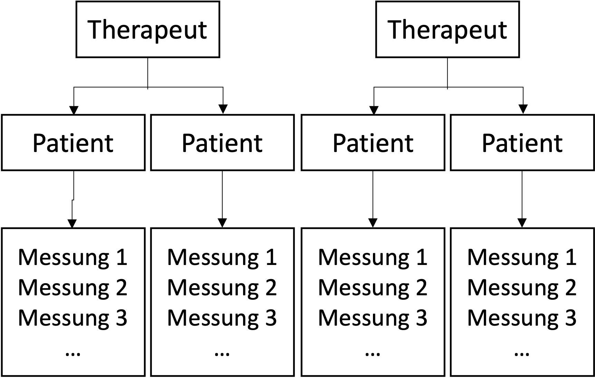

```{r setup, include=FALSE}
options(htmltools.dir.version = FALSE)

library(tidyverse)
library(kableExtra)
library(ggplot2)
library(plotly)
library(htmlwidgets)
library(MASS)
library(ggpubr)
library(xaringanthemer)
library(xaringanExtra)
library(lme4)
library(lmerTest)

style_duo_accent(
  primary_color = "#621C37",
  secondary_color = "#EE0071",
  background_image = "blank.png"
)

xaringanExtra::use_xaringan_extra(c("tile_view"))

use_scribble(
  pen_color = "#EE0071",
  pen_size = 4
)

knitr::opts_chunk$set(
  fig.retina = TRUE,
  warning = FALSE,
  message = FALSE,
  comment = NA
)

source(file = "base_functions.R")
```

name: Title slide
class: middle, left
<br><br><br><br><br><br><br>
# Multivariate Verfahren
***
### Einheit 2: Mehrebenenanalyse - Lineare gemischte Modelle  (1)
##### Wintersemester 2025 | Prof. Dr. Stephan Goerigk

---
class: top, left
### Mehrebenenanalyse - Lineare gemischte Modelle

#### Einführung in hierarchische Datenstrukturen

```{r echo=FALSE}
detach("package:lmerTest", unload = TRUE)
```

* Zentrale Annahme der (multiplen) linearen Regression (siehe Einheit 1):
.center[
**Die Residuen $(ε_i)$ sind unabhängig voneinander. **

$\varepsilon_i \sim N(0, \sigma_\varepsilon^2)$ 

$(\rightarrow$ unabhängig normalverteilt mit Erwartungswert Null und
konstanter Varianz [Homoskedastizität] $)$
]

* Was genau bedeutet es, wenn $ε_i$  unabhängig sind?

* ..., dass $ε_i$ nicht systematisch mit einem anderen Merkmal zusammenhängen

* ..., dass der Wert einer Person keine Informationen über den Wert anderer Person enthält

* ..., dass es keine unberücksichtigten Gruppen/Cluster in den Datenpunkten gibt

---
class: top, left
### Mehrebenenanalyse - Lineare gemischte Modelle

#### Einführung in hierarchische Datenstrukturen

* Unabhängigkeit der Daten bzw. $ε_i$ ist in der Psychologie oft verletzt

* Häufiger Grund: **hierarchischen Datenstrukturen**

.pull-left[

***

Beispiele für hierarchische Daten:

* **Schüler in Klassen (2-Level)**

* gleiche Lehrer
* gleiches Klassenzimmer
* gleiche Mitschüler
* ...

]

.pull-right[
.center[
2-Level Design
<br><br>
```{r eval = TRUE, echo = F, out.width = "400px"}
knitr::include_graphics("bilder/Hierarchical_1.png")
```
]
]


---
class: top, left
### Mehrebenenanalyse - Lineare gemischte Modelle

#### Einführung in hierarchische Datenstrukturen

* Unabhängigkeit der Daten bzw. $ε_i$ ist in der Psychologie oft verletzt

* Häufiger Grund: **hierarchischen Datenstrukturen**

.pull-left[
***
Beispiele für hierarchische Daten:

* Schüler in Klassen (2-Level)

* **Schüler in Klassen in Schulen (3-Level)**
]

.pull-right[
.center[
3-Level Design
<br><br>
```{r eval = TRUE, echo = F, out.width = "400px"}

```
]
]

---
class: top, left
### Mehrebenenanalyse - Lineare gemischte Modelle

#### Einführung in hierarchische Datenstrukturen

* Unabhängigkeit der Daten bzw. $ε_i$ ist in der Psychologie oft verletzt

* Häufiger Grund: **hierarchischen Datenstrukturen**

.pull-left[
***
Beispiele für hierarchische Daten:

* Schüler in Klassen (2-Level)

* Schüler in Klassen in Schulen (3-Level)

* **Patienten in Therapeuten in Studienzentren (3-Level)** 
$\rightarrow$ multizentrische klinische Studie

]

.pull-right[
.center[
3-Level Design
<br><br>
```{r eval = TRUE, echo = F, out.width = "400px"}

```
]
]

---
class: top, left
### Mehrebenenanalyse - Lineare gemischte Modelle

#### Einführung in hierarchische Datenstrukturen

* Unabhängigkeit der Daten bzw. $ε_i$ ist in der Psychologie oft verletzt

* Häufiger Grund: **hierarchischen Datenstrukturen**

.pull-left[
***
Beispiele für hierarchische Daten:

* Schüler in Klassen (2-Level)

* Schüler in Klassen in Schulen (3-Level)

* Patienten in Therapeuten in Studienzentren (3-Level) 

* **Messzeitpunkte in Patienten in Therapeuten (3-Level) **
$\rightarrow$ Messwiederholungsdesign
]

.pull-right[
.center[
3-Level Design
<br><br>
```{r eval = TRUE, echo = F, out.width = "400px"}

```
]
]

---
class: top, left
### Mehrebenenanalyse - Lineare gemischte Modelle

#### Einführung in hierarchische Datenstrukturen

Begriffsklärung hierarchische Daten:

* Daten mit mehreren Ebenen (Levels)

* Niedrigere Levels sind in höhere Levels "geschachtelt" (engl. "nested")

* Elemente einer niedrigeren Ebene ist eindeutig einem Element einer höheren Ebene zuordenbar.


$\rightarrow$ Nicht-Berücksichtigung dieser Einflüsse hat **relevante Implationen**!

---
class: top, left
### Mehrebenenanalyse - Lineare gemischte Modelle

#### Einführung in hierarchische Datenstrukturen

Was folgt aus hierarchische Datenstrukturen:

* Die Merkmale einer höheren Ebene können die Elemente auf niedrigerer Ebene gleichermaßen beeinflussen (z.B. Didaktische Kompetenz des Lehrers die Matheleistung aller Schüler in seiner Klasse)

* Anders gesagt: Personen innerhalb eines Clusters sind sich ähnlicher, weil sie einem gemeinsamen Einfluss ausgesetzt sind

* Messwerte sind voneinander **abhängig**

* Folgen der Nichtbeachtung hierarchischer Datenstrukturen:

* Falsche Prüfverteilung der Regressionskoeffizienten für Signifikanztests wird verwendet 

* $\alpha$-Inflation, da die Nullhypothese $(H_0)$ öfters fälschlich verworfen wird

* **Ökologischer Fehlschluss** kann erfolgen

---
class: top, left
### Mehrebenenanalyse - Lineare gemischte Modelle

#### Ökologischer Fehlschluss

.pull-left[
```{r echo=F, fig.height=6}
# Create a sample dataset to mimic the original image
set.seed(123)  # For reproducibility

# Generate data for 10 clusters arranged diagonally
n_points <- 20  # Number of points per group
groups <- 3     # Number of groups

# Generate the x-values, each group along a diagonal
data <- data.frame(
  Therapiestunden = rep(seq(1, n_points*groups, by = 1)),  # Adjust x-values for groups
  Symptomschwere = c(rnorm(n_points, mean = 2, sd = 0.2) - seq(1, n_points)*0.05,  # Negative slope within each group
                     rnorm(n_points, mean = 3, sd = 0.2) - seq(1, n_points)*0.05,
                     rnorm(n_points, mean = 4, sd = 0.2) - seq(1, n_points)*0.05),  # Y-values for each group with negative slope
  Klinik = rep(1:groups, each = n_points)  # Group labels
)
#data$x = data$x *  rnorm(nrow(data), mean = 1, sd = 0.01)
data$Therapiestunden = data$Therapiestunden / 10

# Create the scatter plot with regression lines
ggplot(data, aes(x = Therapiestunden, y = Symptomschwere)) +
  geom_smooth(method = "lm", se = FALSE, size = 0.8, colour = "black") +  # Add thin black regression lines
  labs(x = "Therapiestunden pro Woche",
       y = "Symptomschwere") +
  coord_cartesian(ylim = c(0,5)) +
  mytheme +
  theme(legend.position = "none", text = element_text(size = 20)) 
```
]
.pull-right[

<small>

* Beispiel: Zusammenhang zwischen Therapiedosis und Symptomlast

* Es scheint ein positiver Zusammenhang zu bestehen. Führt mehr Therapie zu mehr Symptomen?

* Unsere Regression zeigt auch eine positive Steigung:

.code80[
```{r}
lm(Symptomschwere ~ Therapiestunden, data = data)
```
]

* Wie könnte das Ergebnis zustande kommen?
]

---
class: top, left
### Mehrebenenanalyse - Lineare gemischte Modelle

#### Ökologischer Fehlschluss

.pull-left[
```{r echo=F, fig.height=6}
# Create a sample dataset to mimic the original image
set.seed(123)  # For reproducibility

# Generate data for 10 clusters arranged diagonally
n_points <- 20  # Number of points per group
groups <- 3     # Number of groups

# Generate the x-values, each group along a diagonal
data <- data.frame(
  Therapiestunden = rep(seq(1, n_points*groups, by = 1)),  # Adjust x-values for groups
  Symptomschwere = c(rnorm(n_points, mean = 2, sd = 0.2) - seq(1, n_points)*0.05,  # Negative slope within each group
                     rnorm(n_points, mean = 3, sd = 0.2) - seq(1, n_points)*0.05,
                     rnorm(n_points, mean = 4, sd = 0.2) - seq(1, n_points)*0.05),  # Y-values for each group with negative slope
  Klinik = rep(1:groups, each = n_points)  # Group labels
)
#data$x = data$x *  rnorm(nrow(data), mean = 1, sd = 0.01)

data$Klinik = factor(data$Klinik, levels = 1:3, labels = c(paste("Klinik", 1:3)))
data$Therapiestunden = data$Therapiestunden / 10

# Create the scatter plot with regression lines
ggplot(data, aes(x = Therapiestunden, y = Symptomschwere)) +
  geom_point(size = 1) +  # Scatter plot points
  geom_smooth(method = "lm", se = FALSE, size = 0.8, colour = "black") +  # Add thin black regression lines
  geom_smooth(method = "lm", se = FALSE, aes(group = Klinik, colour = Klinik), size = 0.8) +  # Add thin black regression lines
  labs(x = "Therapiestunden pro Woche",
       y = "Symptomschwere",
       colour = "") +
  coord_cartesian(ylim = c(0,5)) +
  mytheme +
  theme(legend.position = c(.85,.15), text = element_text(size = 20)) 

write.csv(data, "Kliniken.csv")
```
]
.pull-right[

<small>

* Hierarchische Datenstruktur:

  * Klinik 1 behandelt leichte Depressionen

  * Klinik 2 behandelt mittelgradige Depressionen

  * Klinik 3 behandelt schwere Depressionen

* Patienten mit mehr Therapiesitzungen (z. B. 2x wöchentlich statt 1x) weisen eine schnellere Verbesserung in den Symptomen auf

* Innerhalb der Gruppen besteht ein negativer Zusammenhang zwischen Therapiesitzungen und Symptomschwere

* Nichtberücksichtigung der Hierarchie führt zu falscher Schlussfolgerung.

]

---
class: top, left
### Mehrebenenanalyse - Lineare gemischte Modelle

#### Ökologischer Fehlschluss

.pull-left[
```{r echo=F, fig.height=6}
# Create a sample dataset to mimic the original image
set.seed(123)  # For reproducibility

# Generate data for 10 clusters arranged diagonally
n_points <- 20  # Number of points per group
groups <- 3     # Number of groups

# Generate the x-values, each group along a diagonal
data <- data.frame(
  Therapiestunden = rep(seq(1, n_points*groups, by = 1)),  # Adjust x-values for groups
  Symptomschwere = c(rnorm(n_points, mean = 2, sd = 0.2) - seq(1, n_points)*0.05,  # Negative slope within each group
                     rnorm(n_points, mean = 3, sd = 0.2) - seq(1, n_points)*0.05,
                     rnorm(n_points, mean = 4, sd = 0.2) - seq(1, n_points)*0.05),  # Y-values for each group with negative slope
  Klinik = rep(1:groups, each = n_points)  # Group labels
)
#data$x = data$x *  rnorm(nrow(data), mean = 1, sd = 0.01)

data$Klinik = factor(data$Klinik, levels = 1:3, labels = c(paste("Klinik", 1:3)))
data$Therapiestunden = data$Therapiestunden / 10

# Create the scatter plot with regression lines
ggplot(data, aes(x = Therapiestunden, y = Symptomschwere)) +
  geom_point(size = 1) +  # Scatter plot points
  geom_smooth(method = "lm", se = FALSE, size = 0.8, colour = "black") +  # Add thin black regression lines
  geom_smooth(method = "lm", se = FALSE, aes(group = Klinik, colour = Klinik), size = 0.8) +  # Add thin black regression lines
  labs(x = "Therapiestunden pro Woche",
       y = "Symptomschwere",
       colour = "") +
  coord_cartesian(ylim = c(0,5)) +
  mytheme +
  theme(legend.position = c(.85,.15), text = element_text(size = 20)) 
```
]
.pull-right[

<small>

Um zu Prüfen inwiefern Annahme unabhäniger $\varepsilon_i$ verletzt ist können wir uns Plot der standardisierten $\varepsilon_i$ gegen standardisiere vorhergesagte Werte anzeigen lassen:

So in der Art sollte der Graph idealerweise aussehen:

.center[
.code80[
```{r fig.height=4, fig.width=6, echo = F}
set.seed(123)
x = rnorm(60, 0, 1)
y = rnorm(60, 0, 1)
model = lm(y ~ x)
plot(model, which = 1) # zum Darstellen der Residuen
```
]
$\rightarrow$ keine Systematik, keine Cluster

]

]

---
class: top, left
### Mehrebenenanalyse - Lineare gemischte Modelle

#### Ökologischer Fehlschluss

.pull-left[
```{r echo=F, fig.height=6}
# Create a sample dataset to mimic the original image
set.seed(123)  # For reproducibility

# Generate data for 10 clusters arranged diagonally
n_points <- 20  # Number of points per group
groups <- 3     # Number of groups

# Generate the x-values, each group along a diagonal
data <- data.frame(
  Therapiestunden = rep(seq(1, n_points*groups, by = 1)),  # Adjust x-values for groups
  Symptomschwere = c(rnorm(n_points, mean = 2, sd = 0.2) - seq(1, n_points)*0.05,  # Negative slope within each group
                     rnorm(n_points, mean = 3, sd = 0.2) - seq(1, n_points)*0.05,
                     rnorm(n_points, mean = 4, sd = 0.2) - seq(1, n_points)*0.05),  # Y-values for each group with negative slope
  Klinik = rep(1:groups, each = n_points)  # Group labels
)
#data$x = data$x *  rnorm(nrow(data), mean = 1, sd = 0.01)

data$Klinik = factor(data$Klinik, levels = 1:3, labels = c(paste("Klinik", 1:3)))
data$Therapiestunden = data$Therapiestunden / 10

# Create the scatter plot with regression lines
ggplot(data, aes(x = Therapiestunden, y = Symptomschwere)) +
  geom_point(size = 1) +  # Scatter plot points
  geom_smooth(method = "lm", se = FALSE, size = 0.8, colour = "black") +  # Add thin black regression lines
  geom_smooth(method = "lm", se = FALSE, aes(group = Klinik, colour = Klinik), size = 0.8) +  # Add thin black regression lines
  labs(x = "Therapiestunden pro Woche",
       y = "Symptomschwere",
       colour = "") +
  coord_cartesian(ylim = c(0,5)) +
  mytheme +
  theme(legend.position = c(.85,.15), text = element_text(size = 20)) 
```
]
.pull-right[

<small>

Darstellung der Residuen für unser einfaches lineares Regressionsmodell:

.center[
.code80[
```{r fig.height=4, fig.width=6}
model = lm(Symptomschwere ~ Therapiestunden, data = data)
plot(model, which = 1) # zum Darstellen der Residuen
```
]
$\rightarrow$ Störeinflüsse hierarch. Datenstruktur sind sichtbar
]
]

---
class: top, left
### Mehrebenenanalyse - Lineare gemischte Modelle

#### Ökologischer Fehlschluss

Weitere Beispiele für Ökologischen Fehlschluss:

* Speed-accuracy-trade off
  
  * Höhere Geschwindigkeit geht mit weniger Fehlern einher (zwischen Personen)
  
  * Höhere Geschwindigkeit geht mit mehr Fehlern einher (innerhalb von Personen)

* Training und Müdigkeit
  
  * Mehr Training führt zu weniger Müdigkeit (zwischen Personen)
  
  * Mehr Training führt zu mehr Müdigkeit (innerhalb von Personen)

* ...

---
class: top, left
### Mehrebenenanalyse - Lineare gemischte Modelle

#### Lösungsansätze um hierarchische Daten zu berücksichtigen

Lösungsversuch: Gruppen getrennt modellieren

* 1 Regressionsmodell pro Gruppe $\rightarrow$ 1 Steigung pro Gruppe

* Problem 1: Overfitting innerhalb der Gruppen

* Problem 2: Wie soll man Innergruppeneffekte zusammenfassen, um zu einer Gesamtaussage zu kommen?

* Problem 3: Heterogenität innerhalb der Gruppen wird abgebildet, aber Heterogenität zwischen Gruppen wird ignoriert

Lösung: Regressionsansatz der...

* ... Effekt auf Gruppen- und Individualebene in einer Gleichung simultan schätzt

* ... diese dadurch voneinander abtrennbar macht

* ... Einflüsse von Prädiktoren auf beiden Ebenen schätzen kann

---
class: top, left
### Mehrebenenanalyse - Lineare gemischte Modelle

#### Lineare gemischte Modelle (Linear mixed models)

<small>

Zur Erinnerung noch einmal unser normales (multiples) lineares Regressionmodell:

$$Y_i = \beta_0 + \beta_1 \cdot X_{1i} + \beta_2 \cdot X_{2i} + ... +\beta_k \cdot X_{ki} + \varepsilon_i, \quad \varepsilon_i \sim N(0, \sigma^2_{\varepsilon})$$
* $\beta_0$, $\beta_1$, $\beta_2$, ... repräsentieren die **durchschnittliche** Steigung der Regressionsgrade (engl. **fixed effects**).

* Da es sich um den Durchschnitt handelt, gibt es für jeden Koeffizienten ( $\beta_0$, $\beta_1$, $\beta_2$...) nur 1 Schätzwert.

* Wenn hierarchische Datenstruktur vorliegen können die Koeffizienten (z.B. von Schule zu Schule) variieren

* Wir benötigen ein flexibleres Modell, dass diese Unterschiede zwischen Koeffizienten auf Elementen höherer Hierarchielevels berücksichtigt

<br>

Was bedeutet "flexibleres Modell" mathematisch?

$\rightarrow$ Variation der Regressionskoeffizienten auf höheren Hierarchiestufen simultan mitmodellieren (engl. **random effects**)


---
class: top, left
### Mehrebenenanalyse - Lineare gemischte Modelle

#### Lineare gemischte Modelle (Linear mixed models)

Standard-Regression:

$$y_i = \beta_0 + \beta_1 x_i + \varepsilon_i$$

* Im Linear mixed Model fürfen Regressionsparameter variieren.

Wenn $\beta_0$ und $\beta_1$ in jedem Cluster der höheren Hierarchiestufen unterschiedlich sein dürfen:

$$y_{ij} = \beta_{0j} + \beta_{1j} x_{ij} + \varepsilon_{ij}$$
<small>

$\beta_{0j}$ = Regressionskonstante (Intercept) im Cluster $j$  

$\beta_{1j}$ = Steigungsparameter (Slope) im Cluster $j$  

$\varepsilon_{ij}$ = Fehlervariable (Residual Error) für die Person $i$ in Cluster $j$  

$i$ = Index für Individuum  

$j$ = Index für Level-2-Einheit (Gruppenindikator)

---
class: top, left
### Mehrebenenanalyse - Lineare gemischte Modelle

#### Lineare gemischte Modelle (Linear mixed models)

Standard-Regression:

$$y_i = \beta_0 + \beta_1 x_i + \varepsilon_i$$

* Im Linear mixed Model fürfen Regressionsparameter variieren.

Wenn $\beta_0$ und $\beta_1$ in jedem Cluster der höheren Hierarchiestufen unterschiedlich sein dürfen:

$$y_{ij} = \beta_{0j} + \beta_{1j} x_{ij} + \varepsilon_{ij}$$

<small>

* Jede Person $i$ in Cluster $j$ hat einen Messwert $x_{ij}$ 

* Jedes Cluster $j$ hat einen eigenen Y-Achsenabschnitt $\beta_{0j}$

* $\beta_{0j}$ ist der durchschnittliche Y-Achsenabschnitt für Messwerte $x_{ij}$, d.h. aller Personen $i$ in Cluster $j$

* Jedes Cluster $j$ hat eine eigene Steigung $\beta_{1j}$

* $\beta_{1j}$ ist die durchschnittliche Steigung für Messwerte $x_{ij}$, d.h. aller Personen $i$ in Cluster $j$

---
class: top, left
### Mehrebenenanalyse - Lineare gemischte Modelle

#### Lineare gemischte Modelle (Linear mixed models)

* $\beta_{0}$ und $\beta_{1}$ sind die durchschnittlichen Koeffizienten im Regressionsmodell

* $\beta_{0j}$ und $\beta_{1j}$ können über die Level-2-Einheiten hinweg variieren

* $\beta_{0j}$ und $\beta_{1j}$ weisen also jeweils Varianz auf

<br>

Nomenklatur Linearer gemischter Modelle:

* Den Durchschnittswert (z.B. der Steigung $\beta_1)$ eines Regressionskoeffizienten nennen wir **Fixed Effekt**

* Die Varianz der (z.B. $\beta_{1j})$ um diesen Durchschnittswert $(\beta_1)$ herum nennen wir **Random Effect**

---
class: top, left
### Mehrebenenanalyse - Lineare gemischte Modelle

#### Lineare gemischte Modelle (Linear mixed models)

Es können auch Modelle geschätzt werden, die nur bezüglich des Y-Achsenabschnitts oder der Steigung variieren:

.center[
```{r echo = F, fig.height=6, fig.width=9}
# Simulate data for the different models
set.seed(42)
n <- 10
x <- seq(1, n)

y_random_intercept_slope <- list(6 + rnorm(3, 0, 1) + 0.1 * x + rnorm(n, 0, 0.2),
                                 5.5 + rnorm(3, 0, 1) - 0.1 * x + rnorm(n, 0, 0.2),
                                 5 + rnorm(3, 0, 1) - 0.3 * x + rnorm(n, 0, 0.2))

# Prepare data frames for plotting

df_random_intercept_slope <- data.frame(x = rep(x, 3), y = unlist(y_random_intercept_slope), group = factor(rep(1:3, each = n)))

lm1 = lm(y ~ x, data = df_random_intercept_slope)
lm2 = lm(y ~ x + group, data = df_random_intercept_slope)
lm3 = lm(y ~ x * group, data = df_random_intercept_slope)

# Plot 1: Fixed effects
p1 <- ggplot(df_random_intercept_slope, aes(x = x, y = y)) +
  geom_point() +
  geom_segment(aes(x = 0, xend = max(df_random_intercept_slope$x), y = coef(lm1)["(Intercept)"] + coef(lm1)["x"], yend = coef(lm1)["(Intercept)"] + coef(lm1)["x"] * max(df_random_intercept_slope$x))) +
  annotate("text", x = -1, y = coef(lm1)["(Intercept)"], label = expression(beta[0]), parse = TRUE, size = 5) +
  annotate("text", x = max(df_random_intercept_slope$x) + 1, y = coef(lm1)["(Intercept)"] + coef(lm1)["x"] * max(df_random_intercept_slope$x), label = expression(beta[1]), parse = TRUE, size = 5) +
  ggtitle("Einfache lineare Regression") +
  coord_cartesian(ylim = c(0,12), xlim = c(-1,12)) +
  mytheme

# Plot 2: Mixed effects - Random intercept, fixed slope
p2 <- ggplot(df_random_intercept_slope, aes(x = x, y = y, color = group)) +
  geom_point() +
  geom_segment(aes(x = 0, xend = max(df_random_intercept_slope$x), y = coef(lm2)["(Intercept)"] + coef(lm2)["x"], yend = coef(lm2)["(Intercept)"] + coef(lm2)["x"] * max(df_random_intercept_slope$x)), colour = scales::hue_pal()(3)[1]) +
  geom_segment(aes(x = 0, xend = max(df_random_intercept_slope$x), y = coef(lm2)["(Intercept)"] + coef(lm2)["group2"] + coef(lm2)["x"], yend = coef(lm2)["(Intercept)"] + coef(lm2)["group2"] + coef(lm2)["x"] * max(df_random_intercept_slope$x)), colour = scales::hue_pal()(3)[2]) +
  geom_segment(aes(x = 0, xend = max(df_random_intercept_slope$x), y = coef(lm2)["(Intercept)"] + coef(lm2)["group3"] + coef(lm2)["x"], yend = coef(lm2)["(Intercept)"] + coef(lm2)["group3"] + coef(lm2)["x"] * max(df_random_intercept_slope$x)), colour = scales::hue_pal()(3)[3]) +
  annotate("text", x = -1, y = coef(lm2)["(Intercept)"], label = expression(beta["01"]), parse = TRUE, size = 5) +
  annotate("text", x = -1, y = coef(lm2)["(Intercept)"] + coef(lm2)["group2"], label = expression(beta["02"]), parse = TRUE, size = 5) +
  annotate("text", x = -1, y = coef(lm2)["(Intercept)"] + coef(lm2)["group3"], label = expression(beta["03"]), parse = TRUE, size = 5) +
  annotate("text", x = max(df_random_intercept_slope$x) + 1, y = 5, label = expression(beta[1]), parse = TRUE, size = 5) +
  ggtitle("Random Intercept, Fixed Slope") +
  coord_cartesian(ylim = c(0,12), xlim = c(-1,12)) +
  mytheme +
  theme(legend.position = "none")

# Plot 3: Mixed effects - Fixed intercept, random slope
p3 <- ggplot(df_random_intercept_slope, aes(x = x, y = y, color = group)) +
  geom_point() +
  geom_segment(aes(x = 0, xend = max(df_random_intercept_slope$x), y = coef(lm2)["(Intercept)"] + coef(lm2)["group2"] + coef(lm2)["x"], yend = coef(lm2)["(Intercept)"] + coef(lm2)["x"] * max(df_random_intercept_slope$x)), colour = scales::hue_pal()(3)[1]) +
  geom_segment(aes(x = 0, xend = max(df_random_intercept_slope$x), y = coef(lm2)["(Intercept)"]  + coef(lm2)["group2"] + coef(lm2)["x"], yend = coef(lm2)["(Intercept)"] + coef(lm2)["group2"] + coef(lm2)["x"] * max(df_random_intercept_slope$x)), colour = scales::hue_pal()(3)[2]) +
  geom_segment(aes(x = 0, xend = max(df_random_intercept_slope$x), y = coef(lm2)["(Intercept)"] + coef(lm2)["group2"] + coef(lm2)["x"], yend = coef(lm2)["(Intercept)"] + coef(lm2)["group3"] + coef(lm2)["x"] * max(df_random_intercept_slope$x)), colour = scales::hue_pal()(3)[3]) +
  annotate("text", x = -1, y = coef(lm2)["(Intercept)"] + coef(lm2)["group2"], label = expression(beta["0"]), parse = TRUE, size = 5) +
  annotate("text", x = max(df_random_intercept_slope$x) + 1, y = coef(lm2)["(Intercept)"] + coef(lm2)["x"] * max(df_random_intercept_slope$x), label = expression(beta["11"]), parse = TRUE, size = 5) +
  annotate("text", x = max(df_random_intercept_slope$x) + 1, y = coef(lm2)["(Intercept)"] + coef(lm2)["group2"] + coef(lm2)["x"] * max(df_random_intercept_slope$x), label = expression(beta["12"]), parse = TRUE, size = 5) +
  annotate("text", x = max(df_random_intercept_slope$x) + 1, y = coef(lm2)["(Intercept)"] + coef(lm2)["group3"] + coef(lm2)["x"] * max(df_random_intercept_slope$x), label = expression(beta["13"]), parse = TRUE, size = 5) +
  ggtitle("Fixed Intercept, Random Slope") +
  coord_cartesian(ylim = c(0,12), xlim = c(-1,12)) +
  mytheme +
  theme(legend.position = "none")

# Plot 4: Random effects - Random intercept, random slope
p4 <- ggplot(df_random_intercept_slope, aes(x = x, y = y, color = group)) +
  geom_point() +
  geom_segment(aes(x = 0, xend = max(df_random_intercept_slope$x), y = coef(lm3)["(Intercept)"] + coef(lm3)["x"], yend = coef(lm3)["(Intercept)"] + coef(lm3)["x"] * max(df_random_intercept_slope$x)), colour = scales::hue_pal()(3)[1]) +
  geom_segment(aes(x = 0, xend = max(df_random_intercept_slope$x), y = coef(lm3)["(Intercept)"] + coef(lm3)["group2"] + coef(lm3)["x"], yend = coef(lm3)["(Intercept)"] + coef(lm3)["group2"] + (coef(lm3)["x"] + coef(lm3)["x:group2"]) * max(df_random_intercept_slope$x)), colour = scales::hue_pal()(3)[2]) +
  geom_segment(aes(x = 0, xend = max(df_random_intercept_slope$x), y = coef(lm3)["(Intercept)"] + coef(lm3)["group3"] + coef(lm3)["x"], yend = coef(lm3)["(Intercept)"] + coef(lm3)["group3"] + (coef(lm3)["x"] + coef(lm3)["x:group3"]) * max(df_random_intercept_slope$x)), colour = scales::hue_pal()(3)[3]) +
  annotate("text", x = -1, y = coef(lm3)["(Intercept)"], label = expression(beta["01"]), parse = TRUE, size = 5) +
  annotate("text", x = -1, y = coef(lm3)["(Intercept)"] + coef(lm3)["group2"], label = expression(alpha["02"]), parse = TRUE, size = 5) +
  annotate("text", x = -1, y = coef(lm3)["(Intercept)"] + coef(lm3)["group3"] -1, label = expression(alpha["03"]), parse = TRUE, size = 5) +
  annotate("text", x = max(df_random_intercept_slope$x) + 1, y = coef(lm3)["(Intercept)"] + coef(lm3)["x"] * max(df_random_intercept_slope$x), label = expression(beta["11"]), parse = TRUE, size = 5) +
  annotate("text", x = max(df_random_intercept_slope$x) + 1, y = coef(lm3)["(Intercept)"] + coef(lm3)["group2"] + (coef(lm3)["x"] + coef(lm3)["x:group2"]) * max(df_random_intercept_slope$x), label = expression(beta["12"]), parse = TRUE, size = 5) +
  annotate("text", x = max(df_random_intercept_slope$x) + 1, y = coef(lm3)["(Intercept)"] + coef(lm3)["group3"] + (coef(lm3)["x"] + coef(lm3)["x:group3"]) * max(df_random_intercept_slope$x), label = expression(beta["13"]), parse = TRUE, size = 5) +
  ggtitle("Random Intercept, Random Slope") +
  coord_cartesian(ylim = c(0,12), xlim = c(-1,12)) +
  mytheme +
  theme(legend.position = "none")

# Arrange plots in a 2x2 grid
ggarrange(p1, p2, p3, p4, ncol = 2, nrow = 2)
```
]

---
class: top, left
### Mehrebenenanalyse - Lineare gemischte Modelle

#### Lineare gemischte Modelle (Linear mixed models)

Es können auch Modelle geschätzt werden, die nur bezüglich des Y-Achsenabschnitts oder der Steigung variieren:

.pull-left[
.center[
```{r echo = F, fig.height=5.5}
# Simulate data for the different models
set.seed(42)
n <- 10
x <- seq(1, n)

y_random_intercept_slope <- list(6 + rnorm(3, 0, 1) + 0.1 * x + rnorm(n, 0, 0.2),
                                 5.5 + rnorm(3, 0, 1) - 0.1 * x + rnorm(n, 0, 0.2),
                                 5 + rnorm(3, 0, 1) - 0.3 * x + rnorm(n, 0, 0.2))

# Prepare data frames for plotting

df_random_intercept_slope <- data.frame(x = rep(x, 3), y = unlist(y_random_intercept_slope), group = factor(rep(1:3, each = n)))

lm1 = lm(y ~ x, data = df_random_intercept_slope)
lm2 = lm(y ~ x + group, data = df_random_intercept_slope)
lm3 = lm(y ~ x * group, data = df_random_intercept_slope)

# Plot 1: Fixed effects
p1 <- ggplot(df_random_intercept_slope, aes(x = x, y = y)) +
  geom_point() +
  geom_segment(aes(x = 0, xend = max(df_random_intercept_slope$x), y = coef(lm1)["(Intercept)"] + coef(lm1)["x"], yend = coef(lm1)["(Intercept)"] + coef(lm1)["x"] * max(df_random_intercept_slope$x))) +
  annotate("text", x = -1, y = coef(lm1)["(Intercept)"], label = expression(beta[0]), parse = TRUE, size = 5) +
  annotate("text", x = max(df_random_intercept_slope$x) + 1, y = coef(lm1)["(Intercept)"] + coef(lm1)["x"] * max(df_random_intercept_slope$x), label = expression(beta[1]), parse = TRUE, size = 5) +
  ggtitle("Einfache lineare Regression") +
  coord_cartesian(ylim = c(0,12), xlim = c(-1,12)) +
  mytheme

# Plot 2: Mixed effects - Random intercept, fixed slope
p2 <- ggplot(df_random_intercept_slope, aes(x = x, y = y, color = group)) +
  geom_point() +
  geom_segment(aes(x = 0, xend = max(df_random_intercept_slope$x), y = coef(lm2)["(Intercept)"] + coef(lm2)["x"], yend = coef(lm2)["(Intercept)"] + coef(lm2)["x"] * max(df_random_intercept_slope$x)), colour = scales::hue_pal()(3)[1]) +
  geom_segment(aes(x = 0, xend = max(df_random_intercept_slope$x), y = coef(lm2)["(Intercept)"] + coef(lm2)["group2"] + coef(lm2)["x"], yend = coef(lm2)["(Intercept)"] + coef(lm2)["group2"] + coef(lm2)["x"] * max(df_random_intercept_slope$x)), colour = scales::hue_pal()(3)[2]) +
  geom_segment(aes(x = 0, xend = max(df_random_intercept_slope$x), y = coef(lm2)["(Intercept)"] + coef(lm2)["group3"] + coef(lm2)["x"], yend = coef(lm2)["(Intercept)"] + coef(lm2)["group3"] + coef(lm2)["x"] * max(df_random_intercept_slope$x)), colour = scales::hue_pal()(3)[3]) +
  annotate("text", x = -1, y = coef(lm2)["(Intercept)"], label = expression(beta["01"]), parse = TRUE, size = 5) +
  annotate("text", x = -1, y = coef(lm2)["(Intercept)"] + coef(lm2)["group2"], label = expression(beta["02"]), parse = TRUE, size = 5) +
  annotate("text", x = -1, y = coef(lm2)["(Intercept)"] + coef(lm2)["group3"], label = expression(beta["03"]), parse = TRUE, size = 5) +
  annotate("text", x = max(df_random_intercept_slope$x) + 1, y = 5, label = expression(beta[1]), parse = TRUE, size = 5) +
  ggtitle("Random Intercept, Fixed Slope") +
  coord_cartesian(ylim = c(0,12), xlim = c(-1,12)) +
  mytheme +
  theme(legend.position = "none")

# Plot 3: Mixed effects - Fixed intercept, random slope
p3 <- ggplot(df_random_intercept_slope, aes(x = x, y = y, color = group)) +
  geom_point() +
  geom_segment(aes(x = 0, xend = max(df_random_intercept_slope$x), y = coef(lm2)["(Intercept)"] + coef(lm2)["group2"] + coef(lm2)["x"], yend = coef(lm2)["(Intercept)"] + coef(lm2)["x"] * max(df_random_intercept_slope$x)), colour = scales::hue_pal()(3)[1]) +
  geom_segment(aes(x = 0, xend = max(df_random_intercept_slope$x), y = coef(lm2)["(Intercept)"]  + coef(lm2)["group2"] + coef(lm2)["x"], yend = coef(lm2)["(Intercept)"] + coef(lm2)["group2"] + coef(lm2)["x"] * max(df_random_intercept_slope$x)), colour = scales::hue_pal()(3)[2]) +
  geom_segment(aes(x = 0, xend = max(df_random_intercept_slope$x), y = coef(lm2)["(Intercept)"] + coef(lm2)["group2"] + coef(lm2)["x"], yend = coef(lm2)["(Intercept)"] + coef(lm2)["group3"] + coef(lm2)["x"] * max(df_random_intercept_slope$x)), colour = scales::hue_pal()(3)[3]) +
  annotate("text", x = -1, y = coef(lm2)["(Intercept)"] + coef(lm2)["group2"], label = expression(beta["0"]), parse = TRUE, size = 5) +
  annotate("text", x = max(df_random_intercept_slope$x) + 1, y = coef(lm2)["(Intercept)"] + coef(lm2)["x"] * max(df_random_intercept_slope$x), label = expression(beta["11"]), parse = TRUE, size = 5) +
  annotate("text", x = max(df_random_intercept_slope$x) + 1, y = coef(lm2)["(Intercept)"] + coef(lm2)["group2"] + coef(lm2)["x"] * max(df_random_intercept_slope$x), label = expression(beta["12"]), parse = TRUE, size = 5) +
  annotate("text", x = max(df_random_intercept_slope$x) + 1, y = coef(lm2)["(Intercept)"] + coef(lm2)["group3"] + coef(lm2)["x"] * max(df_random_intercept_slope$x), label = expression(beta["13"]), parse = TRUE, size = 5) +
  ggtitle("Fixed Intercept, Random Slope") +
  coord_cartesian(ylim = c(0,12), xlim = c(-1,12)) +
  mytheme +
  theme(legend.position = "none")

# Plot 4: Random effects - Random intercept, random slope
p4 <- ggplot(df_random_intercept_slope, aes(x = x, y = y, color = group)) +
  geom_point() +
  geom_segment(aes(x = 0, xend = max(df_random_intercept_slope$x), y = coef(lm3)["(Intercept)"] + coef(lm3)["x"], yend = coef(lm3)["(Intercept)"] + coef(lm3)["x"] * max(df_random_intercept_slope$x)), colour = scales::hue_pal()(3)[1]) +
  geom_segment(aes(x = 0, xend = max(df_random_intercept_slope$x), y = coef(lm3)["(Intercept)"] + coef(lm3)["group2"] + coef(lm3)["x"], yend = coef(lm3)["(Intercept)"] + coef(lm3)["group2"] + (coef(lm3)["x"] + coef(lm3)["x:group2"]) * max(df_random_intercept_slope$x)), colour = scales::hue_pal()(3)[2]) +
  geom_segment(aes(x = 0, xend = max(df_random_intercept_slope$x), y = coef(lm3)["(Intercept)"] + coef(lm3)["group3"] + coef(lm3)["x"], yend = coef(lm3)["(Intercept)"] + coef(lm3)["group3"] + (coef(lm3)["x"] + coef(lm3)["x:group3"]) * max(df_random_intercept_slope$x)), colour = scales::hue_pal()(3)[3]) +
  annotate("text", x = -1, y = coef(lm3)["(Intercept)"], label = expression(beta["01"]), parse = TRUE, size = 5) +
  annotate("text", x = -1, y = coef(lm3)["(Intercept)"] + coef(lm3)["group2"], label = expression(alpha["02"]), parse = TRUE, size = 5) +
  annotate("text", x = -1, y = coef(lm3)["(Intercept)"] + coef(lm3)["group3"] -1, label = expression(alpha["03"]), parse = TRUE, size = 5) +
  annotate("text", x = max(df_random_intercept_slope$x) + 1, y = coef(lm3)["(Intercept)"] + coef(lm3)["x"] * max(df_random_intercept_slope$x), label = expression(beta["11"]), parse = TRUE, size = 5) +
  annotate("text", x = max(df_random_intercept_slope$x) + 1, y = coef(lm3)["(Intercept)"] + coef(lm3)["group2"] + (coef(lm3)["x"] + coef(lm3)["x:group2"]) * max(df_random_intercept_slope$x), label = expression(beta["12"]), parse = TRUE, size = 5) +
  annotate("text", x = max(df_random_intercept_slope$x) + 1, y = coef(lm3)["(Intercept)"] + coef(lm3)["group3"] + (coef(lm3)["x"] + coef(lm3)["x:group3"]) * max(df_random_intercept_slope$x), label = expression(beta["13"]), parse = TRUE, size = 5) +
  ggtitle("Random Intercept, Random Slope") +
  coord_cartesian(ylim = c(0,12), xlim = c(-1,12)) +
  mytheme +
  theme(legend.position = "none")

# Arrange plots in a 2x2 grid
ggarrange(p1, p2, p3, p4, ncol = 2, nrow = 2)
```
]
]
.pull-right[

<small>

Einfache lineare Regression:

* Feste Parameter, keine Variation

Random Intercept, Fixed Slope (2-Level):

* Y-Achsenabschnitt darf zwischen Gruppen variieren
* Steigung ist über Gruppen hinweg fixiert

Fixed Intercept, Random Slope (2-Level):

* Y-Achsenabschnitt ist über Gruppen hinweg fixiert
* Steigung darf zwischen Gruppen variieren

Random Intercept, Random Slope (2-Level):

* Y-Achsenabschnitt und Steigung dürfen variieren

$\rightarrow$ Wahl des Modells folgt theoretischen Überlegungen

]

---
class: top, left
### Mehrebenenanalyse - Lineare gemischte Modelle

#### Lineare gemischte Modelle (Linear mixed models)

* WICHTIG: Das Konzept **einer** Populations-Regressionsfunktion (Level 1) mit 1 Populations-Intercept und 1 Populations-Steigung wird beibehalten

* Unterschiedliche Intercepts/Steigungen der Gruppen werden auf Ebene der Fixed Effects **nicht** explizit als Interaktionseffekt modelliert

* $\beta_0$ und $\beta_1$ werden auf Level-2 als Kombination aus Durchschnittsintercept $(\gamma_{00})$, bzw. Durchschnittssteigung $(\gamma_{01})$ und einer Streuung (Fehler) modelliert.

---
class: top, left
### Mehrebenenanalyse - Lineare gemischte Modelle

#### Lineare gemischte Modelle (Linear mixed models)

* (Durchschnittliche) Fixed Effekte auf Level 1

* Berücksichtigung der Variation über cluster (z.B. Schulen) hinweg auf Level 2

* $\beta_{0j}$ und $\beta_{1j}$ werden als Funktion von Level-2-Parametern modelliert

<br>

Level 1 Gleichung:

$$y_{ij} = \beta_{0j} + \beta_{1j} x_{ij} + \varepsilon_{ij}$$

Level 2 Gleichung:

$$\beta_{0j} = \gamma_{00} + u_{0j}, \quad u_{0j} \sim \mathcal{N}(0, \tau_{00})$$

$$\beta_{1j} = \gamma_{10} + u_{1j}, \quad u_{1j} \sim \mathcal{N}(0, \tau_{11})$$
---
class: top, left
### Mehrebenenanalyse - Lineare gemischte Modelle

#### Lineare gemischte Modelle (Linear mixed models)

Durch Berücksichtigung der Hierarchie (Clusterstruktur) gibt es **drei Quellen** von Zufallsvariationen:

1. Level-1-Zufallsfehler: $r_{ij}$ in den y-Werten (Residuen): Abweichungen der Probandenwerte von der Regression.

2. Level-2-Abweichungen: $u_{0j}$ der Random-Intercepts um den Populations-Intercept.

3. Level-2-Abweichungen: $u_{1j}$ der Random-Slopes um die Durchschnittssteigung

* Diese Koeffizienten quantifizieren (in Kombination) die Abweichung... 

  * ...einer spezifischen Person vom Durchschnitt aller Personen (L1) 
  
  * ...einer spezifischen Gruppe vom Durchschnitt aller Gruppen (L2).

* Jede dieser Abweichungen wird als Varianz/Standardabweichung ausgedrückt

* Es ergeben sich somit mehrere voneinander unterscheidbare Varianzkomponenten.

---
class: top, left
### Mehrebenenanalyse - Lineare gemischte Modelle

#### Lineare gemischte Modelle (Linear mixed models)

**Varianzkomponenten:**

* $\sigma^2$: Residualvarianz auf Level 1 (Varianz der $\varepsilon_{ij}$)
* $\tau_{00}$: Varianz der Y-Achsenabschnitte (Varianz der $u_{0j}$)
* $\tau_{11}$: Varianz der Steigungskoeffizienten  (Varianz der $u_{1j}$)
* $\tau_{01}$: Kovarianz zwischen den Steigungskoeffizienten und Y-Achsenabschnitten (zwischen $u_{0j}$ und $u_{1j}$)

* $\tau_{01}$: z.B., positive Kovarianz: Gruppen, die ein höheres Intercept haben, haben einen höheren Slope.

* Für jeden weiteren Prädiktor auf Level 1 gibt es (z.B. für den zweiten Prädiktor) ein $\beta_{2j}$ mit den dazugehörigen Varianzkomponenten:
* $\tau_{22}$ als Varianz der $u_{2j}$,
* $\tau_{21}$ als Kovarianz der $u_{2j}$ und $u_{1j}$,
* $\tau_{20}$ als Kovarianz der $u_{2j}$ und $u_{0j}$.

---
class: top, left
### Mehrebenenanalyse - Lineare gemischte Modelle

#### Lineare gemischte Modelle (Linear mixed models)

**Einsetzen in eine kombinierte Gleichung:**

<small>

Level 1 Gleichung:

$$y_{ij} = \beta_{0j} + \beta_{1j} x_{ij} + \varepsilon_{ij}$$

Level 2 Gleichung:

$$\beta_{0j} = \gamma_{00} + u_{0j}$$

$$\beta_{1j} = \gamma_{10} + u_{1j}$$
Einsetzen von Level 2 in Level 1:

$$y_{ij} = \gamma_{00} + u_{0j} + (\gamma_{10} + u_{1j}) x_{ij} + \varepsilon_{ij}$$

Umstellen und Ausmultiplizieren:

$$y_{ij} = \color{red}{\gamma_{00} + \gamma_{10} x_{ij}} + \color{blue}{u_{0j} + u_{1j} x_{ij} + \varepsilon_{ij}}$$

$$y_{ij} = \color{red}{fixed} + \color{blue}{random}$$


---
class: top, left
### Mehrebenenanalyse - Lineare gemischte Modelle

#### Fixed effects vs. Random effects

**Fixed Effects** (feste Effekte)

* Durchschnittliche Intercepts/Steigungen über alle Gruppen hinweg

* Häufig das, was uns beim Hypothesentesten interessiert!

* klassische (multiple) Regressionsmodelle enthalten nur feste Effekte

**Random Effects** (zufällige Effekte)

* Variation von Intercepts/Steigungen über Gruppen hinweg

* Ausmaß der Varianz kann geschätzt werden

* "Bereinigen" die festen Effekte vom Einfluss der hierarchischen Struktur

**Mixed Effects (Regression)** (gemischte Effekte)

* Regressionsmodelle, die fixed und random Effekte beinhalten

---
class: top, left
### Mehrebenenanalyse - Lineare gemischte Modelle

#### Lineare gemischte Modelle in R

<small>

In R gibt es mehrere Pakete zur Berechnung von linearen gemischten Modellen:

- **lme4**: Schnell, effizient und ideal für große Datensätze, jedoch ohne standardmäßige $p$-Werte.
- **lmerTest**: Fügt $p$-Werte und Freiheitsgrade zu **lme4** hinzu, jedoch etwas langsamer.
- **nlme**: Flexibel, unterstützt verschiedene Fehlerstrukturen, aber langsamer und komplexer.
- **glmmTMB**: Sehr flexibel, arbeitet mit nicht-normalverteilten Daten, jedoch komplexer in der Anwendung.
- **brms**: Bayesianische Modellierung mit großer Flexibilität, aber langsamer und erfordert Kenntnisse der Bayes-Statistik.
- **MCMCglmm**: Bayesianische MCMC-Modellierung, flexibel, aber langsam und komplex.
- **HLMdiag**: Diagnosen für hierarchische Modelle, nützlich in Kombination mit **lme4** oder **nlme**.
- **afex**: Vereinfachte ANOVA-ähnliche gemischte Modelle, jedoch weniger flexibel für komplexe Modelle.

In der Lehrveranstaltung werden wir mit einer Kombination aus **lme4** und **lmerTest** arbeiten.

```{r eval=F}
# Zur Installation der Pakete:

install.packages("lme4")

install.packages("lmerTest")
```


---
class: top, left
### Mehrebenenanalyse - Lineare gemischte Modelle

#### Lineare gemischte Modelle in R

.pull-left[
.center[
```{r echo = F, fig.height=6}
# Simulate data for the different models
set.seed(42)
n <- 10
x <- seq(1, n)

y_random_intercept_slope <- list(6 + rnorm(3, 0, 1) + 0.1 * x + rnorm(n, 0, 0.2),
                                 5.5 + rnorm(3, 0, 1) - 0.1 * x + rnorm(n, 0, 0.2),
                                 5 + rnorm(3, 0, 1) - 0.3 * x + rnorm(n, 0, 0.2))

# Prepare data frames for plotting

df_random_intercept_slope <- data.frame(x = rep(x, 3), y = unlist(y_random_intercept_slope), group = factor(rep(1:3, each = n)))

lm1 = lm(y ~ x, data = df_random_intercept_slope)
lm2 = lm(y ~ x + group, data = df_random_intercept_slope)
lm3 = lm(y ~ x * group, data = df_random_intercept_slope)

# Plot 1: Fixed effects
p1 <- ggplot(df_random_intercept_slope, aes(x = x, y = y)) +
  geom_point() +
  geom_segment(aes(x = 0, xend = max(df_random_intercept_slope$x), y = coef(lm1)["(Intercept)"] + coef(lm1)["x"], yend = coef(lm1)["(Intercept)"] + coef(lm1)["x"] * max(df_random_intercept_slope$x))) +
  annotate("text", x = -1, y = coef(lm1)["(Intercept)"], label = expression(beta[0]), parse = TRUE, size = 5) +
  annotate("text", x = max(df_random_intercept_slope$x) + 1, y = coef(lm1)["(Intercept)"] + coef(lm1)["x"] * max(df_random_intercept_slope$x), label = expression(beta[1]), parse = TRUE, size = 5) +
  ggtitle("Einfache lineare Regression") +
  coord_cartesian(ylim = c(0,12), xlim = c(-1,12)) +
  mytheme

# Plot 2: Mixed effects - Random intercept, fixed slope
p2 <- ggplot(df_random_intercept_slope, aes(x = x, y = y, color = group)) +
  geom_point() +
  geom_segment(aes(x = 0, xend = max(df_random_intercept_slope$x), y = coef(lm2)["(Intercept)"] + coef(lm2)["x"], yend = coef(lm2)["(Intercept)"] + coef(lm2)["x"] * max(df_random_intercept_slope$x)), colour = scales::hue_pal()(3)[1]) +
  geom_segment(aes(x = 0, xend = max(df_random_intercept_slope$x), y = coef(lm2)["(Intercept)"] + coef(lm2)["group2"] + coef(lm2)["x"], yend = coef(lm2)["(Intercept)"] + coef(lm2)["group2"] + coef(lm2)["x"] * max(df_random_intercept_slope$x)), colour = scales::hue_pal()(3)[2]) +
  geom_segment(aes(x = 0, xend = max(df_random_intercept_slope$x), y = coef(lm2)["(Intercept)"] + coef(lm2)["group3"] + coef(lm2)["x"], yend = coef(lm2)["(Intercept)"] + coef(lm2)["group3"] + coef(lm2)["x"] * max(df_random_intercept_slope$x)), colour = scales::hue_pal()(3)[3]) +
  annotate("text", x = -1, y = coef(lm2)["(Intercept)"], label = expression(beta["01"]), parse = TRUE, size = 5) +
  annotate("text", x = -1, y = coef(lm2)["(Intercept)"] + coef(lm2)["group2"], label = expression(beta["02"]), parse = TRUE, size = 5) +
  annotate("text", x = -1, y = coef(lm2)["(Intercept)"] + coef(lm2)["group3"], label = expression(beta["03"]), parse = TRUE, size = 5) +
  annotate("text", x = max(df_random_intercept_slope$x) + 1, y = 5, label = expression(beta[1]), parse = TRUE, size = 5) +
  ggtitle("Random Intercept, Fixed Slope") +
  coord_cartesian(ylim = c(0,12), xlim = c(-1,12)) +
  mytheme +
  theme(legend.position = "none")

# Plot 3: Mixed effects - Fixed intercept, random slope
p3 <- ggplot(df_random_intercept_slope, aes(x = x, y = y, color = group)) +
  geom_point() +
  geom_segment(aes(x = 0, xend = max(df_random_intercept_slope$x), y = coef(lm2)["(Intercept)"] + coef(lm2)["group2"] + coef(lm2)["x"], yend = coef(lm2)["(Intercept)"] + coef(lm2)["x"] * max(df_random_intercept_slope$x)), colour = scales::hue_pal()(3)[1]) +
  geom_segment(aes(x = 0, xend = max(df_random_intercept_slope$x), y = coef(lm2)["(Intercept)"]  + coef(lm2)["group2"] + coef(lm2)["x"], yend = coef(lm2)["(Intercept)"] + coef(lm2)["group2"] + coef(lm2)["x"] * max(df_random_intercept_slope$x)), colour = scales::hue_pal()(3)[2]) +
  geom_segment(aes(x = 0, xend = max(df_random_intercept_slope$x), y = coef(lm2)["(Intercept)"] + coef(lm2)["group2"] + coef(lm2)["x"], yend = coef(lm2)["(Intercept)"] + coef(lm2)["group3"] + coef(lm2)["x"] * max(df_random_intercept_slope$x)), colour = scales::hue_pal()(3)[3]) +
  annotate("text", x = -1, y = coef(lm2)["(Intercept)"] + coef(lm2)["group2"], label = expression(beta["0"]), parse = TRUE, size = 5) +
  annotate("text", x = max(df_random_intercept_slope$x) + 1, y = coef(lm2)["(Intercept)"] + coef(lm2)["x"] * max(df_random_intercept_slope$x), label = expression(beta["11"]), parse = TRUE, size = 5) +
  annotate("text", x = max(df_random_intercept_slope$x) + 1, y = coef(lm2)["(Intercept)"] + coef(lm2)["group2"] + coef(lm2)["x"] * max(df_random_intercept_slope$x), label = expression(beta["12"]), parse = TRUE, size = 5) +
  annotate("text", x = max(df_random_intercept_slope$x) + 1, y = coef(lm2)["(Intercept)"] + coef(lm2)["group3"] + coef(lm2)["x"] * max(df_random_intercept_slope$x), label = expression(beta["13"]), parse = TRUE, size = 5) +
  ggtitle("Fixed Intercept, Random Slope") +
  coord_cartesian(ylim = c(0,12), xlim = c(-1,12)) +
  mytheme +
  theme(legend.position = "none")

# Plot 4: Random effects - Random intercept, random slope
p4 <- ggplot(df_random_intercept_slope, aes(x = x, y = y, color = group)) +
  geom_point() +
  geom_segment(aes(x = 0, xend = max(df_random_intercept_slope$x), y = coef(lm3)["(Intercept)"] + coef(lm3)["x"], yend = coef(lm3)["(Intercept)"] + coef(lm3)["x"] * max(df_random_intercept_slope$x)), colour = scales::hue_pal()(3)[1]) +
  geom_segment(aes(x = 0, xend = max(df_random_intercept_slope$x), y = coef(lm3)["(Intercept)"] + coef(lm3)["group2"] + coef(lm3)["x"], yend = coef(lm3)["(Intercept)"] + coef(lm3)["group2"] + (coef(lm3)["x"] + coef(lm3)["x:group2"]) * max(df_random_intercept_slope$x)), colour = scales::hue_pal()(3)[2]) +
  geom_segment(aes(x = 0, xend = max(df_random_intercept_slope$x), y = coef(lm3)["(Intercept)"] + coef(lm3)["group3"] + coef(lm3)["x"], yend = coef(lm3)["(Intercept)"] + coef(lm3)["group3"] + (coef(lm3)["x"] + coef(lm3)["x:group3"]) * max(df_random_intercept_slope$x)), colour = scales::hue_pal()(3)[3]) +
  annotate("text", x = -1, y = coef(lm3)["(Intercept)"], label = expression(beta["01"]), parse = TRUE, size = 5) +
  annotate("text", x = -1, y = coef(lm3)["(Intercept)"] + coef(lm3)["group2"], label = expression(alpha["02"]), parse = TRUE, size = 5) +
  annotate("text", x = -1, y = coef(lm3)["(Intercept)"] + coef(lm3)["group3"] -1, label = expression(alpha["03"]), parse = TRUE, size = 5) +
  annotate("text", x = max(df_random_intercept_slope$x) + 1, y = coef(lm3)["(Intercept)"] + coef(lm3)["x"] * max(df_random_intercept_slope$x), label = expression(beta["11"]), parse = TRUE, size = 5) +
  annotate("text", x = max(df_random_intercept_slope$x) + 1, y = coef(lm3)["(Intercept)"] + coef(lm3)["group2"] + (coef(lm3)["x"] + coef(lm3)["x:group2"]) * max(df_random_intercept_slope$x), label = expression(beta["12"]), parse = TRUE, size = 5) +
  annotate("text", x = max(df_random_intercept_slope$x) + 1, y = coef(lm3)["(Intercept)"] + coef(lm3)["group3"] + (coef(lm3)["x"] + coef(lm3)["x:group3"]) * max(df_random_intercept_slope$x), label = expression(beta["13"]), parse = TRUE, size = 5) +
  ggtitle("Random Intercept, Random Slope") +
  coord_cartesian(ylim = c(0,12), xlim = c(-1,12)) +
  mytheme +
  theme(legend.position = "none")

# Arrange plots in a 2x2 grid
ggarrange(p1, p2, p3, p4, ncol = 2, nrow = 2)
```
]
]
.pull-right[

<small>

Einfache lineare Regression:
```{r eval=FALSE}
lm(y ~ x, data = data)
``` 

***

Random Intercept, Fixed Slope (2-Level):
```{r eval=FALSE}
lmer(y ~ x + (1|group), data = data)
``` 

***

Fixed Intercept, Random Slope (2-Level):
```{r eval=FALSE}
lmer(y ~ x + (0 + x|group), data = data)
``` 

***

Random Intercept, Random Slope (2-Level):
```{r eval=FALSE}
lmer(y ~ x + (x|group), data = data)
``` 

]

---
class: top, left
### Mehrebenenanalyse - Lineare gemischte Modelle

#### Lineare gemischte Modelle in R

.pull-left[
.center[
```{r echo = F, fig.height=6}
set.seed(123)  # For reproducibility

# Generate data for 10 clusters arranged diagonally
n_points <- 20  # Number of points per group
groups <- 3     # Number of groups

# Generate the x-values, each group along a diagonal
data <- data.frame(
  Therapiestunden = rep(seq(1, n_points*groups, by = 1)),  # Adjust x-values for groups
  Symptomschwere = c(rnorm(n_points, mean = 2, sd = 0.2) - seq(1, n_points)*0.05,  # Negative slope within each group
                     rnorm(n_points, mean = 3, sd = 0.2) - seq(1, n_points)*0.05,
                     rnorm(n_points, mean = 4, sd = 0.2) - seq(1, n_points)*0.05),  # Y-values for each group with negative slope
  Klinik = rep(1:groups, each = n_points)  # Group labels
)
#data$x = data$x *  rnorm(nrow(data), mean = 1, sd = 0.01)

data$Klinik = factor(data$Klinik, levels = 1:3, labels = c(paste("Klinik", 1:3)))
data$Therapiestunden = data$Therapiestunden / 10

model = lm(Symptomschwere ~ Therapiestunden, data = data)

# Create the scatter plot with regression lines
ggplot(data, aes(x = Therapiestunden, y = Symptomschwere)) +
  geom_point(size = 1) +  # Scatter plot points
  geom_smooth(method = "lm", se = FALSE, aes(group = Klinik, colour = Klinik), size = 0.8) +  # Add thin black regression lines
  labs(x = "Therapiestunden pro Woche",
       y = "Symptomschwere",
       colour = "") +
  coord_cartesian(ylim = c(0,5), xlim = c(-1,7)) +
  mytheme +
  theme(legend.position = c(.85,.15), text = element_text(size = 20)) 
```
]
]

.pull-right[
Ansicht Datensatz in R (Ausschnitt):

```{r echo = F, comment=NA}
data$Symptomschwere = round(data$Symptomschwere, 2)

data[c(1:5, 21:26, 41:46),]
```

]

---
class: top, left
### Mehrebenenanalyse - Lineare gemischte Modelle

#### Lineare gemischte Modelle in R

.pull-left[
.center[
```{r echo = F, fig.height=6}
set.seed(123)  # For reproducibility

# Generate data for 10 clusters arranged diagonally
n_points <- 20  # Number of points per group
groups <- 3     # Number of groups

# Generate the x-values, each group along a diagonal
data <- data.frame(
  Therapiestunden = rep(seq(1, n_points*groups, by = 1)),  # Adjust x-values for groups
  Symptomschwere = c(rnorm(n_points, mean = 2, sd = 0.2) - seq(1, n_points)*0.05,  # Negative slope within each group
                     rnorm(n_points, mean = 3, sd = 0.2) - seq(1, n_points)*0.05,
                     rnorm(n_points, mean = 4, sd = 0.2) - seq(1, n_points)*0.05),  # Y-values for each group with negative slope
  Klinik = rep(1:groups, each = n_points)  # Group labels
)
#data$x = data$x *  rnorm(nrow(data), mean = 1, sd = 0.01)

data$Klinik = factor(data$Klinik, levels = 1:3, labels = c(paste("Klinik", 1:3)))
data$Therapiestunden = data$Therapiestunden / 10

model = lm(Symptomschwere ~ Therapiestunden, data = data)

# Create the scatter plot with regression lines
ggplot(data, aes(x = Therapiestunden, y = Symptomschwere)) +
  geom_point(size = 1) +  # Scatter plot points
  geom_smooth(method = "lm", se = FALSE, size = 0.8, colour = "black") +  # Add thin black regression lines
  geom_smooth(method = "lm", se = FALSE, aes(group = Klinik, colour = Klinik), size = 0.8) +  # Add thin black regression lines
  geom_segment(aes(x = 1.5, xend = 2.5, y = coef(model)["(Intercept)"]+ 1.5*coef(model)["Therapiestunden"], yend = coef(model)["(Intercept)"]+ 1.5*coef(model)["Therapiestunden"]), colour = "black", linetype = "dotted") +
  geom_segment(aes(x = 2.5, xend = 2.5, y = coef(model)["(Intercept)"] + 1.5*coef(model)["Therapiestunden"], yend = coef(model)["(Intercept)"]+ 1.5*coef(model)["Therapiestunden"] + coef(model)["Therapiestunden"]), colour = "black", linetype = "dotted") +
  annotate("text", x = -0.5, y = coef(model)["(Intercept)"] - 0.2, label = expression(beta["0"] * "=1.29"), parse = TRUE, size = 7) +
  annotate("text", x = 3, y = coef(model)["(Intercept)"] + 0.4, label = expression(beta["1"] * "=0.39"), parse = TRUE, size = 7) +
  labs(x = "Therapiestunden pro Woche",
       y = "Symptomschwere",
       colour = "") +
  coord_cartesian(ylim = c(0,5), xlim = c(-1,7)) +
  mytheme +
  theme(legend.position = c(.85,.15), text = element_text(size = 20)) 
```
]
]

.pull-right[
Einfaches lineares Regressionsmodell:

.code60[
```{r}
model = lm(Symptomschwere ~ Therapiestunden, data = data)
summary(model)
```
]
]


---
class: top, left
### Mehrebenenanalyse - Lineare gemischte Modelle

#### Lineare gemischte Modelle in R

.pull-left[

* Fixed Effekte

  * $\beta_0=$ `r round(coef(model)["(Intercept)"], 2)` (Y-Achsenabschnitt)

  * $\beta_1=$ `r round(coef(model)["Therapiestunden"], 2)` (Steigung)

* Varianzkomponenten

  * $\sigma^2=0.5574^2=$ `r round(sigma(model)^2, 2)` (Residualvarianz)

* Interpretation:

  * Ignorieren der hierarchischen Datenstruktur

  * positive Steigung - mehr Therapie führt zu mehr Symptomen (ökologischer Fehlschluss)
]

.pull-right[
Einfaches lineares Regressionsmodell:

.code60[
```{r}
model = lm(Symptomschwere ~ Therapiestunden, data = data)
summary(model)
```
]
]


---
class: top, left
### Mehrebenenanalyse - Lineare gemischte Modelle

#### Lineare gemischte Modelle in R

.pull-left[
.center[
```{r echo = F, fig.height=6}
set.seed(123)  # For reproducibility

# Generate data for 10 clusters arranged diagonally
n_points <- 20  # Number of points per group
groups <- 3     # Number of groups

# Generate the x-values, each group along a diagonal
data <- data.frame(
  Therapiestunden = rep(seq(1, n_points*groups, by = 1)),  # Adjust x-values for groups
  Symptomschwere = c(rnorm(n_points, mean = 2, sd = 0.2) - seq(1, n_points)*0.05,  # Negative slope within each group
                     rnorm(n_points, mean = 3, sd = 0.2) - seq(1, n_points)*0.05,
                     rnorm(n_points, mean = 4, sd = 0.2) - seq(1, n_points)*0.05),  # Y-values for each group with negative slope
  Klinik = rep(1:groups, each = n_points)  # Group labels
)
#data$x = data$x *  rnorm(nrow(data), mean = 1, sd = 0.01)

data$Klinik = factor(data$Klinik, levels = 1:3, labels = c(paste("Klinik", 1:3)))
data$Therapiestunden = data$Therapiestunden / 10
model = lmer(Symptomschwere ~ Therapiestunden + (1|Klinik), data = data)

# Create the scatter plot with regression lines
ggplot(data, aes(x = Therapiestunden, y = Symptomschwere)) +
  geom_point(size = 1) +  # Scatter plot points
  geom_smooth(method = "lm", se = FALSE, aes(group = Klinik, colour = Klinik), size = 0.8) +  # Add thin black regression lines
  geom_segment(aes(x = 0, xend = max(data$Therapiestunden), y = fixef(model)["(Intercept)"], yend = fixef(model)["(Intercept)"] + fixef(model)["Therapiestunden"] * max(data$Therapiestunden)), colour = "black") +
  # geom_segment(aes(x = 0, xend = max(data$Therapiestunden), y = fixef(model)["(Intercept)"] + as.data.frame(VarCorr(model))$sdcor[1], yend = fixef(model)["(Intercept)"] + as.data.frame(VarCorr(model))$sdcor[1] + fixef(model)["Therapiestunden"] * max(data$Therapiestunden)), colour = "black", linetype = "dashed") +
  geom_segment(aes(x = 0, xend = 1, y = fixef(model)["(Intercept)"], yend = fixef(model)["(Intercept)"]), colour = "black", linetype = "dotted") +
  geom_segment(aes(x = 1, xend = 1, y = fixef(model)["(Intercept)"], yend = fixef(model)["(Intercept)"] + fixef(model)["Therapiestunden"]), colour = "black", linetype = "dotted") +
  annotate("text", x = -0.5, y = fixef(model)["(Intercept)"] + 0.2, label = expression(gamma["00"] * "=3.86"), parse = TRUE, size = 7) +
  annotate("text", x = 1.9, y = fixef(model)["(Intercept)"] - 0.2, label = expression(gamma["10"] * "=-0.45"), parse = TRUE, size = 7) +
  labs(x = "Therapiestunden pro Woche",
       y = "Symptomschwere",
       colour = "") +
  coord_cartesian(ylim = c(0,5), xlim = c(-1,7)) +
  mytheme +
  theme(legend.position = c(.85,.15), text = element_text(size = 20)) 
```
]
]

.pull-right[
Random Intercept, Fixed Slope Modell:

.code55[
```{r}
model = lmer(Symptomschwere ~ Therapiestunden + (1|Klinik), data = data)
summary(model)
```
]
]

---
class: top, left
### Mehrebenenanalyse - Lineare gemischte Modelle

#### Lineare gemischte Modelle in R

.pull-left[

<small>

* Fixed Effekte

  * $\gamma_{00}=$ `r round(fixef(model)["(Intercept)"], 2)`
  
  * $\gamma_{10}=$ `r round(fixef(model)["Therapiestunden"], 2)`
  
* Varianzkomponenten

  * $\sigma^2=$ `r round(sigma(model)^2, 2)`

  * $\tau_{00}=$ `r round(as.data.frame(VarCorr(model))$vcov[1], 2)`

* Interpretation:

  * Hierarchische Datenstruktur wird berücksichtigt

  * negative Steigung - mehr Therapie führt zu weniger Symptomen
  
  * Mit 1 zusätzlichen Therapiestunde nehmen Symptome um `r round(fixef(model)["Therapiestunden"], 2)` Punkte ab
  
  </small>
]

.pull-right[
Random Intercept, Fixed Slope Modell:

.code55[
```{r}
model = lmer(Symptomschwere ~ Therapiestunden + (1|Klinik), data = data)
summary(model)
```
]
]

---
class: top, left
### Mehrebenenanalyse - Lineare gemischte Modelle

#### Lineare gemischte Modelle in R

.pull-left[
.center[
```{r echo = F, fig.height=6}
set.seed(123)  # For reproducibility

# Generate data for 10 clusters arranged diagonally
n_points <- 20  # Number of points per group
groups <- 3     # Number of groups

# Generate the x-values, each group along a diagonal
data <- data.frame(
  Therapiestunden = rep(seq(1, n_points*groups, by = 1)),  # Adjust x-values for groups
  Symptomschwere = c(rnorm(n_points, mean = 2, sd = 0.2) - seq(1, n_points)*0.05,  # Negative slope within each group
                     rnorm(n_points, mean = 3, sd = 0.2) - seq(1, n_points)*0.05,
                     rnorm(n_points, mean = 4, sd = 0.2) - seq(1, n_points)*0.05),  # Y-values for each group with negative slope
  Klinik = rep(1:groups, each = n_points)  # Group labels
)
#data$x = data$x *  rnorm(nrow(data), mean = 1, sd = 0.01)

data$Klinik = factor(data$Klinik, levels = 1:3, labels = c(paste("Klinik", 1:3)))
data$Therapiestunden = data$Therapiestunden / 10
model = lmer(Symptomschwere ~ Therapiestunden + (Therapiestunden|Klinik), data = data)

# Create the scatter plot with regression lines
ggplot(data, aes(x = Therapiestunden, y = Symptomschwere)) +
  geom_point(size = 1) +  # Scatter plot points
  geom_smooth(method = "lm", se = FALSE, aes(group = Klinik, colour = Klinik), size = 0.8) +  # Add thin black regression lines
  geom_segment(aes(x = 0, xend = max(data$Therapiestunden), y = fixef(model)["(Intercept)"], yend = fixef(model)["(Intercept)"] + fixef(model)["Therapiestunden"] * max(data$Therapiestunden)), colour = "black") +
  # geom_segment(aes(x = 0, xend = max(data$Therapiestunden), y = fixef(model)["(Intercept)"] + as.data.frame(VarCorr(model))$sdcor[1], yend = fixef(model)["(Intercept)"] + as.data.frame(VarCorr(model))$sdcor[1] + fixef(model)["Therapiestunden"] * max(data$Therapiestunden)), colour = "black", linetype = "dashed") +
  geom_segment(aes(x = 0, xend = 1, y = fixef(model)["(Intercept)"], yend = fixef(model)["(Intercept)"]), colour = "black", linetype = "dotted") +
  geom_segment(aes(x = 1, xend = 1, y = fixef(model)["(Intercept)"], yend = fixef(model)["(Intercept)"] + fixef(model)["Therapiestunden"]), colour = "black", linetype = "dotted") +
  annotate("text", x = -0.5, y = fixef(model)["(Intercept)"] + 0.2, label = expression(gamma["00"] * "=3.81"), parse = TRUE, size = 7) +
  annotate("text", x = 1.9, y = fixef(model)["(Intercept)"] - 0.2, label = expression(gamma["10"] * "=-0.45"), parse = TRUE, size = 7) +
  labs(x = "Therapiestunden pro Woche",
       y = "Symptomschwere",
       colour = "") +
  coord_cartesian(ylim = c(0,5), xlim = c(-1,7)) +
  mytheme +
  theme(legend.position = c(.85,.15), text = element_text(size = 20)) 
```
]
]

.pull-right[
Random Intercept, Random Slope Modell:

.code55[
```{r}
model = lmer(Symptomschwere ~ Therapiestunden + (Therapiestunden|Klinik), data = data)
summary(model)
```
]
]

---
class: top, left
### Mehrebenenanalyse - Lineare gemischte Modelle

#### Lineare gemischte Modelle in R

.pull-left[


<small>

* Fixed Effekte

  * $\gamma_{00}=$ `r round(fixef(model)["(Intercept)"], 2)` (durchschn. Y-Achsenabschnitt)
  
  * $\gamma_{10}=$ `r round(fixef(model)["Therapiestunden"], 2)` (durchschn. Steigung)
  
* Varianzkomponenten

  * $\sigma^2=$ `r round(sigma(model)^2, 2)` (Residualvarianz)

  * $\tau_{00}=$ `r round(as.data.frame(VarCorr(model))$vcov[1], 2)` (Varianz um durchschn. Y-Achsenabschnitt)

  * $\tau_{11}=$ `r round(as.data.frame(VarCorr(model))$vcov[2], 3)` (Varianz um durchschn. Steigung)

  * $\tau_{01}=$ `r round(as.data.frame(VarCorr(model))$sdcor[3], 3)` (Korrelation Y-Achsenabschnitt und Steigung)

]

.pull-right[
Random Intercept, Random Slope Modell:

.code55[
```{r}
model = lmer(Symptomschwere ~ Therapiestunden + (Therapiestunden|Klinik), data = data)
summary(model)
```
]
]

---
class: top, left
### Mehrebenenanalyse - Lineare gemischte Modelle

#### Lineare gemischte Modelle in R

.pull-left[
.center[
```{r echo = F, fig.height=6}
set.seed(123)  # For reproducibility

# Generate data for 10 clusters arranged diagonally
n_points <- 20  # Number of points per group
groups <- 3     # Number of groups

# Generate the x-values, each group along a diagonal
data <- data.frame(
  Therapiestunden = rep(seq(1, n_points*groups, by = 1)),  # Adjust x-values for groups
  Symptomschwere = c(rnorm(n_points, mean = 2, sd = 0.2) - seq(1, n_points)*0.07,  # Negative slope within each group
                     rnorm(n_points, mean = 3, sd = 0.2) - seq(1, n_points)*0.04,
                     rnorm(n_points, mean = 4, sd = 0.2) + seq(1, n_points)*0.02),  # Y-values for each group with negative slope
  Klinik = rep(1:groups, each = n_points)  # Group labels
)
#data$x = data$x *  rnorm(nrow(data), mean = 1, sd = 0.01)

data$Klinik = factor(data$Klinik, levels = 1:3, labels = c(paste("Klinik", 1:3)))
data$Therapiestunden = data$Therapiestunden / 10
model = lmer(Symptomschwere ~ Therapiestunden + (Therapiestunden|Klinik), data = data)

# Create the scatter plot with regression lines
ggplot(data, aes(x = Therapiestunden, y = Symptomschwere)) +
  geom_point(size = 1) +  # Scatter plot points
  geom_smooth(method = "lm", se = FALSE, aes(group = Klinik, colour = Klinik), size = 0.8) +  # Add thin black regression lines
  geom_segment(aes(x = 0, xend = max(data$Therapiestunden), y = fixef(model)["(Intercept)"], yend = fixef(model)["(Intercept)"] + fixef(model)["Therapiestunden"] * max(data$Therapiestunden)), colour = "black") +
  # geom_segment(aes(x = 0, xend = max(data$Therapiestunden), y = fixef(model)["(Intercept)"] + as.data.frame(VarCorr(model))$sdcor[1], yend = fixef(model)["(Intercept)"] + as.data.frame(VarCorr(model))$sdcor[1] + fixef(model)["Therapiestunden"] * max(data$Therapiestunden)), colour = "black", linetype = "dashed") +
  geom_segment(aes(x = 0, xend = 1, y = fixef(model)["(Intercept)"], yend = fixef(model)["(Intercept)"]), colour = "black", linetype = "dotted") +
  geom_segment(aes(x = 1, xend = 1, y = fixef(model)["(Intercept)"], yend = fixef(model)["(Intercept)"] + fixef(model)["Therapiestunden"]), colour = "black", linetype = "dotted") +
  annotate("text", x = -0.5, y = fixef(model)["(Intercept)"] + 0.2, label = expression(gamma["00"] * "=3.05"), parse = TRUE, size = 7) +
  annotate("text", x = 1.9, y = fixef(model)["(Intercept)"] + 0.3, label = expression(gamma["10"] * "=-0.26"), parse = TRUE, size = 7) +
  labs(x = "Therapiestunden pro Woche",
       y = "Symptomschwere",
       colour = "") +
  coord_cartesian(ylim = c(0,5), xlim = c(-1,7)) +
  mytheme +
  theme(legend.position = c(.85,.15), text = element_text(size = 20)) 
```
]
]

.pull-right[
Random Intercept, Random Slope Modell:

.code50[
```{r}
model = lmer(Symptomschwere ~ Therapiestunden + (Therapiestunden|Klinik), data = data)
summary(model)
```
]
]

---
class: top, left
### Mehrebenenanalyse - Lineare gemischte Modelle

#### Lineare gemischte Modelle in R

.pull-left[

* Fixed Effekte

  * $\gamma_{00}=$ `r round(fixef(model)["(Intercept)"], 2)`
  
  * $\gamma_{10}=$ `r round(fixef(model)["Therapiestunden"], 2)`
  
* Varianzkomponenten

  * $\sigma^2=$ `r round(sigma(model)^2, 2)`

  * $\tau_{00}=$ `r round(as.data.frame(VarCorr(model))$vcov[1], 2)`

  * $\tau_{11}=$ `r round(as.data.frame(VarCorr(model))$vcov[2], 3)`

  * $\tau_{01}=$ `r round(as.data.frame(VarCorr(model))$sdcor[3], 3)`

]

.pull-right[
Random Intercept, Random Slope Modell:

.code50[
```{r}
model = lmer(Symptomschwere ~ Therapiestunden + (Therapiestunden|Klinik), data = data)
summary(model)
```
]
]

---
class: top, left
### Mehrebenenanalyse - Lineare gemischte Modelle

#### Einfluss der hierarchischen Struktur bestimmen

<small>

* Frage: Wie viel Hierarchie steckt in den Daten? Braucht es ein Linear mixed model?
* Mathematisch: Wie viel Varianz geht auf die Unterschiede zwischen Level-2 Einheiten zurück?
* Unconditional Random Effects Model (UREM) = Random-Intercept-Modell ohne Prädiktor
* Mithilfe des UREM wird eine Intra-KLassen-Korrelation (ICC) berechnet 

.pull-left[
.code80[
```{r}
model = lmer(Symptomschwere ~ 1 + (1|Klinik), data = data)
summary(model)
```
]
]


.pull-right[
***
Intra-Klassen-Korrelation:

$$ICC = \frac{\tau_{00}}{\tau_{00} + \sigma^2}$$

$$ICC = \frac{`r round(data.frame(VarCorr(model))[1,"sdcor"]^2, 2)`}{`r round(data.frame(VarCorr(model))[1,"sdcor"]^2, 2)` + `r round(data.frame(VarCorr(model))[2,"sdcor"]^2, 2)`}=0.96$$
96% der Gesamtvarianz können durch die Unterschiede zwischen den Kliniken erklärt werden.

$\rightarrow$ Berücksichtigung der hierarchischen Struktur ist notwendig!
]

---
class: top, left
### Mehrebenenanalyse - Lineare gemischte Modelle

#### Hypothesentesten mit linearen gemischten Modellen - Freiheitsgrade (df)

<small>

Freiheitsgrade im LMM sind abhängig von der Intra-Klassen-Korrelation (ICC), dh. vom Ausmaß der Hierarchie in den Daten:

- ** $ICC = 1$ **:  
  * Keine Varianz innerhalb der Cluster
  * alle Messwerte innerhalb eines Clusters sind identisch
  * df = Anzahl der Cluster (abzüglich der geschätzten Parameter für die Prädiktoren)
  
- ** $ICC = 0$ **:  
  * Gruppenzugehörigkeit erklärt keine Varianz in den Messwerten. Das bedeutet
  * Messwert jeder Person variiert unabhängig von der Clusterzugehörigkeit frei variieren kann. 
  * df = Anzahl der Personen (abzüglich der geschätzten Parameter)

- ** $0 < ICC < 1$ **:  
  * Die  Anzahl der Freiheitsgrade liegt irgendwo zwischen der Anzahl der Cluster (L2) und der Anzahl der Personen (L1).

**Satterthwaite-Korrektur & Kenward-Roger-Korrektur** (enthalten im `lmerTest` Paket):  
  Diese Korrekturen adjustieren Freiheitsgrade je nach ICC. Freiheitsgrade können auch dezimale Werte annehmen.

---
class: top, left
### Mehrebenenanalyse - Lineare gemischte Modelle

#### Hypothesentesten mit linearen gemischten Modellen - $p$-Werte

<small>

* Achtung: **`lme4`**, berichtet keine Freiheitsgrade oder eine der beiden Korrekturen — also auch keine $p$-Werte.

- R-Paket **`lmerTest`** erweitert **`lme4`** und liefert als default Freiheitsgrade auf Basis der Satterthwaite-Korrektur.

- **Unterschiede in Korrekturen**:  
  Je nach angewandter Korrektur können sich die Freiheitsgrade und $p$-Werte geringfügig unterscheiden.

.pull-left[
.code70[

```{r}
# ohne lmerTest Paket:

model = lmer(Symptomschwere ~ Therapiestunden + (1|Klinik), data = data)

summary(model)$coefficients # $coefficients um nur fixed effects zu zeigen
```
]

<br>
* keine df und p-Werte

* Frequentistisches Hypothesentesten nicht möglich
]
.pull-right[
.code70[
```{r}
library(lmerTest)

model = lmer(Symptomschwere ~ Therapiestunden + (1|Klinik), data = data)

summary(model)$coefficients # $coefficients um nur fixed effects zu zeigen
```

<br>

* $\gamma_{10}$= `r round(summary(model)$coefficients["Therapiestunden","Estimate"], 2)`, $t_{(56.90)}$=-3.71, $p=.0004$

* Mit zusätzlichen Therapiestunden erfolgte eine signifikante Symptomreduktion von `r round(summary(model)$coefficients["Therapiestunden","Estimate"], 2)` pro Einheit.
]

]

---
class: top, left
### Mehrebenenanalyse - Lineare gemischte Modelle

#### Hypothesentesten mit linearen gemischten Modellen - Konfidenzintervalle

<small>

* Zur Erinnerung: Konfidenzintervalle werden genutzt, um den Bereich anzugeben, in dem der wahre Wert einer Parameter-Schätzung mit einer bestimmten Wahrscheinlichkeit (z.B. 95%) liegt, und so die Unsicherheit der Schätzung zu quantifizieren.

* Nach Laden des **`lmerTest`** Pakets können auch Konfidenzintervalle mit Satterthwaite-Korrektur berechnet werden:

```{r}
library(lmerTest)

model = lmer(Symptomschwere ~ Therapiestunden + (1|Klinik), data = data)

confint(model, level = 0.95)
```

$\rightarrow$ Mit zusätzlichen Therapiestunden erfolgte eine signifikante Symptomreduktion ( $\gamma_{10}$=-0.26, $CI_{95\%}$ -0.37 to -0.11).

---
class: top, left
### Mehrebenenanalyse - Lineare gemischte Modelle

#### Hypothesentesten mit linearen gemischten Modellen - Modellvergleiche

** $\chi^2$-likelihood ratio test:**
<small>

```{r}
einfach = lmer(Symptomschwere ~ Therapiestunden + (1|Klinik), data = data)
komplex = lmer(Symptomschwere ~ Therapiestunden + (Therapiestunden|Klinik), data = data)

anova(einfach, komplex)
```

---
class: top, left
### Mehrebenenanalyse - Lineare gemischte Modelle

#### Hypothesentesten mit linearen gemischten Modellen - Modellvergleiche

.pull-left[
.code60[
```{r}
anova(einfach, komplex)
```
]

**Relativer Modellfit**

  * Akaike Information Criterion (AIC, kleiner = besser)
  
  * Bayesian Information Criterion (BIC, kleiner = besser)
]

.pull-right[
** $\chi^2$-likelihood ratio test**

* Aufgeklärte Varianz einfaches Modell vs. aufgeklärte Varianz komplexes Modell 

* Im einfachen Modell müssen weniger Parameter geschätzt werden (`npar`)

* Signifikantes Ergebnis zeigt Überlegenheit des komplexeren Modells

* Nicht-signifikantes Ergebnis $\rightarrow$ einfaches / "sparsameres" Modell beibehalten

]

---
class: top, left
### Take-aways

.full-width[.content-box-gray[

* Lineare gemischte Modelle ermöglichen Analyse von Daten mit **hierarchischen Datenstrukturen**.

* Nicht-Berücksichtigung hierarchischer Datenstrukturen führt zu **Fehlschlüssen** (z.B. ökologischer Fehlschluss).

* Lineare gemischte Modelle werden auf mehreren ineinander geschachtelten **Ebenen** analysiert.

* Lineare gemischte Modelle setzen sich aus **Fixed Effekten** und **Random Effekten** zusammen.

* Je nach Modellkomplexität dürfen unterschiedliche Modellkoeffizienten über Datenstrukturen **variieren** (Random Intercept, Random Slope).

* Ausmaß der hierarchischen Strukturen kann mittels **Intra-Klassen-Korrelation (ICC)** geschätzt werden.

* Signifikanztest der Modellkoeffizienten (Intercept, Steigungen) erfordern **Anpassung der Freiheitsgrade.**
]
]


