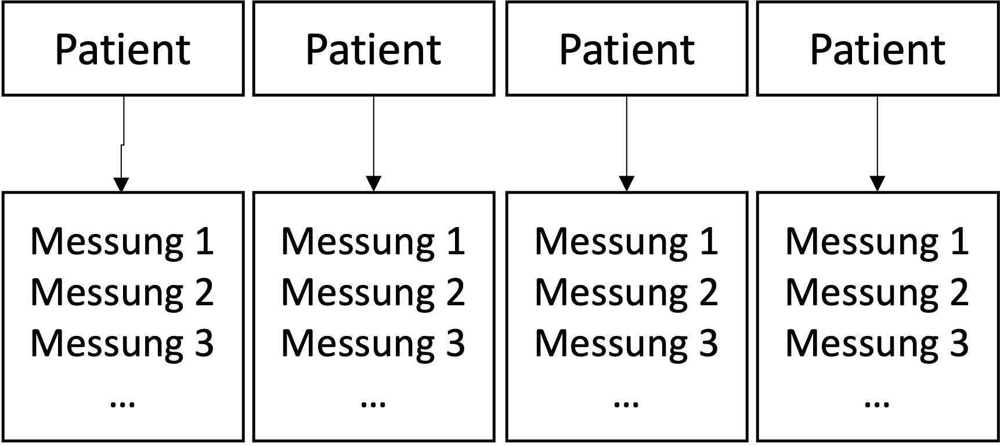
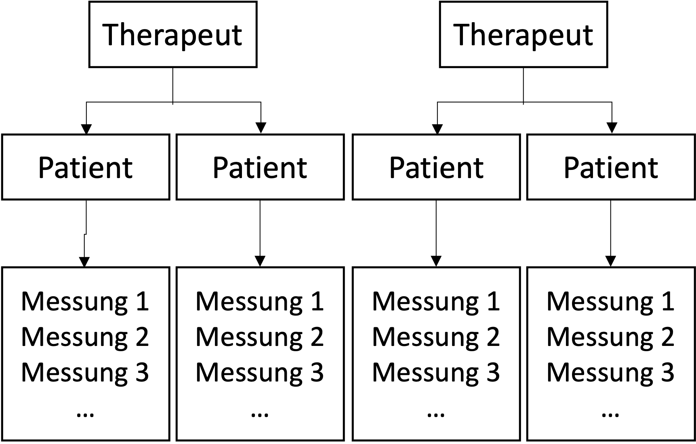

```{r setup, include=FALSE}
options(htmltools.dir.version = FALSE)

library(tidyverse)
library(kableExtra)
library(ggplot2)
library(plotly)
library(htmlwidgets)
library(MASS)
library(ggpubr)
library(xaringanthemer)
library(xaringanExtra)

style_duo_accent(
  primary_color = "#621C37",
  secondary_color = "#EE0071",
  background_image = "blank.png"
)

xaringanExtra::use_xaringan_extra(c("tile_view"))

use_scribble(
  pen_color = "#EE0071",
  pen_size = 4
)

knitr::opts_chunk$set(
  fig.retina = TRUE,
  warning = FALSE,
  message = FALSE,
  comment = NA
)

source(file = "base_functions.R")
```

name: Title slide
class: middle, left
<br><br><br><br><br><br><br>
# Multivariate Verfahren
***
### Einheit 3: Mehrebenenanalyse - Lineare gemischte Modelle  (2)
##### `r format(as.Date(data.frame(readxl::read_excel("Multivariate Verfahren Termine.xlsx"))$Datum), "%d.%m.%Y")[3]` | Prof. Dr. Stephan Goerigk

---
class: top, left
### Mehrebenenanalyse - Lineare gemischte Modelle

#### Wachstumskurvenmodelle

.pull-left[

* Messwiederholungen lassen sich gut mit LMMs modellieren.

* Haben ebenfalls eine hierarchische Struktur (Messzeitpunkte geschachtelt in Personen)

* Messungen innerhalb Personen geben Informationen über Messung dieser Person zu späterem Zeitpunkt (Autokorrelation)

* Beispiel: Wenn $x_t$ ein hoher Wert ist, dann ist $x_{t+1}$ ggf. auch höher 
]

.pull-right[
.center[
Beispiel: 2-Level Design mit Messwiederholungen
<br><br>
```{r eval = TRUE, echo = F, out.width = "400px"}

```
]
]

---
class: top, left
### Mehrebenenanalyse - Lineare gemischte Modelle

```{r echo=FALSE}
set.seed(1)
library(powerlmm)
p1 <- study_parameters(n1 = 11,
                       n2 = 5,
                       n3 = 4,
                       T_end = 10,
                       fixed_intercept = 37,
                       fixed_slope = -3,
                       sigma_subject_intercept = 2.89,
                       sigma_subject_slope = 1,
                       sigma_cluster_intercept = 0.6,
                       icc_slope = 0.1,
                       # var_ratio = 0.03,
                       sigma_error = 1.5,
                       cor_subject = -0.5,
                       cor_cluster = 0,
                       cohend = 0.6)
d1 <- simulate_data(p1)
p2 <- study_parameters(n1 = 11,
                       n2 = 5,
                       n3 = 4,
                       T_end = 10,
                       fixed_intercept = 37,
                       fixed_slope = -1,
                       sigma_subject_intercept = 2.89,
                       sigma_subject_slope = 1,
                       sigma_cluster_intercept = 0.6,
                       icc_slope = 0.1,
                       # var_ratio = 0.03,
                       sigma_error = 1.5,
                       cor_subject = -0.5,
                       cor_cluster = 0,
                       cohend = 0.6)
d2 <- simulate_data(p2)
d1$subject = paste0(d1$subject, "a")
d2$subject = paste0(d2$subject, "b")

for(t in 1:10){
  for (id in unique(d1$subject)) {
    d1$y[d1$time == t & d1$subject == id] = d1$y[d1$time == t & d1$subject == id] + sample(c(-3,3), size = 1)
  }
}
for(t in 1:10){
  d1$y[d1$time == t] = d1$y[d1$time == t] + sample(c(-2,2), size = 1)
}
for(t in 1:10){
  for (id in unique(d2$subject)) {
    d2$y[d2$time == t & d2$subject == id] = d2$y[d2$time == t & d2$subject == id] + sample(c(-3,3), size = 1)
  }
}
for(t in 1:10){
  d2$y[d2$time == t] = d2$y[d2$time == t] + sample(c(-2,2), size = 1)
}

d1$treatment = 1
d2$treatment = 0

d = rbind(d1, d2)
d = rename(d, "therapist" = cluster)
d$treatment = factor(d$treatment, levels = 0:1, labels = c("Warteliste", "Therapie"))

d$y[d$y<0] = sample(c(0:4), size = length(d$y[d$y<0]), replace = T)

write.csv(d, file = "/Users/stephangoerigk/Desktop/Universität/CFH/Lehre/Master/Multivariate Verfahren/Multivariate_Verfahren_WS24/Daten/lmer_data1.csv")

df = read.csv(file = "/Users/stephangoerigk/Desktop/Universität/CFH/Lehre/Master/Multivariate Verfahren/Multivariate_Verfahren_WS24/Daten/lmer_data1.csv")
df$treatment = factor(df$treatment,  levels = c("Warteliste", "Therapie"))
```

.pull-left[
#### Wachstumskurvenmodelle

Theoretische Regressionsgerade auf Personenlevel:

$$Y_{ij} = \beta_{0j} + \beta_{1j} t_{ij} + \varepsilon_{ij}$$

***

* Zeit/Messung $(t)$ wird zu einem Fixed Effekt $(\beta_1)$

* Steigung des Fixed Effekts $\rightarrow$ durchschnittliche Veränderung der Personen über Zeit

* Steigung = Veränderung in $y$, wenn $x$ $(t)$ um eine Einheit zunimmt

* Intercept = Durchschnittlicher $y$-Wert, wenn $x$ $(t)$ = 0 ist (zu Beginn der Studie)

]

.pull-right[
.center[
<br><br>
```{r eval = TRUE, echo = F, fig.height=5}
ggplot(data = df, aes(x = time, y = y)) +
  stat_summary() +
  stat_summary(geom = "line") +
  geom_smooth(method = "lm") +
  scale_x_continuous(breaks = 0:10) +
  coord_cartesian(ylim = c(0,40)) +
  labs(x = "Zeit", colour = "Gruppe") +
  theme(text = element_text(size = 20)) 
```
]
* Schwarz: Mittwelwerte im Zeitverlauf (Daten)
* Blau: Regressionsgerade (Modell)
]

---
class: top, left
### Mehrebenenanalyse - Lineare gemischte Modelle

.pull-left[
#### Wachstumskurvenmodelle

<small>

Verläufe lassen sich auch für Gruppen getrennt modellieren (Interaktion)

Theoretische Regressionsgerade auf Personenlevel:

$$Y_{ij} = \beta_{0j} + \beta_{1j} t_{ij} + \beta_{2j} Gruppe_{ij} + \beta_{3j} t_{ij} \cdot Gruppe_{ij} + \varepsilon_{ij}$$

***

* $\beta_0$ Intercept in der Referenzgruppe (dummy-codiert)

* $\beta_1$ Steigung in der Referenzgruppe

* $\beta_2$ Unterschied in den Intercepts (Wechsel von Referenz auf andere Gruppe)

* $\beta_3$ Unterschied in den Steigungen (Wechsel von Referenz auf andere Gruppe)

]

.pull-right[
.center[
<br><br>
```{r eval = TRUE, echo = F, fig.height=5}
ggplot(data = df, aes(x = time, y = y, colour = treatment)) +
  stat_summary() +
  stat_summary(geom = "line") +
  geom_smooth(method = "lm") +
  scale_x_continuous(breaks = 0:10) +
  coord_cartesian(ylim = c(0,40)) +
  labs(x = "Zeit", colour = "Gruppe") +
  theme(text = element_text(size = 20), legend.position = "right") 
```
]
]


---
class: top, left
### Mehrebenenanalyse - Lineare gemischte Modelle

.pull-left[
#### Wachstumskurvenmodelle

Hierarchische Datenstruktur:

* Jede Person hat einen individuellen Startpunkt

* Klinisch: z.B. aufgrund unterschiedlich starker Symptomatik zu Therapiebeginn

* Jede Person hat eine individuelle Trajektorie (Werteverlauf)

* Klinisch: z.B. aufgrund unterschiedlich gutem Therapieansprechen
]

.pull-right[
.center[
<br><br>
```{r eval = TRUE, echo = F, fig.height=5}
ggplot(data = d, aes(x = time, y = y)) +
  stat_summary() +
  stat_summary(geom = "line") +
  stat_summary(geom = "line", aes(group = subject), alpha = .1) +
  geom_smooth(method = "lm") +
  scale_x_continuous(breaks = 0:10) +
  #coord_cartesian(ylim = c(0,40)) +
  labs(x = "Zeit") +
  theme(text = element_text(size = 20)) 
```
]

<small>

* Schwarz: Mittwelwerte im Zeitverlauf (Daten)
* Grau: Individuelle Verläufe (Daten)
* Blau: Regressionsgerade (Modell)
]

---
class: top, left
### Mehrebenenanalyse - Lineare gemischte Modelle

.pull-left[
<small>

#### Wachstumskurvenmodelle - Datenstruktur (long Format)

.code80[
```{r echo=F}
ex = roundallnumerics(df[df$subject %in% c("1a", "15b"),c("subject", "y", "time", "treatment", "therapist")], 2)
rownames(ex) = 1:nrow(ex)
ex
```
]
$\rightarrow$ Auszug von 2 zufälligen Personen
]

.pull-right[
.center[
<br><br>
```{r eval = TRUE, echo = F, fig.height=5}
ggplot(data = d, aes(x = time, y = y)) +
  stat_summary() +
  stat_summary(geom = "line") +
  stat_summary(geom = "line", aes(group = subject), alpha = .1) +
  geom_smooth(method = "lm") +
  scale_x_continuous(breaks = 0:10) +
  #coord_cartesian(ylim = c(0,40)) +
  labs(x = "Zeit") +
  theme(text = element_text(size = 20)) 
```
]

* Schwarz: Mittwelwerte im Zeitverlauf (Daten)
* Grau: Individuelle Verläufe (Daten)
* Blau: Regressionsgerade (Modell)
]

---
class: top, left
### Mehrebenenanalyse - Lineare gemischte Modelle

.pull-left[
#### Wachstumskurvenmodelle

Hierarchische Datenstruktur:

* Jede Person hat einen individuellen Startpunkt

* Klinisch: z.B. aufgrund unterschiedlich starker Symptomatik zu Therapiebeginn

* Jede Person hat eine individuelle Trajektorie (Werteverlauf)

* Klinisch: z.B. aufgrund unterschiedlich gutem Therapieansprechen
]

.pull-right[
.center[
Zufällige Auswahl von 6 Personen aus dem Datensatz:
<br><br>
```{r eval=TRUE, echo=F, fig.height=5, message=FALSE, warning=FALSE}
ggplot(data = d[d$subject %in% sample(unique(d$subject), size = 6),], aes(x = time, y = y)) +
  stat_summary() +
  stat_summary(geom = "line") +
  stat_summary(geom = "line", aes(group = subject), alpha = .1) +
  geom_smooth(method = "lm", aes(group = subject), alpha = .1) +
  scale_x_continuous(breaks = seq(0,10,2)) +
  # coord_cartesian(ylim = c(0,40)) +
  facet_wrap(.~subject, nrow = 2) +
  labs(x = "Zeit") +
  theme(text = element_text(size = 20)) 
```
]
]


---
class: top, left
### Mehrebenenanalyse - Lineare gemischte Modelle

.pull-left[
#### Wachstumskurvenmodelle

Mögliche Implikationen im Regressionsmodell:

* Jede Person hat individuelles Intercept

* Klinisch: z.B. aufgrund unterschiedlich starker Symptomatik zu Therapiebeginn

* Jede Person hat eine individuelle Steigung 

* Klinisch: z.B. aufgrund unterschiedlich gutem Therapieansprechen

]

.pull-right[
.center[
<br><br>
```{r eval = TRUE, echo = F, fig.height=5}
ggplot(data = d, aes(x = time, y = y)) +
  #stat_summary() +
  #stat_summary(geom = "line") +
  #stat_summary(geom = "line", aes(group = subject), alpha = .1) +
  geom_smooth(method = "lm", aes(group = subject, colour = subject), size = .1, se = F) +
  scale_x_continuous(breaks = 0:10) +
  #coord_cartesian(ylim = c(0,40)) +
  labs(x = "Zeit") +
  theme(text = element_text(size = 20), legend.position = "none") 
```
]
]

---
class: top, left
### Mehrebenenanalyse - Lineare gemischte Modelle

.pull-left[
Einfaches Wachstumskurvenmodell (Kein Prädiktor):

<small>

**Random Intercept, fixed Slope Modell:**

$$
\begin{aligned}
&\textbf{Ebene 1} \\
&Y_{ij} = \beta_{0j} + \beta_{1j} t_{ij} + \varepsilon_{ij} \\
\\
&\textbf{Ebene 2} \\
&\beta_{0j} = \gamma_{00} + u_{0j} \\
&\beta_{1j} = \gamma_{10}  \\
\end{aligned}
$$
mit 

$$u_{0j} \sim \mathcal{N}(0, \tau^2_{00})$$
und

$$
\varepsilon_{ij} \sim \mathcal{N}(0, \sigma^2)
$$

]

.pull-right[
.center[
<br><br>
```{r eval = TRUE, echo = F, fig.height=6}
ggplot(data = d, aes(x = time, y = y)) +
  stat_summary() +
  stat_summary(geom = "line") +
  stat_summary(geom = "line", aes(group = subject), alpha = .1) +
  geom_smooth(method = "lm") +
  scale_x_continuous(breaks = 0:10) +
  #coord_cartesian(ylim = c(0,40)) +
  labs(x = "Zeit") +
  theme(text = element_text(size = 20)) 
```
]
]

---
class: top, left
### Mehrebenenanalyse - Lineare gemischte Modelle

.pull-left[
Einfaches Wachstumskurvenmodell (Kein Prädiktor):

<small>

**Random Intercept, fixed Slope Modell:**

$$
\begin{aligned}
&\textbf{Ebene 1} \\
&Y_{ij} = \beta_{0j} + \beta_{1j} t_{ij} + \varepsilon_{ij} \\
\\
&\textbf{Ebene 2} \\
&\beta_{0j} = \gamma_{00} + u_{0j} \\
&\beta_{1j} = \gamma_{10} \\
\end{aligned}
$$
mit 

$$u_{0j} \sim \mathcal{N}(0, \tau^2_{00})$$

und

$$
\varepsilon_{ij} \sim \mathcal{N}(0, \sigma^2)
$$

]

.pull-right[
.center[
<br><br>
```{r eval = TRUE, echo = F, fig.height=5}
mod = lmer(y ~ time + (1|subject), data = df)
df$fitted = predict(mod)

ggplot(data = df, aes(x = time, y = y)) +
  geom_line(aes(y = fitted, color = subject), size = .1) + 
  labs(x = "Zeit") +
  scale_x_continuous(breaks = 0:10) +
  theme(text = element_text(size = 20), legend.position = "none") 
```
]
$\rightarrow$ Intercepts dürfen über Personen hinweg variieren (Steigungen nicht)
]
---
class: top, left
### Mehrebenenanalyse - Lineare gemischte Modelle

.pull-left[
Einfaches Wachstumskurvenmodell (Kein Prädiktor):

<small>

**Random Intercept, fixed Slope Modell:**

$$
\begin{aligned}
&\textbf{Ebene 1} \\
&Y_{ij} = \beta_{0j} + \beta_{1j} t_{ij} + \varepsilon_{ij} \\
\\
&\textbf{Ebene 2} \\
&\beta_{0j} = \gamma_{00} + u_{0j} \\
&\beta_{1j} = \gamma_{10}  \\
\end{aligned}
$$
mit 

$$u_{0j} \sim \mathcal{N}(0, \tau^2_{00})$$

und

$$
\varepsilon_{ij} \sim \mathcal{N}(0, \sigma^2)
$$

]

.pull-right[
wobei:
- $Y_{ij}$ die Zielvariable zum Zeitpunkt $i$ für die Person $j$ darstellt,

- $\beta_{0j}$ und $\beta_{1j}$ der Intercept und die Steigung für die Person $j$ sind,

- $t_{ij}$ den Zeitpunkt darstellt,

- $\gamma_{00}$ und $\gamma_{10}$ die fixed Effekte sind,

- $u_{0j}$ das random Intercept mit einer Varianz-Kovarianz-Matrix darstellen,

- $\varepsilon_{ij}$ der Residualfehler ist.

Diese Formulierung spezifiziert ein Modell mit zufälligem Intercept und fester Steigung.
]

---
class: top, left
### Mehrebenenanalyse - Lineare gemischte Modelle

.pull-left[
Einfaches Wachstumskurvenmodell (Kein Prädiktor):

<small>

**Random Intercept, fixed Slope Modell:**

$$
\begin{aligned}
&\textbf{Ebene 1} \\
&Y_{ij} = \beta_{0j} + \beta_{1j} t_{ij} + \varepsilon_{ij} \\
\\
&\textbf{Ebene 2} \\
&\beta_{0j} = \gamma_{00} + u_{0j} \\
&\beta_{1j} = \gamma_{10} \\
\end{aligned}
$$
mit 

$$u_{0j} \sim \mathcal{N}(0, \tau^2_{00})$$

und

$$
\varepsilon_{ij} \sim \mathcal{N}(0, \sigma^2)
$$

]

.pull-right[
.code80[
```{r}
mod = lmer(y ~ time + (1|subject), data = df)
summary(mod)
```
]
]

---
class: top, left
### Mehrebenenanalyse - Lineare gemischte Modelle

.pull-left[
Einfaches Wachstumskurvenmodell (Kein Prädiktor):

<small>

**Random Intercept, fixed Slope Modell:**

$\gamma_{00}$ = `r round(summary(mod)$coefficients["(Intercept)","Estimate"], 2)` $\rightarrow$ Zur Baseline $(t=0)$ haben Personen durchschnittlich einen Wert von `r round(summary(mod)$coefficients["(Intercept)","Estimate"], 2)`

$\gamma_{10}$ = `r round(summary(mod)$coefficients["time","Estimate"], 2)` $\rightarrow$ Pro zusätzlicher Messung $(t+1)$ verändern sich die Werte der Personen durchschnittlich um einen Wert von `r round(summary(mod)$coefficients["time","Estimate"], 2)`

$\tau_{0j}$ = `r round(data.frame(VarCorr(mod))$vcov[1], 2)` $\rightarrow$ Die Personen variieren mit $\sqrt{`r round(data.frame(VarCorr(mod))$vcov[1], 2)`}= `r round(sqrt(data.frame(VarCorr(mod))$vcov[1]), 2)`$ Punkten um das Durchschnittsintercept $(\gamma_{00})$

$\sigma^2=$ `r round(sigma(mod)^2, 2)` $\rightarrow$ Es verbleiben `r round(sigma(mod)^2, 2)` Punkte unaufgeklärte Residualvarianz
]

.pull-right[
.code80[
```{r}
mod = lmer(y ~ time + (1|subject), data = df)
summary(mod)
```
]
]

---
class: top, left
### Mehrebenenanalyse - Lineare gemischte Modelle

.pull-left[
Einfaches Wachstumskurvenmodell (Kein Prädiktor):

<small>

**Random Intercept, random Slope Modell:**

$$
\begin{aligned}
&\textbf{Ebene 1} \\
&Y_{ij} = \beta_{0j} + \beta_{1j} t_{ij} + \varepsilon_{ij} \\
\\
&\textbf{Ebene 2} \\
&\beta_{0j} = \gamma_{00} + u_{0j} \\
&\beta_{1j} = \gamma_{10} + u_{1j} \\
\end{aligned}
$$
mit 

$$
\begin{pmatrix}
u_{0j} \\
u_{1j} \\
\end{pmatrix}
\sim \mathcal{N} 
\begin{pmatrix}
\begin{matrix} 0 \\ 0 \end{matrix}, &
\begin{matrix} \tau_{00}^2 & \tau_{01} \\ \tau_{01} & \tau_{10}^2 \end{matrix} 
\end{pmatrix}
$$
und

$$
\varepsilon_{ij} \sim \mathcal{N}(0, \sigma^2)
$$

]

.pull-right[
.center[
<br><br>
```{r eval = TRUE, echo = F, fig.height=6}
ggplot(data = d, aes(x = time, y = y)) +
  stat_summary() +
  stat_summary(geom = "line") +
  stat_summary(geom = "line", aes(group = subject), alpha = .1) +
  geom_smooth(method = "lm") +
  scale_x_continuous(breaks = 0:10) +
  #coord_cartesian(ylim = c(0,40)) +
  labs(x = "Zeit") +
  theme(text = element_text(size = 20)) 
```
]
]

---
class: top, left
### Mehrebenenanalyse - Lineare gemischte Modelle

.pull-left[
Einfaches Wachstumskurvenmodell (Kein Prädiktor):

<small>

**Random Intercept, random Slope Modell:**

$$
\begin{aligned}
&\textbf{Ebene 1} \\
&Y_{ij} = \beta_{0j} + \beta_{1j} t_{ij} + \varepsilon_{ij} \\
\\
&\textbf{Ebene 2} \\
&\beta_{0j} = \gamma_{00} + u_{0j} \\
&\beta_{1j} = \gamma_{10} + u_{1j} \\
\end{aligned}
$$
mit 

$$
\begin{pmatrix}
u_{0j} \\
u_{1j} \\
\end{pmatrix}
\sim \mathcal{N} 
\begin{pmatrix}
\begin{matrix} 0 \\ 0 \end{matrix}, &
\begin{matrix} \tau_{00}^2 & \tau_{01} \\ \tau_{01} & \tau_{10}^2 \end{matrix} 
\end{pmatrix}
$$
und

$$
\varepsilon_{ij} \sim \mathcal{N}(0, \sigma^2)
$$

]

.pull-right[
.center[
<br><br>
```{r eval = TRUE, echo = F, fig.height=5}
mod = lmer(y ~ time + (time|subject), data = df)
df$fitted = predict(mod)

ggplot(data = df, aes(x = time, y = y)) +
  geom_line(aes(y = fitted, color = subject), size = .1) + 
  labs(x = "Zeit") +
  scale_x_continuous(breaks = 0:10) +
  theme(text = element_text(size = 20), legend.position = "none") 
```
]
$\rightarrow$ Intercepts und Slopes dürfen über Personen hinweg variieren
]
---
class: top, left
### Mehrebenenanalyse - Lineare gemischte Modelle

.pull-left[
Einfaches Wachstumskurvenmodell (Kein Prädiktor):

<small>

**Random Intercept, random Slope Modell:**

$$
\begin{aligned}
&\textbf{Ebene 1} \\
&Y_{ij} = \beta_{0j} + \beta_{1j} t_{ij} + \varepsilon_{ij} \\
\\
&\textbf{Ebene 2} \\
&\beta_{0j} = \gamma_{00} + u_{0j} \\
&\beta_{1j} = \gamma_{10} + u_{1j} \\
\end{aligned}
$$
mit 

$$
\begin{pmatrix}
u_{0j} \\
u_{1j} \\
\end{pmatrix}
\sim \mathcal{N} 
\begin{pmatrix}
\begin{matrix} 0 \\ 0 \end{matrix}, &
\begin{matrix} \tau_{00}^2 & \tau_{01} \\ \tau_{01} & \tau_{10}^2 \end{matrix} 
\end{pmatrix}
$$
und

$$
\varepsilon_{ij} \sim \mathcal{N}(0, \sigma^2)
$$

]

.pull-right[
wobei:
- $Y_{ij}$ die Zielvariable zum Zeitpunkt $i$ für die Person $j$ darstellt,

- $\beta_{0j}$ und $\beta_{1j}$ der Intercept und die Steigung für die Person $j$ sind,

- $t_{ij}$ den Zeitpunkt darstellt,

- $\gamma_{00}$ und $\gamma_{10}$ die fixed Effekte sind,

- $u_{0j}$ und $u_{1j}$ random Effekte mit einer Varianz-Kovarianz-Matrix darstellen,

- $\varepsilon_{ij}$ der Residualfehler ist.

Diese Formulierung spezifiziert ein Modell mit zufälligem Intercept und zufälliger Steigung.
]

---
class: top, left
### Mehrebenenanalyse - Lineare gemischte Modelle

.pull-left[
Einfaches Wachstumskurvenmodell (Kein Prädiktor):

<small>

**Random Intercept, random Slope Modell:**

$$
\begin{aligned}
&\textbf{Ebene 1} \\
&Y_{ij} = \beta_{0j} + \beta_{1j} t_{ij} + \varepsilon_{ij} \\
\\
&\textbf{Ebene 2} \\
&\beta_{0j} = \gamma_{00} + u_{0j} \\
&\beta_{1j} = \gamma_{10} + u_{1j} \\
\end{aligned}
$$
mit 

$$
\begin{pmatrix}
u_{0j} \\
u_{1j} \\
\end{pmatrix}
\sim \mathcal{N} 
\begin{pmatrix}
\begin{matrix} 0 \\ 0 \end{matrix}, &
\begin{matrix} \tau_{00}^2 & \tau_{01} \\ \tau_{01} & \tau_{10}^2 \end{matrix} 
\end{pmatrix}
$$
und

$$
\varepsilon_{ij} \sim \mathcal{N}(0, \sigma^2)
$$

]

.pull-right[
.code80[
```{r}
mod = lmer(y ~ time + (time|subject), data = df)
summary(mod)
```
]
]


---
class: top, left
### Mehrebenenanalyse - Lineare gemischte Modelle

.pull-left[
Einfaches Wachstumskurvenmodell (Kein Prädiktor):

<small>

**Random Intercept, random Slope Modell:**

$\gamma_{00}$ = `r round(summary(mod)$coefficients["(Intercept)","Estimate"], 2)` $\rightarrow$ Zur Baseline $(t=0)$ haben Personen durchschnittlich einen Wert von `r round(summary(mod)$coefficients["(Intercept)","Estimate"], 2)`

$\gamma_{10}$ = `r round(summary(mod)$coefficients["time","Estimate"], 2)` $\rightarrow$ Pro zusätzlicher Messung $(t+1)$ verändern sich die Werte der Personen durchschnittlich um einen Wert von `r round(summary(mod)$coefficients["time","Estimate"], 2)`

$\tau_{0j}$ = `r round(data.frame(VarCorr(mod))$vcov[1], 2)` $\rightarrow$ Die Personen variieren mit $\sqrt{`r round(data.frame(VarCorr(mod))$vcov[1], 2)`}= `r round(sqrt(data.frame(VarCorr(mod))$vcov[1]), 2)`$ Punkten um das Durchschnittsintercept $(\gamma_{00})$

$\tau_{1j}$ = `r round(data.frame(VarCorr(mod))$vcov[2], 2)` $\rightarrow$ Die Personen variieren mit $\sqrt{`r round(data.frame(VarCorr(mod))$vcov[2], 2)`}= `r round(sqrt(data.frame(VarCorr(mod))$vcov[2]), 2)`$ Punkten um die Durchschnittssteigung $(\gamma_{10})$

$\sigma^2=$ `r round(sigma(mod)^2, 2)` $\rightarrow$ Es verbleiben `r round(sigma(mod)^2, 2)` Punkte unaufgeklärte Residualvarianz
]

.pull-right[
.code80[
```{r}
mod = lmer(y ~ time + (time|subject), data = df)
summary(mod)
```
]
]

---
class: top, left
### Mehrebenenanalyse - Lineare gemischte Modelle

.pull-left[
<small>

Konditionales Wachstumskurvenmodell (mit Prädiktor):


**Random Intercept, random Slope Modell (2 Gruppen):**

$$
\begin{aligned}
&\textbf{Ebene 1} \\
&Y_{ij} = \beta_{0j} + \beta_{1j} t_{ij} + \varepsilon_{ij} \\
\\
&\textbf{Ebene 2} \\
&\beta_{0j} = \gamma_{00} + \gamma_{01}Gruppe_{j} + u_{0j} \\
&\beta_{1j} = \gamma_{10} + \gamma_{11}Gruppe_{j} + u_{1j} \\
\end{aligned}
$$
mit 

$$
\begin{pmatrix}
u_{0j} \\
u_{1j} \\
\end{pmatrix}
\sim \mathcal{N} 
\begin{pmatrix}
\begin{matrix} 0 \\ 0 \end{matrix}, &
\begin{matrix} \tau_{00}^2 & \tau_{01} \\ \tau_{01} & \tau_{10}^2 \end{matrix} 
\end{pmatrix}
$$
und

$$
\varepsilon_{ij} \sim \mathcal{N}(0, \sigma^2)
$$

]

.pull-right[
.center[
<br><br>
```{r eval = TRUE, echo = F, fig.height=6}
ggplot(data = d, aes(x = time, y = y, colour = treatment)) +
  stat_summary() +
  stat_summary(geom = "line") +
  stat_summary(geom = "line", aes(group = subject), alpha = .1) +
  geom_smooth(method = "lm") +
  scale_x_continuous(breaks = 0:10) +
  #coord_cartesian(ylim = c(0,40)) +
  labs(x = "Zeit", colour = "Gruppe") +
  theme(text = element_text(size = 20)) 
```
]
]

---
class: top, left
### Mehrebenenanalyse - Lineare gemischte Modelle

.pull-left[
<small>

Konditionales Wachstumskurvenmodell (mit Prädiktor):

**Random Intercept, random Slope Modell (2 Gruppen):**

$$
\begin{aligned}
&\textbf{Ebene 1} \\
&Y_{ij} = \beta_{0j} + \beta_{1j} t_{ij} + \varepsilon_{ij} \\
\\
&\textbf{Ebene 2} \\
&\beta_{0j} = \gamma_{00} + \gamma_{01}Gruppe_{j} + u_{0j} \\
&\beta_{1j} = \gamma_{10} + \gamma_{11}Gruppe_{j} + u_{1j} \\
\end{aligned}
$$
mit 

$$
\begin{pmatrix}
u_{0j} \\
u_{1j} \\
\end{pmatrix}
\sim \mathcal{N} 
\begin{pmatrix}
\begin{matrix} 0 \\ 0 \end{matrix}, &
\begin{matrix} \tau_{00}^2 & \tau_{01} \\ \tau_{01} & \tau_{10}^2 \end{matrix} 
\end{pmatrix}
$$
und

$$
\varepsilon_{ij} \sim \mathcal{N}(0, \sigma^2)
$$

]

.pull-right[
.center[
<br><br>
```{r eval = TRUE, echo = F, fig.height=5}
mod = lmer(y ~ time * treatment + (time|subject), data = df)
df$fitted = predict(mod)

ggplot(data = df, aes(x = time, y = y, colour = treatment)) +
  geom_line(aes(y = fitted, group = subject), size = .1) + 
  labs(x = "Zeit", colour = "Gruppe") +
  scale_x_continuous(breaks = 0:10) +
  theme(text = element_text(size = 20), legend.position = "none") 
```
]
$\rightarrow$ Intercepts und Slopes dürfen über Personen hinweg variieren
]

---
class: top, left
### Mehrebenenanalyse - Lineare gemischte Modelle

.pull-left[
<small>

Konditionales Wachstumskurvenmodell (mit Prädiktor):

**Random Intercept, random Slope Modell (2 Gruppen):**

$$
\begin{aligned}
&\textbf{Ebene 1} \\
&Y_{ij} = \beta_{0j} + \beta_{1j} t_{ij} + \varepsilon_{ij} \\
\\
&\textbf{Ebene 2} \\
&\beta_{0j} = \gamma_{00} + \gamma_{01}Gruppe_{j} + u_{0j} \\
&\beta_{1j} = \gamma_{10} + \gamma_{11}Gruppe_{j} + u_{1j} \\
\end{aligned}
$$
mit 

$$
\begin{pmatrix}
u_{0j} \\
u_{1j} \\
\end{pmatrix}
\sim \mathcal{N} 
\begin{pmatrix}
\begin{matrix} 0 \\ 0 \end{matrix}, &
\begin{matrix} \tau_{00}^2 & \tau_{01} \\ \tau_{01} & \tau_{10}^2 \end{matrix} 
\end{pmatrix}
$$
und

$$
\varepsilon_{ij} \sim \mathcal{N}(0, \sigma^2)
$$

]

.pull-right[
wobei:
- $Y_{ij}$ die Zielvariable zum Zeitpunkt $i$ für die Person $j$ darstellt,

- $\beta_{0j}$ und $\beta_{1j}$ der Intercept und die Steigung für die Person $j$ sind,

- $t_{ij}$ den Zeitpunkt darstellt,

- $\gamma_{00}$, $\gamma_{10}$, $\gamma_{10}$ und $\gamma_{11}$ die fixed Effekte sind,

- $u_{0j}$ und $u_{1j}$ random Effekte mit einer Varianz-Kovarianz-Matrix darstellen,

- $\varepsilon_{ij}$ der Residualfehler ist.

Diese Formulierung spezifiziert ein Modell mit zufälligem Intercept und zufälliger Steigung.
]

---
class: top, left
### Mehrebenenanalyse - Lineare gemischte Modelle

.pull-left[
<small>

Konditionales Wachstumskurvenmodell (mit Prädiktor):

**Random Intercept, random Slope Modell (2 Gruppen):**

$$
\begin{aligned}
&\textbf{Ebene 1} \\
&Y_{ij} = \beta_{0j} + \beta_{1j} t_{ij} + \varepsilon_{ij} \\
\\
&\textbf{Ebene 2} \\
&\beta_{0j} = \gamma_{00} + \gamma_{01}Gruppe_{j} + u_{0j} \\
&\beta_{1j} = \gamma_{10} + \gamma_{11}Gruppe_{j} + u_{1j} \\
\end{aligned}
$$
mit 

$$
\begin{pmatrix}
u_{0j} \\
u_{1j} \\
\end{pmatrix}
\sim \mathcal{N} 
\begin{pmatrix}
\begin{matrix} 0 \\ 0 \end{matrix}, &
\begin{matrix} \tau_{00}^2 & \tau_{01} \\ \tau_{01} & \tau_{10}^2 \end{matrix} 
\end{pmatrix}
$$
und

$$
\varepsilon_{ij} \sim \mathcal{N}(0, \sigma^2)
$$

]

.pull-right[
.code60[
```{r}
mod = lmer(y ~ time * treatment + (time|subject), data = df)
summary(mod)
```
]
]

---
class: top, left
### Mehrebenenanalyse - Lineare gemischte Modelle

.pull-left[
<small>

Konditionales Wachstumskurvenmodell (mit Prädiktor):

**Random Intercept, random Slope Modell (2 Gruppen):**

$\gamma_{00}$ = `r round(summary(mod)$coefficients["(Intercept)","Estimate"], 2)` $\rightarrow$ Zur Baseline $(t=0)$ haben Personen in der Wartelistengruppe durchschnittlich einen Wert von `r round(summary(mod)$coefficients["(Intercept)","Estimate"], 2)`

$\gamma_{10}$ = `r round(summary(mod)$coefficients["time","Estimate"], 2)` $\rightarrow$ Pro zusätzlicher Messung $(t+1)$ verändern sich die Werte der Personen in der Wartelistengruppe durchschnittlich um einen Wert von `r round(summary(mod)$coefficients["time","Estimate"], 2)`

$\gamma_{01}$ = `r round(summary(mod)$coefficients["treatmentTherapie","Estimate"], 2)` $\rightarrow$ Zur Baseline $(t=0)$ haben Personen in der Therapiegruppe durchschnittlich einen Wert von `r round(summary(mod)$coefficients["treatmentTherapie","Estimate"], 2)` mehr als die in der Wartelistengruppe

$\gamma_{10}$ = `r round(summary(mod)$coefficients["time:treatmentTherapie","Estimate"], 2)` $\rightarrow$ Pro zusätzlicher Messung $(t+1)$ reduzieren sich die Werte der Personen in der Therapiegruppe durchschnittlich um einen Wert von `r round(summary(mod)$coefficients["time:treatmentTherapie","Estimate"], 2)` mehr als in der Wartelistengruppe

]

.pull-right[
.code60[
```{r}
mod = lmer(y ~ time * treatment + (time|subject), data = df)
summary(mod)
```
]
]

---
class: top, left
### Mehrebenenanalyse - Lineare gemischte Modelle

.pull-left[
<small>

Konditionales Wachstumskurvenmodell (mit Prädiktor):

**Random Intercept, random Slope Modell (2 Gruppen):**

$\tau_{0j}$ = `r round(data.frame(VarCorr(mod))$vcov[1], 2)` $\rightarrow$ Die Personen variieren mit $\sqrt{`r round(data.frame(VarCorr(mod))$vcov[1], 2)`}= `r round(sqrt(data.frame(VarCorr(mod))$vcov[1]), 2)`$ Punkten um das Durchschnittsintercept $(\gamma_{00})$

$\tau_{1j}$ = `r round(data.frame(VarCorr(mod))$vcov[2], 2)` $\rightarrow$ Die Personen variieren mit $\sqrt{`r round(data.frame(VarCorr(mod))$vcov[2], 2)`}= `r round(sqrt(data.frame(VarCorr(mod))$vcov[2]), 2)`$ Punkten um die Durchschnittssteigung $(\gamma_{10})$

$\sigma^2=$ `r round(sigma(mod)^2, 2)` $\rightarrow$ Es verbleiben `r round(sigma(mod)^2, 2)` Punkte unaufgeklärte Residualvarianz
]

.pull-right[
.code60[
```{r}
mod = lmer(y ~ time * treatment + (time|subject), data = df)
summary(mod)
```
]
]


---
class: top, left
### Mehrebenenanalyse - Lineare gemischte Modelle

```{r echo=FALSE}
set.seed(1)
library(powerlmm)
p1 <- study_parameters(n1 = 11,
                       n2 = 4,
                       n3 = 3,
                       T_end = 10,
                       fixed_intercept = 37,
                       fixed_slope = -3,
                       sigma_subject_intercept = 2.89,
                       sigma_subject_slope = 1,
                       sigma_cluster_intercept = 0.6,
                       icc_slope = 0.1,
                       # var_ratio = 0.03,
                       sigma_error = 1.5,
                       cor_subject = -0.5,
                       cor_cluster = 0,
                       cohend = 0.6)
d1 <- simulate_data(p1)
p2 <- study_parameters(n1 = 11,
                       n2 = 4,
                       n3 = 3,
                       T_end = 10,
                       fixed_intercept = 37,
                       fixed_slope = -1,
                       sigma_subject_intercept = 2.89,
                       sigma_subject_slope = 1,
                       sigma_cluster_intercept = 0.6,
                       icc_slope = 0.1,
                       # var_ratio = 0.03,
                       sigma_error = 1.5,
                       cor_subject = -0.5,
                       cor_cluster = 0,
                       cohend = 0.6)
d2 <- simulate_data(p2)
p3 <- study_parameters(n1 = 11,
                       n2 = 4,
                       n3 = 3,
                       T_end = 10,
                       fixed_intercept = 37,
                       fixed_slope = -1.3,
                       sigma_subject_intercept = 2.89,
                       sigma_subject_slope = 1,
                       sigma_cluster_intercept = 0.6,
                       icc_slope = 0.1,
                       # var_ratio = 0.03,
                       sigma_error = 1.5,
                       cor_subject = -0.5,
                       cor_cluster = 0,
                       cohend = 0.6)
d3 <- simulate_data(p3)

d1$subject = paste0(d1$subject, "a")
d2$subject = paste0(d2$subject, "b")
d3$subject = paste0(d2$subject, "c")

for(t in 1:10){
  for (id in unique(d1$subject)) {
    d1$y[d1$time == t & d1$subject == id] = d1$y[d1$time == t & d1$subject == id] + sample(c(-3,3), size = 1)
  }
}
for(t in 1:10){
  d1$y[d1$time == t] = d1$y[d1$time == t] + sample(c(-2,2), size = 1)
}
for(t in 1:10){
  for (id in unique(d2$subject)) {
    d2$y[d2$time == t & d2$subject == id] = d2$y[d2$time == t & d2$subject == id] + sample(c(-3,3), size = 1)
  }
}
for(t in 1:10){
  d2$y[d2$time == t] = d2$y[d2$time == t] + sample(c(-2,2), size = 1)
}
for(t in 1:10){
  for (id in unique(d3$subject)) {
    d3$y[d3$time == t & d3$subject == id] = d3$y[d3$time == t & d3$subject == id] + sample(c(-3,3), size = 1)
  }
}
for(t in 1:10){
  d3$y[d3$time == t] = d3$y[d3$time == t] + sample(c(-2,2), size = 1)
}

d1$treatment = 2
d2$treatment = 0
d3$treatment = 1

d3 = rbind(d1, d2, d3)
d3 = rename(d3, "therapist" = cluster)
d3$treatment = factor(d3$treatment, levels = 0:2, labels = c("Warteliste", "TAU", "Therapie"))

d3$y[d3$y<0] = sample(c(0:4), size = length(d3$y[d3$y<0]), replace = T)

write.csv(d3, file = "/Users/stephangoerigk/Desktop/Universität/CFH/Lehre/Master/Multivariate Verfahren/Multivariate_Verfahren_WS24/Daten/lmer_data2.csv")

df3 = read.csv(file = "/Users/stephangoerigk/Desktop/Universität/CFH/Lehre/Master/Multivariate Verfahren/Multivariate_Verfahren_WS24/Daten/lmer_data2.csv")
df3$treatment = factor(df3$treatment,  levels = c("Warteliste", "TAU", "Therapie"))
```


.pull-left[
<small>

Konditionales Wachstumskurvenmodell (mit Prädiktor):

**Random Intercept, random Slope Modell (3 Gruppen):**

$$
\begin{aligned}
&\textbf{Ebene 1} \\
&Y_{ij} = \beta_{0j} + \beta_{1j} t_{ij} + \varepsilon_{ij} \\
\\
&\textbf{Ebene 2} \\
&\beta_{0j} = \gamma_{00} + \gamma_{01}TAU_{j} + \gamma_{02}Therapie_{j} + u_{0j} \\
&\beta_{1j} = \gamma_{10} + \gamma_{11}TAU_{j} + \gamma_{12}Therapie_{j}+ u_{1j} \\
\end{aligned}
$$
mit 

$$
\begin{pmatrix}
u_{0j} \\
u_{1j} \\
\end{pmatrix}
\sim \mathcal{N} 
\begin{pmatrix}
\begin{matrix} 0 \\ 0 \end{matrix}, &
\begin{matrix} \tau_{00}^2 & \tau_{01} \\ \tau_{01} & \tau_{10}^2 \end{matrix} 
\end{pmatrix}
$$
und

$$
\varepsilon_{ij} \sim \mathcal{N}(0, \sigma^2)
$$

]

.pull-right[
.center[
<br><br>
```{r eval = TRUE, echo = F, fig.height=6}
ggplot(data = df3, aes(x = time, y = y, colour = treatment)) +
  stat_summary() +
  stat_summary(geom = "line") +
  stat_summary(geom = "line", aes(group = subject), alpha = .1) +
  geom_smooth(method = "lm") +
  scale_x_continuous(breaks = 0:10) +
  #coord_cartesian(ylim = c(0,40)) +
  labs(x = "Zeit", colour = "Gruppe") +
  theme(text = element_text(size = 20)) 
```
]
]

---
class: top, left
### Mehrebenenanalyse - Lineare gemischte Modelle

.pull-left[
<small>

Konditionales Wachstumskurvenmodell (mit Prädiktor):

**Random Intercept, random Slope Modell (3 Gruppen):**

$$
\begin{aligned}
&\textbf{Ebene 1} \\
&Y_{ij} = \beta_{0j} + \beta_{1j} t_{ij} + \varepsilon_{ij} \\
\\
&\textbf{Ebene 2} \\
&\beta_{0j} = \gamma_{00} + \gamma_{01}TAU_{j} + \gamma_{02}Therapie_{j} + u_{0j} \\
&\beta_{1j} = \gamma_{10} + \gamma_{11}TAU_{j} + \gamma_{12}Therapie_{j}+ u_{1j} \\
\end{aligned}
$$
mit 

$$
\begin{pmatrix}
u_{0j} \\
u_{1j} \\
\end{pmatrix}
\sim \mathcal{N} 
\begin{pmatrix}
\begin{matrix} 0 \\ 0 \end{matrix}, &
\begin{matrix} \tau_{00}^2 & \tau_{01} \\ \tau_{01} & \tau_{10}^2 \end{matrix} 
\end{pmatrix}
$$
und

$$
\varepsilon_{ij} \sim \mathcal{N}(0, \sigma^2)
$$

]

.pull-right[
.center[
<br><br>
```{r eval = TRUE, echo = F, fig.height=5}
mod = lmer(y ~ time * treatment + (time|subject), data = df3)
df3$fitted = predict(mod)

ggplot(data = df3, aes(x = time, y = y, colour = treatment)) +
  geom_line(aes(y = fitted, group = subject), size = .1) + 
  labs(x = "Zeit", colour = "Gruppe") +
  scale_x_continuous(breaks = 0:10) +
  theme(text = element_text(size = 20), legend.position = "none") 
```
]
$\rightarrow$ Intercepts und Slopes dürfen über Personen hinweg variieren
]

---
class: top, left
### Mehrebenenanalyse - Lineare gemischte Modelle

.pull-left[
<small>

Konditionales Wachstumskurvenmodell (mit Prädiktor):

**Random Intercept, random Slope Modell (3 Gruppen):**

$$
\begin{aligned}
&\textbf{Ebene 1} \\
&Y_{ij} = \beta_{0j} + \beta_{1j} t_{ij} + \varepsilon_{ij} \\
\\
&\textbf{Ebene 2} \\
&\beta_{0j} = \gamma_{00} + \gamma_{01}TAU_{j} + \gamma_{02}Therapie_{j} + u_{0j} \\
&\beta_{1j} = \gamma_{10} + \gamma_{11}TAU_{j} + \gamma_{12}Therapie_{j}+ u_{1j} \\
\end{aligned}
$$
mit 

$$
\begin{pmatrix}
u_{0j} \\
u_{1j} \\
\end{pmatrix}
\sim \mathcal{N} 
\begin{pmatrix}
\begin{matrix} 0 \\ 0 \end{matrix}, &
\begin{matrix} \tau_{00}^2 & \tau_{01} \\ \tau_{01} & \tau_{10}^2 \end{matrix} 
\end{pmatrix}
$$
und

$$
\varepsilon_{ij} \sim \mathcal{N}(0, \sigma^2)
$$

]

.pull-right[
wobei:
- $Y_{ij}$ die Zielvariable zum Zeitpunkt $i$ für die Person $j$ darstellt,

- $\beta_{0j}$ und $\beta_{1j}$ der Intercept und die Steigung für die Person $j$ sind,

- $t_{ij}$ den Zeitpunkt darstellt,

- $\gamma_{00}$, $\gamma_{10}$, $\gamma_{01}$,  $\gamma_{11}$, $\gamma_{02}$ und $\gamma_{12}$ die fixed Effekte sind,

- $u_{0j}$ und $u_{1j}$ random Effekte mit einer Varianz-Kovarianz-Matrix darstellen,

- $\varepsilon_{ij}$ der Residualfehler ist.

Diese Formulierung spezifiziert ein Modell mit zufälligem Intercept und zufälliger Steigung.
]

---
class: top, left
### Mehrebenenanalyse - Lineare gemischte Modelle

.pull-left[
<small>

Konditionales Wachstumskurvenmodell (mit Prädiktor):

**Random Intercept, random Slope Modell (3 Gruppen):**

$$
\begin{aligned}
&\textbf{Ebene 1} \\
&Y_{ij} = \beta_{0j} + \beta_{1j} t_{ij} + \varepsilon_{ij} \\
\\
&\textbf{Ebene 2} \\
&\beta_{0j} = \gamma_{00} + \gamma_{01}TAU_{j} + \gamma_{02}Therapie_{j} + u_{0j} \\
&\beta_{1j} = \gamma_{10} + \gamma_{11}TAU_{j} + \gamma_{12}Therapie_{j}+ u_{1j} \\
\end{aligned}
$$
mit 

$$
\begin{pmatrix}
u_{0j} \\
u_{1j} \\
\end{pmatrix}
\sim \mathcal{N} 
\begin{pmatrix}
\begin{matrix} 0 \\ 0 \end{matrix}, &
\begin{matrix} \tau_{00}^2 & \tau_{01} \\ \tau_{01} & \tau_{10}^2 \end{matrix} 
\end{pmatrix}
$$
und

$$
\varepsilon_{ij} \sim \mathcal{N}(0, \sigma^2)
$$

]

.pull-right[
.code60[
```{r}
mod = lmer(y ~ time * treatment + (time|subject), data = df3)
summary(mod)
```
]
]

---
class: top, left
### Mehrebenenanalyse - Lineare gemischte Modelle

.pull-left[
<small>

Konditionales Wachstumskurvenmodell (mit Prädiktor):

**Random Intercept, random Slope Modell (3 Gruppen):**

<small>
$\gamma_{00}$ = `r round(summary(mod)$coefficients["(Intercept)","Estimate"], 2)` $\rightarrow$ Zur Baseline $(t=0)$ haben Personen in der Wartelistengruppe durchschnittlich einen Wert von `r round(summary(mod)$coefficients["(Intercept)","Estimate"], 2)`

$\gamma_{10}$ = `r round(summary(mod)$coefficients["time","Estimate"], 2)` $\rightarrow$ Pro zusätzlicher Messung $(t+1)$ verändern sich die Werte der Personen in der Wartelistengruppe durchschnittlich um einen Wert von `r round(summary(mod)$coefficients["time","Estimate"], 2)`

$\gamma_{01}$ = `r round(summary(mod)$coefficients["treatmentTAU","Estimate"], 2)` $\rightarrow$ Zur Baseline $(t=0)$ haben Personen in der TAU Gruppe durchschnittlich einen Wert von `r round(summary(mod)$coefficients["treatmentTAU","Estimate"], 2)` mehr als die in der Wartelistengruppe

$\gamma_{11}$ = `r round(summary(mod)$coefficients["time:treatmentTAU","Estimate"], 2)` $\rightarrow$ Pro zusätzlicher Messung $(t+1)$ reduzieren sich die Werte der Personen in der TAU Gruppe durchschnittlich um einen Wert von `r round(summary(mod)$coefficients["time:treatmentTAU","Estimate"], 2)` mehr als in der Wartelistengruppe

$\gamma_{02}$ = `r round(summary(mod)$coefficients["treatmentTherapie","Estimate"], 2)` $\rightarrow$ Zur Baseline $(t=0)$ haben Personen in der Therapiegruppe durchschnittlich einen Wert von `r round(summary(mod)$coefficients["treatmentTherapie","Estimate"], 2)` mehr als die in der Wartelistengruppe

$\gamma_{12}$ = `r round(summary(mod)$coefficients["time:treatmentTherapie","Estimate"], 2)` $\rightarrow$ Pro zusätzlicher Messung $(t+1)$ reduzieren sich die Werte der Personen in der Therapiegruppe durchschnittlich um einen Wert von `r round(summary(mod)$coefficients["time:treatmentTherapie","Estimate"], 2)` mehr als in der Wartelistengruppe

]

.pull-right[
.code60[
```{r}
mod = lmer(y ~ time * treatment + (time|subject), data = df3)
summary(mod)
```
]
]

---
class: top, left
### Mehrebenenanalyse - Lineare gemischte Modelle

.pull-left[
<small>

Konditionales Wachstumskurvenmodell (mit Prädiktor):

**Random Intercept, random Slope Modell (3 Gruppen):**

<small>
$\gamma_{00}$ = `r round(summary(mod)$coefficients["(Intercept)","Estimate"], 2)` $\rightarrow$ Zur Baseline $(t=0)$ haben Personen in der Wartelistengruppe durchschnittlich einen Wert von `r round(summary(mod)$coefficients["(Intercept)","Estimate"], 2)`

$\gamma_{10}$ = `r round(summary(mod)$coefficients["time","Estimate"], 2)` $\rightarrow$ Pro zusätzlicher Messung $(t+1)$ verändern sich die Werte der Personen in der Wartelistengruppe durchschnittlich um einen Wert von `r round(summary(mod)$coefficients["time","Estimate"], 2)`

$\gamma_{01}$ = `r round(summary(mod)$coefficients["treatmentTAU","Estimate"], 2)` $\rightarrow$ Zur Baseline $(t=0)$ haben Personen in der TAU Gruppe durchschnittlich einen Wert von `r round(summary(mod)$coefficients["treatmentTAU","Estimate"], 2)` mehr als die in der Wartelistengruppe

$\gamma_{11}$ = `r round(summary(mod)$coefficients["time:treatmentTAU","Estimate"], 2)` $\rightarrow$ Pro zusätzlicher Messung $(t+1)$ reduzieren sich die Werte der Personen in der TAU Gruppe durchschnittlich um einen Wert von `r round(summary(mod)$coefficients["time:treatmentTAU","Estimate"], 2)` mehr als in der Wartelistengruppe

$\gamma_{02}$ = `r round(summary(mod)$coefficients["treatmentTherapie","Estimate"], 2)` $\rightarrow$ Zur Baseline $(t=0)$ haben Personen in der Therapiegruppe durchschnittlich einen Wert von `r round(summary(mod)$coefficients["treatmentTherapie","Estimate"], 2)` mehr als die in der Wartelistengruppe

$\gamma_{12}$ = `r round(summary(mod)$coefficients["time:treatmentTherapie","Estimate"], 2)` $\rightarrow$ Pro zusätzlicher Messung $(t+1)$ reduzieren sich die Werte der Personen in der Therapiegruppe durchschnittlich um einen Wert von `r round(summary(mod)$coefficients["time:treatmentTherapie","Estimate"], 2)` mehr als in der Wartelistengruppe

]

.pull-right[
.code60[
```{r}
mod = lmer(y ~ time * treatment + (time|subject), data = df3)
summary(mod)
```
]
]

**Problem:** Multiple Vergleiche und nicht alle paarweisen Vergleiche sichtbar (z.B. TAU vs. Therapie) $\rightarrow$ Omnibustest

---
class: top, left
### Mehrebenenanalyse - Lineare gemischte Modelle

.pull-left[
<small>

Konditionales Wachstumskurvenmodell (mit Prädiktor):

**Random Intercept, random Slope Modell (3 Gruppen):**

$\tau_{0j}$ = `r round(data.frame(VarCorr(mod))$vcov[1], 2)` $\rightarrow$ Die Personen variieren mit $\sqrt{`r round(data.frame(VarCorr(mod))$vcov[1], 2)`}= `r round(sqrt(data.frame(VarCorr(mod))$vcov[1]), 2)`$ Punkten um das Durchschnittsintercept $(\gamma_{00})$

$\tau_{1j}$ = `r round(data.frame(VarCorr(mod))$vcov[2], 2)` $\rightarrow$ Die Personen variieren mit $\sqrt{`r round(data.frame(VarCorr(mod))$vcov[2], 2)`}= `r round(sqrt(data.frame(VarCorr(mod))$vcov[2]), 2)`$ Punkten um die Durchschnittssteigung $(\gamma_{10})$

$\sigma^2=$ `r round(sigma(mod)^2, 2)` $\rightarrow$ Es verbleiben `r round(sigma(mod)^2, 2)` Punkte unaufgeklärte Residualvarianz
]

.pull-right[
.code60[
```{r}
mod = lmer(y ~ time * treatment + (time|subject), data = df3)
summary(mod)
```
]
]

---
class: top, left
### Mehrebenenanalyse - Lineare gemischte Modelle

<small>

Konditionales Wachstumskurvenmodell (mit Prädiktor):

**Random Intercept, random Slope Modell (3 Gruppen):**

.code80[
```{r}
mod = lmer(y ~ time * treatment + (time|subject), data = df3)
anova(mod)
```
]

***

* Omnibustest (F-Test) der Modellfaktoren (Gruppe, Zeit, Interaktion), um zu prüfen, ob diese signifikant Varianz aufklären

* Keine multiplen Vergleiche $\rightarrow$ $\alpha$-Fehler Kontrolle

* Anschließend (korrigierte) paarweise Vergleiche für Gruppenvariablen rechnen

---
class: top, left
### Mehrebenenanalyse - Lineare gemischte Modelle

<small>

Konditionales Wachstumskurvenmodell (mit Prädiktor):

**Random Intercept, random Slope Modell (3 Gruppen):**

.pull-left[
(Korrigierte) paarweise Vergleiche:

.code80[
```{r}
library(emmeans)
mod = lmer(y ~ time * treatment + (time|subject), data = df3)
emtrends(mod, pairwise ~ treatment, var = "time", adjust = "tukey")
```
]
]
.pull-right[
<small>

* `emtrends` für kontinuierliche Zeitvariable) oder `emmeans` für diskrete Zeitvariable zur Berechnung der paarweise Vergleiche (beides Funktionen aus dem `emmeans` Paket

* `$emtrends` zeigt die Steigungen innerhalb der 3 Gruppen

* `$contrasts` zeigt die paarweisen Vergleiche der Steitungen zwischen den 3 Gruppen

* Vergleiche werden (in diesem Fall) Tukey-korrigiert ( $\alpha$-Fehler Korrektur)

***
Interpretation:

* Warteliste - TAU nicht signifikant $(t_{(69)}=1.74, p=.196)$

* Warteliste - Therapie  signifikant $(t_{(69)}=7.08, p<.001)$

* TAU - Therapie  signifikant $(t_{(69)}=5.33, p<.001)$
]

---
class: top, left
### Mehrebenenanalyse - Lineare gemischte Modelle

<small>

Konditionales Wachstumskurvenmodell (mit Prädiktor):

**Effektstärken:**

.pull-left[
$\eta^2$ Variante (Modellfaktor)
.code80[
```{r}
library(effectsize)
mod = lmer(y ~ time * treatment + (time|subject), data = df3)
eta_squared(mod, alternative = "two.sided")
```
]
]

.pull-right[
Cohen's d Variante (paarweise Vergleiche)
.code80[
```{r message=FALSE}
library(emmeans) 
mod = lmer(y ~ time * treatment + (time|subject), data = df3)
mod_trends = emtrends(mod, pairwise ~ treatment, var = "time")
eff_size(mod_trends, 
         sigma = 3.098 + 1.004 + 3.781, 
         edf = df.residual(mod))
```
]
<small>

* Vorsicht: Effektschätzungen für Steigung (bei Änderung um 1 Einheit)

* Für Effektstärke von Baseline bis Endpunkt müssen Schätzer mit Anzahl der Messungen (hier 10) multipliziert werden.
]


---
class: top, left
### Mehrebenenanalyse - Lineare gemischte Modelle

#### 3-Level Modelle

.pull-left[

.center[
Beispiel: 3-Level Design mit Messwiederholungen
<br><br>
```{r eval = TRUE, echo = F, out.width = "400px"}

```
]
]

.pull-right[
.code50[
```{r}
mod = lmer(y ~ time + (time|therapist/subject), data = df)
summary(mod)
```
]
]

---
class: top, left
### Mehrebenenanalyse - Lineare gemischte Modelle

#### Möglichkeiten Messwiederholungen zu modellieren

.center[
```{r echo = F, fig.width=14, fig.height=6}
df_bl = df[df$time == 0,]
df_bl$t0 = df[df$time == 0,"y"] - df[df$time == 10,"y"]
df_bl$t10 = df[df$time == 10,"y"]
df_bl$delta = df[df$time == 0,"y"] - df[df$time == 10,"y"]

ggarrange(ggplot(data = df_bl, aes(x = treatment, y = delta, fill = treatment)) +
            stat_summary(geom = "bar") +
            coord_cartesian(ylim = c(0,40)) +
            labs(x = "Gruppe", fill = "Gruppe", y = expression(Delta ~ "=" ~ t[10] - t[0])) +
            ggtitle("Delta Modell (Gruppenvergleich)") +
            theme(text = element_text(size = 20), plot.title = element_text(size = 16), legend.position = "right"),
          ggplot(data = df, aes(x = time, y = y, colour = treatment)) +
            stat_summary() +
            #stat_summary(geom = "line") +
            #geom_smooth(method = "lm") +
            scale_x_continuous(breaks = 0:10) +
            coord_cartesian(ylim = c(0,40)) +
            ggtitle("Mixed ANOVA") +
            labs(x = "Zeit", colour = "Gruppe") +
            theme(text = element_text(size = 20), plot.title = element_text(size = 16), legend.position = "right"),
          ggplot(data = df, aes(x = time, y = y, colour = treatment)) +
            stat_summary() +
            stat_summary(geom = "line") +
            geom_smooth(method = "lm") +
            scale_x_continuous(breaks = 0:10) +
            coord_cartesian(ylim = c(0,40)) +
            ggtitle("Lineare gemischte Regression") +
            labs(x = "Zeit", colour = "Gruppe") +
            theme(text = element_text(size = 20), plot.title = element_text(size = 16), legend.position = "right"), common.legend = T, ncol = 3, legend = "bottom")


```
]

---
class: top, left
### Mehrebenenanalyse - Lineare gemischte Modelle

#### Möglichkeiten Messwiederholungen zu modellieren

.pull-left[
.center[
```{r echo=FALSE, fig.height=5}
ggplot(data = df_bl, aes(x = treatment, y = delta, fill = treatment)) +
            stat_summary(geom = "bar") +
            coord_cartesian(ylim = c(0,40)) +
            labs(x = "Gruppe", fill = "Gruppe", y = expression(Delta ~ "=" ~ t[10] - t[0])) +
            ggtitle("Delta Modell (Gruppenvergleich)") +
            theme(text = element_text(size = 20), plot.title = element_text(size = 16), legend.position = "right")
```
]
$$Δ = Gruppe + Baseline$$

]

.pull-right[
<small>
Datenstruktur für n=15 zufällig ausgewählte Personen

.code80[
```{r echo=FALSE}
ex = df_bl[sample(1:nrow(df_bl), size = 10), c("subject", "treatment", "t0", "t10", "delta")]
ex = roundallnumerics(ex, 2)
rownames(ex) = 1:nrow(ex)
ex
```
]
* 1 Zeile pro Person (wide Format)

* Delta = Differenz aus erstem und letztem Wert der Person

* $t_0$ = Baseline
]

---
class: top, left
### Mehrebenenanalyse - Lineare gemischte Modelle

#### Möglichkeiten Messwiederholungen zu modellieren

.pull-left[
.center[
```{r echo=FALSE, fig.height=5}
ggplot(data = df_bl, aes(x = treatment, y = delta, fill = treatment)) +
            stat_summary(geom = "bar") +
            coord_cartesian(ylim = c(0,40)) +
            labs(x = "Gruppe", fill = "Gruppe", y = expression(Delta ~ "=" ~ t[10] - t[0])) +
            ggtitle("Delta Modell (Gruppenvergleich)") +
            theme(text = element_text(size = 20), plot.title = element_text(size = 16), legend.position = "right")
```
]
$$Δ = Gruppe + Baseline$$

]

.pull-right[
<small>

* AV: Nicht einzelne Messwerte, sondern Differenz 1. vs. letzte Messung für jede Person

* Differenz = Gesamtveränderung

* Kein Zeiteffekt (Veränderung direkt durch AV ausgedrückt)

* Einfacher Gruppenvergleich

* Modell beinhaltet i.d.R. Baseline-Wert als Kontrollvariable 

***

Nachteile:

* Igenorieren der Messungen zwischen der 1. und letzten Messung

* Personen mit fehlender letzten Messung fallen raus

* weniger Power
]

---
class: top, left
### Mehrebenenanalyse - Lineare gemischte Modelle

#### Möglichkeiten Messwiederholungen zu modellieren

.pull-left[
.center[
```{r echo=FALSE, fig.height=5}
ggplot(data = df, aes(x = time, y = y, colour = treatment)) +
            stat_summary() +
            #stat_summary(geom = "line") +
            #geom_smooth(method = "lm") +
            scale_x_continuous(breaks = 0:10) +
            coord_cartesian(ylim = c(0,40)) +
            ggtitle("Mixed ANOVA") +
            labs(x = "Zeit", colour = "Gruppe") +
            theme(text = element_text(size = 20), plot.title = element_text(size = 16), legend.position = "right")
```
]
$$Y = Zeit_{diskret} + Gruppe + Zeit_{diskret} \cdot Gruppe$$

]

.pull-right[
<small>

* AV: Einzelne Messwerte (mehrere pro Person)

* Zeiteffekt zur Modellierung der Veränderung über Zeit

* Zeit x Gruppe Interaktion

* Modell beinhaltet oft Baseline-Wert als Kontrollvariable (ANCOVA)

* Unterschiedlichkeit zwischen Gruppen wird durch Vergleich von Mittelwerten (pro Zeitpunkt) modelliert

***

Nachteile:

* Personen mit fehlenden Messungen fallen raus

]

---
class: top, left
### Mehrebenenanalyse - Lineare gemischte Modelle

#### Möglichkeiten Messwiederholungen zu modellieren

.pull-left[
.center[
```{r echo=FALSE, fig.height=5}
ggplot(data = df, aes(x = time, y = y, colour = treatment)) +
            stat_summary() +
            stat_summary(geom = "line") +
            geom_smooth(method = "lm") +
            scale_x_continuous(breaks = 0:10) +
            coord_cartesian(ylim = c(0,40)) +
            ggtitle("Lineare gemischte Regression") +
            labs(x = "Zeit", colour = "Gruppe") +
            theme(text = element_text(size = 20), plot.title = element_text(size = 16), legend.position = "right")
```
]
$$Y = Zeit_{kontinuierlich} + Gruppe + Zeit_{kontinuierlich} \cdot Gruppe$$

]

.pull-right[
<small>

* AV: Rinzelne Messwerte (mehrere pro Person)

* Zeiteffekt zur Modellierung der Veränderung über Zeit

* Zeit x Gruppe Interaktion

* Kontrolle der Baseline-Unterschiede durch random Intercept

* Unterschiedlichkeit zwischen Gruppen wird durch Vergleich von Steigungen (pro Gruppe) modelliert

]

---
class: top, left
### Mehrebenenanalyse - Lineare gemischte Modelle

#### Möglichkeiten Messwiederholungen zu modellieren

**Diskrete vs. kontinuierliche Zeiteffekte**

Diskreter Zeiteffekt:

.code60[
```{r}
fixef(lmer(y ~ factor(time) * treatment + (1|subject), data = df))
```
]

<small>

* Zeit = kategoriale Faktorvariable mit $t_0$ als Referenzkategorie

* Einzelvergleiche über jede Stufe der diskreten Zeitvariable

---
class: top, left
### Mehrebenenanalyse - Lineare gemischte Modelle

#### Möglichkeiten Messwiederholungen zu modellieren

**Diskrete vs. kontinuierliche Zeiteffekte**

Kontinuierlicher Zeiteffekt:

.code60[
```{r}
fixef(lmer(y ~ time * treatment + (1|subject), data = df))
```
]

<small>

* Zeit = kontinuierliche (numerische) Variable mit 0 als niedrigstem Wert

* Eine einzige Steigung (pro Gruppe) zur Quantifizierung der Veränderung über die Zeit

---
class: top, left
### Mehrebenenanalyse - Lineare gemischte Modelle

#### Möglichkeiten Messwiederholungen zu modellieren

<small>

<table>
  <tr>
    <th>Vorteil</th>
    <th>Linear Mixed Model (LMM)</th>
    <th>Mixed ANOVA</th>
  </tr>
  <tr>
    <td>Umgang mit fehlenden Daten</td>
    <td>Flexibel, benötigt keine vollständigen Daten</td>
    <td>Meistens nur vollständige Daten</td>
  </tr>
  <tr>
    <td>Mehrere Ebenen von Zufallseffekten</td>
    <td>Ja, verschachtelte und gekreuzte Zufallseffekte</td>
    <td>Eingeschränkt auf einfache Zufallseffekte</td>
  </tr>
  <tr>
    <td>Varianz- und Kovarianzstrukturen</td>
    <td>Flexibel anpassbar</td>
    <td>Setzt oft Sphärizität und homogene Varianzen voraus</td>
  </tr>
  <tr>
    <td>Robustheit gegenüber Verteilungsannahmen</td>
    <td>Robuster, besonders bei kleinen Stichproben</td>
    <td>Anfällig gegenüber Annahmeverletzungen</td>
  </tr>
  <tr>
    <td>Interzepte und Steigungen für Individuen</td>
    <td>Zufällige Interzepte und Steigungen möglich</td>
    <td>Eingeschränkte Modellierung individueller Unterschiede</td>
  </tr>
  <tr>
    <td>Interpretation</td>
    <td>Klar und flexibel bei komplexen Designs</td>
    <td>Schwierig bei verschachtelten Strukturen</td>
  </tr>
</table>

---
class: top, left
### Mehrebenenanalyse - Lineare gemischte Modelle

#### Möglichkeiten Messwiederholungen zu modellieren

<small>

<table>
  <tr>
    <th>Nachteil</th>
    <th>Linear Mixed Model (LMM)</th>
    <th>Mixed ANOVA</th>
  </tr>
  <tr>
    <td>Komplexität der Modellierung und Interpretation</td>
    <td>Höher, erfordert mehr statistisches Wissen (z.B. Auswahl von random Effekten)</td>
    <td>Einfacher</td>
  </tr>
  <tr>
    <td>Anforderungen an Rechenleistung und Laufzeit</td>
    <td>Rechenintensiv und längere Laufzeiten (für moderne Computer kein Problem mehr)</td>
    <td>Weniger Rechenintensiv</td>
  </tr>
  <tr>
    <td>Konvergenzprobleme</td>
    <td>Manchmal bei komplexen Modellen</td>
    <td>Selten</td>
  </tr>
  <tr>
    <td>Modellvalidierung und -güte</td>
    <td>Weniger standardisierte Tests</td>
    <td>Klare und standardisierte Verfahren</td>
  </tr>
  <tr>
    <td>Verfügbarkeit in Statistik-Programmen</td>
    <td>Manchmal schwierig zu implementieren (mittlerweise aber weit verbreitet)</td>
    <td>Weit verbreitet und einfach zu verwenden</td>
  </tr>
  <tr>
    <td>Effektgrößen und Post-hoc-Tests</td>
    <td>Weniger standardisiert, teils schwierig umzusetzen</td>
    <td>Klare Verfahren</td>
  </tr>
  <tr>
    <td>Verallgemeinerbarkeit bei kleinen Stichproben</td>
    <td>Anfälliger für Überanpassung (komplexere Modelle)</td>
    <td>Robuster bei kleineren Stichproben</td>
  </tr>
</table>


---
class: top, left
### Take-aways

.full-width[.content-box-gray[
*	**Wachstumskurvenmodelle** (Growth Curve Models) eigenen sich für die Analyse von zeitabhängigen Veränderungen innerhalb von Individuen, wie z.B. den Fortschritt in Therapien.

*	**Random Intercepts und Steigungen:** Es können individuelle Unterschiede in der Ausgangslage und Veränderungsrate berücksichtigt werden.

*	**Unterschiedliche Hierarchieebenen:** Wachstumskurvenmodelle können Daten auf mehreren Ebenen berücksichtigen, z.B. Messzeitpunkte innerhalb von Personen und Personen innerhalb von Gruppen (z.B.Kliniken) $\rightarrow$ realistische Abbildung von Datenstrukturen in der Praxis sorgt.

*	**Modellierung nicht-linearer Verläufe:** Neben linearen Veränderungen können durch das Einfügen von Polynomtermen (z.B. quadratische oder kubische Terme) auch nicht-lineare Wachstumskurven abgebildet werden, was für komplexere Entwicklungsverläufe wichtig ist.

*	**Handhabung fehlender Daten:** Im Gegensatz zu traditionellen Methoden wie ANOVA oder MANOVA kann ein lineares gemischtes Modell mit fehlenden Werten umgehen, ohne dass ganze Probanden ausgeschlossen werden müssen. Dies erhöht die statistische Power und reduziert Bias.

]
]


