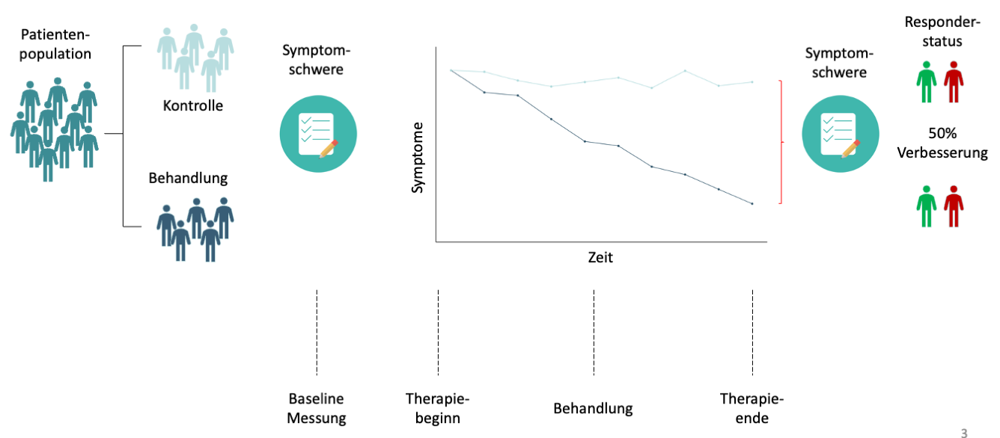
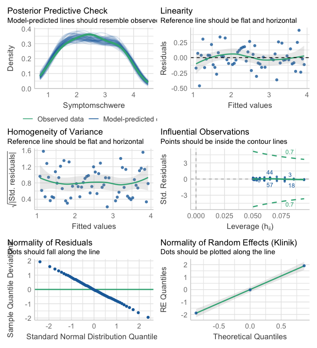

```{r setup, include=FALSE}
options(htmltools.dir.version = FALSE)

library(tidyverse)
library(kableExtra)
library(ggplot2)
library(plotly)
library(htmlwidgets)
library(MASS)
library(ggpubr)
library(xaringanthemer)
library(xaringanExtra)
library(lme4)

style_duo_accent(
  primary_color = "#621C37",
  secondary_color = "#EE0071",
  background_image = "blank.png"
)

xaringanExtra::use_xaringan_extra(c("tile_view"))

use_scribble(
  pen_color = "#EE0071",
  pen_size = 4
  )

knitr::opts_chunk$set(
  fig.retina = TRUE,
  warning = FALSE,
  message = FALSE,
  comment = NA
)

source(file = "base_functions.R")
```

name: Title slide
class: middle, left
<br><br><br><br><br><br><br>
# Multivariate Verfahren
***
### Einheit 4: Mehrebenenanalyse - Lineare gemischte Modelle  (3)
##### `r format(as.Date(data.frame(readxl::read_excel("Multivariate Verfahren Termine.xlsx"))$Datum), "%d.%m.%Y")[4]` | Prof. Dr. Stephan Goerigk


---
class: top, left
### Mehrebenenanalyse - Lineare gemischte Modelle

#### Statistische Analyse von Wirksamkeitsstudien (Efficacy trials)

* Klinische Trials sind systematische Studien, die dazu dienen, die Sicherheit und Wirksamkeit klinischer Interventionen wie Medikamente, psychotherapeutische Behandlungen oder neue Therapieverfahren zu testen.


* Ziele klinischer Trials:

  * Sicherheit und Wirksamkeit nachweisen
  
  * Vergleich mit bestehenden Standardbehandlungen
  
  * Neue Interventionen validieren

---
class: top, left
### Mehrebenenanalyse - Lineare gemischte Modelle

#### Statistische Analyse von Wirksamkeitsstudien (Efficacy trials)

Beispiel: Das randomisiert kontrollierte Trial (RCT)

.center[

```{r eval = TRUE, echo = F, out.width = "900px"}

```
]

---
class: top, left
### Mehrebenenanalyse - Lineare gemischte Modelle

#### Statistische Analyse von Wirksamkeitsstudien (Efficacy trials)

**Phasen Klinischer Studien**

```{r echo=FALSE}
phases_df <- data.frame(
  Phase = c("Phase I (Erste Studien am Menschen)", "Phase II (Erste Wirksamkeitsprüfung)", "Phase III (Bestätigung der Wirksamkeit und Vergleich)", "Phase IV (Überwachung nach Markteinführung [Post-Marketing-Studien])"),
  Ziel = c(
    "Prüfung der Sicherheit und Festlegung einer Dosierung (bei Medikamenten)",
    "Ermittlung der Wirksamkeit und weitergehende Sicherheitsprüfung",
    "Vergleich mit bestehenden Standardbehandlungen und Verifikation der Langzeitwirkung und -sicherheit",
    "Langzeitüberwachung der Sicherheit, Wirksamkeit und Nebenwirkungen nach der Markteinführung"
  ),
  Teilnehmer = c(
    "Kleine Gruppe gesunder Freiwilliger (oder Patienten bei riskanten Therapien)",
    "Größere Gruppe von Patienten, die an der zu behandelnden Krankheit leiden",
    "Große Patientengruppen (hundert bis tausende)",
    "Noch breitere Anwendungspopulation im klinischen Alltag"
  ),
  Fokus = c(
    "Toxizität, Nebenwirkungen, Dosisfindung",
    "Erste Nachweise für die Wirksamkeit, Untersuchung von Nebenwirkungen",
    "Bestätigung der Ergebnisse aus Phase II, häufig Randomisierte Kontrollierte Studien (RCTs)",
    "Erkennung seltener Nebenwirkungen, Langzeitergebnisse und Vergleich mit neuen Entwicklungen"
  )
)

phases_df %>%
  kbl() %>%
  kable_classic(full_width = T, position = "left", font_size = 18)
```

Merke: Klinische Studien sind der Goldstandard zur Sicherstellung der Wirksamkeit und Sicherheit neuer Behandlungsansätze.

---
class: top, left
### Mehrebenenanalyse - Lineare gemischte Modelle

#### Statistische Analyse von Wirksamkeitsstudien (Efficacy trials)

Spezifische Aspekte für Psychotherapie-Studien

*	Phasenmodelle können angepasst werden (z. B. Pilotstudien statt Phase I).

*	Besondere Herausforderungen: Langfristige Überprüfung der Wirksamkeit, Placeboeffekte, Durchführung randomisierter Studien.

---
class: top, left
### Mehrebenenanalyse - Lineare gemischte Modelle

#### Statistische Analyse von Wirksamkeitsstudien (Efficacy trials)

```{r echo=FALSE}
study_designs_df <- data.frame(
  Design = c(
    "Randomisierte Kontrollierte Studien (RCTs)",
    "Nicht-Randomisierte Studien",
    "Cross-Over-Designs",
    "Beobachtungsstudien"
  ),
  Definition_Beschreibung = c(
    "Teilnehmer werden zufällig in Interventions- und Kontrollgruppen aufgeteilt.",
    "Kein Zufallsmechanismus bei der Gruppenzuweisung.",
    "Teilnehmer erhalten abwechselnd verschiedene Behandlungen.",
    "Beobachtungen von Teilnehmern ohne experimentelle Eingriffe (z.B., Kohortenstudien, Fall-Kontroll-Studien)."
  ),
  Vorteile = c(
    "Hohe interne Validität durch Randomisierung, Minimierung von Bias.",
    "Praktisch, wenn Randomisierung nicht möglich ist; geringere Kosten.",
    "Jeder Teilnehmer fungiert als eigene Kontrolle.",
    "Einsatz für Hypothesenbildung, Langzeitrisiken."
  ),
  Beispiele = c(
    "Vergleich einer neuen kognitiven Verhaltenstherapie (CBT) mit einer Standardtherapie.",
    "Praktische Anwendungen, wenn Randomisierung nicht möglich ist.",
    "Vergleich von zwei Psychotherapieansätzen bei derselben Personengruppe zu unterschiedlichen Zeitpunkten.",
    "Kohortenstudien zur Langzeitverfolgung, Fall-Kontroll-Studien."
  )
)

study_designs_df %>%
  kbl() %>%
  kable_classic(full_width = T, position = "left", font_size = 18)
```

Merke: Die Wahl des Designs hängt von den Studienzielen, ethischen Überlegungen und praktischen Herausforderungen ab.

---
class: top, left
### Mehrebenenanalyse - Lineare gemischte Modelle

#### Statistische Analyse von Wirksamkeitsstudien (Efficacy trials)

.pull-left[
**Randomisierte Kontrollierte Studien (RCTs)**
```{r echo=FALSE}
library(DiagrammeR)

DiagrammeR::grViz("
digraph RCT {
  graph [layout = dot, rankdir = TB]  // 'TB' for Top to Bottom layout
  
  # Nodes
  node [shape = rectangle, style = filled, fillcolor = white, fontname = Helvetica]
  Population [label = 'Population']
  Randomisierung [label = 'Randomisierung']
  Interventionsgruppe [label = 'Interventionsgruppe']
  Kontrollgruppe [label = 'Kontrollgruppe']
  ErgebnisIntervention [label = 'Ergebnismessung (Intervention)']
  ErgebnisKontrolle [label = 'Ergebnismessung (Kontrolle)']

  # Edges
  Population -> Randomisierung
  Randomisierung -> Interventionsgruppe
  Randomisierung -> Kontrollgruppe
  Interventionsgruppe -> ErgebnisIntervention
  Kontrollgruppe -> ErgebnisKontrolle
}
")
```
]

.pull-right[
**Nicht-Randomisierte Studien (Kohortenstudien)**
```{r echo=FALSE}
DiagrammeR::grViz("
digraph RCT {
  graph [layout = dot, rankdir = TB]  // 'TB' for Top to Bottom layout
  
  # Nodes
  node [shape = rectangle, style = filled, fillcolor = white, fontname = Helvetica]
  Population [label = 'Population']
  Randomisierung [label = 'Natürliche Allokation']
  Interventionsgruppe [label = 'Interventionsgruppe']
  Kontrollgruppe [label = 'Kontrollgruppe']
  ErgebnisIntervention [label = 'Ergebnismessung (Intervention)']
  ErgebnisKontrolle [label = 'Ergebnismessung (Kontrolle)']

  # Edges
  Population -> Randomisierung
  Randomisierung -> Interventionsgruppe
  Randomisierung -> Kontrollgruppe
  Interventionsgruppe -> ErgebnisIntervention
  Kontrollgruppe -> ErgebnisKontrolle
}
")
```
]

---
class: top, left
### Mehrebenenanalyse - Lineare gemischte Modelle

#### Statistische Analyse von Wirksamkeitsstudien (Efficacy trials)

.pull-left[
**Cross-Over-Designs**
```{r echo=FALSE, fig.height=5}
DiagrammeR::grViz("
digraph CrossOver {
  graph [layout = dot, rankdir = TB]  // 'TB' for Top to Bottom layout
  
  # Nodes
  node [shape = rectangle, style = filled, fillcolor = white, fontname = Helvetica]
  Population [label = 'Population']
  Randomisierung [label = 'Randomisierung']
  GruppeA_Intervention [label = 'Gruppe A: Intervention']
  GruppeA_Kontrolle [label = 'Gruppe A: Kontrolle']
  GruppeB_Intervention [label = 'Gruppe B: Intervention']
  GruppeB_Kontrolle [label = 'Gruppe B: Kontrolle']
  CrossOverPhase [label = 'Cross-Over-Phase']

  # Edges
  Population -> Randomisierung
  Randomisierung -> GruppeA_Intervention
  Randomisierung -> GruppeB_Kontrolle
  GruppeA_Intervention -> CrossOverPhase
  GruppeB_Kontrolle -> CrossOverPhase
  CrossOverPhase -> GruppeA_Kontrolle
  CrossOverPhase -> GruppeB_Intervention
}
")
```
]

.pull-right[
**Beobachtungsstudien**
```{r echo=FALSE, fig.height=5}
DiagrammeR::grViz("
digraph Observational {
  graph [layout = dot, rankdir = TB]  // 'TB' for Top to Bottom layout
  
  # Nodes
  node [shape = rectangle, style = filled, fillcolor = white, fontname = Helvetica]
  Population [label = 'Population']
  GruppeExposure [label = 'Gruppe mit Exposition']
  GruppeNoExposure [label = 'Gruppe ohne Exposition']
  OutcomeExposed [label = 'Beobachtung des Ergebnisses\n (Exponierte Gruppe)']
  OutcomeUnexposed [label = 'Beobachtung des Ergebnisses\n (Nicht-Exponierte Gruppe)']
  Vergleich [label = 'Vergleich der Ergebnisse']

  # Edges
  Population -> GruppeExposure
  Population -> GruppeNoExposure
  GruppeExposure -> OutcomeExposed
  GruppeNoExposure -> OutcomeUnexposed
  OutcomeExposed -> Vergleich
  OutcomeUnexposed -> Vergleich
}
")
```
]

---
class: top, left
### Mehrebenenanalyse - Lineare gemischte Modelle

#### Statistische Analyse von Wirksamkeitsstudien (Efficacy trials)

<small>

Studiendesign für Phase-III RCT (Methodenteil) - CONSORT Checkliste

<small>

<table style="width:100%; border:1px solid black; border-collapse:collapse;">
  <tr>
    <th style="border:1px solid black; padding:8px;">Abschnitt/Thema</th>
    <th style="border:1px solid black; padding:8px;">Punkt Nr.</th>
    <th style="border:1px solid black; padding:8px;">Checkliste Punkt</th>
  </tr>
  <tr>
    <td style="border:1px solid black; padding:8px;">Studiendesign</td>
    <td style="border:1px solid black; padding:8px;">3a</td>
    <td style="border:1px solid black; padding:8px;">Beschreibung des Studiendesigns (z.B. parallel, faktoriell) einschließlich des Zuweisungsverhältnisses</td>
  </tr>
  <tr>
    <td style="border:1px solid black; padding:8px;"></td>
    <td style="border:1px solid black; padding:8px;">3b</td>
    <td style="border:1px solid black; padding:8px;">Wichtige Änderungen der Methoden nach Beginn der Studie (z.B. Einschlusskriterien), mit Begründungen</td>
  </tr>
  <tr>
    <td style="border:1px solid black; padding:8px;">Teilnehmer</td>
    <td style="border:1px solid black; padding:8px;">4a</td>
    <td style="border:1px solid black; padding:8px;">Einschlusskriterien für Teilnehmer</td>
  </tr>
  <tr>
    <td style="border:1px solid black; padding:8px;"></td>
    <td style="border:1px solid black; padding:8px;">4b</td>
    <td style="border:1px solid black; padding:8px;">Kontexte und Orte, an denen die Daten erhoben wurden</td>
  </tr>
  <tr>
    <td style="border:1px solid black; padding:8px;">Interventionen</td>
    <td style="border:1px solid black; padding:8px;">5</td>
    <td style="border:1px solid black; padding:8px;">Die Interventionen für jede Gruppe mit ausreichenden Details zur Replikation, einschließlich wie und wann sie verabreicht wurden</td>
  </tr>
  <tr>
    <td style="border:1px solid black; padding:8px;">Outcomes</td>
    <td style="border:1px solid black; padding:8px;">6a</td>
    <td style="border:1px solid black; padding:8px;">Vollständig definierte, vorab festgelegte primäre und sekundäre Endpunkte, einschließlich wie und wann sie gemessen wurden</td>
  </tr>
  <tr>
    <td style="border:1px solid black; padding:8px;"></td>
    <td style="border:1px solid black; padding:8px;">6b</td>
    <td style="border:1px solid black; padding:8px;">Änderungen der Endpunkte nach Beginn der Studie, mit Begründungen</td>
  </tr>
  <tr>
    <td style="border:1px solid black; padding:8px;">Stichprobengröße</td>
    <td style="border:1px solid black; padding:8px;">7a</td>
    <td style="border:1px solid black; padding:8px;">Wie die Stichprobengröße bestimmt wurde</td>
  </tr>
  <tr>
    <td style="border:1px solid black; padding:8px;"></td>
    <td style="border:1px solid black; padding:8px;">7b</td>
    <td style="border:1px solid black; padding:8px;">Falls zutreffend, Erklärung von Zwischenanalysen und Abbruchkriterien</td>
  </tr>
</table>

https://www.equator-network.org/reporting-guidelines/consort/

---
class: top, left
### Mehrebenenanalyse - Lineare gemischte Modelle

#### Statistische Analyse von Wirksamkeitsstudien (Efficacy trials)

<small>

Studiendesign für Phase-III RCT (Methodenteil) - CONSORT Checkliste

<small>

<table style="width:100%; border:1px solid black; border-collapse:collapse;">
  <tr>
    <th style="border:1px solid black; padding:8px;">Abschnitt/Thema</th>
    <th style="border:1px solid black; padding:8px;">Punkt Nr.</th>
    <th style="border:1px solid black; padding:8px;">Checkliste Punkt</th>
  </tr>
  <tr>
    <td style="border:1px solid black; padding:8px;">Randomisierung: Sequenzgenerierung</td>
    <td style="border:1px solid black; padding:8px;">8a</td>
    <td style="border:1px solid black; padding:8px;">Methode zur Generierung der zufälligen Zuweisungssequenz</td>
  </tr>
  <tr>
    <td style="border:1px solid black; padding:8px;"></td>
    <td style="border:1px solid black; padding:8px;">8b</td>
    <td style="border:1px solid black; padding:8px;">Art der Randomisierung; Details zu Einschränkungen (wie Blockbildung und Blockgröße)</td>
  </tr>
  <tr>
    <td style="border:1px solid black; padding:8px;">Randomisierung: Zuweisungsmechanismus</td>
    <td style="border:1px solid black; padding:8px;">9</td>
    <td style="border:1px solid black; padding:8px;">Mechanismus zur Implementierung der zufälligen Zuweisungssequenz (wie nummerierte Behälter), einschließlich Maßnahmen zur Geheimhaltung der Sequenz</td>
  </tr>
  <tr>
    <td style="border:1px solid black; padding:8px;">Randomisierung: Durchführung</td>
    <td style="border:1px solid black; padding:8px;">10</td>
    <td style="border:1px solid black; padding:8px;">Wer die zufällige Zuweisungssequenz erstellt hat, wer die Teilnehmer eingeschrieben hat und wer die Teilnehmer zugewiesen hat</td>
  </tr>
  <tr>
    <td style="border:1px solid black; padding:8px;">Verblindung</td>
    <td style="border:1px solid black; padding:8px;">11a</td>
    <td style="border:1px solid black; padding:8px;">Falls durchgeführt, wer nach der Zuweisung zur Intervention verblindet war (z.B. Teilnehmer, Pflegekräfte, Ergebnisprüfer) und wie</td>
  </tr>
  <tr>
    <td style="border:1px solid black; padding:8px;"></td>
    <td style="border:1px solid black; padding:8px;">11b</td>
    <td style="border:1px solid black; padding:8px;">Falls relevant, Beschreibung der Ähnlichkeit der Interventionen</td>
  </tr>
  <tr>
    <td style="border:1px solid black; padding:8px;">Statistische Methoden</td>
    <td style="border:1px solid black; padding:8px;">12a</td>
    <td style="border:1px solid black; padding:8px;">Statistische Methoden zum Vergleich von Gruppen für primäre und sekundäre Endpunkte</td>
  </tr>
  <tr>
    <td style="border:1px solid black; padding:8px;"></td>
    <td style="border:1px solid black; padding:8px;">12b</td>
    <td style="border:1px solid black; padding:8px;">Methoden für zusätzliche Analysen, wie Subgruppenanalysen und angepasste Analysen</td>
  </tr>
</table>

https://www.equator-network.org/reporting-guidelines/consort/

---
class: top, left
### Mehrebenenanalyse - Lineare gemischte Modelle

#### Statistische Analyse von Wirksamkeitsstudien (Efficacy trials)

Beispieltext Studiendesign für Phase-III RCT (Methodenteil)

*The [...] trial was a double-blind, placebo-controlled randomized clinical trial that enrolled patients with [...]. Randomization was performed using [...].  The study protocol was described elsewhere [Referenz] and performed with no significant changes.
The  trial was conducted at [...] study centers (Name der Institute) from [...] to [...]. The study was registered on [...], reported per the Consolidated Standards of Reporting Trials (CONSORT) reporting guideline for nonpharmacological treatments, and approved by the [Name der Ethikkommission]. Participants signed informed consent forms per the Declaration of Helsinki guidelines.*

*Die […]-Studie war eine doppelblinde, placebokontrollierte, randomisierte klinische Studie, die Patienten mit […] einschloss. Die Randomisierung wurde mithilfe von […] durchgeführt. Das Studienprotokoll wurde an anderer Stelle beschrieben [Referenz] und ohne signifikante Änderungen durchgeführt. Die Studie wurde in […] Studienzentren (Name der Institute) von […] bis […] durchgeführt. Die Studie wurde am […] registriert, gemäß den CONSORT-Richtlinien für die Berichterstattung über nicht-pharmakologische Behandlungen berichtet und von der [Name der Ethikkommission] genehmigt. Die Teilnehmer unterzeichneten Einverständniserklärungen gemäß den Richtlinien der Deklaration von Helsinki.*

---
class: top, left
### Mehrebenenanalyse - Lineare gemischte Modelle

#### Statistische Analyse von Wirksamkeitsstudien (Efficacy trials)

**Endpunkte und Outcomes in Klinischen Studien**

* Endpunkte sind messbare Ereignisse oder Ergebnisse, um den Erfolg oder Misserfolg einer Intervention zu bewerten.

* Sie geben an, worauf eine Studie abzielt, und dienen als Grundlage zur Beurteilung der Wirksamkeit und Sicherheit.

* Endpunkte werden i.d.R. hierarchisiert (z.B. Primäre vs. Sekundäre Endpunkte)

---
class: top, left
### Mehrebenenanalyse - Lineare gemischte Modelle

#### Statistische Analyse von Wirksamkeitsstudien (Efficacy trials)

**Primäre Endpunkte**

*	Definition: Der primäre Endpunkt ist das Hauptziel der Studie und stellt die wichtigste Messgröße zur Bewertung der Wirksamkeit dar.

*	Beispiele:
  
  *	In einer Psychotherapiestudie: Reduktion von Depressionssymptomen gemessen durch eine validierte Skala (z. B. Beck-Depressions-Inventar).
	
	*	In einer Medikamentenstudie: Überlebensrate, Symptomfreiheit nach einer bestimmten Zeit.

$\rightarrow$	Bedeutung: Signifikanz des primären Endpunkts entscheidet über den Erfolg oder Misserfolg der Studie.

---
class: top, left
### Mehrebenenanalyse - Lineare gemischte Modelle

#### Statistische Analyse von Wirksamkeitsstudien (Efficacy trials)

**Sekundäre Endpunkte**

*	Definition: Sekundäre Endpunkte sind zusätzliche Messgrößen, die zur umfassenderen Bewertung der Intervention herangezogen werden.

*	Beispiele (bezogen auf Depression als primären Endpunkt):
	
	*	Verbesserung der Lebensqualität.
	
	*	Reduktion von Angstzuständen bei einer Therapie.
	
	*	Nebenwirkungen oder Langzeiteffekte.

$\rightarrow$ Bedeutung: Sekundäre Endpunkte liefern ergänzende Informationen und helfen, weitere Aspekte der Wirksamkeit und Sicherheit zu verstehen.

---
class: top, left
### Mehrebenenanalyse - Lineare gemischte Modelle

#### Statistische Analyse von Wirksamkeitsstudien (Efficacy trials)

<small>

**Primäre Endpunkte vs. sekundäre Endpunkte (Studienbeispiel - Methodenteil)**

Praktische Bedeutung für Psychotherapie-Studien:

*	Ein klar definierter primärer Endpunkt hilft, den Fokus der Studie zu behalten und die Hauptfrage zu beantworten.

*	Sekundäre Endpunkte bieten wertvolle zusätzliche Einsichten und unterstützen die Interpretation der Ergebnisse.

<br>

<table style="width:50%; margin:auto; border:1px solid black; border-collapse:collapse;">
  <tr>
    <th style="border:1px solid black; padding:8px;">Primäre Endpunkte</th>
    <th style="border:1px solid black; padding:8px;">Sekundäre Endpunkte</th>
  </tr>
  <tr>
    <td style="border:1px solid black; padding:8px;">Hauptziel der Studie</td>
    <td style="border:1px solid black; padding:8px;">Ergänzende, zusätzliche Ziele</td>
  </tr>
  <tr>
    <td style="border:1px solid black; padding:8px;">Wesentliche Grundlage für Studienerfolg</td>
    <td style="border:1px solid black; padding:8px;">Hilfreich zur umfassenden Bewertung</td>
  </tr>
  <tr>
    <td style="border:1px solid black; padding:8px;">Zentrale Messgröße für die Wirksamkeit</td>
    <td style="border:1px solid black; padding:8px;">Weitere Messgrößen zur Unterstützung</td>
  </tr>
</table>

---
class: top, left
### Mehrebenenanalyse - Lineare gemischte Modelle

#### Statistische Analyse von Wirksamkeitsstudien (Efficacy trials)

<small>

**Primäre Endpunkte vs. sekundäre Endpunkte**

$\rightarrow$	Signifikanz des primären Endpunkts entscheidet über den Erfolg oder Misserfolg der Studie.

Zentral für die statistische Auswertung:

* Stichprobenumfangsplanung (Poweranalyse) wird i.d.R. am erwarteten Effekt im primären Endpunkt orientiert
  
* Signifikanzniveau gilt für Hypothesentest des primären Endpunkts (**konfirmatorisches Ergebnis**)
  
* (mehrere) sekundäre Endpunkte $\rightarrow$ $\alpha$-Fehler Kumulierung (erhöhte Typ-I-Fehlerrate)

  * Problem: Stichprobengröße $(N)$ durch Effekt im primären Endpunkt festgelegt $\rightarrow$ Typ-I-Fehlerkorrektur würde bewirken, dass sekundäre Endpunkte nur schwer signifikant werden
  
  * Lösung in der Praxis: Hypothesentests für sekundäre Endpunkte werden nicht für $\alpha$-Fehler korrigiert
  
  * Vorsicht bei der Interpretation: Ergebnisse multipler, nicht-kontrollierter Tests sind **explorative Ergebnisse** (nicht hypothesenprüfend, sondern hypothesengenerierend)

---
class: top, left
### Mehrebenenanalyse - Lineare gemischte Modelle

#### Statistische Analyse von Wirksamkeitsstudien (Efficacy trials)

Beispieltext Endpunkte (Methodenteil)

*Assessments were performed by trained psychiatrists and psychologists blinded for patients’ condition. Participants were assessed at baseline and then [...] weeks, [...] weeks, [...] weeks (primary endpoint), and [...] weeks (secondary endpoint) after treatment onset. Adverse effects were recorded at [...] weeks after treatment onset.
The primary outcome was the change in [...] scores until [...] weeks. Secondary outcomes included clinical response (defined as 50% or greater improvement) and remission (defined as a ... score less than ...) as well as changes in the [...] scales.*

*Die Messungen wurden von geschulten Psychiatern und Psychologen durchgeführt, die für die Gruppenzugehörigkeit der Patienten verblindet waren. Die Teilnehmer wurden zu Beginn (Baseline) sowie […] Wochen, […] Wochen, […] Wochen (primärer Endpunkt) und […] Wochen (sekundärer Endpunkt) nach Beginn der Behandlung beurteilt. Nebenwirkungen wurden […] Wochen nach Beginn der Behandlung erfasst.
Der primäre Endpunkt war die Veränderung der […]-Werte bis […] Wochen. Sekundäre Endpunkte umfassten das klinische Ansprechen (definiert als eine Verbesserung von 50% oder mehr) und die Remission (definiert als ein […]-Wert unter …) sowie Veränderungen auf den […]-Skalen.*

---
class: top, left
### Mehrebenenanalyse - Lineare gemischte Modelle

#### Statistische Analyse von Wirksamkeitsstudien (Efficacy trials)

**Itention-to-treat vs. Per-protocol Analysen**

Intention-to-Treat Analyse (ITT)

*	Definition: Alle Teilnehmer, die einer Behandlungsgruppe zu Beginn der Studie zufällig zugewiesen wurden, werden in die Analyse einbezogen, unabhängig davon, ob sie die zugewiesene Behandlung vollständig durchgeführt haben oder nicht.

*	Vorteile:
	
	*	Erhalt der Randomisierung: Minimiert Bias und bewahrt die Vergleichbarkeit der Gruppen.
	
	*	Realitätsnähe: Gibt ein realistisches Bild der Wirksamkeit einer Intervention in der Praxis.

*	Beispiel: Ein Teilnehmer, der eine Therapie vorzeitig abbricht, wird weiterhin der ursprünglichen Gruppe zugerechnet.

---
class: top, left
### Mehrebenenanalyse - Lineare gemischte Modelle

#### Statistische Analyse von Wirksamkeitsstudien (Efficacy trials)

**Itention-to-treat vs. Per-protocol Analysen**

Per-Protocol Analyse (PP)

*	Definition: Nur die Teilnehmer, die die Behandlung genau nach Protokoll durchgeführt haben, werden in die Analyse aufgenommen.

*	Vorteile:

	*	Reine Wirksamkeitsprüfung: Bietet eine Bewertung der optimalen Wirkung der Intervention unter idealen Bedingungen.

*	Nachteil:

	*	Gefahr von Bias: Durch den Ausschluss von Teilnehmern, die das Protokoll nicht befolgen, kann die Vergleichbarkeit zwischen den Gruppen beeinträchtigt werden.

*	Beispiel: Teilnehmer, die eine Therapie abbrechen, werden nicht in die Analyse einbezogen.

---
class: top, left
### Mehrebenenanalyse - Lineare gemischte Modelle

#### Statistische Analyse von Wirksamkeitsstudien (Efficacy trials)

**Itention-to-treat vs. Per-protocol Analysen**

Praktische Relevanz:

*	Die ITT-Analyse ist der Goldstandard für die Bewertung der Wirksamkeit in klinischen Studien, da sie die tatsächliche klinische Praxis besser widerspiegelt.
	
*	Per-Protocol-Analysen bieten zusätzliche Informationen zur maximalen Wirksamkeit der Behandlung.
	
* Die Wahl zwischen ITT- und Per-Protocol-Analysen beeinflusst die Interpretation der Studienergebnisse und sollte klar definiert und begründet sein.

<table style="width:70%; margin:auto; border:1px solid black; border-collapse:collapse;">
  <tr>
    <th style="border:1px solid black; padding:8px;">ITT-Analyse</th>
    <th style="border:1px solid black; padding:8px;">Per-Protocol-Analyse</th>
  </tr>
  <tr>
    <td style="border:1px solid black; padding:8px;">Berücksichtigt alle Teilnehmer</td>
    <td style="border:1px solid black; padding:8px;">Nur Teilnehmer, die das Protokoll einhalten</td>
  </tr>
  <tr>
    <td style="border:1px solid black; padding:8px;">Erhalt der Randomisierung</td>
    <td style="border:1px solid black; padding:8px;">Risiko von Verzerrungen durch Ausfälle</td>
  </tr>
  <tr>
    <td style="border:1px solid black; padding:8px;">Realitätsnahe Ergebnisse</td>
    <td style="border:1px solid black; padding:8px;">Ergebnisse unter idealen Bedingungen</td>
  </tr>
</table>

---
class: top, left
### Mehrebenenanalyse - Lineare gemischte Modelle

#### Statistische Analyse von Wirksamkeitsstudien (Efficacy trials)

<small>

**Monozentrische vs. Multizentrische Studien**

Monozentrische Studien:

*	Definition: Studien, die an einem einzigen Standort (z.B. Klinik oder Forschungseinrichtung) durchgeführt werden.

*	Vorteile:
	
	*	Einheitliche Bedingungen: Kontrollierte und konsistente Durchführung.
	
	*	Kostengünstiger: Oft einfacher und kostengünstiger durchführbar.
	
	*	Leichtere Koordination: Weniger organisatorischer Aufwand.
	
*	Nachteile:

	*	Geringere Generalisierbarkeit: Ergebnisse sind möglicherweise nicht auf andere Standorte oder Populationen übertragbar.

	*	Begrenzte Teilnehmerzahl: Weniger Teilnehmer im Vergleich zu multizentrischen Studien.

*	Beispiele: Pilotstudien, kleinere klinische Studien zur Überprüfung erster Hypothesen.

---
class: top, left
### Mehrebenenanalyse - Lineare gemischte Modelle

#### Statistische Analyse von Wirksamkeitsstudien (Efficacy trials)

<small>

**Monozentrische vs. Multizentrische Studien**

Multizentrische Studien:

*	Definition: Studien, die an mehreren Standorten gleichzeitig durchgeführt werden.

*	Vorteile:
	
	*	Höhere Generalisierbarkeit: Ergebnisse sind repräsentativer und übertragbarer auf verschiedene Populationen und Standorte.
	
	*	Größere Teilnehmerzahl: Mehr Teilnehmer erhöhen die statistische Aussagekraft.
	
	*	Breitere Vergleichbarkeit: Variabilität zwischen Standorten ermöglicht umfassendere Beurteilungen.
	
*	Nachteile:

	*	Komplexere Koordination: Höherer organisatorischer Aufwand und Kommunikationsbedarf.

	*	Höhere Kosten: Meist teurer und ressourcenintensiver.

*	Beispiele: Große klinische Studien zu neuen Medikamenten, nationale oder internationale Studien.
	
** $\rightarrow$ Zentrumseffekte sollten (statistisch) berücksichtigt werden**

---
class: top, left
### Mehrebenenanalyse - Lineare gemischte Modelle

#### Statistische Analyse von Wirksamkeitsstudien (Efficacy trials)

**Monozentrische vs. Multizentrische Studien**

Multizentrische Studien - statistische Kontrolle von Zentrumseffekten im LMM (2 Optionen)

1 - Kontrolle mittels Kovariate (Fixed Effekt):

```{r eval=FALSE}
lmer(y ~ time * group + center + (time|subject))
```

* leichter zu schätzen (nur 1 Modellkoeffizient), aber komplexere Hierarchie nicht abbildbar

2 - Kontrolle mittels Random Effekt:

```{r eval=FALSE}
lmer(y ~ time * group + (time|center/subject))
```

* komplexer zu schätzen (k Varianzen für pro Zentrum; kann in kleinen Stichproben zu Konvergierungsproblemen führen), aber flexibler

---
class: top, left
### Mehrebenenanalyse - Lineare gemischte Modelle

#### Poweranalyse

**Zur Erinnerung - Warum Poweranalyse?**

* Bestimmung der benötigten Stichprobengröße: Um sicherzustellen, dass die Studie ausreichend Teilnehmer hat, um statistisch signifikante Effekte zu erkennen ( $\beta$-Fehler vermeiden).

* Optimierung von Ressourcen: Ressourcen wie Zeit und Kosten effizient einsetzen, indem die Stichprobengröße so gewählt wird, dass unnötig große Studien vermieden werden.

***

Immer nötige Zutaten (neben anderen - je nach Modell):

* Signifikanzniveau $(\alpha)$

* gewünschte Power $(1-\beta)$, i.d.R. mindestens 80%

* Effektschätzung

* Stichprobengröße (oft gesucht)

---
class: top, left
### Mehrebenenanalyse - Lineare gemischte Modelle

#### Poweranalyse

**Poweranalyse für das LMM - Herausforderungen**

* Anzahl von Messungen muss auf mehreren Ebenen berücksichtigt werden (Messungen, Personen, Zentren...)

* Für eine genaue Schätzung müssen viele Komponenten bekannt sein

  * Für fixed Effekte sind i.d.R. Schätzungen/Vorstellungen verfügbar (Effektstärke)
  
  * Für Varianzkomponenten (random Effekte) i.d.R. unbekannt.
  
  * Größere Vorstudien - hilfreich, unterscheiden sich jedoch oft in Details
  
  * Kleinere Pilotstudien - hilfreich, jedoch oft zu klein für sinnvolle Schätzung
  
* Einführen von Kovariaten kann die optimalen Stichprobengrößen auf jedem Level ändern

---
class: top, left
### Mehrebenenanalyse - Lineare gemischte Modelle

#### Poweranalyse

**Simulationsbasierte Poweranalyse**

* Für genaue Powerschätzungen müssen Daten (inklusive fixed und random Effekte simuliert werden)

* Schätzer für fixed und random Effekte müssen angegeben werden

* Logik:

  * Daten erstellen, die in etwa so aussehen, wie in unserer Studie
  
  * In diesen Daten LMM berechnen und den Effekt, der uns interessiert auf Signifikanz prüfen
  
  * Vorgang für stabile Ergebnisse oft wiederholen (i.d.R. 1000 oder 10000 mal) 
  
  * Power (%) = Anteil der Durchgänge, in denen Test signifikant war

* Implementierung simulationsbasierte Poweranalysen im R-Paket `simr`

---
class: top, left
### Mehrebenenanalyse - Lineare gemischte Modelle

#### Poweranalyse

**Simulationsbasierte Poweranalyse**

<small>

.pull-left[

Datensatzstruktur erstellen (Anzahl Personen, Gruppen, Zeitpunkte):

```{r eval=FALSE}
library(simr)

subj <- factor(1:10) # 10 Personen
class_id <- letters[1:5] # 5 Klassen
time <- 0:2 # 3 Messzeitpunkte
group <- c("control", "intervention")

subj_full <- rep(subj, 15)
class_full <- rep(rep(class_id, each=10), 3)
time_full <- rep(time, each=50)
group_full <- rep(rep(group, each=5), 15)

data <- data.frame(id=subj_full, 
                     class=class_full, 
                     treatment=group_full, 
                     time=time_full)
```

```{r echo=FALSE}
library(simr)

subj <- factor(1:10) # 10 Personen
class_id <- letters[1:5] # 5 Klassen
time <- 0:2 # 3 Messzeitpunkte
group <- c("control", "therapy")

subj_full <- rep(subj, 15)
class_full <- rep(rep(class_id, each=10), 3)
time_full <- rep(time, each=50)
group_full <- rep(rep(group, each=5), 15)

data <- data.frame(id=subj_full, 
                     class=class_full, 
                     group=group_full, 
                     time=time_full)
```
]

.pull-right[

Blick in den simulierten Datensatz (erste 10 Zeilen):

```{r}
head(data, 10)
```
]

---
class: top, left
### Mehrebenenanalyse - Lineare gemischte Modelle

#### Poweranalyse

<small>

**Simulationsbasierte Poweranalyse**

Wir wollen in der Studie folgendes Modell nutzen:

```{r eval=FALSE}
lmer(𝑦 ~ group * time + (1|class/id), data = data)
```

Fixed Effekte und Varianzkomponenten müssen für die genaue Simulation angegeben/geschätzt werden:

```{r eval=FALSE}
## Intercept und slopes für group, time und treatment:time

fixed <- c(5, 0, 1, 0.6)

## Random intercepts für Teilnehmer gruppiert in Klassen

rand <- list(0.5, 0.1)

## Residualvarianz

res <- 1
```

```{r echo=FALSE}
## Intercept und slopes für group, time und treatment:time

fixed <- c(5, 0, 1, 0.6)

## Random intercepts für Teilnehmer gruppiert in Klassen

rand <- list(0.5, 0.1)

## Residualvarianz

res <- 1
```

---
class: top, left
### Mehrebenenanalyse - Lineare gemischte Modelle

#### Poweranalyse

<small>

**Simulationsbasierte Poweranalyse**

Basierend auf den Parametern erstellen wir ein "künstliches" Regressionsmodell:

```{r}
model <- makeLmer(y ~ group*time + (1|class/id), fixef=fixed, VarCorr=rand, sigma=res, data=data)
model
```

---
class: top, left
### Mehrebenenanalyse - Lineare gemischte Modelle

#### Poweranalyse

<small>

**Simulationsbasierte Poweranalyse**

Wir analysieren die erreichte Power für den Interaktionseffekt:

```{r}
powerSim(model, nsim=100, test = fixed("grouptherapy:time", method = "t"))
```

***
**Anmerkung:** Es werden im Beispiel aus Zeitgründen 100 Simulationen durchgeführt. Für eine Studie würde man öfter simulieren (z.B. `nsim` = 1000 oder besser 10000) 


---
class: top, left
### Mehrebenenanalyse - Lineare gemischte Modelle

#### Poweranalyse

<small>

**Klassische Poweranalyse**

* Aufgrund der Schwierigkeiten bzgl. Schätzung der Varianzkomponenten wird in der Praxis oft eine klassische Poweranalyse herangezogen

* Statt eines LMMs wird eine konventioneller Test (ohne random Effekte) geprüft

* Diese Schätzung ist **konsevativer**, da Berücksichtigung von random Effekten die Power tendenziell eher erhöht

* Beispiel:

  * Im LMM: Unterschied zwischen den durchschnittlichen Steigungen von 2 Gruppen (t-verteilt)
  
  * Konventionell: Unterschied zwischen 2 Durchschnittswerten (t-verteilt)

* Diese Analysen können auf Basis herkömmlicher Effektstärkeschätzungen berechnet werden (fixed Effekte)

* Implementierung klassischer Poweranalysen im R-Paket `pwr`

---
class: top, left
### Mehrebenenanalyse - Lineare gemischte Modelle

#### Poweranalyse

<small>

**Klassische Poweranalyse - Beispiel 2 Gruppen RCT**

.pull-left[
```{r}
library(pwr)

pwr.t.test(d = 0.5, 
           sig.level = 0.05, 
           power = 0.80, 
           type = "two.sample", 
           alternative = "two.sided")
```
]

.pull-right[
* Beispiel: Vergleich der durchschnittlichen Veränderungen von 2 Gruppen

* Annahme eines mittleren Effekts (d=0.5, nach Cohen)

* $\alpha=.05$

* $1-\beta=.80$ (wird i.d.R. als Untergrenze definiert)

* Es werden $N=128$ Personen benötigt ( $n=64$ pro Gruppe)
]

---
class: top, left
### Mehrebenenanalyse - Lineare gemischte Modelle

#### Statistische Analyse von Wirksamkeitsstudien (Efficacy trials)

<small>

**Exkurs: Kategoriale Outcomes für Therapieansprechen**

Response (50% Verbesserung):

* Definition: Eine Verbesserung um 50% oder mehr im Vergleich zum Ausgangswert eines Messinstruments (z.B. Skalen zur Symptomerfassung).

* Bedeutung: 

  * Wird häufig als Kriterium zur Beurteilung des klinischen Ansprechens einer Therapie verwendet. 
  
  * Ein Patient, der eine 50%ige Verbesserung zeigt, wird als “Responder” bezeichnet.

* Beispiel: Bei der Behandlung von Depressionen bedeutet dies eine Reduktion der Symptome um mindestens 50% gemäß einer Skala wie dem Hamilton-Depressions-Skala (HAMD).

---
class: top, left
### Mehrebenenanalyse - Lineare gemischte Modelle

#### Statistische Analyse von Wirksamkeitsstudien (Efficacy trials)

<small>

**Exkurs: Kategoriale Outcomes für Therapieansprechen**

Remission:

*	Definition: 

  * Ein Zustand, bei dem die Symptome einer Erkrankung auf ein normales oder nahezu normales Niveau reduziert werden
  
  * Häufig definiert durch einen festgelegten Schwellenwert auf einer Symptombewertungsskala.
	
*	Bedeutung: 

  * Remission bedeutet, dass die Krankheitssymptome minimal oder nicht mehr nachweisbar sind und der Patient sich weitgehend normal fühlt. 
  
  * Sie stellt ein anspruchsvolleres Ziel als eine bloße Verbesserung dar.

*	Beispiel: Ein Patient gilt als in Remission, wenn der HAMD-Score unter einen bestimmten Wert fällt, der als symptomfrei oder symptomarm definiert wird (z.B. HAMD ≤ 7).	
	
	
---
class: top, left
### Mehrebenenanalyse - Lineare gemischte Modelle

#### Statistische Analyse von Wirksamkeitsstudien (Efficacy trials)

<small>

**Exkurs: Kategoriale Outcomes für Therapieansprechen**

Reliable change index (RCI)

* Statistisches Maß, das verwendet wird, um die Signifikanz einer Veränderung auf individueller Ebene zu beurteilen.

* Zeigt an, ob die Veränderung in den Testergebnissen einer Person zwischen zwei Zeitpunkten größer ist, als es durch Messfehler (eines Tests) erklärbar wäre


$$\text{RCI} = \frac{\text{Post-Test-Score} - \text{Pre-Test-Score}}{\text{Standard Error of Difference (SE\(_{\text{diff}}\))}}$$
	
$$\text{SE}_{\text{diff}} = \sqrt{2 \cdot (\text{Standard Error of Measurement})^2}$$
$\rightarrow$ Der Standardfehler der Messung basiert auf der Reliabilität des Tests und seiner Standardabweichung.

---
class: top, left
### Mehrebenenanalyse - Lineare gemischte Modelle

#### Statistische Analyse von Wirksamkeitsstudien (Efficacy trials)
.pull-left[

<small>

**Exkurs: Kategoriale Outcomes für Therapieansprechen**

Reliable change index (RCI)


Interpretation des RCI:

*	Positiver Wert (> 1.96): Die Veränderung ist signifikant und kann als echte Verbesserung interpretiert werden 

  * bei einem z-Wert von 1.96 entspricht dies einer Signifikanz auf dem 5%-Niveau

*	Negativer Wert (< -1.96): Die Veränderung ist signifikant und zeigt eine Verschlechterung an.

*	Wert im Bereich von -1.96 bis 1.96: Keine verlässliche Veränderung; die Veränderung könnte durch Messfehler bedingt sein.
]

.pull-right[
```{r echo=FALSE, fig.height=6}
set.seed(123)
data <- data.frame(
  Pre_Score = runif(100, min = 0, max = 100),
  Post_Score = runif(100, min = 0, max = 100)
)

# Create categories based on score change
data$Category <- cut(
  data$Post_Score - data$Pre_Score,
  breaks = c(-Inf, -10, 10, Inf),
  labels = c("Verschlechtert", "Unverändert", "Verbessert")
)


# Plotting
ggplot(data, aes(x = Pre_Score, y = Post_Score)) +
  geom_point(size = 3, alpha = 0.7) +
  geom_abline(intercept = 0, slope = 1, color = "black", linetype = "dashed") + # Reference line
  geom_ribbon(aes(ymin = Pre_Score - 15, ymax = Pre_Score + 15), fill = "lightgrey", alpha = 0.4) +
  labs(
    x = "Prä-Therapie Score",
    y = "Post-Therapie Score",
    shape = ""
  ) +
  coord_cartesian(ylim = c(0,120), xlim = c(0,120)) +
  theme(text = element_text(size = 20)) +
  annotate("text", x = 30, y = 110, label = "Reliabel verschlechtert", color = "darkred", size = 6) +
  annotate("text", x = 95, y = 0, label = "Reliabel verbessert", color = "darkgreen", size = 6) +
  annotate("text", x = 110, y = 110, label = "Unverändert", color = "black", angle = 45, size = 6)
```

]

---
class: top, left
### Mehrebenenanalyse - Lineare gemischte Modelle

#### Statistische Analyse von Wirksamkeitsstudien (Efficacy trials)

**Exkurs: Kategoriale Outcomes für Therapieansprechen**

Reliable change index (RCI)

Beispiel: 

Ein Patient erhält zu Beginn einer Therapie (Pre-Test) einen Score von 20 auf einer Depressionsskala und am Ende (Post-Test) einen Score von 10. Mit einem berechneten $SE_{\text{diff}}$ von 4 beträgt der RCI:

$$\text{RCI} = \frac{10 - 20}{4} = -2.5$$

Da der Wert kleiner als -1.96 ist, zeigt er eine verlässliche Verbesserung.

---
class: top, left
### Mehrebenenanalyse - Lineare gemischte Modelle

#### Statistische Analyse von Wirksamkeitsstudien (Efficacy trials)
.pull-left[

<small>
**Exkurs: Kategoriale Outcomes für Therapieansprechen - Reliable and clinically significant change**

* Oft wird der RCI mit einem Remissionskriterium kombiniert

* Verbesserungen sind dann vom Messfehler befreit und klinisch bedeutsam

* Hier wurde ein Remissionskrierium von Score < 50 gewählt
]

.pull-right[
```{r echo=FALSE, fig.height=6}
set.seed(123)
data <- data.frame(
  Pre_Score = runif(100, min = 0, max = 100),
  Post_Score = runif(100, min = 0, max = 100)
)

# Create categories based on score change
data$Category <- cut(
  data$Post_Score - data$Pre_Score,
  breaks = c(-Inf, -10, 10, Inf),
  labels = c("Verschlechtert", "Unverändert", "Verbessert")
)

data$Remission = NA
data$Remission[data$Post_Score < 50] = "in Remission"
data$Remission[data$Post_Score >= 50] = "nicht in Remission"


# Plotting
ggplot(data, aes(x = Pre_Score, y = Post_Score, shape = Remission)) +
  geom_point(size = 3, alpha = 0.7) +
  geom_abline(intercept = 0, slope = 1, color = "black", linetype = "dashed") + # Reference line
  geom_hline(yintercept = 50) +
  geom_ribbon(aes(ymin = Pre_Score - 15, ymax = Pre_Score + 15), fill = "lightgrey", alpha = 0.4) +
  labs(
    x = "Prä-Therapie Score",
    y = "Post-Therapie Score",
    shape = ""
  ) +
  coord_cartesian(ylim = c(0,120), xlim = c(0,120)) +
  theme(text = element_text(size = 20), legend.position = "bottom") +
  annotate("text", x = 30, y = 110, label = "Reliabel verschlechtert", color = "darkred", size = 6) +
  annotate("text", x = 95, y = 0, label = "Reliabel verbessert", color = "darkgreen", size = 6) +
  annotate("text", x = 110, y = 110, label = "Unverändert", color = "black", angle = 45, size = 6)
```

]


---
class: top, left
### Mehrebenenanalyse - Lineare gemischte Modelle

#### Statistische Analyse von Wirksamkeitsstudien (Efficacy trials)

<small>

**Sensitivitätsanalysen**

*	Definition: Eine Sensitivitätsanalyse bewertet, wie empfindlich die Ergebnisse einer klinischen Studie gegenüber Änderungen in den Annahmen, Methoden oder Parametern des Modells sind.

*	Ziel: Sicherstellung der Robustheit und Zuverlässigkeit der Studienergebnisse durch die Analyse, wie sich Änderungen auf die Hauptschlussfolgerungen auswirken.

***

Typische Anwendungsfälle in Klinischen Studien

*	Umgang mit fehlenden Daten: Analyse der Auswirkungen verschiedener Annahmen über fehlende Werte (z.B. vollständig zufälliges Fehlen, imputierte Werte).

*	Abweichungen vom Protokoll: Berücksichtigung von Teilnehmern, die sich nicht an das Studienprotokoll gehalten haben (z.B. Intention-to-Treat-Analyse vs. Per-Protocol-Analyse).

*	Änderung von Modellparametern: Bewertung, wie sich Änderungen in den Parametern oder Variablen auf die Ergebnisse auswirken.


---
class: top, left
### Mehrebenenanalyse - Lineare gemischte Modelle

#### Statistische Analyse von Wirksamkeitsstudien (Efficacy trials)

Beispieltext Endpunkte (Methodenteil)

<small>

*The sample size was estimated for a power of 80% and a 2-tailed α-level of 5% for a 2-group comparison of change over time in the [primary outcome]. Our study was powered to detect a between-group difference of d=0.5, which represents a moderate effect size (Cohen, 1992). Therefore, a targeted sample of 128 patients (50 per group) was obtained.*
*Data were analyzed in the intention-to-treat sample. Analyses were performed in R in its most recent version. Results were significant at a P value less than .05. For all continuous outcomes, we calculated 2-level linear mixed-effects regression models (LMM), assuming a linear relationship over time with 5 (up to week 6) repeated measurements per patient, respectively. The model included time, group and their interaction as fixed effects. Measurements were assumed to be nested within patients. Effect sizes were calculated as Cohen's d. As secondary outcomes, response (at least 50 improvement from baseline on the [primary outcome]) and remission ([primary outcome] scores below XX) were computed for each group.*

*Die Stichprobengröße wurde für eine Power von 80% und ein zweiseitiges α-Niveau von 5% für einen Vergleich der Veränderung über die Zeit in der [primären Zielgröße] zwischen zwei Gruppen geschätzt. Unsere Studie war darauf ausgelegt, einen Unterschied zwischen den Gruppen mit d=0,5 zu erkennen, was eine moderate Effektgröße darstellt (Cohen, 1992). Daher wurde eine angestrebte Stichprobe von 128 Patienten (50 pro Gruppe) erreicht.*
*Die Daten wurden in der Intention-to-Treat-Stichprobe analysiert. Die Analysen wurden in der aktuellsten Version von R durchgeführt. Die Ergebnisse wurden als signifikant betrachtet, wenn der P-Wert kleiner als 0.05 war. Für alle kontinuierlichen Endpunkte berechneten wir zweistufige lineare gemischte Regressionsmodelle (LMM), wobei wir von einer linearen Beziehung über die Zeit mit 5 (bis zur Woche 6) Messwiederholungen pro Patient ausgingen. Das Modell umfasste Zeit, Gruppe und deren Interaktion als feste Effekte. Die Messungen wurden als in den Patienten verschachtelt betrachtet. Effektgrößen wurden als Cohen’s d berechnet. Als sekundäre Endpunkte wurden das Ansprechen (mindestens 50% Verbesserung gegenüber dem Ausgangswert auf der [primären Zielgröße]) und die Remission ([primäre Zielgröße]-Werte unter XX) für jede Gruppe berechnet.*

---
class: top, left
### Mehrebenenanalyse - Lineare gemischte Modelle

<small>

#### Statistische Analyse von Wirksamkeitsstudien (Efficacy trials)

Studiendesign für Phase-III RCT (Ergebnisteil) - CONSORT Checkliste

<table style="width:100%; border:1px solid black; border-collapse:collapse;">
  <tr>
    <th style="border:1px solid black; padding:8px;">Abschnitt/Thema</th>
    <th style="border:1px solid black; padding:8px;">Punkt Nr.</th>
    <th style="border:1px solid black; padding:8px;">Checkliste Punkt</th>
  </tr>
  <tr>
    <td style="border:1px solid black; padding:8px;">Teilnehmerfluss (Diagramm wird empfohlen)</td>
    <td style="border:1px solid black; padding:8px;">13a</td>
    <td style="border:1px solid black; padding:8px;">Für jede Gruppe die Anzahl der zufällig zugewiesenen Teilnehmer, die die vorgesehene Behandlung erhalten haben und die für das primäre Ergebnis analysiert wurden</td>
  </tr>
  <tr>
    <td style="border:1px solid black; padding:8px;"></td>
    <td style="border:1px solid black; padding:8px;">13b</td>
    <td style="border:1px solid black; padding:8px;">Für jede Gruppe Verluste und Ausschlüsse nach der Randomisierung, zusammen mit Begründungen</td>
  </tr>
  <tr>
    <td style="border:1px solid black; padding:8px;">Rekrutierung</td>
    <td style="border:1px solid black; padding:8px;">14a</td>
    <td style="border:1px solid black; padding:8px;">Zeitpunkte, die die Rekrutierungs- und Nachbeobachtungszeiträume definieren</td>
  </tr>
  <tr>
    <td style="border:1px solid black; padding:8px;"></td>
    <td style="border:1px solid black; padding:8px;">14b</td>
    <td style="border:1px solid black; padding:8px;">Gründe, warum die Studie beendet oder gestoppt wurde</td>
  </tr>
  <tr>
    <td style="border:1px solid black; padding:8px;">Baseline-Daten</td>
    <td style="border:1px solid black; padding:8px;">15</td>
    <td style="border:1px solid black; padding:8px;">Eine Tabelle mit den demografischen und klinischen Ausgangsdaten für jede Gruppe</td>
  </tr>
  <tr>
    <td style="border:1px solid black; padding:8px;">Analysierte Zahlen</td>
    <td style="border:1px solid black; padding:8px;">16</td>
    <td style="border:1px solid black; padding:8px;">Für jede Gruppe die Anzahl der in jeder Analyse eingeschlossenen Teilnehmer (Nenner) und ob die Analyse nach den ursprünglichen Zuweisungsgruppen durchgeführt wurde</td>
  </tr>
</table>

https://www.equator-network.org/reporting-guidelines/consort/

---
class: top, left
### Mehrebenenanalyse - Lineare gemischte Modelle

<small>

#### Statistische Analyse von Wirksamkeitsstudien (Efficacy trials)

Studiendesign für Phase-III RCT (Ergebnisteil) - CONSORT Checkliste

<table style="width:100%; border:1px solid black; border-collapse:collapse;">
  <tr>
    <th style="border:1px solid black; padding:8px;">Abschnitt/Thema</th>
    <th style="border:1px solid black; padding:8px;">Punkt Nr.</th>
    <th style="border:1px solid black; padding:8px;">Checkliste Punkt</th>
  </tr>
  <tr>
    <td style="border:1px solid black; padding:8px;">Outcomes und Schätzungen</td>
    <td style="border:1px solid black; padding:8px;">17a</td>
    <td style="border:1px solid black; padding:8px;">Für jedes primäre und sekundäre Ergebnis die Ergebnisse für jede Gruppe und die geschätzte Effektgröße sowie deren Präzision (z.B. 95%-Konfidenzintervall)</td>
  </tr>
  <tr>
    <td style="border:1px solid black; padding:8px;"></td>
    <td style="border:1px solid black; padding:8px;">17b</td>
    <td style="border:1px solid black; padding:8px;">Für binäre Outcomes wird die Darstellung sowohl absoluter als auch relativer Effektgrößen empfohlen</td>
  </tr>
  <tr>
    <td style="border:1px solid black; padding:8px;">Zusätzliche Analysen</td>
    <td style="border:1px solid black; padding:8px;">18</td>
    <td style="border:1px solid black; padding:8px;">Ergebnisse anderer durchgeführter Analysen, einschließlich Subgruppenanalysen und angepasster Analysen, unter Unterscheidung zwischen vordefinierten und explorativen Analysen</td>
  </tr>
  <tr>
    <td style="border:1px solid black; padding:8px;">Schädigungen</td>
    <td style="border:1px solid black; padding:8px;">19</td>
    <td style="border:1px solid black; padding:8px;">Alle wichtigen Schädigungen oder unbeabsichtigte Effekte in jeder Gruppe (für spezifische Leitlinien siehe CONSORT für Schädigungen)</td>
  </tr>
</table>

https://www.equator-network.org/reporting-guidelines/consort/


---
class: top, left
### Mehrebenenanalyse - Lineare gemischte Modelle

<small>

#### Statistische Analyse von Wirksamkeitsstudien (Efficacy trials)

**Beispielszenario:**  Vergleich von Kognitiver Verhaltenstherapie (KVT) vs. Kognitive Verhaltenstherapie + Muttraining

Die Studie soll die Wirksamkeit von Kognitiver Verhaltenstherapie (KVT) vs. KVT + Muttraining bei Patienten mit generalisierter Angststörung vergleichen. Es handelt sich um eine doppelblinde, randomisierte klinische Studie, in der 128 Patienten zufällig einer der beiden Therapieformen zugewiesen werden. Die Behandlungen werden über 6 Wochen hinweg in wöchentlichen Sitzungen durchgeführt.

**Ziel der Studie:** Primärer Endpunkt ist die Veränderung der Angstwerte, gemessen anhand der Hamilton-Angst-Skala (HAM-A), 6 Wochen nach Therapiebeginn. Sekundäre Endpunkte umfassen die Response, Remission (definiert als HAM-A-Wert unter 7) sowie die Verbesserung der Lebensqualität, gemessen durch das SF-36-Formular.

**Ablauf:** Die Teilnehmer werden von geschulten Therapeuten behandelt, die für die spezifische Therapieform trainiert sind. Die Bewertung der Ergebnisse erfolgt durch verblindete Psychologen. Nebenwirkungen oder unerwünschte Ereignisse werden dokumentiert.

**Hypothesen:** Es wird erwartet, dass beide Therapieformen zu einer signifikanten Reduktion der Angst führen, jedoch mit unterschiedlichen Schwerpunkten in der Symptomreduktion und Lebensqualitätsverbesserung.

---
class: top, left
### Mehrebenenanalyse - Lineare gemischte Modelle

<small>

#### Statistische Analyse von Wirksamkeitsstudien (Efficacy trials)


.pull-left[
.code80[
```{r eval=FALSE}
ggplot(data, aes(x = time, y = y, colour = treatment)) +
  stat_summary(aes(group = subject), geom = "line") +
  labs(colour = "", x = "Wochen", y = "HAM-A") +
  theme(text = element_text(size = 20), legend.position = "right")
```
]
* Darstellung der Daten in Linegraph (Deskriptivstatistik)

* I.d.R. bekommt primärer Endpunkt einen eigenen Graphen.

]

.pull-right[
```{r echo=FALSE, fig.height=6}
set.seed(2)
library(powerlmm)
p1 <- study_parameters(n1 = 7,
                       n2 = 64,
                       T_end = 6,
                       fixed_intercept = 20,
                       fixed_slope = -1.5,
                       sigma_subject_intercept = 1.89,
                       sigma_subject_slope = .9,
                       icc_slope = 0.15,
                       # var_ratio = 0.03,
                       sigma_error = 1,
                       cor_subject = -0.5,
                       cohend = 0.5)
data <- simulate_data(p1)

data$treatment = factor(data$treatment, levels = 0:1, labels = c("KVT", "KVTM"))
data$y[data$treatment == "KVTM"] = data$y[data$treatment == "KVTM"] - (mean(data$y[data$time == 0 & data$treatment == "KVTM"]) - mean(data$y[data$time == 0 & data$treatment == "KVT"]) )

data = data[,c("y", "time", "subject", "treatment")]  
  
mod = lmer(y ~ time * treatment + (time|subject), data = data)

ggplot(data, aes(x = time, y = y, colour = treatment)) +
  stat_summary() +
  stat_summary(geom = "line") +
  stat_summary(aes(group = subject), geom = "line", alpha = 0.2) +
  labs(colour = "", x = "Wochen") +
  theme(text = element_text(size = 20), legend.position = "right")

#em = emmeans::emtrends(mod, pairwise ~ treatment, var = "time")

```
]

---
class: top, left
### Mehrebenenanalyse - Lineare gemischte Modelle

<small>

#### Statistische Analyse von Wirksamkeitsstudien (Efficacy trials)

.code70[
```{r}
mod = lmer(y ~ time * treatment + (time|subject), data = data)
summary(mod)
```
]

---
class: top, left
### Mehrebenenanalyse - Lineare gemischte Modelle

<small>

#### Statistische Analyse von Wirksamkeitsstudien (Efficacy trials)

Veränderung innerhalb beider Gruppen und deren Differenz darstellen:

```{r}
library(emmeans)

em = emmeans::emtrends(mod, pairwise ~ treatment, var = "time")
em
```
]


---
class: top, left
### Mehrebenenanalyse - Lineare gemischte Modelle

<small>

.pull-left[

#### Statistische Analyse von Wirksamkeitsstudien (Efficacy trials)

```{r}
em
```
]

.pull-right[
***

**Beispieltext im Ergebnisteil:**

*Es zeigten sich signifikante Verbesserungen im HAM-A für die KVT Gruppe $(\beta_{KVT}=-7.32, KI_{95\%} -8.82 \text{ bis } -5.78)$ und die KVTM Gruppe $(\beta_{KVTM}=-9.66, KI_{95\%} -11.16 \text{ bis } -8.14)$. Es wurde ein signifikanter Zeit x Gruppe Interaktionseffekte mit stärken Verbesserungen für die KVTM Gruppe gefunden $(\beta_{Diff}=2.36, t_{126}=2.17, p=.032)$.*

***

Vorsicht: Steigungen müssen mit 6 multipliziert werden, um Veränderung bis zum Endpunkt (Woche 6) der Studie zu berechnen.
]


---
class: top, left
### Mehrebenenanalyse - Lineare gemischte Modelle

<small>

#### Statistische Analyse von Wirksamkeitsstudien (Efficacy trials)

Berechnung der Effektsärke

```{r}
eff_size(em, sigma = sum(as.data.frame(VarCorr(mod))[,"sdcor"]), edf = df.residual(mod))
```

***

**Beispieltext im Ergebnisteil:**

*Die Effektstärke für den Zwischengruppeneffekt betrug ein Cohen's d von 0.69 $(KI_{95\%} = 0.06 \text{ bis } 1.32)$. Dies entspricht einem mittleren Effekt.*

---
class: top, left
### Mehrebenenanalyse - Lineare gemischte Modelle

<small>

#### Statistische Analyse von Wirksamkeitsstudien (Efficacy trials)

Berechnen der Response und Remissionsraten:

```{r}
data_w = pivot_wider(data, id_cols = c(subject, treatment), names_from = time, names_prefix = "week", values_from = y, )

head(data_w, 10)
```

---
class: top, left
### Mehrebenenanalyse - Lineare gemischte Modelle

<small>

#### Statistische Analyse von Wirksamkeitsstudien (Efficacy trials)

Berechnen der Response und Remissionsraten:

```{r}
data_w = pivot_wider(data, id_cols = c(subject, treatment), names_from = time, names_prefix = "week", values_from = y, )

data_w$response = data_w$week6 < (data_w$week0 * 0.5) 
data_w$remission = data_w$week6 < 7 
```

.pull-left[
.code80[
```{r}
table(data_w$response, data_w$treatment)

table(data_w$remission, data_w$treatment)
```
]
]
.code80[
.pull-right[
```{r}
prop.table(table(data_w$response, data_w$treatment), 2)

prop.table(table(data_w$remission, data_w$treatment), 2)
```
]
]

---
class: top, left
### Mehrebenenanalyse - Lineare gemischte Modelle

```{r echo=FALSE}
set.seed(123)  # For reproducibility

# Generate data for 10 clusters arranged diagonally
n_points <- 20  # Number of points per group
groups <- 3     # Number of groups

# Generate the x-values, each group along a diagonal
data <- data.frame(
  Therapiestunden = rep(seq(1, n_points*groups, by = 1)),  # Adjust x-values for groups
  Symptomschwere = c(rnorm(n_points, mean = 2, sd = 0.2) - seq(1, n_points)*0.05,  # Negative slope within each group
                     rnorm(n_points, mean = 3, sd = 0.2) - seq(1, n_points)*0.05,
                     rnorm(n_points, mean = 4, sd = 0.2) - seq(1, n_points)*0.05),  # Y-values for each group with negative slope
  Klinik = rep(1:groups, each = n_points)  # Group labels
)
#data$x = data$x *  rnorm(nrow(data), mean = 1, sd = 0.01)

data$Klinik = factor(data$Klinik, levels = 1:3, labels = c(paste("Klinik", 1:3)))
data$Therapiestunden = data$Therapiestunden / 10
```

.pull-left[
#### Modellvoraussetzungen

```{r warning=TRUE, message=TRUE, eval=FALSE}
model = lmer(Symptomschwere ~ Therapiestunden + (1|Klinik), data = data)

library(performance)
check_model(model)
```
]

.pull-right[
.center[

```{r eval = TRUE, echo = F, out.width = "470px"}

```
]

]
---
class: top, left
### Mehrebenenanalyse - Lineare gemischte Modelle

#### Troubleshooting

* `Warning: „model failed to converge"`

* Keine Modellkonvergierung (vermutliche zu viele Parameter bei zu kleiner Stichprobe)

* Ergebnis darf nicht interpretiert werden - Schätzwerte könnten falsch sein

* Lösung 1: Modell vereinfachen, Variablen transformieren (zentrieren, standardisieren)

* Lösung 2: Anderen Optimizer verwenden (mehr Iterationen bei maximum likelihood Schätzung erzwingen)

```{r eval=FALSE}
# anderen Optimizer testen bei Konvergierungsproblemen

lmer(y ~ x + (1|group), data = data, control = lmerControl(optimizer = "Nelder_Mead"))
```

---
class: top, left
### Mehrebenenanalyse - Lineare gemischte Modelle

#### Troubleshooting

.pull-left[

* `Warning: "singular fit"`

* Grund 1: Mindestens ein Random Effekt ist 0 (oder beinahe 0)

* Grund 2: Eine Korrelation zwischen Random Effekten ist -1 oder 1 (oder beinahe)

* Nicht zwingend problematisch, aber Hinweis, dass Modell vereinfacht werden könnte

* Kann auch potentiell auf Multikolliniarität hinweisen (hohe Korrelation zwischen Prädiktoren)
]

.pull-right[

```{r echo=FALSE}
set.seed(123)  # For reproducibility

# Generate data for 10 clusters arranged diagonally
n_points <- 20  # Number of points per group
groups <- 3     # Number of groups

# Generate the x-values, each group along a diagonal
data <- data.frame(
  Therapiestunden = rep(seq(1, n_points*groups, by = 1)),  # Adjust x-values for groups
  Symptomschwere = c(rnorm(n_points, mean = 2, sd = 0.2) - seq(1, n_points)*0.05,  # Negative slope within each group
                     rnorm(n_points, mean = 3, sd = 0.2) - seq(1, n_points)*0.05,
                     rnorm(n_points, mean = 4, sd = 0.2) - seq(1, n_points)*0.05),  # Y-values for each group with negative slope
  Klinik = rep(1:groups, each = n_points)  # Group labels
)
#data$x = data$x *  rnorm(nrow(data), mean = 1, sd = 0.01)

data$Klinik = factor(data$Klinik, levels = 1:3, labels = c(paste("Klinik", 1:3)))
data$Therapiestunden = data$Therapiestunden / 10
```

.code40[
```{r warning=TRUE, message=TRUE}
model = lmer(Symptomschwere ~ Therapiestunden + (Therapiestunden|Klinik), data = data)
summary(model)
```
]
]

---
class: top, left
### Take-aways

.full-width[.content-box-gray[
* Lineare gemischte Modelle (LMMs) sind ein wichtiges statistisches Instrument zur Analyse hierarchischer und wiederholter Messdaten, wie sie in klinischen Studien häufig auftreten.

* In klinischen Studien sind primäre und sekundäre Endpunkte entscheidend für die Bewertung der Wirksamkeit und Sicherheit einer Intervention. Primäre Endpunkte bestimmen den Studienerfolg, während sekundäre Endpunkte ergänzende Informationen liefern.

* Poweranalysen für LMMs erfordern Simulation auf Basis vieler Axiome, oft wird daher eine konventionelle Poweranalyse durchgeführt.

* Diskrete Endpunkte wie Response, Remission oder RCI können ebenfalls zur Bewertung von Therapieerfolg herangezogen werden. 

* Die CONSORT Checkliste ist ein Katalog zur Qualitätskontrolle beim Berichten von Methoden und Ergebnissen klinischer Studien.
]

]


