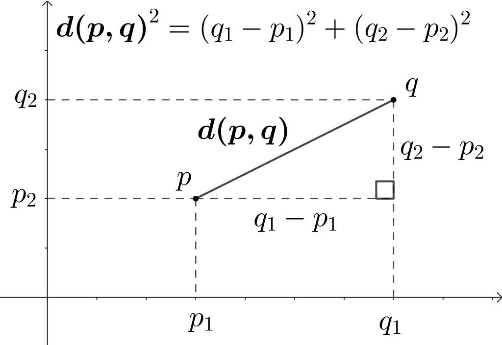
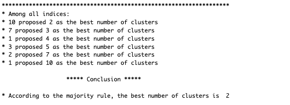

```{r setup, include=FALSE}
options(htmltools.dir.version = FALSE)

library(tidyverse)
library(kableExtra)
library(ggplot2)
library(plotly)
library(htmlwidgets)
library(MASS)
library(ggpubr)
library(xaringanthemer)
library(dbscan)
library(xaringanExtra)

style_duo_accent(
  primary_color = "#621C37",
  secondary_color = "#EE0071",
  background_image = "blank.png"
)

xaringanExtra::use_xaringan_extra(c("tile_view"))

use_scribble(
  pen_color = "#EE0071",
  pen_size = 4
)

knitr::opts_chunk$set(
  fig.retina = TRUE,
  warning = FALSE,
  message = FALSE
)

source(file = "base_functions.R")
```

name: Title slide
class: middle, left
<br><br><br><br><br><br><br>
# Multivariate Verfahren
***
### Einheit 5: Gruppieren: Clusteranalyse
##### `r format(as.Date(data.frame(readxl::read_excel("Multivariate Verfahren Termine.xlsx"))$Datum), "%d.%m.%Y")[5]` | Prof. Dr. Stephan Goerigk

---
class: top, left
### Clusteranalyse

#### Einführung in die Clusteranalyse

* **Definition**: Clusteranalyse ist ein exploratives Verfahren, das verwendet wird, um **Objekte** (z. B. Personen, Symptome, Variablen) zu **Gruppen** (Cluster) zusammenzufassen, basierend auf deren Ähnlichkeit zueinander.

* **Ziel**: Finden von **natürlichen Gruppen** in den Daten, die ähnliche Merkmale oder Verhaltensmuster aufweisen (Mustererkennung).

.pull-left[

- **Anwendungsbereiche in der Psychologie**:

- **Kategorisierung** (z. B. Cluster von Symptomen).
- **Identifikation von Risikogruppen** für psychische Störungen.
- **Personalisierung** basierend auf Gruppenbildung (z. B. welche Therapie wirkt bei welcher Patientengruppe).
]

.pull-right[
```{r echo=FALSE, fig.height=4}
# Set seed for reproducibility
set.seed(123)

# Simulate data for two clusters (e.g., Patient group A and B)
n <- 100  # Total number of patients
cluster <- rep(c("Group A", "Group B"), each = n/2)

# Symptom severity (e.g., depression severity score) and treatment response (e.g., symptom improvement)
symptom_severity <- c(rnorm(n/2, mean = 70, sd = 10), rnorm(n/2, mean = 50, sd = 10))
treatment_response <- c(rnorm(n/2, mean = 40, sd = 10), rnorm(n/2, mean = 60, sd = 10))

# Create a dataframe with the simulated data
data_clinical <- data.frame(
  cluster = factor(cluster),
  symptom_severity = symptom_severity,
  treatment_response = treatment_response
)

# Create scatter plot
ggplot(data_clinical, aes(x = symptom_severity, y = treatment_response, color = cluster)) +
  geom_point(size = 3, alpha = 0.8) +
  labs(
    x = "Symptomausprägung\n(Depressionsschwere)",
    y = "Therapieansprechen\n(Symptomverbesserung)",
    color = "Patientencluster"
  ) +
  mytheme +
  theme(text = element_text(size = 20),
        legend.position = "right") +
  scale_color_manual(values = c("Group A" = "blue", "Group B" = "red"))
```
]

---
class: top, left
### Clusteranalyse

#### Grundkonzepte: Was ist Clustering?

* **Clustering** ist ein Verfahren der **strukturentdeckenden Verfahren**

* Datenpunkte in Gruppen zu unterteilen, **ohne** dass eine vorher festgelegte Zielvariable vorliegt.

* Im Machine Learning Kontext nennt man das auch "unsupervised Learning"

.pull-left[
* Ähnliche Objekte sollen in einem Cluster zusammengefasst werden, während unähnliche Objekte unterschiedlichen Clustern zugeordnet werden.
]

.pull-right[
```{r echo=FALSE, fig.height=4}
# Set seed for reproducibility
set.seed(123)

# Simulate data for two clusters (e.g., Patient group A and B)
n <- 100  # Total number of patients
cluster <- rep(c("Group A", "Group B"), each = n/2)

# Symptom severity (e.g., depression severity score) and treatment response (e.g., symptom improvement)
symptom_severity <- c(rnorm(n/2, mean = 70, sd = 10), rnorm(n/2, mean = 50, sd = 10))
treatment_response <- c(rnorm(n/2, mean = 40, sd = 10), rnorm(n/2, mean = 60, sd = 10))

# Create a dataframe with the simulated data
data_clinical <- data.frame(
  cluster = factor(cluster),
  symptom_severity = symptom_severity,
  treatment_response = treatment_response
)

# Create scatter plot
ggplot(data_clinical, aes(x = symptom_severity, y = treatment_response, color = cluster)) +
  geom_point(size = 3, alpha = 0.8) +
  labs(
    x = "Symptomausprägung\n(Depressionsschwere)",
    y = "Therapieansprechen\n(Symptomverbesserung)",
    color = "Patientencluster"
  ) +
  mytheme +
  theme(text = element_text(size = 20),
        legend.position = "right") +
  scale_color_manual(values = c("Group A" = "blue", "Group B" = "red"))
```
]

---
class: top, left
### Clusteranalyse

#### Grundkonzepte: Wichtige Eigenschaften von Clustern

- **Kohäsion**: Objekte innerhalb eines Clusters sind einander ähnlich.

- **Separation**: Objekte in verschiedenen Clustern unterscheiden sich stark voneinander.

.pull-left[

```{r echo=F, fig.height=5}
# Setze den Seed für Reproduzierbarkeit
set.seed(123)

# Generiere Daten für zwei Cluster
n <- 100  # Anzahl der Datenpunkte
cluster <- rep(c("Cluster 1", "Cluster 2"), each = n/2)

# Cluster 1: Hohe Kohäsion, enge Datenpunkte
cluster1_x <- rnorm(n/2, mean = 5, sd = 0.5)
cluster1_y <- rnorm(n/2, mean = 5, sd = 0.5)

# Cluster 2: Gute Separation, weiter entfernt von Cluster 1
cluster2_x <- rnorm(n/2, mean = 12, sd = 0.5)
cluster2_y <- rnorm(n/2, mean = 12, sd = 0.5)

# Daten zusammenführen
data_clusters <- data.frame(
  cluster = factor(cluster),
  x = c(cluster1_x, cluster2_x),
  y = c(cluster1_y, cluster2_y)
)

# Scatterplot erstellen, der Kohäsion und Separation zeigt
ggplot(data_clusters, aes(x = x, y = y, color = cluster)) +
  geom_point(size = 3) +
  labs(
    x = "X",
    y = "Y",
    color = "Cluster"
  ) +
  mytheme +
  theme(text = element_text(size = 20),
        legend.position = "none") +
  scale_color_manual(values = c("Cluster 1" = "blue", "Cluster 2" = "red")) +
  annotate("text", x = 4, y = 7, label = "Hohe Kohäsion", color = "black", size = 5, hjust = 0) +
  annotate("text", x = 7, y = 10, label = "Gute Separation", color = "black", size = 5, hjust = 0)
```
]

.pull-right[
```{r echo=F, fig.height=5}
# Setze den Seed für Reproduzierbarkeit
set.seed(123)

# Generiere Daten für zwei Cluster
n <- 100  # Anzahl der Datenpunkte
cluster <- rep(c("Cluster 1", "Cluster 2"), each = n/2)

# Cluster 1: Hohe Kohäsion, enge Datenpunkte
cluster1_x <- rnorm(n/2, mean = 8, sd = 2)
cluster1_y <- rnorm(n/2, mean = 8, sd = 2)

# Cluster 2: Gute Separation, weiter entfernt von Cluster 1
cluster2_x <- rnorm(n/2, mean = 9, sd = 1)
cluster2_y <- rnorm(n/2, mean = 9, sd = 1)

# Daten zusammenführen
data_clusters <- data.frame(
  cluster = factor(cluster),
  x = c(cluster1_x, cluster2_x),
  y = c(cluster1_y, cluster2_y)
)

# Scatterplot erstellen, der Kohäsion und Separation zeigt
ggplot(data_clusters, aes(x = x, y = y, color = cluster)) +
  geom_point(size = 3) +
  labs(
    x = "X",
    y = "Y",
    color = "Cluster"
  ) +
  mytheme +
  theme(text = element_text(size = 20),
        legend.position = "none") +
  scale_color_manual(values = c("Cluster 1" = "blue", "Cluster 2" = "red")) +
  annotate("text", x = 4, y = 5, label = "Niedrige Kohäsion", color = "black", size = 5, hjust = 0) +
  annotate("text", x = 9.5, y = 12, label = "Schlechte Separation", color = "black", size = 5, hjust = 0)
```
]


---
class: top, left
### Clusteranalyse

#### Arten der Clusteranalyse

<small>

- **Hierarchische Clusteranalyse**:
  - Organisiert Objekte in eine **hierarchische Struktur** von Clustern.
  - 2 Arten (**agglomorativ** vs. **divisiv**)
  - Ergebnis wird in einem **Dendrogramm** visualisiert, das die Clusterhierarchie zeigt.

- **Partitionierende Clusteranalyse (centroid-based)**:
  - Teilt die Daten in eine **vorgegebene Anzahl von Clustern** ein.
  - Der bekannteste Ansatz ist der **K-Means-Algorithmus**:
  - Ziel: Minimierung der **Intra-Cluster-Varianz**.

- **Dichtebasierte Clusteranalyse**:
  - Gruppen von Objekten werden durch ihre **Dichte** in einem Raum definiert.
  - Findet Cluster von beliebiger Form.
  - Identifiziert auch **Ausreißer**, die nicht in Cluster passen.

- **Fuzzy Clustering**:
  - Fälle dürfen. zu mehreren Clustern gehören (Zugehörigkeitsgrade)
  - z.B. Fuzzy C-Means (FCM) als beliebter Algorithmus

---
class: top, left
### Clusteranalyse

#### Hierarchisches Clustering

.pull-left[

- Organisiert Objekte in eine **hierarchische Struktur** von Clustern.

  - 2 Arten (**agglomorativ** vs. **divisiv**)
  
  - Ergebnis wird in einem **Dendrogramm** visualisiert, das die Clusterhierarchie zeigt.
  
  - Zugehörigkeit von Personen auf Basis ihrer Werte in den "Input"-Variablen
  
]
.pull-right[
```{r echo = F, fig.height=5}
# Load necessary libraries
library(ggdendro)
library(ggpubr)

# Generate some example data for clustering
set.seed(123)
data <- data.frame(
  x = c(rnorm(50, mean = 2), rnorm(50, mean = 5)),
  y = c(rnorm(50, mean = 2), rnorm(50, mean = 5))
)

# Perform hierarchical clustering
dist_matrix <- dist(data)  # Compute distance matrix
hc <- hclust(dist_matrix, method = "complete")  # Hierarchical clustering

# Cut the dendrogram to form 2 clusters
clusters <- cutree(hc, k = 2)  # Assign cluster labels (2 clusters)

# Add cluster information to the dataset
data$cluster <- as.factor(clusters)

# Convert to dendrogram data
dendro_data <- dendro_data(hc)

# Plot the dendrogram with colored clusters
dendrogram_plot <- ggplot() +
  geom_segment(data = segment(dendro_data), aes(x = x, y = y, xend = xend, yend = yend)) +
  geom_point(data = label(dendro_data), aes(x = x, y = y, color = as.factor(clusters)), size = 3) +
  scale_color_manual(values = c("red", "blue")) +
  mytheme +
  labs(x = "Probanden", y = "Distanz") +
  theme(text = element_text(size = 20),
        legend.position = "none")  +
  theme(axis.line = element_blank(), axis.text.x = element_blank(),
        axis.ticks = element_blank(),
        legend.position = "none")

# Create scatter plot with colored clusters
scatter_plot <- ggplot(data, aes(x = x, y = y, color = cluster)) +
  geom_point(size = 3) +
  labs(x = "X", y = "Y") +
  scale_color_manual(values = c("red", "blue")) +
  mytheme +
  theme(text = element_text(size = 20),
        legend.position = "none") 

# Arrange both plots side by side
ggarrange(dendrogram_plot, scatter_plot, ncol = 2)
```
]

---
class: top, left
### Clusteranalyse

#### Hierarchisches Clustering - agglomorativ vs. divisiv

**Agglomoratives hierarchisches Clustering:**

*	Die agglomerative Clusteranalyse ist die häufigste Form der hierarchischen Clusteranalyse, die Objekte basierend auf ihrer Ähnlichkeit in Cluster gruppiert. Sie wird auch als AGNES (Agglomerative Nesting) bezeichnet.

*	Die agglomerative Clusteranalyse arbeitet nach dem „bottom-up“-Prinzip:

*	Jedes Objekt wird anfangs als eigenständiger Cluster (Blatt) betrachtet.

*	In jedem Schritt des Algorithmus werden die beiden ähnlichsten Cluster zu einem größeren Cluster (Knoten) zusammengeführt.

*	Dieser Vorgang wird wiederholt, bis alle Punkte Teil eines einzigen großen Clusters (Wurzel) sind.

*	Das Ergebnis ist eine baumbasierte Darstellung der Objekte, die als Dendrogramm bezeichnet wird.

---
class: top, left
### Clusteranalyse

#### Hierarchisches Clustering - agglomorativ vs. divisiv

**Divisives hierarchisches Clustering:**

*	Die divisive Clusteranalyse ist das Gegenteil der agglomerativen Clusteranalyse und wird auch als DIANA (Divisive Analysis) bezeichnet.

*	Sie arbeitet nach dem „top-down“-Prinzip:

*	Der Prozess beginnt bei der Wurzel, wobei alle Objekte in einem einzigen Cluster enthalten sind.

*	In jedem Iterationsschritt wird der heterogenste Cluster in zwei Teilcluster aufgeteilt.

*	Dieser Vorgang wird wiederholt, bis jedes Objekt seinen eigenen Cluster bildet.

*	Während die agglomerative Clusteranalyse gut darin ist, kleine Cluster zu identifizieren, eignet sich die divisive Clusteranalyse typischerweise besser zur Identifikation von großen Clustern.


---
class: top, left
### Clusteranalyse

#### Hierarchisches Clustering - Linkage


*	Ein entscheidender Faktor bei der hierarchischen Clusteranalyse ist die Messung der Unähnlichkeit zwischen zwei Clustern von Beobachtungen.

*	Es wurden verschiedene Methoden zur Cluster-Aggregation (sogenannte Linkage-Methoden) entwickelt, um diese Frage zu beantworten. Die gängigsten Methoden sind:

  * Maximum- oder Complete-Linkage-Clustering

  * Minimum- oder Single-Linkage-Clustering

  * Mean- oder Average-Linkage-Clustering

  * Ward’s Minimum-Variance-Methode

---
class: top, left
### Clusteranalyse

#### Hierarchisches Clustering - Linkage

<small>

*	Maximum- oder Complete-Linkage-Clustering:
  *	Berechnet alle paarweisen Unähnlichkeiten zwischen den Elementen von Cluster 1 und Cluster 2.
  *	Nimmt den größten Wert (d. h. den Maximalwert) dieser Unähnlichkeiten als Abstand zwischen den Clustern.
  *	Führt dazu, dass kompaktere Cluster entstehen.

*	Minimum- oder Single-Linkage-Clustering:
  *	Berechnet alle paarweisen Unähnlichkeiten zwischen den Elementen von Cluster 1 und Cluster 2.
  *	Nimmt den kleinsten dieser Werte als Kriterium für die Verknüpfung.
  *	Führt häufig zu langen, „losen“ Clustern.

*	Mean- oder Average-Linkage-Clustering:
  *	Berechnet alle paarweisen Unähnlichkeiten zwischen den Elementen von Cluster 1 und Cluster 2.
  *	Nimmt den Durchschnitt dieser Unähnlichkeiten als Abstand zwischen den Clustern.

*	Ward’s Minimum-Variance-Methode:
  *	Minimiert die totale Varianz innerhalb der Cluster.
  *	In jedem Schritt werden die Cluster mit der minimalen zwischen-Cluster-Distanz zusammengeführt.


---
class: top, left
### Clusteranalyse

#### Agglomoratives hierarchisches Clustering

Im Allgemeinen funktioniert die agglomerative hierarchische Clusteranalyse wie folgt:

1.	Berechnung der (Un-)Ähnlichkeit ([Dis]similarities) zwischen jedem Paar von Objekten im Datensatz.

2.	Verwendung einer Verknüpfungsfunktion (Linkage-Funktion)

  * Objekte werden basierend auf Basis der Ähnlichkeiten zu einer hierarchischen Clusterstruktur zusammengefasst. 
  
  * Objekte/Cluster, die nahe beieinander liegen, werden zusammengeführt/verknüpft.

3.	Pruning: Bestimmung, an welcher Stelle der hierarchische Baum (Dendrogram) in Cluster aufgeteilt werden soll


---
class: top, left
### Clusteranalyse

#### Agglomoratives hierarchisches Clustering

**Beispiel:** Identifizierung von Depressionssubtypen anhand von Entzündungsmarkern und neuronaler Aktivität

* Depression ist eine hochgradig heterogene Erkrankung, bei der Patienten unterschiedliche biologische Grundlagen aufweisen. 

* Durch das Clustern von Patienten basierend auf Biomarkern können biologisch unterschiedliche Subtypen identifiziert werden

* Subtypen $\rightarrow$ maßgeschneiderte Behandlungen


---
class: top, left
### Clusteranalyse

#### Agglomoratives hierarchisches Clustering

**Beispiel:** Identifizierung von Depressionssubtypen anhand von Entzündungsmarkern und neuronaler Aktivität

Dimensionen für das Clustering:

1.	Entzündungsmarker:

  *	Beispiele: C-reaktives Protein (CRP), Interleukin-6 (IL-6) oder Tumor-Nekrose-Faktor-Alpha (TNF-α).

  *	Höhere Werte können auf systemische Entzündungen hinweisen, die mit einer spezifischen Depressionsform verbunden sind, die häufig resistent gegenüber Standardbehandlungen ist.

2.	Neuronale Aktivität:

  *	Beispiel: Funktionale Aktivität im präfrontalen Kortex, gemessen mit fMRT oder EEG.

  *	Reduzierte Aktivität im linken dorsolateralen präfrontalen Kortex (DLPFC) wird häufig bei Patienten mit therapieresistenter Depression beobachtet.

---
class: top, left
### Clusteranalyse

#### Agglomoratives hierarchisches Clustering

.pull-left[
**Beispiel:** Identifizierung von Depressionssubtypen anhand von Entzündungsmarkern und neuronaler Aktivität

Dimensionen für das Clustering:

1.	Entzündungsmarker: Interleukin-6 (IL-6) 

2.	Neuronale Aktivität: DLPFC Aktivität

]

.pull-right[
Ausschnitt von $N=15$ Personen aus Datensatz (Werte sind z-standardisiert)

```{r, echo=FALSE}
library('factoextra')
df <- iris #loading data

df <- dplyr::select(df, 
                    -Species) #removing Species

df <- as.data.frame(scale(df)) #scaling

df = df[,c(1,3)]

names(df) = c("DLPFC Aktivität", "Interleukin-6")

head(df, 15)
```
]

---
class: top, left
### Clusteranalyse

#### Agglomoratives hierarchisches Clustering

.pull-left[
```{r echo=FALSE, fig.height=6}
ggplot(df, aes(y = `DLPFC Aktivität`, x = `Interleukin-6`)) +
  geom_point() +
  mytheme +
  theme(text = element_text(size = 20),
        legend.position = "none")
```

]

.pull-right[
```{r, eval=FALSE}
ggplot(df, aes(y = `DLPFC Aktivität`, 
               x = `Interleukin-6`)) +
  geom_point()
```

* Visualisierung im Streudiagramm

* Leicht möglich, da Daten 2-dimensional

* Jeder Punkt entspricht einer Person
]

---
class: top, left
### Clusteranalyse

#### Agglomoratives hierarchisches Clustering

**Berechnung der (Un-)Ähnlichkeit ([Dis]similarities)**

*	Um zu entscheiden, welche Objekte/Cluster kombiniert werden sollen, müssen Methoden zur Messung der Ähnlichkeit angegeben werden.

*	In R berechnen wir Ähnlichkeit über die Funktion `dist()`

*	Standardmäßig berechnet die Funktion dist() die **euklidische Distanz** zwischen Objekten.

*	Es ist jedoch möglich, andere Distanzmetriken anzugeben.

---
class: top, left
### Clusteranalyse

#### Agglomoratives hierarchisches Clustering

**Berechnung der (Un-)Ähnlichkeit ([Dis]similarities)**

<small>

Euklidische Distanz:

* Die euklidische Distanz ist die geradlinige Entfernung zwischen zwei Punkten (Personen) in einem mehrdimensionalen Raum.

* Für zwei Punkte $A(x_1, y_1)$ und $B(x_2, y_2)$ im zweidimensionalen Raum:

$$d(A, B) = \sqrt{(x_2 - x_1)^2 + (y_2 - y_1)^2}$$


* Für n-dimensionale Punkte:

$$d(A, B) = \sqrt{\sum_{i=1}^{n} (x_{iB} - x_{iA})^2}$$
* Eigenschaften der euklidische Distanz

*	Positive Werte: Die Distanz ist immer positiv (oder 0, wenn beide Punkte identisch sind).
*	Symmetrie: d(A, B) = d(B, A).
*	Dreiecksungleichung: Der direkte Weg zwischen zwei Punkten ist immer kürzer oder gleich der Summe der indirekten Wege.

---
class: top, left
### Clusteranalyse

#### Agglomoratives hierarchisches Clustering

**Berechnung der (Un-)Ähnlichkeit ([Dis]similarities)**

<small>

Euklidische Distanz:

.center[

```{r eval = TRUE, echo = F, out.width = "500px"}

```
]

---
class: top, left
### Clusteranalyse

#### Agglomoratives hierarchisches Clustering

**Berechnung der (Un-)Ähnlichkeit ([Dis]similarities)**

<small>

Exkurs: Alternative Distanzmetriken:

Manhattan-Distanz (City-Block-Distanz)

*	Definition: Summiert die absoluten Differenzen der Koordinaten zwischen zwei Punkten.

*	Formel:

$$d(A, B) = \sum_{i=1}^{n} |x_{iA} - x_{iB}|$$

*	Beispiel: Geeignet für hochdimensionale Daten und bei Daten, die wie in einem Raster (z. B. Stadtstraßen) strukturiert sind.

*	Eigenschaft: Führt oft zu „längeren“ Clustern als die euklidische Distanz.

---
class: top, left
### Clusteranalyse

#### Agglomoratives hierarchisches Clustering

**Berechnung der (Un-)Ähnlichkeit ([Dis]similarities)**

<small>

Exkurs: Alternative Distanzmetriken:

Minkowski-Distanz

*	Definition: Verallgemeinerung der euklidischen und Manhattan-Distanzen.

*	Formel:

$$d(A, B) = \left( \sum_{i=1}^{n} |x_{iA} - x_{iB}|^p \right)^{\frac{1}{p}}$$

*	Parameter p:

*	p = 1: Manhattan-Distanz

*	p = 2: Euklidische Distanz

*	Beispiel: Ermöglicht Flexibilität in der Definition von Distanzen.

---
class: top, left
### Clusteranalyse

#### Agglomoratives hierarchisches Clustering

**Berechnung der (Un-)Ähnlichkeit ([Dis]similarities)**

<small>

Exkurs: Alternative Distanzmetriken:

Cosinus-Distanz (Cosine Similarity)

*	Definition: Misst den Winkel zwischen zwei Vektoren, nicht deren absolute Werte.

*	Formel (Ähnlichkeit):

$$\text{Cosine Similarity} = \frac{\vec{A} \cdot \vec{B}}{\|\vec{A}\| \|\vec{B}\|}$$

Cosinus-Distanz = 1 - $\text{Cosine Similarity}$.

*	Beispiel: Häufig in Textanalysen verwendet, z. B. bei der Analyse von Wortfrequenzen (Bag-of-Words).

*	Eigenschaft: Unempfindlich gegenüber der Länge der Vektoren.

---
class: top, left
### Clusteranalyse

#### Agglomoratives hierarchisches Clustering

**Berechnung der (Un-)Ähnlichkeit ([Dis]similarities)**

Exkurs: Alternative Distanzmetriken:

Mahalanobis-Distanz

*	Definition: Berücksichtigt die Korrelationen zwischen den Variablen und die Verteilung der Daten.

*	Formel:

$$d(A, B) = \sqrt{(x_A - x_B)^T \Sigma^{-1} (x_A - x_B)}$$

wobei \Sigma^{-1} die inverse Kovarianzmatrix ist.

*	Beispiel: Besonders nützlich bei korrigierten und skalierten Daten oder bei variierenden Skalen.

*	Eigenschaft: Berücksichtigt Abhängigkeiten zwischen Variablen.


---
class: top, left
### Clusteranalyse

#### Agglomoratives hierarchisches Clustering

**Berechnung der (Un-)Ähnlichkeit ([Dis]similarities)**

<small>

Exkurs: Alternative Distanzmetriken:

Jaccard-Distanz

*	Definition: Misst die Ähnlichkeit zwischen zwei Mengen, insbesondere für binäre oder kategoriale Daten.

*	Formel:

$$\text{Jaccard Similarity} = \frac{|A \cap B|}{|A \cup B|}$$

Jaccard-Distanz $= 1 - \text{Jaccard Similarity}$.

*	Beispiel: Verwendung bei Clustering von Merkmalen wie „Ja/Nein“-Antworten.

---
class: top, left
### Clusteranalyse

#### Agglomoratives hierarchisches Clustering

**Berechnung der (Un-)Ähnlichkeit ([Dis]similarities) - Distanzmatrix**

```{r}
# Berechnung der (Un-)Ähnlichkeitsmatrix

d <- dist(df, method = "euclidean")

as.matrix(d)[1:8, 1:8] # Anzeigen für die ersten 8 Personen
```

---
class: top, left
### Clusteranalyse

#### Agglomoratives hierarchisches Clustering

**Berechnung der (Un-)Ähnlichkeit ([Dis]similarities) - Distanzmatrix**

```{r echo=FALSE}
# Berechnung der (Un-)Ähnlichkeitsmatrix

d <- dist(df, method = "euclidean")

as.matrix(d)[1:8, 1:8] # Anzeigen für die ersten 8 Personen
```

***

* Große Werte = hohe Unänlichkeit/Distanz zwischen Personen

* Kleine Werte = hohe Änlichkeit zwischen Personen (Kandidaten für gleiches Cluster)

* Diagnonale 0 Werte = Distanz einer Person mit sich selbst (Distanz = 0 da Werte identisch)

---
class: top, left
### Clusteranalyse

#### Agglomoratives hierarchisches Clustering

**Linkage in R**

* Das hierarchische Clustering wird mit der `hclust()` Funktion durchgeführt

* Typischerweise werden hierfür die Complete-Linkage-Methode oder die Ward-Methode bevorzugt.

```{r}
# Linkage berechnen (Distanzmatrix geben)
hc <- hclust(d = d, method = "ward.D2")

hc
```

---
class: top, left
### Clusteranalyse

#### Agglomoratives hierarchisches Clustering

**Dendrogram visualisieren**

.center[
```{r, fig.height=5, fig.width=12}
fviz_dend(hc, cex = 0.2) + coord_flip()
```
]

---
class: top, left
### Clusteranalyse

#### Agglomoratives hierarchisches Clustering

**Dendrogram visualisieren**

*	In den Dendrogrammen entspricht jedes Blatt einem Datenpunkt oder Objekt.

*	Objekte, die einander ähnlich sind, werden zu Ästen kombiniert, bis schließlich alles in einem einzigen Cluster zusammengeführt wird.

*	Die Höhe der Verschmelzung auf der vertikalen Achse zeigt die (Un)Ähnlichkeit bzw. Distanz zwischen zwei Objekten oder Clustern an.

*	Je höher die Höhe der Verschmelzung, desto weniger ähnlich sind die Objekte.

*	Diese Höhe wird als cophenetische Distanz zwischen den beiden Objekten bezeichnet.

---
class: top, left
### Clusteranalyse

#### Agglomoratives hierarchisches Clustering

**Dendrogram - Modellpassung**

<small>

*	Wir können überprüfen, wie gut der Baum die tatsächlichen Daten widerspiegelt, indem wir die Distanzmatrix betrachten, die mit der Funktion dist() berechnet wird.

*	Diese Distanzmatrix dient im Wesentlichen als Möglichkeit, den Baum und die berechneten Distanzen zu validieren.

*	Dies kann erreicht werden, indem die Korrelation zwischen den cophenetischen Distanzen und den ursprünglichen Distanzen berechnet wird.

*	In der Theorie sollte diese Korrelation hoch sein.Idealerweise liegt die Korrelation über 0.75.

* Wenn die Korrelation nicht ausreichend ist $\rightarrow$ andere Linkage-Methoden ausprobieren

```{r}
# cophenetischen Distanzen berechnen
coph <- cophenetic(hc)

# Korrelation zwischen den cophenetischen Distanzen und den ursprünglichen Distanzen
cor(d, coph)
```

---
class: top, left
### Clusteranalyse

#### Agglomoratives hierarchisches Clustering

**Zuweisung der Fälle zu den Clustern**

*	Als Nächstes können wir die Cluster tatsächlich benennen, da der Algorithmus zwar ein Dendrogramm erzeugt, wir dieses aber interpretieren müssen.

*	Wir müssen die Anzahl der Cluster $k$ bestimmen. In unserem Graph sah es so aus, als wäre $k = 2$.

*	Es ist jedoch möglich, komplexere Methoden zu verwenden, um ein geeignetes $k$ zu bestimmen, indem das Dendrogramm genauer betrachtet und analysiert wird (folgt später).

*	Wir fahren mit $k = 2$ fort.

---
class: top, left
### Clusteranalyse

#### Agglomoratives hierarchisches Clustering

**Zuweisung der Fälle zu den Clustern**

```{r, fig.height=5, fig.width=12}
fviz_dend(hc, cex = 0.2, k = 2, color_labels_by_k = TRUE) + coord_flip() # Nach k einfärben
```

---
class: top, left
### Clusteranalyse

#### Agglomoratives hierarchisches Clustering

**Zuweisung der Fälle zu den Clustern**

```{r}
df$cluster <- cutree(hc, k = 2)
```

.pull-left[
```{r echo=FALSE, fig.height=5}
ggplot(df, aes(y = `DLPFC Aktivität`, x = `Interleukin-6`, colour = cluster)) +
  geom_point() +
  mytheme +
  theme(text = element_text(size = 20),
        legend.position = "none")
```

]

.pull-right[
```{r, eval=FALSE}
ggplot(df, aes(y = `DLPFC Aktivität`, 
               x = `Interleukin-6`,
               colour = cluster)) +
  geom_point()
```

* Visualisierung im Streudiagramm

* Leicht möglich, da Daten 2-dimensional

* Jeder Punkt entspricht einer Person

* Cluster farblich visualisiert
]

---
class: top, left
### Clusteranalyse

#### Agglomoratives hierarchisches Clustering

.pull-left[
**Beispiel:** Identifizierung von Depressionssubtypen anhand von Entzündungsmarkern und neuronaler Aktivität

Dimensionen für das Clustering (mehr als 2):

1. Entzündungsmarker: Interleukin-6 (IL-6) 

2. C-reaktives Protein (CRP)

3. Tumor-Nekrose-Faktor-Alpha (TNF-α)

4. Neuronale Aktivität: DLPFC Aktivität

]

.pull-right[
Ausschnitt von $N=15$ Personen aus Datensatz (Werte sind z-standardisiert)

```{r, echo=FALSE}
library('factoextra')
df <- iris #loading data

df <- dplyr::select(df, 
                    -Species) #removing Species

df <- as.data.frame(scale(df)) #scaling

df = df[,c(1:4)]

names(df) = c("DLPFC", "CRP", "IL-6", " TNF-α")

head(df, 15)
```
]


---
class: top, left
### Clusteranalyse

#### Agglomoratives hierarchisches Clustering (mehr als 2 Dimensionen)

```{r, fig.height=5, fig.width=12}
d <- dist(df, method = "euclidean")
hc <- hclust(d = d, method = "ward.D2")
fviz_dend(hc, cex = 0.2, k = 2, color_labels_by_k = TRUE) + coord_flip()
```

---
class: top, left
### Clusteranalyse

#### Agglomoratives hierarchisches Clustering (mehr als 2 Dimensionen)

.pull-left[
```{r echo=FALSE, fig.height=6}
cut <- cutree(hc, k = 2)

fviz_cluster(list(data = df, cluster=cut), labelsize = 0) +
  mytheme +
  labs(title = "") +
  theme(text = element_text(size = 20),
        legend.position = "none")
```
]

.pull-right[
```{r eval=FALSE}
cut <- cutree(hc, k = 2)

fviz_cluster(list(data = df, 
                  cluster=cut), 
             labelsize = 0) +
  mytheme +
  labs(title = "")
```

<small>

* Problem: 4 Dimensionen aber nur 2 Achsen

* Lösung: R rechnet erst eine Hauptkomponentenanalyse (PCA), um Daten auf 2 Komponenten herunterzubrechen

* Komponentenwerte werden auf X- und Y-Achse dargestellt $\rightarrow$ Clustertrennung sichtbar

* Nachteil: Variablen nicht in Ursprungseinheit sichtbar
]

---
class: top, left
### Clusteranalyse

#### Divisives hierarchisches Clustering 

* Die divisive Clusteranalyse beginnt mit allen Objekten/Beobachtungen des Datensatzes in einem einzigen großen Cluster. 

* In jeder Iteration wird der heterogenste Cluster in zwei Teilcluster aufgeteilt. 

* Dieser Prozess wird so lange wiederholt, bis jedes Objekt seinen eigenen Cluster bildet

$\rightarrow$ Gegenteil der agglomerativen Clusteranalyse.

---
class: top, left
### Clusteranalyse

#### Divisives hierarchisches Clustering 

```{r}
library(cluster)

di <- diana(x = df, 
            stand = TRUE, # Standardisieren vor dem clustern
            metric = "euclidean")

di$dc
```

* Ergebnis: **Divisiver Koeffizient** - Maß für die gefundene Clusterstruktur

* Dieser entspricht im Wesentlichen der Unähnlichkeit zum ersten (gesamten) Cluster geteilt durch die Unähnlichkeit der Zusammenführung im letzten Schritt

---
class: top, left
### Clusteranalyse

#### Divisives hierarchisches Clustering 

```{r, fig.height=5, fig.width=12}
fviz_dend(di, cex = 0.2, k = 2) + coord_flip() # Einfärben passiert automatisch
```

---
class: top, left
### Clusteranalyse

#### Divisives hierarchisches Clustering 

.pull-left[
```{r echo=FALSE, fig.height=6}
cut <- cutree(di, k = 2)

fviz_cluster(list(data = df, cluster=cut), labelsize = 0) +
  mytheme +
  labs(title = "") +
  theme(text = element_text(size = 20),
        legend.position = "none")
```
]

.pull-right[
```{r eval=FALSE}
cut <- cutree(di, k = 2)

fviz_cluster(list(data = df, 
                  cluster=cut), 
             labelsize = 0) +
  mytheme +
  labs(title = "")
```

* Divisives findet eine ähnliche, jedoch nicht identische Clusterzuweisung
]

---
class: top, left
### Clusteranalyse

#### Wahl der optimalen Anzahl von Clustern

.pull-left[
```{r echo=FALSE, fig.height=6}
cut <- cutree(hc, k = 3)

fviz_cluster(list(data = df, cluster=cut), labelsize = 0) +
  mytheme +
  labs(title = "") +
  theme(text = element_text(size = 20),
        legend.position = "none")
```
]

.pull-right[
```{r eval=FALSE}
cut <- cutree(hc, k = 3)

fviz_cluster(list(data = df, 
                  cluster=cut), 
             labelsize = 0) +
  mytheme +
  labs(title = "")
```

<small>

* Prinzipiell wären auch andere Clusterzahlen denkbar

* Optimale Zahl muss bestimmt werden

* Visuelle Inspektion reicht dafür i.d.R. nicht
]

---
class: top, left
### Clusteranalyse

#### Wahl der optimalen Anzahl von Clustern

.pull-left[
```{r echo=FALSE, fig.height=6}
cut <- cutree(hc, k = 4)

fviz_cluster(list(data = df, cluster=cut), labelsize = 0) +
  mytheme +
  labs(title = "") +
  theme(text = element_text(size = 20),
        legend.position = "none")
```
]

.pull-right[
```{r eval=FALSE}
cut <- cutree(hc, k = 4)

fviz_cluster(list(data = df, 
                  cluster=cut), 
             labelsize = 0) +
  mytheme +
  labs(title = "")
```

<small>

* Prinzipiell wären auch andere Clusterzahlen denkbar

* Optimale Zahl muss bestimmt werden

* Visuelle Inspektion reicht dafür i.d.R. nicht
]

---
class: top, left
### Clusteranalyse

#### Wahl der optimalen Anzahl von Clustern

*	$k$ ist die Anzahl der Cluster, die ein Algorithmus erzeugt.

*	Die Wahl beeinflusst direkt die Ergebnisse und die Interpretierbarkeit des Clusterings.

*	Zu wenige Cluster: Heterogene Gruppen, wichtige Unterschiede werden übersehen.

*	Zu viele Cluster: Übersegmentierung, Cluster sind schwer interpretierbar.

---
class: top, left
### Clusteranalyse

#### Wahl der optimalen Anzahl von Clustern

<small>

Methoden zur Wahl der optimalen Clusterzahl (Beispiele)

*	Elbow-Methode:

  *	Berechnung der Gesamt-Within-Cluster-Summe der Quadrate (WSS) für verschiedene k-Werte.

  *	Identifikation des “Knicks” (Elbow), bei dem die WSS stark abflacht.

  *	Beispiel: k = 3 liefert eine gute Balance zwischen Komplexität und Genauigkeit.

*	Silhouettenanalyse:

  *	Misst die Qualität eines Clusterings anhand der Kohäsion (Zusammenhalt innerhalb eines Clusters) und Separation (Trennung der Cluster).

  *	Silhouetten-Koeffizient (-1 bis +1): Werte nahe +1 deuten auf gut getrennte Cluster hin.

*	Gap-Statistik:

  *	Vergleicht die Clusterung der tatsächlichen Daten mit zufälligen Daten.

  *	Das optimale k maximiert den Unterschied zwischen beiden.

---
class: top, left
### Clusteranalyse

#### Wahl der optimalen Anzahl von Clustern

**Elbow-Methode:**

.pull-left[
```{r, echo=FALSE, fig.height=5}
factoextra::fviz_nbclust(x = df, FUN = hcut, method = c("wss")) + 
  geom_vline(xintercept = 3,linetype=2) +
  geom_vline(xintercept = 4, linetype=2)
```
]
.pull-right[
```{r, eval=FALSE, fig.height=5}
library(factoextra)

fviz_nbclust(x = df, 
             FUN = hcut, 
             method = c("wss"))
```
]

---
class: top, left
### Clusteranalyse

#### Wahl der optimalen Anzahl von Clustern

**Elbow-Methode:**

*	Wir suchen nach dem „Knick“ im Diagramm, der darauf hinweist, dass zusätzliche Cluster nur noch geringfügigen Nutzen bringen.
	
*	Hier: Der Knick deutet darauf hin, dass $k = 3$ wahrscheinlich angemessen ist.
	
*	Im Wesentlichen gilt: Wenn der Liniendiagramm wie ein Arm aussieht, dann ist der „Ellbogen“ des Arms der Wert von k, der am besten geeignet ist.

*	Die Idee ist, dass wir eine geringe WSS (Within-Cluster Sum of Squares) anstreben, aber die WSS dazu neigt, gegen 0 zu sinken, wenn $k$ erhöht wird.

*	Unser Ziel ist es, einen kleinen Wert für $k$ zu wählen, der dennoch eine niedrige WSS aufweist.
	
*	Der Knickpunkt („Ellbogen“) repräsentiert normalerweise den Punkt, an dem der Nutzen abnimmt, wenn $k$ weiter erhöht wird.
	
	
---
class: top, left
### Clusteranalyse

#### Wahl der optimalen Anzahl von Clustern

**Silhouettenanalyse:**

.pull-left[
```{r, echo=FALSE, fig.height=5}
factoextra::fviz_nbclust(x = df, FUN = hcut, method = c("silhouette"))
```
]
.pull-right[
```{r, eval=FALSE, fig.height=5}
fviz_nbclust(x = df, 
             FUN = hcut, 
             method = c("silhouette"))
```
]

---
class: top, left
### Clusteranalyse

#### Wahl der optimalen Anzahl von Clustern

**Silhouettenanalyse:**

*	Für jeden Punkt p wird zunächst die durchschnittliche Distanz zwischen p und allen anderen Punkten im selben Cluster berechnet (dies misst die Kohäsion, nennen wir sie A).
	
*	Anschließend wird die durchschnittliche Distanz zwischen p und allen Punkten im nächsten Cluster berechnet (dies misst die Separation vom nächstgelegenen anderen Cluster, nennen wir sie B).
	
*	Der Silhouetten-Koeffizient für p wird definiert als der Unterschied zwischen B und A, geteilt durch den größeren der beiden Werte $(\max(A, B))$.
	
*	Ziel: Den Abstand zwischen Clustern messen.
	
*	Wenn die Clusterkohäsion gut ist (A ist klein) und die Clustertrennung gut ist (B ist groß), wird der Zähler groß, was auf gut getrennte Cluster hinweist.
	
*	Im Beispiel zeigt der zweite Plot, dass $k=2$ der ideale Wert ist.


---
class: top, left
### Clusteranalyse

#### Wahl der optimalen Anzahl von Clustern

**Gap-Statistik:**
```{r include=FALSE}
gap_stat <- clusGap(x = df, FUN = hcut, K.max = 10, B = 10)
```

.pull-left[
```{r, echo = FALSE, fig.height=5}
fviz_gap_stat(gap_stat)
```
]
.pull-right[
```{r, eval=FALSE, fig.height=5}
gap_stat <- clusGap(x = df, 
                    FUN = hcut, 
                    K.max = 10, 
                    B = 10)
fviz_gap_stat(gap_stat)
```
]

---
class: top, left
### Clusteranalyse

#### Wahl der optimalen Anzahl von Clustern

<small>

**Gap-Statistik:**

* Logik: Qualität der Clusterung zu bewerten, indem die Variation innerhalb der Cluster mit der Variation verglichen wird, die bei einer zufälligen Verteilung der Daten zu erwarten wäre.

* Für jeden Wert von k wird die Summe der quadratischen Abstände zwischen den Punkten und ihren Clusterzentren berechnet (Kohäsion).

* Ein zufälliger Datensatz wird generiert, der die gleiche Anzahl von Datenpunkten und die gleichen Grenzen wie die Originaldaten hat.

* Für jeden potentiellen Wert von $k$ wird die Variation innerhalb der Cluster auch im zufälligen Datensatz berechnet.

* Der Unterschied (Gap) zwischen der Variation im Referenzdatensatz und im Originaldatensatz wird berechnet:

$$\text{Gap}(k) = E[\log(W_k^{\text{random}})] - \log(W_k^{\text{data}})$$

* Der optimale Wert für $k$ ist der Punkt, an dem die Gap-Statistik den größten Wert hat.

*	Im Beispiel zeigt der dritte Plot, dass $k=2$ der ideale Wert ist

---
class: top, left
### Clusteranalyse

#### Wahl der optimalen Anzahl von Clustern - Cluster Validity Indices und Majority rule

* Manche R Pakete berechnen viele Cluster Validity Indices (CVIs) auf einmal und entscheiden dann nach dem Mehrheitsprinzip (Majority rule)

```{r eval=FALSE}
library(NbClust)
nb = NbClust(df, distance = "euclidean", min.nc = 2, max.nc = 10, method = "ward.D2")
```

```{r include=FALSE}
nb = NbClust(df, distance = "euclidean", min.nc = 2, max.nc = 10, method = "ward.D2")

```

.code70[
```{r echo=FALSE}
library(NbClust)
roundallnumerics(nb$All.index, 2)
```
]

---
class: top, left
### Clusteranalyse

#### Wahl der optimalen Anzahl von Clustern - Majority rule

```{r eval=FALSE}
library(NbClust)
nb = NbClust(df, distance = "euclidean", min.nc = 2, max.nc = 10, method = "ward.D2")
```

.center[
```{r eval = TRUE, echo = F, out.width = "700px"}

```
]

---
class: top, left
### Clusteranalyse

#### Wahl der optimalen Anzahl von Clustern

**Top-Down - Vorwissen:**

* Eine weitere Methode, die wir für das Clustering verwenden können, bezieht sich auf das theoretische „Vorwissen“

* Daraus könnten wir ableiten, dass k = 3 eine bessere Wahl sein könnte. 

* Diese Methode sollte jedoch mit Vorsicht angewendet werden. 

* Es ist ratsam, den Algorithmus mehrmals auszuführen und die Cluster zu analysieren, um zu überprüfen, welches $k$ am besten geeignet ist.

---
class: top, left
### Clusteranalyse

#### Partitionierende Clusteranalyse

.pull-left[

- Teilt die Daten in eine **vorgegebene Anzahl von Clustern** ein.

- Der bekannteste Ansatz ist der **K-Means-Algorithmus**:

- Ziel: Minimierung der **Intra-Cluster-Varianz**

]

.pull-right[
Partitionierende Clusteranalyse (Centroid-based)

```{r echo = F, fig.height=5}
# Set seed for reproducibility
set.seed(123)

# Generate sample data for two clusters
n <- 150
cluster <- rep(c("Cluster 1", "Cluster 2"), each = n/2)

# Cluster 1 (red): Centered at (0.4, 0.3)
x1 <- rnorm(n/2, mean = 0.45, sd = 0.05)
y1 <- rnorm(n/2, mean = 0.35, sd = 0.05)

# Cluster 2 (blue): Centered at (0.6, 0.7)
x2 <- rnorm(n/2, mean = 0.5, sd = 0.05)
y2 <- rnorm(n/2, mean = 0.65, sd = 0.05)

# Combine into a data frame
data_clusters <- data.frame(
  x = c(x1, x2),
  y = c(y1, y2),
  cluster = factor(cluster)
)

# Calculate centroids
centroids <- data.frame(
  cluster = factor(c("Cluster 1", "Cluster 2")),
  x = c(mean(x1), mean(x2)),
  y = c(mean(y1), mean(y2))
)

# Create the plot with lines from centroids to each point
ggplot(data_clusters, aes(x = x, y = y, color = cluster)) +
  geom_point(size = 2, alpha = 0.8) +  # Scatter points for clusters
  geom_segment(data = data_clusters[data_clusters$cluster == "Cluster 1", ], 
               aes(x = centroids[1, "x"], y = centroids[1, "y"], xend = x, yend = y), color = "red", alpha = 0.5) +  # Lines from Cluster 1 centroid
  geom_segment(data = data_clusters[data_clusters$cluster == "Cluster 2", ], 
               aes(x = centroids[2, "x"], y = centroids[2, "y"], xend = x, yend = y), color = "blue", alpha = 0.5) +  # Lines from Cluster 2 centroid
  geom_point(data = centroids, aes(x = x, y = y), color = "black", size = 5, shape = 17) +  # Centroids as triangles
  geom_abline(intercept = 1, slope = -1, color = "black", size = 1) +  # Decision boundary line
  labs(
    x = "X", 
    y = "Y") +
  mytheme +
  theme(text = element_text(size = 20),
        legend.position = "none") +
  scale_color_manual(values = c("Cluster 1" = "pink", "Cluster 2" = "blue")) +
  theme(legend.position = "none")
```

]


---
class: top, left
### Clusteranalyse

#### Partitionierende Clusteranalyse

*	Im Allgemeinen bezeichnet partionelles Clustering einen Ansatz, bei dem eine gegebene Menge von $n$ Objekten in $k$ Partitionen aufgeteilt wird.

** $\rightarrow$ $k$ muss gegeben sein!**
	
*	Ein Partitionierungsalgorithmus erstellt diese $k$ Partitionen basierend auf den Daten.

*	Der Wert für $k$ wird von uns vorgegeben, wie nutzen die oben vorgestellten Methoden, um das geeignetste $k$ zu bestimmen.

*	Die grundlegenden Partitionierungsmethoden verwenden in der Regel eine exklusive Clustertrennung, bei der jede Beobachtung nur einem Cluster zugeordnet werden darf.

* Häufiger Algorithmus: K-Means Clustering

---
class: top, left
### Clusteranalyse

<small>

#### Partitionierende Clusteranalyse - K-Means

Der k-means-Algorithmus funktioniert im Allgemeinen in den folgenden Schritten:

1.	Anzahl der Cluster k festlegen: Dies wird vom Datenwissenschaftler/Forscher bestimmt.
  
2.	Initiale Clusterzentren auswählen: $k$ Objekte werden zufällig aus dem Datensatz als anfängliche Clusterzentren (Mittelwerte) ausgewählt.

3.	Zuweisung der Beobachtungen zu Clustern:	Jede Beobachtung wird dem nächstgelegenen Clusterzentrum zugewiesen (euklidischen Distanz) 

4.	Aktualisierung der Clusterzentren:	Für jedes der $k$ Cluster wird das Clusterzentrum durch die Berechnung der neuen Mittelwerte aller Datenpunkte im Cluster aktualisiert.

5.	Iterative Optimierung:

	*	Minimierung der Gesamtsumme der Quadrate innerhalb der Cluster (Within Sum of Squares, WSS).

	*	Schritte 3 und 4 werden wiederholt, bis sich die Clusterzuweisungen nicht mehr ändern oder die maximale Anzahl an Iterationen erreicht ist.

---
class: top, left
### Clusteranalyse

<small>

#### Partitionierende Clusteranalyse - K-Means

```{r eval=FALSE}
set.seed(123) # Zufällig gezogene Daten reproduzierbar machen

km <- kmeans(df, 2, nstart = 25) # wir wählen k = 2, da dies zuvor die beste Lösung war
km
```

.code80[
```{r echo=FALSE}
set.seed(123) # Zufällig gezogene Daten reproduzierbar machen

km <- kmeans(df, 2, nstart = 25) # wir wählen k = 2, da dies zuvor die beste Lösung war
km
```
]

---
class: top, left
### Clusteranalyse

<small>

#### Partitionierende Clusteranalyse - K-Means

**Limitationen von K-Means**

1.	Erfordert Vorwissen über die Daten:
	
	*	Der Analyst muss die geeignete Anzahl der Cluster (k) im Voraus festlegen.

2.	Empfindlich gegenüber der zufälligen Auswahl der Startwerte:
	
	*	Das Endergebnis hängt stark von der initialen zufälligen Auswahl der Clusterzentren ab.
	
	*	Bei jedem Durchlauf des Algorithmus mit demselben Datensatz können unterschiedliche Startwerte gewählt werden.
	
	*	Dies kann zu unterschiedlichen Clustering-Ergebnissen bei verschiedenen Durchläufen führen.
	
	*	Daher ist die Verwendung von set.seed(x) entscheidend, um reproduzierbare Ergebnisse zu erzielen.
	
3.	Empfindlich gegenüber Ausreißern:

	*	Ausreißer können die Ergebnisse erheblich beeinflussen, da sie die Berechnung der Clusterzentren verzerren können.

---
class: top, left
### Clusteranalyse

#### Dichtebasierte Clusteranalyse - DBSCAN

*	 Partitionierungsmethoden (z.B. k-means) und hierarchisches Clustering eignen sich gut zur Identifikation von sphärisch geformten Clustern oder konvexen Clustern.

*	Sie funktionieren gut, wenn die Cluster klar definiert und relativ deutlich voneinander getrennt sind.

*	Diese Methoden haben jedoch Schwierigkeiten, wenn:

  *	Extremwerte oder Ausreißer vorhanden sind.

  *	Starkes Rauschen in den Daten vorliegt
	
---
class: top, left
### Clusteranalyse

#### Dichtebasierte Clusteranalyse - DBSCAN

* Density-Based Clustering of Applications with Noise (DBSCAN) ein interessanter alternativer Ansatz, der ein unüberwachter, nicht-linearer Algorithmus ist.

*	Anstatt sich ausschließlich auf die Distanz zwischen Objekten/Datenpunkten zu konzentrieren, liegt der Fokus hier auf der Dichte.

*	Die Daten werden in Gruppen mit ähnlichen Eigenschaften oder Clustern unterteilt, ohne dass die Anzahl der Cluster vorab spezifiziert werden muss.

*	Ein Cluster wird als eine maximale Menge dicht verbundener Punkte definiert.

*	Vorteil von DBSCAN:	Kann Cluster beliebiger Formen in rauschbehafteten räumlichen Datenbanken erkennen.

---
class: top, left
### Clusteranalyse

<small>

#### Dichtebasierte Clusteranalyse - DBSCAN

*	Ziel: ähnlich dichte Regionen innerhalb eines Datensatzes zu identifizieren.
	
*	Es gibt zwei relevante Parameter für DBSCAN:
	
	*	Epsilon $(\epsilon)$: Definiert den Radius der Nachbarschaft um einen gegebenen Punkt.
	
	*	Minimale Anzahl von Punkten (MinPts): Die minimale Anzahl von Nachbarn innerhalb des eps-Radius.

*	Kernpunkte (core points):
	
	*	Wenn ein Punkt mindestens MinPts Nachbarn hat, gilt er als Kernpunkt.
	
	*	Kernpunkte befinden sich typischerweise im Zentrum des Clusters, da diese Regionen als dicht angesehen werden.

*	Randpunkte (border points):
	
	*	Wenn ein Punkt weniger Nachbarn als MinPts hat, gilt er als Randpunkt.
	
	*	Randpunkte sind eher peripher und befinden sich am Rand eines Clusters.
	
	*	Rauschen oder Ausreißer:

*	Punkte, die so weit entfernt sind, dass sie nicht in einen eps-Radius mit genügend Nachbarn fallen, werden als Rauschen oder Ausreißer klassifiziert.
	
---
class: top, left
### Clusteranalyse

<small>

#### Dichtebasierte Clusteranalyse - DBSCAN

DBSCAN funktioniert im Allgemeinen wie folgt:

1.	Zufällige Auswahl eines Punktes p:

	*	Für den Punkt p werden alle Punkte ermittelt, die "erreichbar" sind.

	*	Das bedeutet, sie liegen innerhalb des Maximalradius der Nachbarschaft $(\epsilon)$ und erfüllen die Bedingung der minimalen Anzahl von Punkten (MinPts) in der $\epsilon$-Nachbarschaft.

2.	Markierung von Kernpunkten:

	*	Jeder Punkt, der mindestens MinPts Nachbarn hat, wird als Kernpunkt oder als besucht markiert.

3.	Clusterbildung:

	*	Für jeden Kernpunkt, der noch keinem Cluster zugewiesen ist, wird ein neuer Cluster erstellt.

	*	Rekursiv werden alle dichteverbundenen Punkte des Kernpunktes gefunden und dem gleichen Cluster zugewiesen.

4.	Durchlaufen der restlichen unbesuchten Punkte:

	*	Der Algorithmus wiederholt die Schritte für die verbleibenden unbesuchten Punkte im Datensatz.
	
---
class: top, left
### Clusteranalyse

<small>

#### Dichtebasierte Clusteranalyse - DBSCAN

**Beispiel:** Clusteranalyse von aktivierten Voxeln in einem fMRI-Experiment

* Ein Experiment untersucht die neuronale Aktivierung im präfrontalen Kortex während einer Aufgabe, bei der Probanden emotionale Bilder betrachten. 

* Die Aktivierung wird mittels funktioneller Magnetresonanztomographie (fMRI) gemessen. 

* Wir nehmen der Einfachheit halber 2D Daten an (normalerweise werden 3D Voxel genutzt)

* Jeder Pixel hat eine Position $(x, y)$ und eine Aktivität

Ziel:

* 	Clusterbildung der aktivierten Regionen basierend auf den räumlichen Koordinaten (x, y, z) und der Aktivierungsintensität.

* 	Identifikation von funktionalen Clustern im Gehirn, die mit der Verarbeitung emotionaler Bilder zusammenhängen.
	
---
class: top, left
### Clusteranalyse

<small>

#### Dichtebasierte Clusteranalyse - DBSCAN

```{r echo=FALSE}
data("multishapes")
df <- multishapes[multishapes$y > -1.2,1:2]
```

.pull-left[
```{r, eval = F, fig.height=5}
ggplot(df, aes(x, y)) +
  geom_vline(xintercept = 0) +
  geom_hline(yintercept = 0) +
  geom_point()
```
**Beispiel:** Clusteranalyse von aktivierten Voxeln in einem fMRI-Experiment

* Jeder Pixel hat eine Position $(x, y)$ und eine Aktivität

* Aktive Pixel werden im Streudiagramm rechts dargestellt
]

.pull-right[
```{r, echo = F, fig.height=5}
ggplot(df, aes(x, y)) +
  geom_vline(xintercept = 0) +
  geom_hline(yintercept = 0) +
  geom_point() + 
  mytheme +
  labs(title = "") +
  theme(text = element_text(size = 20),
        legend.position = "none")
```
]

---
class: top, left
### Clusteranalyse

<small>

#### Dichtebasierte Clusteranalyse - DBSCAN

.pull-left[
```{r eval=FALSE}
set.seed(123)
km <- kmeans(df, 5, nstart = 25)
fviz_cluster(km, df,
             ellipse.type = "point",
             geom = c("point"))
```

* kmeans-Clustering führt zu suboptimalen Ergebnissen

* Voxel werden aufgrund ihrer Nähe, aber nicht basierend auf der klar sichtbaren Ringform zugeordnet

* Dies könnte zu Fehlinterpretationen (falsch-Lokalisierung von Hirnfunktionen und Netzwerken führen)

$\rightarrow$ Ein flexiblerer Algorithmus wird benötigt
]

.pull-right[
```{r, echo = F, fig.height=5}
set.seed(127)
km <- kmeans(df, 5, nstart = 25)
fviz_cluster(km, df,ellipse.type = "point",
             geom=c("point")) +
  labs(title = "") +
  mytheme +
  theme(text = element_text(size = 20),
        legend.position = "none") +
  labs(title = "", x = "x", y = "y") 
```
]

---
class: top, left
### Clusteranalyse

<small>

#### Dichtebasierte Clusteranalyse - DBSCAN

**Parameterbestimmung**

* DBSCAN-Algorithmus erfordert, dass Benutzer die optimalen Werte für $\epsilon$ und den Parameter MinPts festlegen.

* Einschränkung von DBSCAN: Algorithmus ist empfindlich gegenüber der Wahl von $\epsilon$ ist, insbesondere wenn die Cluster unterschiedliche Dichten aufweisen.

* Konsequenzen schlecht gewählter $\epsilon$-Werte 

  *	Wenn der $\epsilon$-Wert zu klein gewählt wird, werden dünner besetzte Cluster als Rauschen definiert.

  *	Wenn der $\epsilon$-Wert zu groß gewählt wird, können dichter besetzte Cluster miteinander verschmolzen werden.

---
class: top, left
### Clusteranalyse

<small>

#### Dichtebasierte Clusteranalyse - DBSCAN

**Parameterbestimmung**

*	Eine gängige Methode besteht darin, die k-nearest neighbour-Distanzen zu berechnen.

*	Damit wird die durchschnittliche Distanz jedes Punktes zu seinen nächsten Nachbarn berechnet.

*	Der Wert von $k$ wird dabei vom Datenwissenschaftler/Analysten festgelegt und entspricht dem MinPts-Wert.

*	Anschließend erstellen wir ein sogenanntes knee-Diagramm (ähnlich dem „Elbow-Plot“ bei k-means).
	
*	Wir suchen den Punkt, an dem ein starker Knick nach oben erkennbar ist $\rightarrow$ dieser Punkt wird als unser $\epsilon$-Wert verwendet.

---
class: top, left
### Clusteranalyse

<small>

#### Dichtebasierte Clusteranalyse - DBSCAN

**Parameterbestimmung**

.pull-left[
```{r eval=FALSE}
library('dbscan')
library(fpc)

dbscan::kNNdistplot(df, k =  5) +
  abline(h = 0.15, lty = 2)
```

* Der Schnittpunkt für $\epsilon$ schein bei ~ 0.15 zu liegen

]

.pull-right[
```{r echo=FALSE, fig.height=5}
library('dbscan')
library(fpc)
dbscan::kNNdistplot(df, k =  5) +
  abline(h = 0.15, lty = 2) 
```
]

---
class: top, left
### Clusteranalyse

<small>

#### Dichtebasierte Clusteranalyse - DBSCAN

.pull-left[
```{r eval=FALSE}
set.seed(123)

db <- dbscan(df, eps = 0.15, MinPts = 5)

fviz_cluster(db, df,
             ellipse.type = "point",
             geom=c("point"))
```

* DBSCAN ist sensitiv für komplexe Datenstrukturen (Ring) 

* Es findet zwei distinkte Hirnregregionen, in welchen aktivierte Voxel liegen

* Graue Punkte = Ausreißer
]

.pull-right[
```{r echo=FALSE, fig.height=5}
set.seed(123)
library(fpc)

db <- dbscan(df, eps = 0.15, MinPts = 5)

fviz_cluster(db, df,
             ellipse.type = "point",
             geom=c("point")) +
  mytheme +
  theme(text = element_text(size = 20),
        legend.position = "none") +
  labs(title = "", x = "x", y = "y")
```
]

<!-- --- -->
<!-- class: top, left -->
<!-- ### Clusteranalyse -->

<!-- #### Techniken zur Validierung von Clustern -->


<!-- --- -->
<!-- class: top, left -->
<!-- ### Clusteranalyse -->

<!-- #### Clustering gemischter Datentypen -->

<!-- --- -->
<!-- class: top, left -->
<!-- ### Clusteranalyse -->

<!-- #### Visualisierung von Clustern -->

<!-- Methoden wie PCA, t-SNE und UMAP zur Visualisierung hochdimensionaler Daten. -->


---
class: top, left
### Clusteranalyse

#### Modellbasiertes Clustering (Soft Clustering)

*	Modellbasierte Clusteranalyse basiert auf einem statistischen Modell für die Daten, üblicherweise einem **Mixture Modell**

* Zugehörigkeit zu einem Cluster wird über Wahrscheinlichkeiten modelliert (maximum likelihood estimation)

* Häufig genutzte Modelle:

  * Bei kontinuierlichen Daten: Gaussian mixture model (GMM)

  * Bei kategorialen Daten: Latent class model (LCM)

* Vorteile:

  *	Bietet eine fundierte statistische Grundlage für das Clustern.

  *	Bewertet die Unsicherheit der Clusterzuweisung.

  *	Identifiziert Ausreißer, die keiner Gruppe zugehörig sind.

---
class: top, left
### Clusteranalyse

#### Modellbasiertes Clustering (Soft Clustering)

<small>

*	Für jede der $n$ Beobachtungen liegen Daten zu $d$ Variablen vor, die für Beobachtung $i$ als $y_i = (y_{i,1}, \ldots, y_{i,d})$ bezeichnet werden.

*	Modellbasierte Clusteranalyse drückt die Wahrscheinlichkeitsdichtefunktion von $y_i$ als endliche Mischung oder gewichteten Durchschnitt von $G$ Komponenten-Wahrscheinlichkeitsdichtefunktionen aus:

$$p(y_i) = \sum_{g=1}^G \tau_g f_g(y_i \mid \theta_g)$$,

wobei $f_g$ eine Wahrscheinlichkeitsdichtefunktion mit dem Parameter $\theta_g$ ist.

*	$\tau_g$ ist die entsprechende Mischungswahrscheinlichkeit, wobei gilt: $\sum_{g=1}^G \tau_g = 1$.

*	In ihrer einfachsten Form betrachtet die modellbasierte Clusteranalyse jede Komponente des Mixture Modells als ein einzelnes Cluster.

*	Die Methode schätzt die Modellparameter und weist jeder Beobachtung den Cluster zu, der der wahrscheinlichsten Mischungs-Komponente entspricht.

---
class: top, left
### Clusteranalyse

#### Arten der Clusteranalyse - Hard vs. Soft vs. Fuzzy

<small>

<table border="1" style="border-collapse: collapse; width: 100%; text-align: left;">
<thead>
<tr>
<th>Merkmal</th>
<th>Hard Clustering</th>
<th>Soft Clustering (Modell basiert)</th>
<th>Fuzzy Clustering</th>
</tr>
</thead>
<tbody>
<tr>
<td><b>Mitgliedschaftsrepräsentation</b></td>
<td>Jeder Datenpunkt gehört genau zu einem Cluster (binäre Zuordnung).</td>
<td>Wahrscheinlichkeiten (Summe = 1), die die Wahrscheinlichkeit der Zugehörigkeit zu jedem Cluster anzeigen.</td>
<td>Mitgliedschaftsgrade (zwischen 0 und 1), die den Grad der Zugehörigkeit zu jedem Cluster angeben (Summe = 1).</td>
</tr>
<tr>
<td><b>Grenzen</b></td>
<td>Klare und genau definierte Clustergrenzen.</td>
<td>Überlappende Grenzen mit probabilistischer Mitgliedschaft.</td>
<td>Überlappende Grenzen mit abgestuften Mitgliedschaften.</td>
</tr>
<tr>
<td><b>Konzepte</b></td>
<td>Deterministisch, feste Zuordnungen.</td>
<td>Wahrscheinlichkeitstheorie (basierend auf Likelihood).</td>
<td>Distanzbasiert (Fuzziness-Parameter \(m\)).</td>
</tr>
<tr>
<td><b>Beispiele für Algorithmen</b></td>
<td>K-Means, hierarchisches Clustering.</td>
<td>Gaussian Mixture Models (GMMs).</td>
<td>Fuzzy C-Means (FCM).</td>
</tr>
<tr>
<td><b>Interpretierbarkeit</b></td>
<td>Einfach und leicht zu interpretieren.</td>
<td>Mittlere Komplexität durch Wahrscheinlichkeiten.</td>
<td>Mittlere Komplexität durch Mitgliedschaftsgrade.</td>
</tr>
<tr>
<td><b>Optimaler Anwendungsfall</b></td>
<td>Klar abgegrenzte, nicht überlappende Cluster.</td>
<td>Bei Unsicherheiten oder überlappenden Clustern.</td>
<td>Wenn Clusterzugehörigkeiten nicht diskret sind und variieren.</td>
</tr>
</tbody>
</table>

---
class: top, left
### Clusteranalyse

<small>

#### Grenzen der Clusteranalyse

1.	Interpretierbarkeit der Ergebnisse
	
	*	Die Bedeutung der gefundenen Cluster ist oft nicht eindeutig und hängt stark von der Domänenkenntnis ab.
	
	*	Es besteht das Risiko von überinterpretierten Clustern, die keine echte Trennung in den Daten widerspiegeln.
	
	*	Beispiel: Cluster können nur durch technische Artefakte (z.B. Datenskalen) entstehen und keinen inhaltlichen Wert haben.

2.	Stabilität der Clusterlösung
	
	*	Ergebnisse der Clusteranalyse sind oft empfindlich gegenüber Parametereinstellungen (z.B. Distanzmetrik).
	
	*	Bei kleineren Änderungen der Daten können sich die Cluster komplett ändern, was die Reproduzierbarkeit erschwert.
	
	*	Beispiel: Unterschiedliche Startwerte bei k-means führen zu unterschiedlichen Lösungen.

3.	Generalisierbarkeit auf neue Daten
	
	*	Clusteranalysen werden meist auf einem statischen Datensatz durchgeführt und sind oft nicht direkt auf neue Daten anwendbar.
	
	*	Beispiel: Cluster aus einer Stichprobe von Patienten könnten in einer anderen Population nicht auftreten.

---
class: top, left
### Take-aways

.full-width[.content-box-gray[

* **Ziel der Clusteranalyse** ist die Identifikation von Gruppen in den Daten, die intern möglichst homogen und extern möglichst heterogen sind.

* Clusteranalyse umfasst **verschiedene Ansätze** (z. B. k-means, hierarchisches Clustering, DBSCAN), die unterschiedliche Anforderungen und Stärken haben.

* Die Wahl der richtigen **Anzahl von Clustern $(k)$** oder anderen **Parametern** (z. B. $\epsilon$ bei DBSCAN) ist entscheidend für die Qualität der Ergebnisse.

* Zur Überprüfung der **Qualität und Stabilität** der Clusterlösungen können Methoden wie Silhouettenanalyse, Gap-Statistik oder externe Validierung genutzt werden.

* Die Ergebnisse können von Parametern, Ausreißern, der Wahl der Distanzmetrik und der Datenstruktur stark **beeinflusst** werden.

* Die Bedeutung der Cluster ist oft nicht eindeutig und erfordert **Fachwissen**, um sie sinnvoll zu deuten.
]

]


