```{r setup, include=FALSE}
options(htmltools.dir.version = FALSE)

library(tidyverse)
library(kableExtra)
library(ggplot2)
library(plotly)
library(htmlwidgets)
library(MASS)
library(ggpubr)
library(xaringanthemer)
library(xaringanExtra)

style_duo_accent(
  primary_color = "#621C37",
  secondary_color = "#EE0071",
  background_image = "blank.png"
)

xaringanExtra::use_xaringan_extra(c("tile_view"))

use_scribble(
  pen_color = "#EE0071",
  pen_size = 4
)

knitr::opts_chunk$set(
  fig.retina = TRUE,
  warning = FALSE,
  message = FALSE
)

source(file = "base_functions.R")
```

name: Title slide
class: middle, left
<br><br><br><br><br><br><br>
# Multivariate Verfahren
***
### Einheit 7: Gruppieren: Multivariate (latente) Modellierung (1)
##### `r format(as.Date(data.frame(readxl::read_excel("Multivariate Verfahren Termine.xlsx"))$Datum), "%d.%m.%Y")[7]` | Prof. Dr. Stephan Goerigk


---
class: top, left
### Multivariate (latente) Modellierung

#### Endogene vs. exogene Variablen

<small>

.pull-left[

1. **.red[Endogene Variable]** = AV: Variable, die durch andere Variablen erklärt wird
  * die meisten manifesten Variablen
  * manche latenten Variablen
  * grafisch: mind. 1 gerichteter Pfeil zeigt auf die endogene Variable (Doppelpfeile gelten nicht!)
  * Benötigen zugehörige Fehlervariable (da wir nie Variablen perfekt aus anderen vorhersagen)

2. **.blue[Exogene Variable]** = UV: Variable, die nicht durch andere Variablen erklärt wird
  * alle Residuen
  * manche latente Variablen
  * manche manifeste Variablen
  * grafisch: kein gerichteter Pfeil zeigt auf die exogene Variable
]

.pull-right[
.center[
```{r eval = TRUE, echo = F, out.width = "150px"}
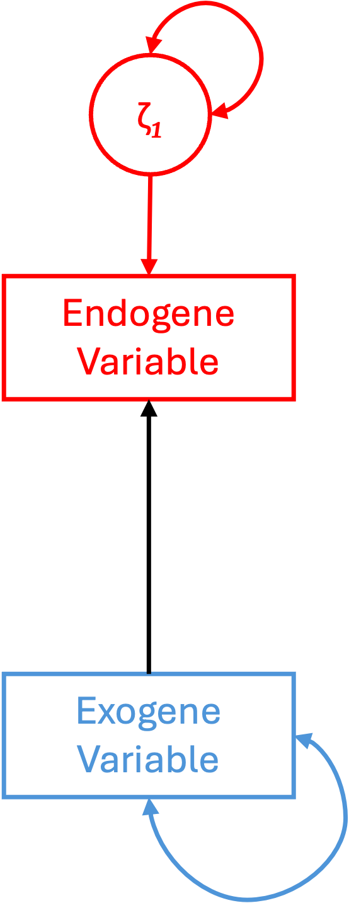
```
]
]

---
class: top, left
### Multivariate (latente) Modellierung

#### Manifeste vs. latente Variablen

<small>

.pull-left[

1. **.red[Manifeste Variable:]**
Variable, die direkt beobachtbar ist.

  * z.B. einzelne Fragebogenitems
  
  * „Physische“ Merkmale von Personen (Gewicht, Größe, etc.)
  
  * Sonstige beobachtbare Indikatoren wie Krankheitstage, Anzahl der Freunde, Bildung)

2. **.blue[Latente Variable:]**
Variable, die nicht direkt beobachtbar ist.

  * Psychologische Konstrukte wie Intelligenz oder Persönlichkeit
  
  * Nur indirekt beobachtbar, durch die Messung einer manifesten Variable (die auf Ausprägung der latenten Variable zurückzuführen ist)

]

.pull-right[
.center[
```{r eval = TRUE, echo = F, out.width = "150px"}
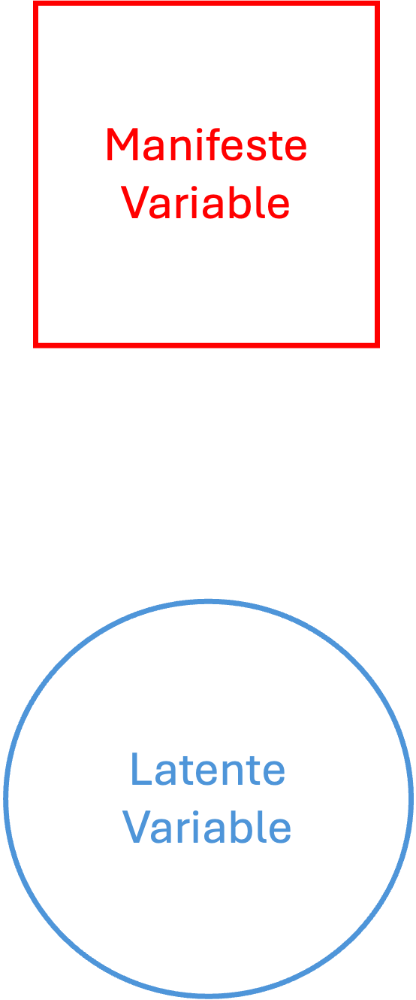
```
]
]

---
class: top, left
### Multivariate (latente) Modellierung

#### Gerichtete vs. ungerichtete Zusammenhänge

1. Gerichteter Zusammenhang:

  - Grafische Darstellung: einfacher Pfeil ( $\rightarrow$ )

  - Statistik: Regressionsgewicht (synonym: Ladung, Gewicht/Weight, Pfad)

2. Ungerichteter Zusammenhang:

  - Grafische Darstellung: Doppelpfeil ( $\leftrightarrow$ )

  - Statistik: Kovarianz/Korrelation

Vorsicht! 

* Ein gerichteter Zusammenhang muss theoretisch/inhatlich begründet sein

* Das erfordert Vorwissen

---
class: top, left
### Multivariate (latente) Modellierung

#### Darstellung und Bezeichnungen im SEM

<small>

.full-width[.content-box-gray[
$\Box$ beobachtete, so genannte manifeste Variable  

$\bigcirc$ latente Variable/Fehlervariable  

$\leftrightarrow$ Kovarianz oder Korrelation  

$\leftarrow$ semipartielles Regressionsgewicht oder Ladung ( $\lambda$, Lambda) für Items $\beta$ für manifeste und $\gamma$ (Gamma) für latente Variablen  

$\varepsilon$ Fehlervariable einer manifesten Variablen (Epsilon)  

$\zeta$ Fehlervariable einer latenten abhängigen Variablen (Zeta)  

$\xi$ latente unabhängige Variable (Ksi), von der ein Pfeil ausgeht und auf die kein Pfeil zeigt  

$\eta$ latente abhängige Variable (Eta), auf die ein Pfeil zeigt  

$X$ Indikatoren der latenten Variablen  

]
]

---
class: top, left
### Multivariate (latente) Modellierung

#### Univariate und Multivariate Modelle - Übersicht

.center[
```{r eval = TRUE, echo = F, out.width = "900px"}
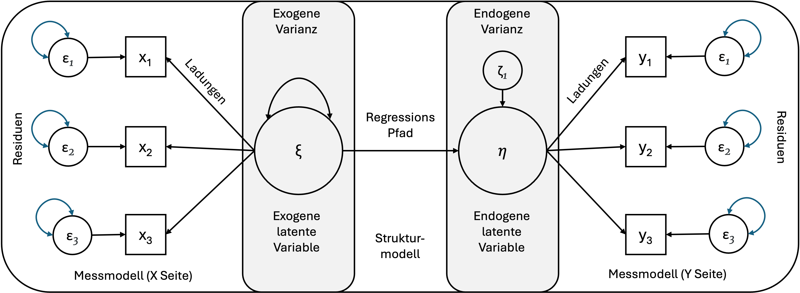
```
]

---
class: top, left
### Multivariate (latente) Modellierung

#### Messmodell vs. Strukturmodell

1. Messmodell: 

  * beschreibt die Verknüpfung zwischen einer latenten Variable und ihren Indikatoren bzw. manifesten Variablen

  * spezifiziert die Operationalisierung des Konstrukts

2. Strukturmodell: 

  * beschreibt die Verknüpfung zwischen latenten Variablen, oder zwischen latenten Variablen und manifesten Variablen, welche nicht als Indikatoren für latente Variablen verwendet werden

  * Regression zwischen mehreren latenten Variablen

---
class: top, left
### Multivariate (latente) Modellierung

#### Univariate und Multivariate Modelle - Übersicht

.center[
```{r eval = TRUE, echo = F, out.width = "850px"}
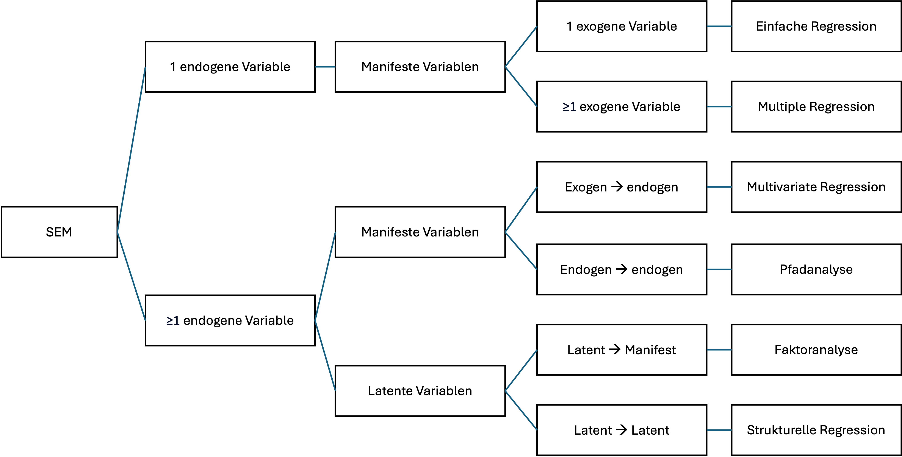
```
]

---
class: top, left
### Multivariate (latente) Modellierung

#### Einfache Regression

<small>

.center[
```{r eval = TRUE, echo = F, out.width = "600px"}
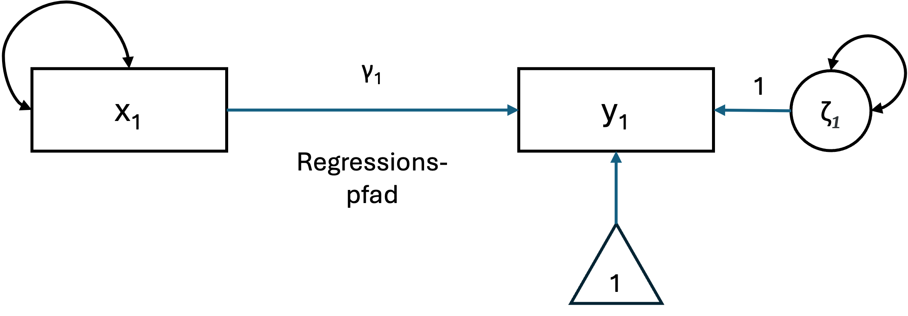
```
]

* Das einfache Regressionsmodell beschreibt die Beziehung zwischen einer beobachteten exogenen Variable und einer beobachteten endogenen Variable. 

* Für eine einzelne Person wird die einfache lineare Regressionsgleichung üblicherweise definiert als:

$$
y_1 = b_0 + b_1 x_1 + \varepsilon_1
$$

wobei $b_0$ der Achsenabschnitt (Intercept) ist, $b_1$ der Regressionskoeffizient, $x_1$ eine beobachtete Prädiktorvariable und $\varepsilon_1$ der Residuenwert. 

---
class: top, left
### Multivariate (latente) Modellierung

#### Einfache Regression

<small>

.pull-left[
.center[
```{r eval = TRUE, echo = F, out.width = "600px"}

```
]

In der multivariaten Statistik wird für dasselbe Modell oft eine spezielle Notation verwendet:

$$
y_1 = \alpha + \gamma x_1 + \zeta_1
$$
]

.pull-right[

Definitionen

- $x_1$: Einzelne exogene Variable  

- $y_1$: Einzelne endogene Variable  

- $b_0, \alpha$: Achsenabschnitt (Intercept) von $y_1$, genannt „Alpha“  

- $b_1, \gamma$: Regressionskoeffizient, genannt „Gamma“  

- $\varepsilon, \zeta_1$: Residuen von $y_1$, genannt „Epsilon“ und „Zeta“  


]

---
class: top, left
### Multivariate (latente) Modellierung

#### Multiple Regression

<small>

.center[
```{r eval = TRUE, echo = F, out.width = "600px"}
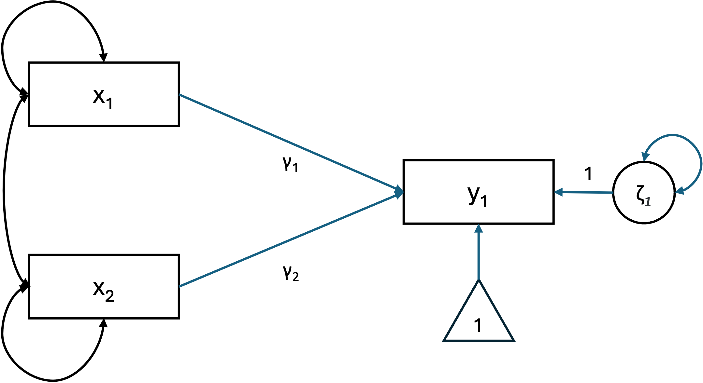
```
]

* Die einfache Regression ist auf eine einzelne exogene Variable beschränkt. 

* Bei einem endogenen Outcome, aber zwei exogene Prädiktoren liegt eine multiple Regression vor:

$$
y_1 = b_0 + b_1 x_1 + b_2 x_2 + \varepsilon_1
$$

---
class: top, left
### Multivariate (latente) Modellierung

#### Multiple Regression

<small>

.pull-left[

.center[
```{r eval = TRUE, echo = F, out.width = "600px"}

```
]


* Die Matrixnotation ermöglicht es uns, die Gleichung für alle Beobachtungen kompakt darzustellen:

$$
y_1 = \alpha_1 + \mathbf{X}\gamma + \zeta_1
$$

]

.pull-right[
Definitionen

- $y_1$: Einzelne endogene Variable  

- $\alpha_1$: Achsenabschnitt (Intercept) für $y_1$  

- $\mathbf{X}$: Vektor $(1 \times q)$ der exogenen Variablen  

- $\gamma$: Vektor $(q \times 1)$ der Regressionskoeffizienten, wobei $q$ die Gesamtanzahl der exogenen Variablen ist  

- $\zeta_1$: Residuum von $y_1$, gesprochen „Zeta“  

Annahmen

- $E(\zeta) = 0$: Der Mittelwert der Residuen ist null  

- $\zeta$ ist unkorreliert mit $\mathbf{X}$  

]

---
class: top, left
### Multivariate (latente) Modellierung

#### Multivariate Regression

<small>

.center[
```{r eval = TRUE, echo = F, out.width = "600px"}
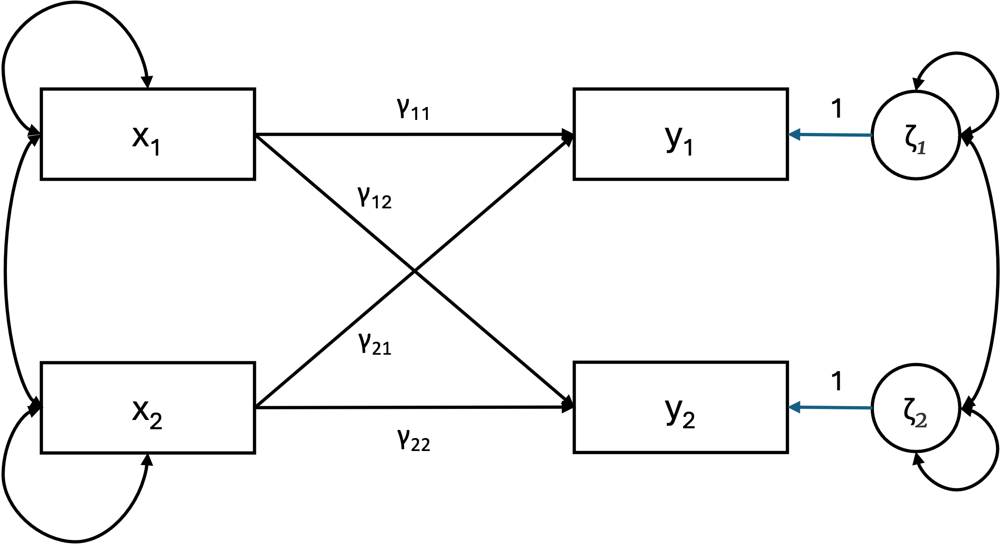
```
]

* Einfache und multiple Regressionsmodelle betrachten jeweils ein Outcome ( $y$ ) zur gleichen Zeit. 

* In der multivariaten Regression werden mehrere Outcomes ( $y_1, y_2, \dots, y_k$ ) gleichzeitig modelliert. 

---
class: top, left
### Multivariate (latente) Modellierung

#### Multivariate Regression

<small>

.center[
```{r eval = TRUE, echo = F, out.width = "600px"}

```
]


System von Regressionsgleichungen

$$y_1 = \gamma_{11} x_1 + \gamma_{12} x_1 + \zeta_1$$
$$y_2 = \gamma_{21} x_1 + \gamma_{22} x_2 + \zeta_2$$


---
class: top, left
### Multivariate (latente) Modellierung

#### Multivariate Regression

<small>

.pull-left[
.center[
```{r eval = TRUE, echo = F, out.width = "600px"}

```
]

Das allgemeine multivariate lineare Modell wird definiert als:
$$
\mathbf{y} = \alpha + \Gamma \mathbf{x} + \zeta
$$
]
.pull-right[

Um die Matrixnotation klarer zu veranschaulichen, betrachten wir zwei (bivariate) endogene Variablen ( $y_1, y_2$), die durch zwei exogene Prädiktoren ( $x_1, x_2$) vorhergesagt werden:

$$
\begin{pmatrix}
y_1 \\
y_2
\end{pmatrix}
=
\begin{pmatrix}
\alpha_1 \\
\alpha_2
\end{pmatrix}
+
\begin{pmatrix}
\gamma_{11} & \gamma_{12} \\
\gamma_{21} & \gamma_{22}
\end{pmatrix}
\begin{pmatrix}
x_1 \\
x_2
\end{pmatrix}
+
\begin{pmatrix}
\zeta_1 \\
\zeta_2
\end{pmatrix}
$$
Definitionen:

- $\mathbf{y} = (y_1, \dots, y_p)'$: Vektor der $p$ endogenen Variablen (nicht die Anzahl der Beobachtungen!)  
- $\mathbf{x} = (x_1, \dots, x_q)'$: Vektor der $q$ exogenen Variablen  
- $\alpha$: Vektor der $p$ Achsenabschnitte (Intercepts)  
- $\Gamma$: Matrix der Regressionskoeffizienten ( $p \times q$), wobei die $i$-te Zeile die endogene Variable und die $j$-te Spalte die exogene Variable beschreibt  
- $\zeta = (\zeta_1, \dots, \zeta_p)'$: Vektor der $p$ Residuen (für die Anzahl der endogenen Variablen, nicht der Beobachtungen)  
]


---
class: top, left
### Multivariate (latente) Modellierung

#### Pfadanalyse

<small>

.center[
```{r eval = TRUE, echo = F, out.width = "600px"}
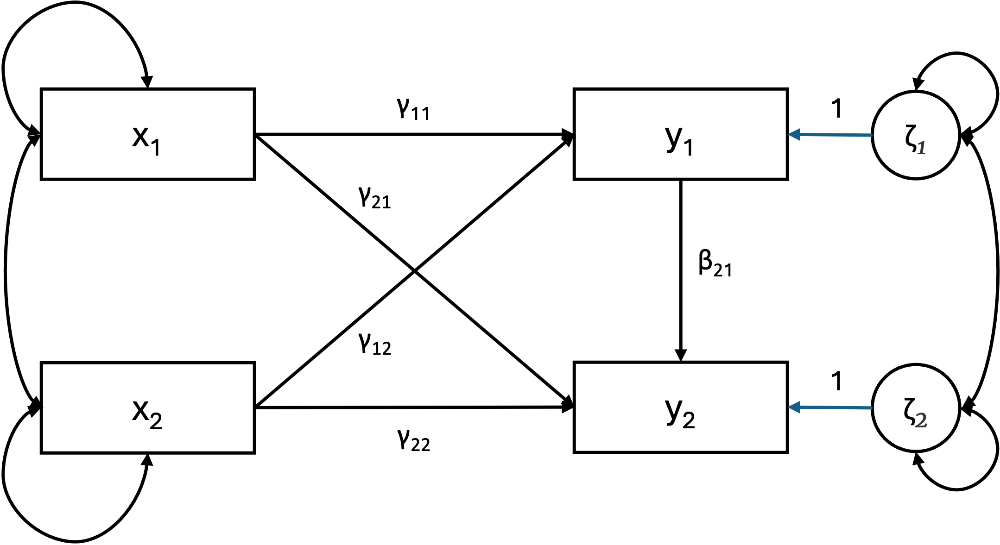
```
]

* Die multivariate Regression ist ein Sonderfall der Pfadanalyse, bei der ausschließlich exogene Variablen endogene Variablen vorhersagen. 

* Die Pfadanalyse ist ein allgemeineres Modell, in dem alle Variablen weiterhin manifest sind, jedoch endogene Variablen auch andere endogene Variablen erklären dürfen. 

---
class: top, left
### Multivariate (latente) Modellierung

#### Pfadanalyse

<small>

.center[
```{r eval = TRUE, echo = F, out.width = "600px"}

```
]

System von Regressionsgleichungen

$$y_1 = \gamma_{11} x_1 + \gamma_{12} x_1 + \zeta_1$$
$$y_2 = \gamma_{21} x_1 + \gamma_{22} x_2 + \beta_{21} y1 + \zeta_2$$


---
class: top, left
### Multivariate (latente) Modellierung

#### Pfadanalyse

<small>

.pull-left[

.center[
```{r eval = TRUE, echo = F, out.width = "600px"}

```
]

Matrixnotation:

$$
\mathbf{y} = \alpha + \Gamma \mathbf{x} + B \mathbf{y} + \zeta
$$
]

.pull-right[
<small>

Matrixnotation:

$$
\begin{pmatrix}
y_1 \\
y_2
\end{pmatrix}
=
\begin{pmatrix}
\alpha_1 \\
\alpha_2
\end{pmatrix}
+
\begin{pmatrix}
\gamma_{11} & \gamma_{12} \\
0 & \gamma_{22}
\end{pmatrix}
\begin{pmatrix}
x_1 \\
x_2
\end{pmatrix}
+
\begin{pmatrix}
0 & 0 \\
\beta_{21} & 0
\end{pmatrix}
\begin{pmatrix}
y_1 \\
y_2
\end{pmatrix}
+
\begin{pmatrix}
\zeta_1 \\
\zeta_2
\end{pmatrix}
$$

Definitionen:

- $\mathbf{y} = (y_1, \dots, y_p)'$: Vektor der $p$ endogenen Variablen  
- $\mathbf{x} = (x_1, \dots, x_q)'$: Vektor der $q$ exogenen Variablen  
- $\alpha$: Vektor der $p$ Achsenabschnitte (Intercepts)  
- $\Gamma$: Matrix der Regressionskoeffizienten ( $p \times q$) von exogenen zu endogenen Variablen, wobei die $i$-te Zeile die endogene Variable und die $j$-te Spalte die exogene Variable beschreibt  
- $B$: Matrix der Regressionskoeffizienten ( $p \times p$) von endogenen zu endogenen Variablen, wobei die $i$-te Zeile die Zielvariable und die $j$-te Spalte die Quelle beschreibt  
- $\zeta = (\zeta_1, \dots, \zeta_p)'$: Vektor der Residuen  

Annahmen:

- $E(\zeta) = 0$: Der Mittelwert der Residuen ist null  
- $\zeta$ ist unkorreliert mit $\mathbf{x}$  
- $(I - B)$ ist invertierbar (zum Beispiel $B \neq I$)  
]


---
class: top, left
### Multivariate (latente) Modellierung

#### Konfirmatorische Faktorenanalyse

.center[
```{r eval = TRUE, echo = F, out.width = "400px"}
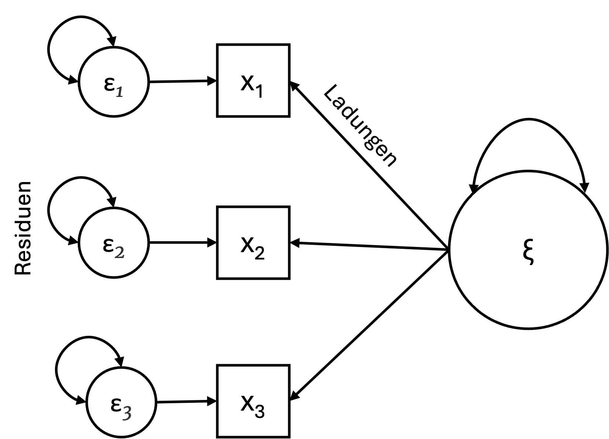
```
]

* Eine CFA ist im Wesentlichen ein multivariates Regressionsmodell, bei dem der Prädiktor eine exogene oder endogene latente Variable (Faktor) ist.

---
class: top, left
### Multivariate (latente) Modellierung

#### Konfirmatorische Faktorenanalyse

<small>

.pull-left[
.center[
```{r eval = TRUE, echo = F, out.width = "400px"}

```
]

$$
\mathbf{x} = \tau_x + \Lambda_x \xi + \\varepsilon
$$

]

.pull-right[


Definitionen:

- $\mathbf{x} = (x_1, \dots, x_q)'$: Vektor der Indikatoren auf der x-Seite  

- $\tau_x$: Vektor der $q$ Achsenabschnitte (Intercepts) für die Indikatoren auf der x-Seite  

- $\xi$: Vektor der $n$ latenten exogenen Variablen  

- $\varepsilon = (\varepsilon_1, \dots, \varepsilon_q)'$: Vektor der Residuen für die Indikatoren auf der x-Seite  

- $\Lambda_x$: Matrix der Ladungen ($q \times n$), die den latenten exogenen Variablen entsprechen  
]

---
class: top, left
### Multivariate (latente) Modellierung

#### Konfirmatorische Faktorenanalyse

<small>

.pull-left[
.center[
```{r eval = TRUE, echo = F, out.width = "400px"}

```
]

$$
\mathbf{x} = \tau_x + \Lambda_x \xi + \varepsilon
$$

]

.pull-right[

Matrixnotation:

$$
\Sigma(\theta) = 
\begin{pmatrix}
\lambda_1^x \\
\lambda_2^x \\
\lambda_3^x
\end{pmatrix}
\begin{pmatrix}
\lambda_1^x & \lambda_2^x & \lambda_3^x
\end{pmatrix}
+
\begin{pmatrix}
\theta_{11}^\varepsilon & 0 & 0 \\
0 & \theta_{22}^\varepsilon & 0 \\
0 & 0 & \theta_{33}^\varepsilon
\end{pmatrix}
$$
- $\theta_\varepsilon$: Varianz oder Kovarianz der Residuen für die Indikatoren auf der x-Seite  
]

---
class: top, left
### Multivariate (latente) Modellierung

####  Konfirmatorische Faktorenanalyse

**Exploratorische vs. Konfirmatorische Faktorenanalyse**

1. Exploratorischen Faktorenanalyse (EFA)

  * Bei der EFA wird für jedes Item auf jedem Faktor eine Ladung zugelassen und geschätzt.

  * „Nebenladungen“ sind erlaubt

2. Konfirmatorische Faktorenanalyse (CFA)

  * Bei der CFA werden nur theoretisch begründete Ladungen geschätzt

  * Ladungen des manifesten Indikators auf den latenten Faktor werden "forciert"

---
class: top, left
### Multivariate (latente) Modellierung

####  Konfirmatorische Faktorenanalyse

**Exploratorische vs. Konfirmatorische Faktorenanalyse**

.center[
```{r eval = TRUE, echo = F, out.width = "900px"}
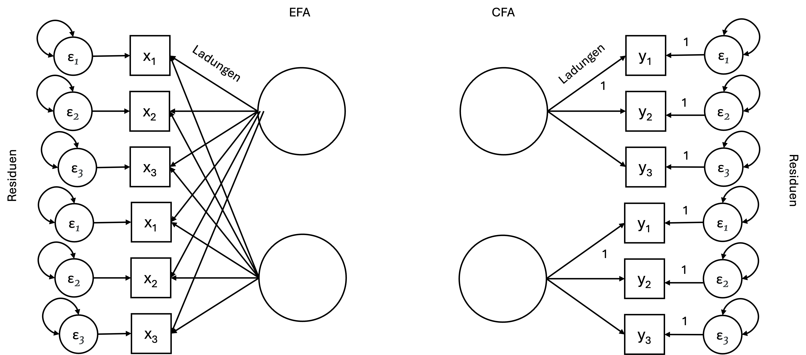
```
]

---
class: top, left
### Multivariate (latente) Modellierung

#### Strukturelle Regression (volles Strukturgleichungsmodell)

.center[
```{r eval = TRUE, echo = F, out.width = "900px"}
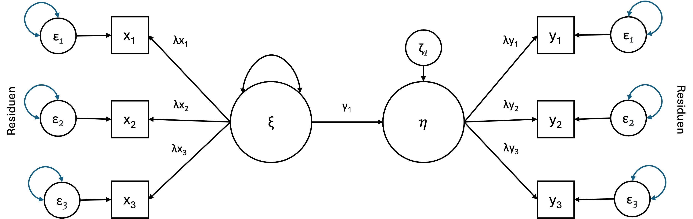
```
]

* Strukturelle Regression vereint Mess- und Strukturmodelle, um latente Variablen – sowohl endogene als auch exogene – als erklärende Variablen zu berücksichtigen.


---
class: top, left
### Multivariate (latente) Modellierung

#### Strukturelle Regression (volles Strukturgleichungsmodell)

<small>

.pull-left[

.center[
```{r eval = TRUE, echo = F, out.width = "900px"}

```
]

Matrixnotation:

$$
\mathbf{x} = \tau_x + \Lambda_x \xi + \varepsilon
$$

$$
\mathbf{y} = \tau_y + \Lambda_y \eta + \varepsilon
$$

$$
\eta = \alpha + B \eta + \Gamma \xi + \zeta
$$

]

.pull-right[
Definitionen:

Messmodell:

- $\mathbf{x} = (x_1, \dots, x_q)'$: Vektor der Indikatoren auf der x-Seite  

- $\mathbf{y} = (y_1, \dots, y_p)'$: Vektor der Indikatoren auf der y-Seite  

- $\tau_x$: Vektor der $q$ Achsenabschnitte (Intercepts) für die Indikatoren auf der x-Seite  

- $\tau_y$: Vektor der $p$ Achsenabschnitte (Intercepts) für die Indikatoren auf der y-Seite  

- $\xi$: Vektor der $n$ latenten exogenen Variablen  

- $\eta$: Vektor der $m$ latenten endogenen Variablen  
]

---
class: top, left
### Multivariate (latente) Modellierung

#### Strukturelle Regression (volles Strukturgleichungsmodell)

<small>

.pull-left[

.center[
```{r eval = TRUE, echo = F, out.width = "900px"}

```
]

Matrixnotation:

$$
\mathbf{x} = \tau_x + \Lambda_x \xi + \varepsilon
$$

$$
\mathbf{y} = \tau_y + \Lambda_y \eta + \varepsilon
$$

$$
\eta = \alpha + B \eta + \Gamma \xi + \zeta
$$

]

.pull-right[
Definitionen:

<small>

Strukturmodell

- $\alpha$: Vektor der $m$ Achsenabschnitte (Intercepts)  

- $\Gamma$: Matrix der Regressionskoeffizienten  von latenten exogenen zu latenten endogenen Variablen, wobei die $i$-te Zeile die latente endogene Variable und die $j$-te Spalte die latente exogene Variable beschreibt  

- $B$: Matrix der Regressionskoeffizienten von latenten endogenen zu latenten endogenen Variablen, wobei die $i$-te Zeile die Zielvariable und die $j$-te Spalte die Ursprungsvariable beschreibt  

- $\zeta = (\zeta_1, \dots, \zeta_m)'$: Vektor der Residuen für die latenten endogenen Variablen  

Annahmen

- $\eta$ und $\xi$ werden nicht beobachtet  
- $\varepsilon$ sind Messfehler für $\mathbf{y}$ und $\mathbf{x}$ entsprechend  
- $\varepsilon$ sind unkorreliert 
]

---
class: top, left
### Multivariate (latente) Modellierung

#### Strukturelle Regression (volles Strukturgleichungsmodell)

**Spezifikation des vollständigen strukturellen Regressionsmodells:**

* Um ein vollständiges strukturelles Regressionsmodell zu spezifizieren, ist es sinnvoll, mit dem Messmodell zu beginnen 

* Anschließend zu definieren, wie die latenten Variablen miteinander in Beziehung stehen (das Strukturmodell). 

* Damit latente exogene Variablen latente endogene Variablen erklären können, müssen zwei separate Messmodelle aufgestellt werden.

---
class: top, left
### Multivariate (latente) Modellierung

#### Strukturelle Regression (volles Strukturgleichungsmodell)

**Messmodell für latente exogene Variable:**

* Zunächst spezifizieren wir das Messmodell für latente exogene Variablen mit sechs Indikatoren. 

* Die ersten drei Indikatoren ( $x_1, x_2, x_3$) werden durch $\xi_1$ gemessen

$$
\begin{pmatrix}
x_1 \\
x_2 \\
x_3
\end{pmatrix}
=
\begin{pmatrix}
\tau_{x1} \\
\tau_{x2} \\
\tau_{x3}
\end{pmatrix}
+
\begin{pmatrix}
\lambda_{11}^x & \lambda_{12}^x \\
\lambda_{21}^x & \lambda_{22}^x \\
\lambda_{31}^x & \lambda_{32}^x 
\end{pmatrix}
\begin{pmatrix}
\xi_1
\end{pmatrix}
+
\begin{pmatrix}
\varepsilon_1 \\
\varepsilon_2 \\
\varepsilon_3
\end{pmatrix}
$$
---
class: top, left
### Multivariate (latente) Modellierung

#### Strukturelle Regression (volles Strukturgleichungsmodell)

**Messmodell für latente endogene Variable:**

* Nachdem das exogene Messmodell definiert wurde, gehen wir zum Messmodell für endogene Variablen über. 

* Die drei Indikatoren ( $y_1, y_2, y_3$) werden durch einen Faktor $\eta_1$ gemessen:

$$
\begin{pmatrix}
y_1 \\
y_2 \\
y_3
\end{pmatrix}
=
\begin{pmatrix}
\tau_{y1} \\
\tau_{y2} \\
\tau_{y3}
\end{pmatrix}
+
\begin{pmatrix}
\lambda_{11}^y \\
\lambda_{21}^y \\
\lambda_{31}^y
\end{pmatrix}
\eta_1
+
\begin{pmatrix}
\varepsilon_1 \\
\varepsilon_2 \\
\varepsilon_3
\end{pmatrix}
$$

---
class: top, left
### Multivariate (latente) Modellierung

#### Strukturelle Regression (volles Strukturgleichungsmodell)

**Strukturmodell:**

* Analog zum Strukturmodell in der multivariaten Regression und Pfadanalyse, das Beziehungen zwischen **beobachteten** Variablen beschreibt, spezifiziert die strukturelle Regression die Beziehung zwischen **latenten** Variablen. 

* Im Modell  haben wir eine latente exogene Variablen ( $\xi_1$), die eine latente endogene Variable ( $\eta_1$) vorhersagt:

$$\eta_1 = \alpha_1 + \gamma_{11} \xi_1 + \zeta_1$$

---
class: top, left
### Multivariate (latente) Modellierung

#### Strukturgleichungsmodell (SEM)

**Eigenschaften eines Strukturgleichungsmodells**

* engl. Structural euqation model (SEM)

* Ein Strukturgleichungsmodell dient als formale Darstellung einer Theorie oder eines Modells.

**Ziele der Analyse von Strukturgleichungsmodellen:**

*	Schätzung unbekannter Parameter, wie z. B. Pfade, Varianzen und Kovarianzen.

* Prüfung der zugrunde liegenden Theorie auf ihre Gültigkeit (Modellpassung).

* Vergleich konkurrierender Modelle

* Multivariate Hypothesen prüfen (z.B. Mediation)


---
class: top, left
### Multivariate (latente) Modellierung

#### Metrik latenter Variablen

*	Manifeste Variablen besitzen eine Einheit, die durch das jeweilige Messinstrument vorgegeben ist (z.B. Meter, richtig gelöste Aufgaben...). 

*	Latente Variablen hingegen werden nicht direkt gemessen und besitzen daher keine festgelegte Einheit. 

*	Ein Unterschied von 1 bei einer latenten Variable hat demnach keine klar definierte Bedeutung.

*	Die Varianz einer Variable ist immer an ihre Einheit gekoppelt. Fehlt die Einheit – wie bei latenten Variablen – ist nicht eindeutig bestimmbar, wie groß die Varianz sein sollte.


$\rightarrow$ Jede latente Variable braucht eine Metrik.

$\rightarrow$ Diese muss von uns festgelegt werden

---
class: top, left
### Multivariate (latente) Modellierung

#### Metrik latenter Variablen

Zwei unterschiedliche Lösungsmöglichkeiten, um Metrik zu definieren:

1. Wir definieren, dass wir bei einem Unterschied von 1 in der latenten Variable auch einen Unterschied von 1 in einer bestimmten manifesten Variable erwarten.

  * Metrik der latenten Variable wird durch Metrik eines Indikators definiert.

  * Unit Loading Identification (ULI)

2. Wir definieren, dass die Varianz der latenten Variable einen bestimmten Wert erhält (z.B. 1).

  * Fixierung der Varianz auf festen Wert $\rightarrow$ damit ist sie definiert

  * Unit Variance Identification (UVI)

---
class: top, left
### Multivariate (latente) Modellierung

#### Metrik latenter Variablen

<small>

.pull-left[

**Unit Loading Identification (ULI)**

* Ladung von $x_1$ (oder eines anderen Indikators) auf die latenten Variable ξ wird 1 gesetzt (ULI).

* In `R` wird standardmäßig der 1. Indikator gewäblt.

* Variable, deren Ladung auf 1 fixiert wird, wird Referenzvariable genannt (Normierung)

* Vorschläge zur Auswahl der Referenzvariable:

* bester Indikator (höchstes Regressionsgewicht)

* höchste Reliabilität bei Messung des Indikators

* inhaltlich wichtigste Indikatorvariable

]

.pull-right[
.center[
```{r eval = TRUE, echo = F, out.width = "400px"}
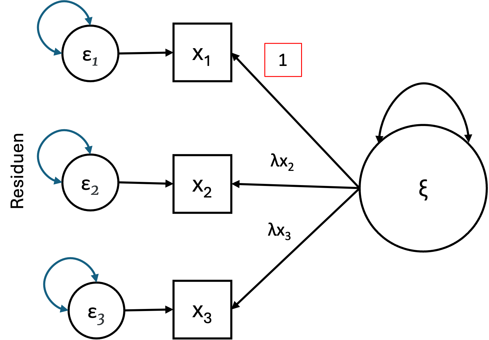
```
]
]

---
class: top, left
### Multivariate (latente) Modellierung

#### Metrik latenter Variablen

<small>

.pull-left[

**Unit Variance Identification (UVI)**

* Varianz der latenten Variablen auf 1 fixieren

* Vorteil: Alle Ladungen werden frei geschätzt und können auf Signifikanz geprüft werden

* Nachteil: Varianz kann nicht mehr auf Signifikanz geprüft werden

* Latente Variable ist dann standardisiert und wird in z-Einheiten angegeben (MW = 0, SD = 1)

]

.pull-right[
.center[
```{r eval = TRUE, echo = F, out.width = "400px"}
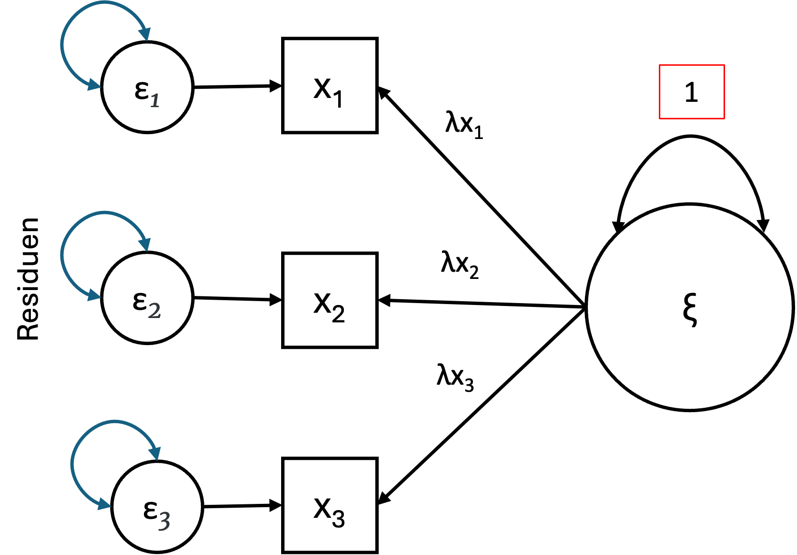
```
]
]

---
class: top, left
### Multivariate (latente) Modellierung

#### Metrik von Fehlern

.pull-left[

* Residuen sind latente Variablen ➙ Schätzung notwendig!

* Es muss ebenfalls eine Metrik zugewiesen werden

* Bei Fehlertermen wird stets ULI verwendet  

* Residuen haben die selbe Metrik wie die vorhergesagte Variable.

]

.pull-right[
.center[
```{r eval = TRUE, echo = F, out.width = "400px"}
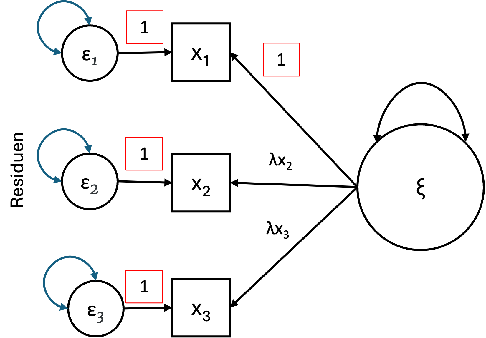
```
]
]

---
class: top, left
### Multivariate (latente) Modellierung

#### Strukturgleichungsmodell

**Zusammenfassung - Vorteile des SEM**

<small>

*	Berücksichtigung von Messfehlern durch Messmodell.

*	Analyse komplexer Beziehungen: SEM ermöglicht die Untersuchung komplexer Zusammenhänge, einschließlich indirekter Effekte und Mediationen.

*	Latente Variablen: Konstrukte analysieren, die nicht direkt beobachtbar sind.

*	Theorietests: SEM erlaubt die Überprüfung theoretischer Modelle gegen die empirischen Daten.

*	Gleichzeitige Schätzung mehrerer Beziehungen: Mehrere Abhängigkeiten und Pfade können in einem einzigen Modell geschätzt werden.

*	Modellvergleich: SEM bietet Werkzeuge zur Bewertung und zum Vergleich alternativer Modelle (z. B. über Fit-Indizes).

*	Anwendung bei verschiedenen Datentypen: SEM kann mit unterschiedlichen Datentypen wie metrischen, ordinalen oder dichotomen Variablen umgehen.

*	Grafische Darstellung: SEM ermöglicht eine intuitive und visuell verständliche Darstellung von theoretischen Modellen.

---
class: top, left
### Multivariate (latente) Modellierung

#### Strukturgleichungsmodelle in R - `lavaan`

* Strukturgleichungsmodelle werden in R mit dem Paket `lavaan` berechnet

* Installation:

```{r eval=FALSE}
install.packages("lavaan")
library(lavaan)
```

* In `lavaan` werden die Modelle mit einer spezielle Modellsyntax geschrieben (s.h. nächste Folie)

* Das definierte Modell wird dann mit einer Modellfunktion wie `cfa()` oder `sem()` berechnet

* Das Aufstellen des Modells erfolgt als character Vektor

---
class: top, left
### Multivariate (latente) Modellierung

#### Strukturgleichungsmodelle in R - `lavaan`

<small>

* In `lavaan` hat eine **Regressionsformel** die folgende Form:

```{r eval=FALSE}
y ~ x1 + x2 + x3 + x4
```

* In dieser Formel ist die Tilde (~) der Regressionsoperator. 

* Auf der linken Seite des Operators steht die abhängige Variable (y)

* Auf der  rechten Seite die unabhängigen Variablen, getrennt durch den +- Operator, aufgeführt sind.
***
* Ein typisches (multivariates) Modell besteht aus einem  System von Regressionsformeln

* Dabei können einige Variablen (beginnend mit einem „f“ wie Faktor im Beispiel unten) latent sein. Zum Beispiel:

```{r eval=FALSE}
y ~ f1 + f2 + x1 + x2

f1 ~ f2 + f3

f2 ~ f3 + x1 + x2
```

---
class: top, left
### Multivariate (latente) Modellierung

#### Strukturgleichungsmodelle in R - `lavaan`

* Wenn latente Variablen in einer der Regressionsformeln vorkommen, müssen diese definiert werden

* Sie werden definiert, indem ihre (manifesten oder latenten) Indikatoren angegeben werden. 

* Dies geschieht mit dem speziellen Operator =~, der gelesen werden kann als „wird gemessen durch“. 

* Zum Beispiel können wir die drei latenten Variablen f1, f2 und f3 wie folgt definieren:

```{r eval=FALSE}
f1 =~ y1 + y2 + y3 

f2 =~ y4 + y5 + y6 

f3 =~ y7 + y8 + y9 + y10
```

---
class: top, left
### Multivariate (latente) Modellierung

#### Strukturgleichungsmodelle in R - `lavaan`

* Varianzen und Kovarianzen mit dem Operator ~~ (doppelte Tilde) spezifiziert. Zum Beispiel:

```{r eval=FALSE}
y1 ~~ y1  # Varianz

y1 ~~ y2  # Kovarianz

f1 ~~ f2  # Kovarianz
```

***

* Achsenabschnitte (Intercepts) für beobachtete und latente Variablen werden durch einfache Regressionsformeln angegeben 

* Dabei wird nur ein Achsenabschnitt (explizit durch die Zahl 1 dargestellt) als Prädiktor aufgeführt:

```{r eval=FALSE}
y1 ~ 1

f1 ~ 1
```

---
class: top, left
### Multivariate (latente) Modellierung

.pull-left[

#### Strukturgleichungsmodelle in R - CFA Beispiel

<small>
* Das Modell (rechts) stellt die CFA für einen Kognitionstest dar (Holzinger & Swineford, 1939).

*	Ein visueller Faktor, gemessen durch die 3 Variablen: $x_1$, $x_2$ und $x_3$.

*	Ein textueller Faktor, gemessen durch die 3 Variablen: $x_4$, $x_5$ und $x_6$.

*	Ein Geschwindigkeitsfaktor, gemessen durch die 3 Variablen: $x_7$, $x_8$ und $x_9$.

***

Modell in `lavaan`:

.code90[
```{r eval=FALSE}
model <- 'visual  =~ x1 + x2 + x3 
          textual =~ x4 + x5 + x6
          speed   =~ x7 + x8 + x9'

fit <- cfa(model, data = HolzingerSwineford1939)
```
]
]

.pull-right[
.center[
```{r eval = TRUE, echo = F, out.width = "300px"}
knitr::include_graphics("bilder/holzinger.png")
```
]
]

---
class: top, left
### Multivariate (latente) Modellierung

<small> <small>

.pull-left[

#### Strukturgleichungsmodelle in R - CFA Beispiel


.center[
```{r eval = TRUE, echo = F, out.width = "280px"}
knitr::include_graphics("bilder/holzinger.png")
```
]

]

.pull-right[
.code80[
```{r eval=FALSE}
parameterEstimates(fit)
```
]
.center[
```{r eval = TRUE, echo = F, out.width = "300px"}
knitr::include_graphics("bilder/holzinger2.png")
```
]
]

---
class: top, left
### Multivariate (latente) Modellierung

#### lavaan Syntax

<small>

.full-width[.content-box-gray[

Am häufigsten verwendeten Syntaxelemente in `lavaan`:

- $\sim$ Vorhersage, wird für die Regression eines beobachteten Outcomes auf beobachtete Prädiktoren verwendet (z. B. $y \sim x$).  

- $= \sim$ Indikator, wird für die Zuordnung einer latenten Variablen zu beobachteten Indikatoren in Messmodellen der Faktorenanalyse verwendet (z. B. $f = \sim q + r + s$).  

- $\sim\sim$ Kovarianz (z. B. $x \sim\sim x$).  

- $\sim 1$ Intercept oder Mittelwert (z. B. $x \sim 1$ schätzt den Mittelwert der Variablen $x$).  

- $1\ast$ Fixiert einen Parameter oder eine Ladung auf den Wert 1 (z. B. $f = \sim 1\ast q$).  

- $NA\ast$ Lässt einen Parameter oder eine Ladung frei (nützlich, um die Standard-Marker-Methode zu überschreiben, z. B. $f = \sim NA\ast q$).  

- $a\ast$ Vergibt ein Label für den Parameter „a“, das für Modellrestriktionen verwendet werden kann (z. B. $f = \sim a\ast q$).  

]
]


---
class: top, left
### Take-aways

.full-width[.content-box-gray[

* SEM erlauben multivariate Modelle mit Messfehlerkorrektur - diese werden multideterministischen Theorien in der PSychologie oft eher gerecht als einfache Regressionsmodelle.

* Grundkonzepte von SEM:
  * manifeste vs. latente Variable
  * endogene vs. exogene Variablen
  * gerichtete vs. ungerichtete Zusammenhänge
  
* Messmodell vs. Strukturmodell

* Parameter: Frei geschätzt oder fixiert?

* Metrik von latenten Variablen festlegen
  – Unit Loading Identification (ein Pfad wird auf 1 fixiert)
  – Unit Variance Identification (eine Varianz wird auf 1 fixiert)
]

]


