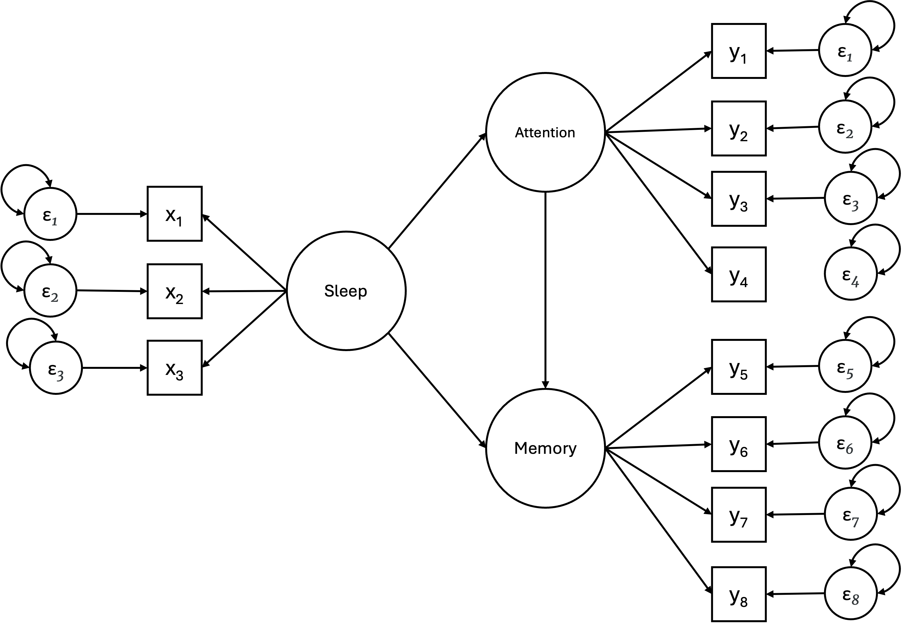

```{r setup, include=FALSE}
options(htmltools.dir.version = FALSE)

library(tidyverse)
library(kableExtra)
library(ggplot2)
library(plotly)
library(htmlwidgets)
library(MASS)
library(ggpubr)
library(xaringanthemer)
library(xaringanExtra)
library(lavaan)

style_duo_accent(
  primary_color = "#621C37",
  secondary_color = "#EE0071",
  background_image = "blank.png"
)

xaringanExtra::use_xaringan_extra(c("tile_view"))

use_scribble(
  pen_color = "#EE0071",
  pen_size = 4
  )

knitr::opts_chunk$set(
  fig.retina = TRUE,
  warning = FALSE,
  message = FALSE
)

source(file = "base_functions.R")
```

name: Title slide
class: middle, left
<br><br><br><br><br><br><br>
# Multivariate Verfahren
***
### Einheit 8: Multivariate (latente) Modellierung (2)
##### Wintersemester 2025 | Prof. Dr. Stephan Goerigk

---
class: top, left
### Multivariate (latente) Modellierung

.pull-left[

#### Strukturgleichungsmodelle in R - CFA Beispiel

<small>
* Das Modell (rechts) stellt die CFA für einen Kognitionstest dar (Holzinger & Swineford, 1939).

*	Ein visueller Faktor, gemessen durch die 3 Variablen: $x_1$, $x_2$ und $x_3$.

*	Ein textueller Faktor, gemessen durch die 3 Variablen: $x_4$, $x_5$ und $x_6$.

*	Ein Geschwindigkeitsfaktor, gemessen durch die 3 Variablen: $x_7$, $x_8$ und $x_9$.

***

Modell in `lavaan`:

```{r include=FALSE}
model <- 'visual  =~ x1 + x2 + x3 
          textual =~ x4 + x5 + x6
          speed   =~ x7 + x8 + x9'

fit <- cfa(model, data = HolzingerSwineford1939)
```

.code90[
```{r eval=FALSE}
model <- 'visual  =~ x1 + x2 + x3 
          textual =~ x4 + x5 + x6
          speed   =~ x7 + x8 + x9'

fit <- cfa(model, data = HolzingerSwineford1939)
```
]
]

.pull-right[
.center[
```{r eval = TRUE, echo = F, out.width = "300px"}

```
]
]

---
class: top, left
### Multivariate (latente) Modellierung

<small> <small>

.pull-left[

#### Strukturgleichungsmodelle in R - CFA Beispiel

.center[
```{r eval = TRUE, echo = F, out.width = "340px"}

```
]

]

.pull-right[
.code80[
```{r eval=FALSE}
parameterEstimates(fit)
```
]
.center[
```{r eval = TRUE, echo = F, out.width = "300px"}

```
]
]

---
class: top, left
### Multivariate (latente) Modellierung

<small> <small>

.pull-left[

#### Strukturgleichungsmodelle in R - CFA Beispiel

Die Ausgabe besteht aus drei Teilen. Die ersten neun Zeilen werden als Header bezeichnet. Der Header enthält die folgenden Informationen:

*	die verwendete lavaan-Version

*	ob die Optimierung normal beendet wurde oder nicht und wie viele Iterationen dafür benötigt wurden

*	den Schätzer, der verwendet wurde (hier: ML, für Maximum-Likelihood)

*	den Optimizer, der verwendet wurde, um die am besten passenden Parameterwerte für diesen Schätzer zu finden (hier: NLMINB)

*	die Anzahl der Modellparameter (hier: `r fitMeasures(fit)["npar"]`)

*	die Anzahl der Beobachtungen, die effektiv in der Analyse verwendet wurden (hier: `r nobs(fit)`)

*	einen Abschnitt namens Model Test User Model, der einen Teststatistik-Wert, Freiheitsgrade und einen p-Wert für das vom Nutzer spezifizierte Modell bereitstellt.
]

.pull-right[
.code80[
```{r}
fit
```
]

]


---
class: top, left
### Multivariate (latente) Modellierung

<small> <small>

.pull-left[

#### Strukturgleichungsmodelle in R - CFA Beispiel

Anschließend werden alle freien (und festen) Parameter, die im Modell enthalten sind, tabellarisch dargestellt. Typischerweise werden zunächst die latenten Variablen angezeigt, gefolgt von Kovarianzen und (residualen) Varianzen.

*	Die erste Spalte `(Estimate)` enthält den (geschätzten oder festgelegten) Parameterwert für jeden Modellparameter.

*	Die zweite Spalte `(Std.err)` zeigt den Standardfehler für jeden geschätzten Parameter.

*	Die dritte Spalte `(Z-value)` enthält die Wald-Statistik (die einfach durch Division des Parameterwerts durch seinen Standardfehler berechnet wird).

*	Die letzte Spalte `(P(>|z|))` enthält den p-Wert, um die Nullhypothese zu testen, dass der Parameterwert in der Population gleich null ist.
]

.pull-right[
.code80[
```{r eval=FALSE}
parameterEstimates(fit)
```
]
.center[
```{r eval = TRUE, echo = F, out.width = "300px"}

```
]
]

---
class: top, left
### Multivariate (latente) Modellierung

<small> <small>

.pull-left[

#### Strukturgleichungsmodelle in R - CFA Beispiel

Abschnitt `Variances`: 

* Vor den Namen der beobachteten Variablen steht ein Punkt. 

  * Dies liegt daran, dass es sich um abhängige (oder endogene) Variablen handelt, die von den latenten Variablen vorhergesagt werden. 
  
  * Der in der Ausgabe angezeigte Wert für die Varianz ist daher eine Schätzung der Residualvarianz, also der übrig gebliebenen Varianz, die nicht durch die Prädiktor(en) erklärt wird.

* Dagegen steht kein Punkt vor den Namen der latenten Variablen, da sie in diesem Modell exogene Variablen sind (es zeigen keine einseitigen Pfeile auf sie). 

* Die angezeigten Werte für die Varianzen stellen hier die geschätzten Gesamtvarianzen der latenten Variablen dar.
]

.pull-right[
.code80[
```{r eval=FALSE}
parameterEstimates(fit)
```
]
.center[
```{r eval = TRUE, echo = F, out.width = "300px"}

```
]
]

---
class: top, left
### Multivariate (latente) Modellierung

#### Modellpassung und Fit indices

.center[
```{r eval = TRUE, echo = F, out.width = "800px"}

```
]

---
class: top, left
### Multivariate (latente) Modellierung

#### Modellpassung und Fit indices

<small>

`lavaan` liefert eine Vielzahl von Statistiken zur Modellpassung. Wir konzentrieren uns jedoch auf die 5 gängigsten:

*	Modell-Chi-Quadrat: Dies ist die Chi-Quadrat-Statistik, die aus der Maximum-Likelihood-Schätzung gewonnen wird (in `lavaan` als Test Statistic for the Model Test User Model bezeichnet).
	
*	CFI (Comparative Fit Index): Werte liegen zwischen 0 und 1. Werte > 0.90 (konservativ: 0.95) deuten auf eine gute Modellanpassung hin.

*	TLI (Tucker-Lewis-Index): Auch dieser liegt zwischen 0 und 1. Werte > 1 werden auf 1 gerundet. Werte über 0.90 weisen auf eine gute Modellanpassung hin. Wenn CFI und TLI beide unter 1 liegen, ist der CFI stets größer als der TLI.

* SRMR (Standardized-Root-Mean-Residual)

*	RMSEA (Root Mean Square Error of Approximation):

  *	In lavaan wird zusätzlich ein p-Wert für die „Close Fit“-Hypothese angegeben, der testet, ob RMSEA < 0.05 ist.
	
	*	Wird das Modell abgelehnt, bedeutet dies, dass Ihr Modell keine „nahe“ Anpassung an die Daten zeigt.

$\rightarrow$ Diese Fit-Maße gehören zu den wichtigsten Indikatoren für die Bewertung von Strukturgleichungsmodellen.

---
class: top, left
### Multivariate (latente) Modellierung

.pull-left[
#### Modellpassung und Fit indices

* In `lavaan` können Maße zur Modellpassung angezeigt werden

* Dafür setzen wir im `summary()` Befehl, `fit.measures = TRUE` ein.

* Die wichtigsten Indizes sind standardmäßig enthalten

* Für zusätzliche Maße kann `fitmeasures(fit)` genutzt werden
]

.pull-right[
```{r eval=FALSE}
summary(fit, fit.measures = TRUE)
```

.center[
```{r eval = TRUE, echo = F, out.width = "280px"}
knitr::include_graphics("bilder/Holzinger_fitmeasures.png")
```
]
]

---
class: top, left
### Multivariate (latente) Modellierung

#### Modellpassung und Fit indices

<small>

** $\chi^2$-Test**

Das Modell-Chi-Quadrat wird definiert als entweder $N F_{ML}$ oder $(N - 1) F_{ML}$ (je nach statistischem Paket)

$$
(N - 1) F_{ML}[S, \Sigma(\hat{\theta})] \sim \chi^2(df) \quad \text{mit } df = p - q
$$

* $p$: Anzahl bekannter Parameter  
* $q$: Anzahl zu schätzender Parameter  
* $N$: Anzahl der Versuchspersonen  
* $F_{ML}$ ist die Fit-Funktion aus der Maximum-Likelihood-Methode ist, die zur Schätzung der Parameter im Modell verwendet wird.


Das Hypothesenpaar des $\chi^2$-Tests lautet_

* **H₀**: $\Sigma = S$  
* **H₁**: $\Sigma \neq S$  

* Unter **H₀** ist dieser Wert $\chi^2$-verteilt mit $df = p - q$.  

---
class: top, left
### Multivariate (latente) Modellierung

#### Modellpassung und Fit indices

** $\chi^2$-Test**

* Je größer der $\chi^2$-Wert, desto größer ist der Unterschied zwischen der durch das Modell implizierten Kovarianzmatrix und der beobachteten Kovarianzmatrix. 

* Ergibt der Signifikanztest für diesen $\chi^2$-Wert ein $p < 0.05$, wird die **H₀** abgelehnt.  

  * Das bedeutet, die modell-implizierte Kovarianzmatrix weicht signifikant von der empirischen Kovarianzmatrix ab.  

* Wird der Test **nicht signifikant**, spricht dies für einen guten Modellfit.  

  * Dadurch steigt die Wahrscheinlichkeit, dass das Modell abgelehnt wird.

---
class: top, left
### Multivariate (latente) Modellierung

#### Modellpassung und Fit indices

** $\chi^2$-Test und Stichprobengröße/Power**

* Test ist sehr abhängig von der Stichprobengröße

* Große Stichproben:

  * In der Literatur ist gut dokumentiert, dass der $\chi^2$-Test in der Modellprüfung bei großen Stichproben überempfindlich reagiert. 

  * Für Modelle mit 75 bis 200 Fällen ein vernünftiges Maß für die Modellanpassung

  * Bei 400 oder mehr Fällen fällt er nahezu immer signifikant aus (Kenny, 2003).

* Kleine Stichproben: 

  * Auch große Abweichungen von einem perfekten Modell führen nicht zwangsläufig zur Ablehnung des Modells (underpowered).

---
class: top, left
### Multivariate (latente) Modellierung

#### Modellpassung und Fit indices

<small>

** $\chi^2$-Test und Stichprobengröße/Power**

* Der $\chi^2$-Test ist empfindlich gegenüber großen Stichprobenumfängen, aber bedeutet das, dass wir uns auf kleine Stichproben beschränken sollten? 

  * Nein – größere Stichproben sind vorzuziehen. 

  * SEM sind für große Stichproben ausgelegt - Theorie basiert auf der Annahme, dass die Stichprobe so groß wie möglich ist.

Benötigte Stichprobengröße im SEM:

* Die $n:q$ Regel- (Kline, 2016)

  * Stichprobengröße sollte von der Anzahl der Parameter in Ihrem Modell abhängen
  
  * empfohlenes Verhältnis von 20:1  
  
  * Das bedeutet, dass bei 10 Parametern die Stichprobengröße mindestens $n = 200$ betragen sollte. 
  
  * Laut Kline ist eine Stichprobe von weniger als 100 Fällen nahezu immer unzureichend.

---
class: top, left
### Multivariate (latente) Modellierung

#### Modellpassung und Fit indices

**Exakter vs. approximativer Modellfit**

Historisch war der $\chi^2$-Test die einzige Methode zur Prüfung der Modellanpassung. 

* In der Praxis wurde die $H_0$ aufgrund der Empfindlichkeit des $\chi^2$-Tests häufig abgelehnt

* Daher wurden approximative Fit-Indizes entwickelt $\rightarrow$ basieren nicht auf Verwerfung der $H_0$  

* Diese approximativen Fit-Indizes lassen sich weiter unterteilen in:

  * Absolute Fit-Indizes 
  
  * Relative Fit-Indizes (aka inkrementelle Fit-Indizes)

---
class: top, left
### Multivariate (latente) Modellierung

#### Modellpassung und Fit indices

**Approximative Fit-Indizes**

* Relative Fit-Indizes (z.B. CFI, TLI)

  * Vergleichen Abweichung des genutzten Modells vom schlechtest passenden Modell (auch Baseline-Modell genannt) vs. Abweichung des saturierten Modells (auch bestes passendes Modell) vom Nullmodell. 
  
  * Nullmodell = alle Variablen unkorreliert (außer den Fehlertermen keine latenten Variablen und keine Zusammenhänge zwischen den Variablen)
  
  * Verhältnis sollte 1 betragen, wenn die Abweichung des genutzten Modells der Abweichung des saturierten Modells entspricht.
  
  * Je größer jedoch die Diskrepanz zwischen den Abweichungen ist, desto näher liegt das Verhältnis bei 0

* Absolute Fit-Indizes (z.B. RSMEA, SRMR)

  * Vergleichen genutztes Modell mit den beobachteten Daten.

---
class: top, left
### Multivariate (latente) Modellierung

#### Modellpassung und Fit indices

**Relative Fit-Indizes - CFI (Comparative Fit Index)**

* CFI vergleicht genutztes Modells mit restriktiveren Nullmodell

$$
CFI = 1 - \frac{\chi^2_M - df_M}{\chi^2_N - df_N}
$$
  * $\chi^2_M:$ Teststatistik des genutzten Modells
  * $\chi^2_N:$ Teststatistik des Nullmodells

* Der Wertebereich liegt zwischen 0 und 1 (1 = optimaler Fit)

* Vorteil: weniger sensitiv gegenüber der Stichprobengröße $(N)$

---
class: top, left
### Multivariate (latente) Modellierung

.pull-left[

#### Modellpassung und Fit indices

**Relative Fit-Indizes - CFI (Comparative Fit Index)**

* Berechnung des CFI im Beispiel:

$$
CFI = 1 - \frac{\chi^2_M - df_M}{\chi^2_N - df_N}
$$
$$
CFI = 1 - \frac{85.306 - 24}{918.852 - 36} = 0.931
$$

* Typische Empfehlung: 

  * CFI sollte > 0.95 sein  (Hu & Bentler, 1998)
]

.pull-right[
.center[
```{r eval = TRUE, echo = F, out.width = "280px"}
knitr::include_graphics("bilder/Holzinger_fitmeasures.png")
```
]
]

---
class: top, left
### Multivariate (latente) Modellierung

#### Modellpassung und Fit indices

**Relative Fit-Indizes - TLI (Tucker Lewis Index)**

* TLI wird häufig zusammen mit dem CFI ausgegeben

* TLI nutzt relatives $\chi^2$ (weniger empfindlich gegenüber der Stichprobengröße)

* Ein perfekt angepasstes Modell ergibt einen TLI, der genau 1 beträgt.

* Da der TLI und der CFI hoch korreliert sind, sollte nur einer der beiden berichtet werden.
$$
TLI = \frac{\frac{\chi^2_{N}}{df_N} - \frac{\chi^2_M}{df_M}}{\frac{\chi^2_N}{df_N} - 1}
$$


---
class: top, left
### Multivariate (latente) Modellierung

#### Modellpassung und Fit indices

**Absolute Fit-Indizes - RMSEA (Root-Mean-Square-Error of Approximation)**


$$
RMSEA = \sqrt{\frac{\chi^2 - df}{N \cdot df}}
$$
* RMSEA berücksichtigt sowohl Stichprobegröße als auch Modellkomplexität
  * Je komplexer ein Modell, desto weniger Freiheitsgrade
  * Nenner wird kleiner $\rightarrow$ RMSEA wird größer

* Wertebereich zwischen 0 und 1 (optimaler Wert = 0)

* Nachteil: sensibel gegenüber fehlspezifizierten Ladungen und Pfaden.

---
class: top, left
### Multivariate (latente) Modellierung

.pull-left[

#### Modellpassung und Fit indices

**Absolute Fit-Indizes - RMSEA (Root-Mean-Square-Error of Approximation)**

* Berechnung des RMSEA im Beispiel:

$$
RMSEA = \sqrt{\frac{\chi^2 - df}{N \cdot df}}
$$
$$
RMSEA = \sqrt{\frac{85.306 - 24}{301 \cdot 24}} = 0.092
$$

* Typische Empfehlung (Hu & Bentler, 1998):  
  * RMSEA $\leq 0.06$ bei $N > 250$.  
  * RMSEA $\leq 0.08$ bei $N < 250$. 
]

.pull-right[
.center[
```{r eval = TRUE, echo = F, out.width = "280px"}
knitr::include_graphics("bilder/Holzinger_fitmeasures.png")
```
]
]

---
class: top, left
### Multivariate (latente) Modellierung

#### Modellpassung und Fit indices

**Absolute Fit-Indizes - SRMR (Standardized-Root-Mean-Residual)**

.pull-left[

$$SRMR = \sqrt{\sum_{j} \sum_{k<j}\frac{ r_{jk}^2}{e}}$$

$$r_{jk} = \frac{S_{jk}}{S_j \cdot S_k} - \frac{\hat{\sigma}_{jk}}{\hat{\sigma}_j \cdot \hat{\sigma}_k}$$
$$e = \frac{p \cdot (p+1)}{2}$$

]

.pull-right[

<small>

* Wertebereich  zwischen 0 und 1 (optimale Wert = 0)

* SRMR gibt durchschnittliche Abweichung der beobachteten $(S)$ von der modellimplizierten Korrelationsmatrix $(\Sigma)$ an.  

* Formel:
  - $p$: Anzahl der manifesten Variablen  
  - $S$: modellimplizierte SDs/Kovarianz  
  - $\sigma$: aus Stichprobe geschätzte SDs/Kovarianz 
  
*  SRMR berücksichtigt weder Modellkomplexität noch die Stichprobengröße
]

---
class: top, left
### Multivariate (latente) Modellierung

#### Modellpassung und Fit indices

**Zusammenfassung der Cutoff-Empfehlungen:**

* Cutoff-Werte für ML- Schätzalgorithmus (Hu & Bentler, 1999)

  * RMSEA < 0.06 bei N>250; < 0.08 bei N ≤ 250

  * SRMR < 0.11

  * CFI > 0.95

* Kritik an Cut-Off Werten

  * Cutoffs in der Praxis oft nicht erreichtbar (Marsh, 2004)
  
  * Hu & Bentler Empfehlungen in Daten mit sehr hohen Ladungen demonstriert


---
class: top, left
### Multivariate (latente) Modellierung

#### Modellpassung und Fit indices

**Voraussetzungen für Modelltests**

* Linearität

* Keine (Multi-) Kollinearität

  * mehrere Items korrelieren sehr hoch miteinander (Daumenregel: $r > .85$ problematisch)

* Ausreichende Stichprobengröße

* Angemessene Anzahl von Indikatoren pro latenter Variable

  * Daumenregel: mindestens vier Items pro latenter Variable
  
  * Mehr Items pro Faktor führen zu besseren Schätzungen (Marsh, Hau, Balla & Grayson, 1998)

* Zutreffen angenommener Verteilungen

---
class: top, left
### Multivariate (latente) Modellierung

.pull-left[

#### Signifikanztest für einzelne Modellparameter

* Einzelne Modellparameter: z.B. Ladungen, Regressionen, Kovarianzen

* `lavaan` gibt Hypothesentest für Einzelparameter aus

  * $H_0:$ Parameter = 0
  * $H_1:$ Parameter $\neq$ 0

* Teststatistik ist ein z-verteilter **critical ratio** (ähnlich Wald-Test bei Regression):

$$
C.R. = \frac{Estimate}{SE}
$$
* Wenn `P(>|z|)` < .05 wird $H_0$ verworfen.
]

.pull-right[
.center[
```{r eval = TRUE, echo = F, out.width = "300px"}

```
]
]

---
class: top, left
### Multivariate (latente) Modellierung

#### Fit Funktionen in `lavaan`

* `lavaan` unterstützt folgende Funktionen um ein Modell auf die Daten anzupassen:

  * `cfa()` $\rightarrow$ Konfirmatorische Faktorenanalysen
  
  * `sem()` $\rightarrow$ Strukturgleichungsmodelle
  
  * `growth()` $\rightarrow$ latente Wachstuskurvenmodelle (Modelle mit Messwiederholungen)

* Benutzerfreundliche Funktionen, die viele Details automatisch übernehmen

* Um automatische Durchführung bestimmter Schritte zu vermeiden, kann Low-Level-Funktion lavaan() verwendet werdeb, die volle Kontrolle ermöglicht.

---
class: top, left
### Multivariate (latente) Modellierung

#### Strukturgleichungsmodelle in R - SEM Beispiel

```{r echo = F}
df = PoliticalDemocracy
```

<small>

* Multivariate Zusammenhänge zwischen Schlafdauer, Aufmerksamkeit und Gedächtnisleistung.
* Aufmerksamkeit gleichzeitig endogen (wird erklärt durch Schlafdauer) und exogen (erklärt Gedächtnisleistung).

.center[
```{r eval = TRUE, echo = F, out.width = "600px"}

```
]

---
class: top, left
### Multivariate (latente) Modellierung

#### Strukturgleichungsmodelle in R - SEM Beispiel

```{r echo = F}
df = PoliticalDemocracy
```

<small>

* Multivariate Zusammenhänge zwischen Schlafdauer, Aufmerksamkeit und Gedächtnisleistung.
* Aufmerksamkeit gleichzeitig endogen (wird erklärt durch Schlafdauer) und exogen (erklärt Gedächtnisleistung).

.pull-left[

Aufstellen des Modells in `lavaan`:

```{r eval=FALSE}
model <- '
  # measurement model
    sleep =~ x1 + x2 + x3
    attention =~ y1 + y2 + y3 + y4
    memory =~ y5 + y6 + y7 + y8
    
  # regressions
    attention ~ sleep
    memory ~ sleep + attention
'

fit <- sem(model, data = df)
```
]

.pull-right[
In diesem Beispiel verwenden wir 2 Formeltypen: 

* Definitionen latenter Variablen (mit dem Operator =~) 
  
* Regressionsformeln (mit dem Operator ~).

]

---
class: top, left
### Multivariate (latente) Modellierung

#### Strukturgleichungsmodelle in R - SEM Beispiel

```{r eval=FALSE}
summary(fit, standardized = TRUE)
```

.center[
```{r eval = TRUE, echo = F, out.width = "500px"}

```
]

---
class: top, left
### Multivariate (latente) Modellierung

#### Strukturgleichungsmodelle in R - SEM Beispiel

**Zahlen im Output standardisieren**

* Das Argument `standardized = TRUE` innerhalb der `summary()` Funktion erweitert den Output um standardisierte Parameterwerte. 

* Es werden zwei zusätzliche Spalten mit standardisierten Parameterwerten angezeigt:

	*	In der ersten Spalte (beschriftet mit `Std.lv`) werden nur die latenten Variablen standardisiert.
	
	*	In der zweiten Spalte (beschriftet mit `Std.all`) werden sowohl die latenten als auch die beobachteten Variablen standardisiert.

* Letztere wird oft als „vollständig standardisierte Lösung“ bezeichnet.

---
class: top, left
### Multivariate (latente) Modellierung

#### Strukturgleichungsmodelle in R 

**Fixieren von Modellparametern**

* Standardmäßig fixiert lavaan die Faktorladung des ersten Indikators immer auf 1 

* Die anderen Parameter sind frei und ihre Werte werden vom Modell geschätzt.

* Es gibt jedoch inhaltliche Gründe Parameter in Modellen zu fixieren

* Zur Fixierung muss die entsprechende Variable in der Formel mit einem festen Wert multipliziert werden.

Folgende Formel fixiert z.B. alle Ladungen auf 1:

```{r eval=TRUE}
Faktor =~ x1 + 1*x2 + 1*x3 + 1*x4
```

---
class: top, left
### Multivariate (latente) Modellierung

#### Strukturgleichungsmodelle in R 

<small>

**Fixieren von Modellparametern**

* Modellparameter können mit 0 fixiert werden, um voreingestellte Berechnungen zu ignorieren

* Beispiel: In einem CFA-Modell wird standardmäßig angenommen, dass alle exogenen latenten Variablen korreliert sind

* Wenn Sie jedoch die Korrelation zwischen einem Paar latenter Variablen auf Null festlegt werden soll, muss dies in der Modellsyntax berücksichtigt werden.

* Folgender Code würde annehmen, dass es zwischen den Faktoren visual/textual und speed keine Korrelation gibt (diese orthogonal sind), aber zwischen visual und textual schon:

```{r eval=FALSE}
model = '
  visual =~ x1 + x2 + x3
  textual =~ x4 + x5 + x6
  speed   =~ x7 + x8 + x9
  
  visual ~~ 0*speed
  textual ~~ 0*speed
'
```

---
class: top, left
### Multivariate (latente) Modellierung

#### Strukturgleichungsmodelle in R 

**Fixieren von Modellparametern - Equality contraints**

* Equality contraints zwingen einzelne Paramter in einem Modell "gleich zu sein"

* Dies macht Sinn, wenn die Hypothese gleicher Ladungen oder gleicher Effekte zwischen Gruppen getestet werden soll

* Dies wird erreicht, indem für die jeweiligen Variablen ein identischer Multiplikator genutzt wird

* Folgendes Modell nimmt z.B. identische Ladungen für `x2` und `x3` an:
```{r eval=FALSE}
model = '
visual  =~ x1 + a*x2 + a*x3
textual =~ x4 + x5 + x6
speed   =~ x7 + x8 + x9
'
```

---
class: top, left
### Multivariate (latente) Modellierung

#### Modellvergleiche

* Modellvergleiche können für geschachtelte Modelle geprüft werden

* Geschachtelt = ein Modell konzeptuell im anderen enthalten (einfaches vs. komplexes Modell)

* Modelle, in denen Parameter fixiert werden sind "einfacher", da weniger freie Werte geschätzt werden müssen

.center[
```{r eval = TRUE, echo = F, out.width = "700px"}

```
]

---
class: top, left
### Multivariate (latente) Modellierung

#### Modellvergleiche

* Geschachtelte Modelle können mittels **χ²-likelihood-ratio-test** verglichen werden.  

* Teststatistik des Modellvergleichs: $\Delta \chi^2 = \chi^2_{\text{einfach}} - \chi^2_{\text{komplex}}$
* Freiheitsgrade des Modellvergleichs: $\Delta df = df_{\text{einfach}} - df_{\text{komplex}}$

* Einfacheres Modell hat immer einen schlechteren Modellfit als ein komplexeres Modell. (Zu prüfen: Ist es signifikant schlechter?)

Interpretation:

* Signifikanter Modellvergleich: Das einfachere Modell ist signifikant schlechter ist als das komplexe Modell $\rightarrow$ komplexes Modell wählen.  
  
* Nicht signifikanter Modellvergleich: Das einfachere Modell ist nicht signifikant schlechter ist als das komplexe Modell $\rightarrow$ einfaches Modell wählen.  

---
class: top, left
### Multivariate (latente) Modellierung

#### Modellvergleiche

* Beispiel: 2 Modelle werden angepasst

  * komplexes Modell: alle Parameter frei schätzen (außer die der ersten Indikatoren)
  
  * einfaches Modell: Ladungen für `x2` und `x3` sind fixiert.
  
```{r}
komplex = '
visual  =~ x1 + x2 + x3
textual =~ x4 + x5 + x6
speed   =~ x7 + x8 + x9
'

einfach = '
visual  =~ x1 + 1*x2 + 1*x3
textual =~ x4 + x5 + x6
speed   =~ x7 + x8 + x9
'
```

---
class: top, left
### Multivariate (latente) Modellierung

#### Modellvergleiche

```{r}
fiteinfach = cfa(einfach, data = HolzingerSwineford1939)
fitkomplex = cfa(komplex, data = HolzingerSwineford1939)

anova(fiteinfach, fitkomplex)
```

* Komplexes Modell hat zwei freie Parameter mehr als das einfache Model / Einfaches Modell hat zwei zu schätzende Parameter weniger

* Modellvergleich ist signifikant $\rightarrow$ komplexes Modell hat signifikant bessere Modellpassung

---
class: top, left
### Multivariate (latente) Modellierung

#### Modellvergleiche

* Sind Modelle nicht geschachtelt, können keine direkten Modellvergleiche gerechnet werden.

* Modellpassung muss anhand relativen Modellfits verglichen werden

* Hierfür wird oft das Akaike Information Criterion herangezogen (AIC)

* AIC-Interpretation: Das Modell mit dem kleineren AIC Wert ist zu bevorzugen.

```{r}
anova(fiteinfach, fitkomplex) # Angenommen Modelle wären nicht geschachtelt
```

---
class: top, left
### Multivariate (latente) Modellierung

#### Kategoriale Daten

* Folgende Variablenarten werden als kategorial (nicht kontinuierlich) betrachtet:

  * Binäre Variablen
  * ordinale Variablen
  * nominale Variablen
  
* Wichtig: Es macht einen großen Unterschied, ob diese kategorialen Variablen im Modell exogen (unabhängig) oder endogen (abhängig) sind.

  * Exogene kategoriale Variablen sind relativ unproblematisch zu modellieren

  * Endogene kategoriale Variablen sind herausfordernder in der Modellierung

---
class: top, left
### Multivariate (latente) Modellierung

#### Kategoriale Daten

**Exogene kategoriale Variablen**

*	Binäre exogene Variable (z.B. Geschlecht)

  * Muss als Dummy-Variable (0/1) codiert werden, genauso wie in einem klassischen Regressionsmodell.
	
*	 Exogenen ordinale Variable 

  * Es kann ein Codierungsschema verwendet werden, das die Reihenfolge widerspiegelt (z. B. 1, 2, 3, …)
  
  * Variable kann wie jede andere numerische Variable behandelt werden.

*	nominale exogene Variable mit  $K > 2$  Kategorien

  * muss durch ein Set von  $K-1$  Dummy-Variablen ersetzt werden

---
class: top, left
### Multivariate (latente) Modellierung

#### Kategoriale Daten

<small>

**Endogene kategoriale Variablen**

* `lavaan` kann derzeit mit binären und ordinalen (aber nicht nominalen) endogenen Variablen umgehen

* Dafür müssen kategoriale Variablen als `ordered` definiert werden

* Das ordered-Argument kann beim Fitting des Modells (cfa/sem/growth/lavaan) verwendet werden.

* Wenn Sie z.B. 3 binäre/ordinale Variablen haben (z. B. item1, item2, item3):

```{r eval=FALSE}
fit <- cfa(model, data = df, ordered = c("item1","item2", "item3"))
```

* Wenn alle (endogenen) Variablen als kategorial behandelt werden sollen, kann pauschal `ordered = TRUE` verwendet werdeb.

```{r eval=FALSE}
fit <- cfa(model, data = df, ordered = TRUE)
```

* Wenn das `ordered = TRUE` Argument verwendet wird, wechselt `lavaan` automatisch auf den `WLSMV` Schätzalgorithmus.

---
class: top, left
### Multivariate (latente) Modellierung

#### Fehlende Werte

* Wenn die Daten fehlende Werte enthalten, ist die Standardvorgehensweise die listwise deletion (Fallweises Löschen). 

* `lavaan` bietet die Möglichkeit der fallweisen Maximum-Likelihood-Schätzung (full information likelihood, FIML).

* Voraussetzung:  Werte fehlen MCAR (missing completely at random) oder MAR (missing at random) 

* FIML-Schätzung kann aktiviert werden, indem  das Argument `missing = "ML"` beim Aufruf der Anpassungsfunktion verwendet wird.

```{r eval=FALSE}
fit <- cfa(model, data = df, missing = "ML")
```

---
class: top, left
### Multivariate (latente) Modellierung

#### Robuste Standardfehler und Bootstrapping

**Robuste Standardfehler**

* Robuste Standardfehler können explizit mit dem Argument `se = "robust"` angefordert werden. 

* Ebenso können robuste Teststatistiken explizit mit `test = "robust"` angefordert werden. 

* Sinnvoll z.B. bei Verteilungsverletzungen o.ä.

**Bootstrapping**

* Es kann entweder `se = "bootstrap"` oder `test = "bootstrap"` beim Anpassen des Modells verwendet werden

* Dadurch werden Bootstrap-Standardfehler bzw. ein auf Bootstrap basierender p-Wert ausgegeben

* Sinnvoll bei nicht-normalverteilten Daten, kleinen Stichproben, komplexen Modellen oder unsicheren Modellannahmen

* Bootstrapping kann rechenintensiv sein, insbesondere bei großen Datensätzen

---
class: top, left
### Multivariate (latente) Modellierung

#### Vergleich implementierter Schätzmethoden

*	Maximum-Likelihood-Methode: Beantwortet die Frage, „Welche Parameter in der Population sind am wahrscheinlichsten, gegeben die beobachteten Daten?“
➙ liefert eine optimale Schätzung der Parameter der Population.

* GLS- und ULS-Methode: Minimieren die quadrierten Differenzen zwischen der beobachteten und der modellimplizierten Kovarianzmatrix.

*	ADF-Methode: Verwendet eine spezielle Kovarianzmatrix und basiert auf der Generalized Least Squares (GLS)-Schätzung.

  * benötigt große Stichproben (N > 3000 empfohlen) und ist nur bei wenig komplexen Modellen gut
  
  * Vorteil: macht keine Verteilungsannahmen

*	WLSMV-Methode: Beruht auf einer gewichteten Schätzung der kleinsten quadratischen Abweichungen und berücksichtigt dabei Anpassungen für das arithmetische Mittel und die Varianz.

  * Vorteil: ermöglicht eine robuste Schätzung von Modellen mit dichotomen Variablen


---
class: top, left
### Take-aways

.full-width[.content-box-gray[
* Die Güte der Modellpassung eines SEMs kann mittels Fit-Indizes angegeben werden.

* Fit-Indizes werden in exakte bzw. approximative Maße unterteilt - approximative Maße weiterhin in relative und absolute Maße unterteilt.

* Die Güte eines Indizes wird anhand gängiger Cutoffs bewertet, welche in der Literatur jedoch auch Kritik unterliegen.

* Mit fehlenden Werten kann in SEMs mittels FIML-Schätzung umgegangen werden.

* Konkurrierende Modelle können mittels geschachtelten Modelltests oder durch den Abgleich relativer Indizes des Modellfits (z.B. AIC) verglichen werden

* `lavaan` kann im Falle von Voraussetzungsverletzungen robuste Standardfehler berechnen und Bootstrapping durchführen.
]
]


