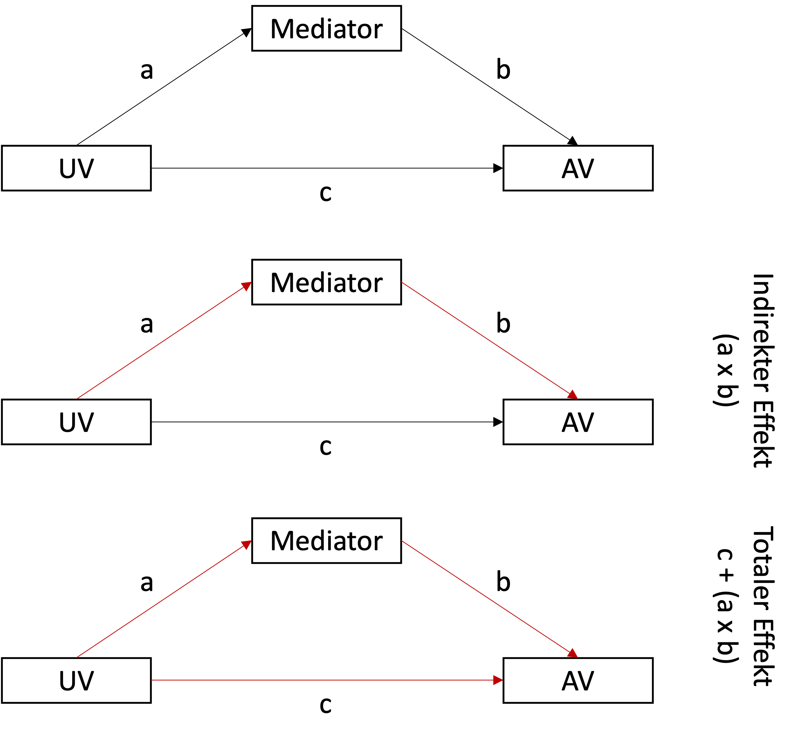

```{r setup, include=FALSE}
options(htmltools.dir.version = FALSE)

library(tidyverse)
library(kableExtra)
library(ggplot2)
library(plotly)
library(htmlwidgets)
library(MASS)
library(ggpubr)
library(xaringanthemer)
library(xaringanExtra)
library(lavaan)

style_duo_accent(
  primary_color = "#621C37",
  secondary_color = "#EE0071",
  background_image = "blank.png"
)

xaringanExtra::use_xaringan_extra(c("tile_view"))

use_scribble(
  pen_color = "#EE0071",
  pen_size = 4
)

knitr::opts_chunk$set(
  fig.retina = TRUE,
  warning = FALSE,
  message = FALSE
)

source(file = "base_functions.R")
```

name: Title slide
class: middle, left
<br><br><br><br><br><br><br>
# Multivariate Verfahren
***
### Einheit 9: Multivariate (latente) Modellierung (3)
##### Wintersemester 2025 | Prof. Dr. Stephan Goerigk

---
class: top, left
### Multivariate (latente) Modellierung

#### Spezielle Anwendungsbeispiele und Hypothesen mit SEMs

<small>

* **Mediation**
  * Direkte und indirekte Effekte: Identifikation von Pfaden, über die eine UV auf eine AV wirkt.  
  
  * Signifikanztest: Prüfung, ob der indirekte Effekt signifikant ist (z. B. Bootstrapping).  
  
  * Praktische Anwendungen: Verständnis von Mechanismen, z. B. wie Interventionen Verhaltensänderungen bewirken.

* **Latente Wachstumskurvenmodelle (vgl. LMM)**
  * Analyse von Veränderungen: Erfassung individueller Entwicklung über die Zeit.  
  
  * Schätzung von Wachstumsparametern: Mittlere Wachstumsrate und Variabilität in der Entwicklung.  
  
  * Vergleich zu LMM: Vorteile durch Berücksichtigung von Messfehlern bei latenten Variablen.

* **Messinvarianzprüfung**
  * Prüfung von Gruppenunterschieden: Überprüfung, ob ein Messmmodell in verschiedenen Gruppen gleich funktioniert. 
  
  * Hierarchische Tests: Vergleich von Modellen mit zunehmenden Restriktionen (konfigural, metrisch, skalär).  
  
  * Praktische Relevanz: Sicherstellung, dass Vergleiche zwischen Gruppen valide sind.


---
class: top, left
### Multivariate (latente) Modellierung

#### Mediation vs. Moderation (Pfadanalyse)

* Moderation und Mediation sind 2 unterschiedliche Konzepte (mit ähnlichen Namen)

* Gemeinsamkeiten:

  * Bei beiden Analysen geht es um ein besseres Verständnis des Zusammenhangs zwischen AV und UV

  * Es geht darum zu prüfen, inwieweit eine dritte Variable in diesen Zusammenhang passt.

* Unterschiede:

  * Moderation: Dritte Variable beeinflusst Stärke des Zusammenhangs zwischen AV und UV

  * Mediation: Dritte Variable vermittelt den Zusammenhang zwischen AV und UV

* Mediator = Bindeglied

* (Teil-)Grund für den Effekt der UV auf AV (Vorsicht Kausalitätsannahmen)

---
class: top, left
### Multivariate (latente) Modellierung

#### Mediation vs. Moderation (Pfadanalyse)

.pull-left[

**Moderation**

Schlafmitteldosis (**UV**) erhöht die Schlafdauer (**AV**); Straßenlärm (**Moderator**) verändert die Stärke des Effekts der Schlafmitteldosis (**UV**) auf die Schlafdauer (**AV**).

.center[
```{r eval = TRUE, echo = F, out.width = "500px"}
knitr::include_graphics("bilder/Moderation.png")
```
]
]

.pull-right[
**Mediation:**

Schulnote (**UV**) beeinflusst Selbstwertgefühl (**Mediator**); Selbstwertgefühl (**Mediator**) beeinflusst Lebenszufriedenheit **AV**

.center[
```{r eval = TRUE, echo = F, out.width = "500px"}
knitr::include_graphics("bilder/Mediation.png")
```
]
]

$\rightarrow$ Da bei Mediation sowohl AV als auch Mediator **endogene** Variablen sind, brauchen wir ein multivariates Modell

---
class: top, left
### Multivariate (latente) Modellierung

#### Mediation vs. Moderation (Pfadanalyse)

**Moderation**

Schlafmitteldosis (**UV**) erhöht die Schlafdauer (**AV**); Straßenlärm (**Moderator**) wirkt zusätzlich auf die **AV**

Statistische Prüfung der Moderationshypothese:

* **Interaktionseffekt**: AV ~ UV x Moderator (wie im Regressionsmodell)

* Frage: Variiert der Effekt von UV auf AV in Abhängigkeit einer weiteren Variable

.center[
```{r eval = TRUE, echo = F, out.width = "500px"}
knitr::include_graphics("bilder/Moderation.png")
```
]

---
class: top, left
### Multivariate (latente) Modellierung

#### Mediation vs. Moderation (Pfadanalyse)

<small>

**Mediation:**

Schulnote (**UV**) beeinflusst Selbstwertgefühl (**Mediator**); Selbstwertgefühl (**Mediator**) beeinflusst Lebenszufriedenheit **AV**

Statistische Prüfung der Mediationshypothese:

* **Mediator** vermittelt (**mediiert**) den Einfluss der **UV** auf die **AV**
* **Indirekter Effekt:**  **UV ** beeinflusst  **Mediator**, dies führt zur einem Effekt des  **Mediators ** auf  **AV **
* **Direkter Effekt:** Effekt von **UV** auf **AV** (in Anwesenheit des Mediators)
* **Keine Mediation:** indirekter Effekt nicht signifikant
* **Partielle Mediation:** indirekter Effekt signifikant und direkter Effekt auch signifikant
* **Vollständige Mediation:** indirekter Effekt signifikant und direkter Effekt nicht mehr signifikant.

.center[
```{r eval = TRUE, echo = F, out.width = "500px"}
knitr::include_graphics("bilder/Mediation.png")
```
]


---
class: top, left
### Multivariate (latente) Modellierung

#### Moderation (Pfadanalyse)


```{r echo = F}
set.seed(123)
df = data.frame(Therapieerfolg = NA,
                Erfahrung = sample(1:2, 52, replace=TRUE, prob=c(.5, .5)),
                Konfrontativ = round(rnorm(52, 45, 19)))
df$Erfahrung = factor(df$Erfahrung, levels = 1:2, labels = c("niedrig", "hoch"))
#df$Therapieerfolg[df$Erfahrung == "niedrig"] = round(df$Konfrontativ[df$Erfahrung == "niedrig"] * 0.12 + 51  + rnorm(length(df$Konfrontativ[df$Erfahrung == "niedrig"]),0,10))

df$Therapieerfolg[df$Erfahrung == "niedrig"] = round(faux::rnorm_pre(df$Konfrontativ[df$Erfahrung == "niedrig"], mu = 52, sd = 10, r = -0.61))
df$Therapieerfolg[df$Erfahrung == "hoch"] = round(faux::rnorm_pre(df$Konfrontativ[df$Erfahrung == "hoch"], mu = 78, sd = 10, r = 0.85))

df$Empathie = faux::rnorm_pre(df$Therapieerfolg, mu = 0, sd = 1, r = 0.7)
df$Empathie[df$Empathie >= 0] = 2
df$Empathie[df$Empathie < 0] = 1
df$Empathie = factor(df$Empathie, levels = 1:2, labels = c("niedrig", "hoch"))

df$IQ = round(faux::rnorm_pre(df$Therapieerfolg, mu = 100, sd = 15, r = 0.2))

df$Erfahrung_dummy = as.numeric(df$Erfahrung) -1
df = BBmisc::dropNamed(df, drop = c("IQ", "Empathie"))
```

.pull-left[
<small>

**Moderation - Beispiel: Faktoren für Erfolg einer Therapie**

* Datensatz für $N=52$ Therapeut:innen

* **Forschungsfrage:** Was kann als Prädiktor für Therapieerfolg gelten? Gibt es Interaktionen?

* Es wurden folgende Variablen gemessen:

* Therapieerfolg (AV; 0-100 Punkte) 

* Therapieerfahrung der Therapeut:in (UV; niedrig, hoch)

* Bereitschaft Patient:in zu konfrontieren (UV 0-100 Punkte) 


* Die ersten 15 Fälle sind in der Tabelle rechts dargestellt.

</small>
]

.pull-right[
```{r echo = F}
knitr::kable(df[1:15,],
             booktabs = T,
             longtable = F) %>%
  kable_classic(full_width = T,
                font_size = 13,
                html_font = "Times New Roman")
```
]

---
class: top, left
### Multivariate (latente) Modellierung

#### Moderation (Pfadanalyse)

**Moderation - Beispiel: Faktoren für Erfolg einer Therapie**

.pull-left[
Mögliche Forschungsfragen im Modell:

<small>

1. Verändert sich der Therapieerfolg von unerfahrenen Therapeut:innen mit zunehmender Konfrontationsbereitschaft?

2. Verändert sich der Therapieerfolg von erfahrenen Therapeut:innen mit zunehmender Konfrontationsbereitschaft?

3. Ist der Effekt der Konfrontationsbereitschaft auf den Therapieerfolg in den Gruppen signifikant unterschiedlich?

$\rightarrow$ Die dritte Frage stellt eine Moderationshypothese dar (rechts dargestellt)
]

.pull-right[

.center[
```{r eval = TRUE, echo = F, out.width = "950px"}
knitr::include_graphics("bilder/Moderation.png")
```
]

* AV: Therapieerfolg
* UV: Konfrontationsbereitschaft
* Moderator: Erfahrung

**Moderation:** *Beeinflusst die Erfahrung den Effekt der Konfrontationsbereitschaft auf den Therapieerfolg?* (Beispielserklärung: Erfahrenere Therapeut:innen können besser konfrontieren.) 
]

---
class: top, left
### Multivariate (latente) Modellierung

#### Moderation (Pfadanalyse)

**Moderation - Beispiel: Faktoren für Erfolg einer Therapie**


.pull-left[
.code60[
```{r}
model = lm(Therapieerfolg ~ Erfahrung * Konfrontativ, data = df)
summary(model)
```
]
]

.pull-right[
Interpretation der Koeffizienten:

* Therapeut:innen mit niedriger Erfahrung (Erfahrung=0) haben bei einer Konfrontationsbereitschaft = 0 einen geschätzten Therapieerfolg von `r round(as.data.frame(summary(model)$coefficients)[1,1], 2)` Punkten

* Therapeut:innen mit hoher Erfahrung (Erfahrung=1) haben bei einer Konfrontationsbereitschaft = 0 einen geschätzten Therapieerfolg von `r round(as.data.frame(summary(model)$coefficients)[2,1], 2)` Punkten weniger, als die Referenzgruppe
]
---
class: top, left
### Multivariate (latente) Modellierung

#### Moderation (Pfadanalyse)

**Moderation - Beispiel: Faktoren für Erfolg einer Therapie**


.pull-left[
.code60[
```{r}
model = lm(Therapieerfolg ~ Erfahrung * Konfrontativ, data = df)
summary(model)
```
]
]

.pull-right[
Interpretation der Koeffizienten:

<small>
* Mit 1 Einheit zusätzlicher Konfrontationsbereitschaft nimmt der Therapieerfolg von Therapeut:innen mit niedriger Erfahrung um `r round(as.data.frame(summary(model)$coefficients)[3,1], 2)` Punkte ab $(t_{48}=-4.14, p<.001)$.

* Mit 1 Einheit zusätzlicher Konfrontationsbereitschaft nimmt der Therapieerfolg von Therapeut:innen mit hoher Erfahrung um `r round(as.data.frame(summary(model)$coefficients)[4,1], 2)` Punkte mehr zu, als bei der Referenzgruppe $(t_{48}=6.51, p<.001)$.

* Insgesamt nimmt der Therapieerfolg bei von Therapeut:innen mit hoher Erfahrung mit 1 Einheit zusätzlicher Konfrontationsbereitschaft also um `r round(as.data.frame(summary(model)$coefficients)[3,1], 2)` + `r round(as.data.frame(summary(model)$coefficients)[4,1], 2)` = `r round(as.data.frame(summary(model)$coefficients)[3,1], 2) +  round(as.data.frame(summary(model)$coefficients)[4,1], 2)` Punkte zu
]

---
class: top, left
### Multivariate (latente) Modellierung

#### Moderation (Pfadanalyse)


.pull-left[
<small>

**Moderation - Beispiel: Faktoren für Erfolg einer Therapie**


Moderation in `lavaan`:

* Interaktion  muss aktiv in Daten angelegt werden

* Interaktion = Produkt der Prädiktoren

.code80[
```{r}
library(lavaan)

df$Interaktion = df$Erfahrung_dummy * df$Konfrontativ

model = '
Therapieerfolg ~ Erfahrung + Konfrontativ + Interaktion
'
```
]

* Dann wird das formulierte Modell auf Daten angepasst
.code80[
```{r}
fit = sem(model, data = df)
```
]
]

.pull-right[
```{r echo = F}
knitr::kable(df[1:15,],
             booktabs = T,
             longtable = F) %>%
  kable_classic(full_width = F,
                font_size = 13,
                html_font = "Times New Roman")
```
]

---
class: top, left
### Multivariate (latente) Modellierung

#### Moderation (Pfadanalyse)

**Moderation - Beispiel: Faktoren für Erfolg einer Therapie**


.pull-left[
.code60[
```{r}
model = lm(Therapieerfolg ~ Erfahrung * Konfrontativ, data = df)
summary(model)
```
]
]

.pull-right[
.code60[
```{r eval=FALSE}
# In lavaan
summary(fit, fit.measures = TRUE) # Modellfit
```

.center[
```{r eval = TRUE, echo = F, out.width = "350px"}

```
]

]
]

---
class: top, left
### Multivariate (latente) Modellierung

#### Moderation (Pfadanalyse)

**Moderation - Beispiel: Faktoren für Erfolg einer Therapie**


.pull-left[
.code60[
```{r}
model = lm(Therapieerfolg ~ Erfahrung * Konfrontativ, data = df)
summary(model)
```
]
]

.pull-right[
.code60[
```{r eval=FALSE}
# In lavaan
summary(fit, fit.measures = TRUE) # Parameterübersicht
```

.center[
```{r eval = TRUE, echo = F, out.width = "350px"}

```
]

]
]

---
class: top, left
### Multivariate (latente) Modellierung

#### Mediation (Pfadanalyse)

```{r echo=FALSE}
set.seed(123)
Raumtemperatur <- rnorm(50, mean = 20, sd = 3)
Durst <- 0.2*Raumtemperatur + rnorm(50) 
Getraenke <- 0.7*Durst + rnorm(50) 
df <- data.frame(Raumtemperatur = Raumtemperatur, Durst = Durst, Getraenke = Getraenke)
df = round(df)
```

```{r echo=FALSE}
set.seed(123)
X <- rnorm(50, mean = 20, sd = 3)
M <- 0.2*X + rnorm(50) 
Y <- 0.7*M + rnorm(50) 
# df <- data.frame(X = X, Y = Y, M = M)
# df = round(df)
```

.pull-left[

**Beispiel Mediation: Flüssigkeitszufuhr**

* UV (X) = Raumtemperatur

* Mediator (M) = Durst (Skala von 1-10)

* AV (Y) = Getrunkene Gläser

* $N = 50$ (rechts nur 15 Zeilen dargestellt)

.center[
```{r eval = TRUE, echo = F, out.width = "500px"}
knitr::include_graphics("bilder/Mediation.png")
```
]
]

.pull-right[
```{r echo = F}
knitr::kable(df[1:15,],
             booktabs = T,
             longtable = F) %>%
  kable_classic(full_width = T,
                font_size = 13,
                html_font = "Times New Roman")
```
]

---
class: top, left
### Multivariate (latente) Modellierung

.pull-left[
#### Mediation (Pfadanalyse)

**Mediation in `lavaan`**
```{r eval=FALSE}
model <- ' # Direkter Effekt
             Y ~ c * X
           # Mediator
             M ~ a * X
             Y ~ b * M
           # Indirekter Effect (a*b)
             ab := a*b
           # Totaler Effect
             total := c + (a*b)
         '
fit <- sem(model, data = df)
```

]

.pull-right[
.center[
```{r eval = TRUE, echo = F, out.width = "500px"}

```
]
]

---
class: top, left
### Multivariate (latente) Modellierung

#### Mediation (Pfadanalyse)

.pull-left[

**Beispiel Mediation: Flüssigkeitszufuhr**

```{r}
model <- ' # Direkter Effekt
             Getraenke ~ c * Raumtemperatur
           # Mediator
             Durst ~ a * Raumtemperatur
             Getraenke ~ b * Durst
           # Indirekter Effect (a*b)
             ab := a*b
           # Totaler Effect
             total := c + (a*b)
         '
set.seed(123) # Zufällifgkeit reproduzieren

fit <- sem(model, 
           data = df, 
           se = "bootstrap", 
           bootstrap = 1000)
```
]

.pull-right[
```{r echo = F}
knitr::kable(df[1:15,],
             booktabs = T,
             longtable = F) %>%
  kable_classic(full_width = T,
                font_size = 13,
                html_font = "Times New Roman")
```
]

---
class: top, left
### Multivariate (latente) Modellierung

.pull-left[

#### Mediation (Pfadanalyse)

```{r eval=FALSE}
summary(fit, fit.measures = TRUE)
```

* Keine latenten Variablen im Modell (Pfadanalyse)

* Fit Indizes geben optimalen Fit an

* Achtung: Bei Mediation mit latenten Variablen muss vor der Interpretation der Modellfit geprüft werden 
]

.pull-right[
.center[
```{r eval = TRUE, echo = F, out.width = "450px"}

```
]
]

---
class: top, left
### Multivariate (latente) Modellierung

.pull-left[

#### Mediation (Pfadanalyse)

<small>

* $a$: Raumtemperatur sagt Durst signifikant vorher $(\beta=0.20, p<.001)$

* $b$: Durst sagt Getränkezahl signifikant vorher $(\beta=0.54, p=.001)$. 

* Indirekter Pfad $a \cdot b$: Der Effekt von Raumtemperatur auf Getränkezahl wird signifikant durch Durst mediiert $(\beta=0.11, p=.008)$. 

* Direkter Pfad $c$: Wenn $a \cdot b$ berücksichtigt wird, ist Pfad von Raumtemperatur auf Getränkezahl nicht signifikant $(\beta=0.05, p=.407)$

* Da $a \cdot b$ signifikant und $c$ nicht signifikant $\rightarrow$ Totale Mediation 

* Falls $a \cdot b$ signifikant und $c$ auch signifikant wäre $\rightarrow$ Partielle Mediation 
]

.pull-right[
```{r eval=FALSE}
summary(fit, fit.measures = TRUE)
```
.center[
```{r eval = TRUE, echo = F, out.width = "420px"}

```
]
]

---
class: top, left
### Multivariate (latente) Modellierung

#### Mediation (Pfadanalyse)

**Mediation und Bootstrapping**

* In `sem(model, data = df, se = "bootstrap", bootstrap = 1000)` wird ein Bootstrap mit 1000 Wiederholungen angefordert.

* Gründe für die Verwendung von Bootstrappig:

* Indirekter Effekt $(a \cdot b)$ hat häufig eine schiefe oder asymmetrische Verteilung. Bootstrapping umgeht die Annahme der Normalverteilung und liefert zuverlässigere Ergebnisse.

* Klassische Tests wie der Sobel-Test setzen Normalverteilung voraus und sind daher oft ungenau. Bootstrapping ermöglicht eine direkte Signifikanzprüfung des indirekten Effekts.

* Bootstrapping erstellt empirische Konfidenzintervalle durch Resampling, die die tatsächliche Verteilung der Daten besser abbilden.

* Bootstrapping liefert auch bei geringer Datenmenge robuste Schätzungen für indirekte Effekte.

---
class: top, left
### Multivariate (latente) Modellierung

#### Mediation (Pfadanalyse)

**Darstellung in Tabellenform**

```{r}
library(flextable)
flextable(parameterestimates(fit, boot.ci.type = "bca.simple") )
```

---
class: top, left
### Multivariate (latente) Modellierung

.pull-left[
#### Mediation (Pfadanalyse)

**Graphische Darstellung**

.code80[
```{r eval=FALSE}
library(tidySEM)

# Anordnung im Plot definieren

layout = get_layout("", "Durst", "", 
                    "Raumtemperatur", "", "Getränke",
                    rows = 2)

# Graph erstellen

graph_sem(model = fit, 
          layout = layout)
```
]
]

.pull-right[
```{r echo=FALSE}
library(tidySEM)

layout = get_layout("", "Durst", "", 
                    "Raumtemperatur", "", "Getränke",
                    rows = 2)

graph_sem(model = fit, layout = layout)
```
]

---
class: top, left
### Multivariate (latente) Modellierung

#### Latente Wachstumskurvenmodelle

```{r echo=FALSE}
set.seed(1)
library(powerlmm)
p1 <- study_parameters(n1 = 11,
                       n2 = 5,
                       n3 = 4,
                       T_end = 10,
                       fixed_intercept = 37,
                       fixed_slope = -3,
                       sigma_subject_intercept = 2.89,
                       sigma_subject_slope = 1,
                       sigma_cluster_intercept = 0.6,
                       icc_slope = 0.1,
                       # var_ratio = 0.03,
                       sigma_error = 1.5,
                       cor_subject = -0.5,
                       cor_cluster = 0,
                       cohend = 0.6)
d1 <- simulate_data(p1)
p2 <- study_parameters(n1 = 11,
                       n2 = 5,
                       n3 = 4,
                       T_end = 10,
                       fixed_intercept = 37,
                       fixed_slope = -1,
                       sigma_subject_intercept = 2.89,
                       sigma_subject_slope = 1,
                       sigma_cluster_intercept = 0.6,
                       icc_slope = 0.1,
                       # var_ratio = 0.03,
                       sigma_error = 1.5,
                       cor_subject = -0.5,
                       cor_cluster = 0,
                       cohend = 0.6)
d2 <- simulate_data(p2)
d1$subject = paste0(d1$subject, "a")
d2$subject = paste0(d2$subject, "b")

for(t in 1:10){
  for (id in unique(d1$subject)) {
    d1$y[d1$time == t & d1$subject == id] = d1$y[d1$time == t & d1$subject == id] + sample(c(-3,3), size = 1)
  }
}
for(t in 1:10){
  d1$y[d1$time == t] = d1$y[d1$time == t] + sample(c(-2,2), size = 1)
}
for(t in 1:10){
  for (id in unique(d2$subject)) {
    d2$y[d2$time == t & d2$subject == id] = d2$y[d2$time == t & d2$subject == id] + sample(c(-3,3), size = 1)
  }
}
for(t in 1:10){
  d2$y[d2$time == t] = d2$y[d2$time == t] + sample(c(-2,2), size = 1)
}

d1$treatment = 1
d2$treatment = 0

d = rbind(d1, d2)
d = rename(d, "therapist" = cluster)
d$treatment = factor(d$treatment, levels = 0:1, labels = c("Warteliste", "Therapie"))

df = pivot_wider(d, id_cols = "subject", values_from = "y", names_from = "time")
df = df[,1:7]
names(df)[2:7] = paste0("t", names(df)[2:7])
df = roundallnumerics(as.data.frame(df))
```

* Mit latenten Wachstumskurvenmodellen lassen sich Messwiederholungen modellieren

* Ähnlich wie beim LMM gibt es einen Intercept und einen Slope

  * Intercept = Durchschnitt zu Zeitpunkt 0
  
  * Slope = Durchschnittliche Veränderung, wenn Zeit $(t)$ um 1 Einheit zunimmt

* In latenten Wachstumskurvenmodellen haben Intercept und Slope eine Varianz (sie dürfen also variieren)

  * $\rightarrow$ entspricht LMM mit random Intercepts und random Slopes

* Vorteil der latenten Wachstumskurvenmodelle gegenüber LMM

  * Veränderung mehrerer AVs gleichzeitig modellierbar (multivariat)
  
  * Man kann Veränderung einer Variable mit Veränderung anderer Variable vorhersagen

---
class: top, left
### Multivariate (latente) Modellierung

#### Latente Wachstumskurvenmodelle

.pull-left[

**Beispiel: Latente Wachstumskurvenmodelle: Therapieansprechen**

* Depressionsstudie mit $N=80$ Patient:innen

* Baseline $(t_0)$ und 5 Verlaufsmessungen $(t_{1-5})$

* Patienten erhalten eine Psychotherapie

* Hypothese: Abnahme der Symptomatik im Verlauf (negativer Slope)
]

.pull-right[
```{r echo = F}
knitr::kable(df[1:15,],
             booktabs = T,
             longtable = F) %>%
  kable_classic(full_width = T,
                font_size = 13,
                html_font = "Times New Roman")
```
]

---
class: top, left
### Multivariate (latente) Modellierung

#### Latente Wachstumskurvenmodelle

.pull-left[

**Beispiel: Latente Wachstumskurvenmodelle: Therapieansprechen**

Vergleich LMM:

.code60[
```{r}
# Datensatz ist im wide Format (s.h. vorherige Folie)
# In das long Format umstrukturieren

long = pivot_longer(df, 
                    cols = c("t0", "t1", "t2", "t3", "t4", "t5"),
                    names_to = "Time",
                    values_to = "Score")

# Zeitvariable numerisch machen, um kontinuierlichen Slope berechnen zu können

long$Time_num = as.numeric(factor(long$Time)) - 1

library(lme4)
library(lmerTest)

lmm_model = lmer(Score ~ Time_num + (Time_num|subject), data = long)
```
]
]

.pull-right[
```{r echo = F}
knitr::kable(long[1:15,],
             booktabs = T,
             longtable = F) %>%
  kable_classic(full_width = T,
                font_size = 13,
                html_font = "Times New Roman")
```
]

---
class: top, left
### Multivariate (latente) Modellierung

.pull-left[

#### Latente Wachstumskurvenmodelle

**Beispiel: Latente Wachstumskurvenmodelle: Therapieansprechen**

Vergleich LMM:

* Fixed und Randomeffekte enthalten

* Zur Baseline haben Pat. einen Symptomwert von 37.90 (Intercept)

* Pro Messung nehmen Symptome durchschnittlich um -2.41 Punkte ab (Slope)

]

.pull-right[
.code60[
```{r}
summary(lmm_model)
```
]
]

---
class: top, left
### Multivariate (latente) Modellierung

#### Latente Wachstumskurvenmodelle

.pull-left[
.center[
```{r eval = TRUE, echo = F, out.width = "600px"}

```
]
]

.pull-right[
* Im latenten Wachstumskurvenmodell sind messwiederholte Werte manifeste Indikatoren 

* Veränderung (Slope) und Ausgangsniveau (Intercept) werden als latente Variablen modelliert

* Beide haben eine Varianz (random Intercept und random Slope)

* Der Schlüssel für die Modellierung der Messwiederholung liegt in der besonderen Fixierung der Pfade
]

---
class: top, left
### Multivariate (latente) Modellierung

#### Latente Wachstumskurvenmodelle

.pull-left[
.center[
```{r eval = TRUE, echo = F, out.width = "600px"}

```
]
]

.pull-right[
* Der Schlüssel für die Modellierung der Messwiederholung liegt in der besonderen Fixierung der Pfade

* Für den Intercept werden alle Ladungen auf 1 fixiert
]

---
class: top, left
### Multivariate (latente) Modellierung

#### Latente Wachstumskurvenmodelle

.pull-left[
.center[
```{r eval = TRUE, echo = F, out.width = "600px"}

```
]
]

.pull-right[
* Der Schlüssel für die Modellierung der Messwiederholung liegt in der besonderen Fixierung der Pfade

* Für den Slope werden die Ladungen kontinuierlich durchnummeriert (beginnend mit 0 = Baseline)

* Dies entspricht einem linearen Wachstumsfaktor

* Sollen andere Abstände modelliert werden, können die Zahlen angepasst werden (z.B. in tatsächlichen Wochenabständen)
]


---
class: top, left
### Multivariate (latente) Modellierung

#### Latente Wachstumskurvenmodelle

.pull-left[

**Beispiel: Latente Wachstumskurvenmodelle: Therapieansprechen**

Latente Wachstumskurvenmodelle in `lavaan`:

```{r}
model <- ' 

i =~ 1*t0 + 1*t1 + 1*t2 + 1*t3 + 1*t4 + 1*t5

s =~ 0*t0 + 1*t1 + 2*t2 + 3*t3 + 4*t4 + 5*t5
'

fit <- growth(model, data = df)
```

]

.pull-right[
```{r echo = F}
knitr::kable(df[1:15,],
             booktabs = T,
             longtable = F) %>%
  kable_classic(full_width = T,
                font_size = 13,
                html_font = "Times New Roman")
```
]

---
class: top, left
### Multivariate (latente) Modellierung

#### Latente Wachstumskurvenmodelle

.pull-left[
```{r eval=FALSE}
summary(lmm_model) # lme4
```
.center[
```{r eval = TRUE, echo = F, out.width = "600px"}

```
]

]

.pull-right[
```{r eval=FALSE}
summary(fit) # lavaan (Messmodell)
```
.center[
```{r eval = TRUE, echo = F, out.width = "500px"}

```
]
]

---
class: top, left
### Multivariate (latente) Modellierung

#### Latente Wachstumskurvenmodelle

.pull-left[
```{r eval=FALSE}
summary(lmm_model) # lme4
```
.center[
```{r eval = TRUE, echo = F, out.width = "600px"}

```
]

]

.pull-right[
```{r eval=FALSE}
summary(fit) # lavaan (Strukturmodell)
```
.center[
```{r eval = TRUE, echo = F, out.width = "400px"}

```
]
]

---
class: top, left
### Multivariate (latente) Modellierung

#### Latente Wachstumskurvenmodelle 

Latente Wachstumskurvenmodelle ermöglichen komplexe Analysen (z.B. Mediation latenter Variablen)

.center[
```{r eval = TRUE, echo = F, out.width = "760px"}

```
]


---
class: top, left
### Multivariate (latente) Modellierung

#### Messinvarianzprüfung

* Messinvarianz = ein Messinstrument funktioniert über verschiedene Gruppen (z. B. Geschlecht, Altersgruppen, Kulturen) oder über die Zeit hinweg gleich 

* 	Messinvarianzprüfung - Ziel:
  * Sicherstellen, dass Unterschiede in den gemessenen Werten echte Unterschiede in der zugrunde liegenden latenten Variable darstellen
  
  * Unterschiede sind nicht lediglich durch Unterschiede in der Messweise bedingt.
  
* Praktische Relevanz:

  * Ermöglicht faire Gruppenvergleiche.
 
  * Prüft, ob das Konstrukt (z. B. Intelligenz, Angst) in allen Gruppen gleich interpretiert wird.
 
  * Sicherstellung, dass Veränderungen über die Zeit tatsächlich auf eine Veränderung des Konstrukts zurückzuführen sind.
	
---
class: top, left
### Multivariate (latente) Modellierung

#### Messinvarianzprüfung

<small>

Wenn die Daten kontinuierlich sind, umfasst die Prüfung der Messinvarianz eine festgelegte Abfolge von Modellvergleichstests:

**1. Konfigurale Invarianz (engl. configural invariance)**

  * Die gleiche **Faktorstruktur** wird in allen Gruppen angenommen, ohne dass weitere Einschränkungen vorgenommen werden.

**2. Schwache Invarianz (engl. metric invariance)**

  * Die **Faktorladungen** werden zwischen den Gruppen gleichgesetzt 
  
  * d. h., die Beziehungen zwischen den Indikatoren und den latenten Variablen sind in allen Gruppen gleich

**3. Starke Invarianz (engl. scalar invariance)**

  * Sowohl die **Faktorladungen** als auch die **Intercepts** werden zwischen den Gruppen gleichgesetzt
  
  * d. h., dass die gemessenen Variablen in allen Gruppen die latenten Variablen gleich repräsentieren.
  
**4. Strenge Invarianz (engl. strict invariance)**

  * Setzt Gleichheit der einzigartigen Varianzen oder der Residualvarianzen voraus
  
  * In der Praxis wird jedoch das Erreichen der ersten drei Invarianzstufen als ausreichend angesehen (Van de Schoot et al., 2012)

---
class: top, left
### Multivariate (latente) Modellierung

#### Messinvarianzprüfung

* Gängige Methode: Multi-Group Confirmatory Factor Analysis (MGCFA)

* Nutzbare Funktionen für MGCFA in `lavaan`:

  * `anova()`
  
  * `compareFit()`
  
  * `lavTestLRT()`

* Modelle werden simultan für alle Gruppen innerhalb eines Gesamtmodells angepasst.

* Für unterschiedliche strenge Invarianzstufen, werden zusätzliche Parameter fixiert (engl. contraints)

* Sollen ganze Gruppen von Parametern (z.B. alle Ladungen) zwischen Gruppen gleichgehalten werden, geht dies mit der Funktion `group.equal`

  * Vorteil: Nicht alle Parameter müssen händisch im Modell angepasst werden

---
class: top, left
### Multivariate (latente) Modellierung

#### Messinvarianzprüfung

```{r echo=FALSE}
df = HolzingerSwineford1939

df = BBmisc::dropNamed(df, c("id", "sex", "ageyr", "agemo", "grade"))
names(df) = gsub("x", "Item", names(df))
names(df) = gsub("school", "Geschlecht", names(df))
levels(df$Geschlecht) = c("männlich", "weiblich")

df[,2:10] = df[,2:10] + rnorm(nrow(df), 0, 1)

df = roundallnumerics(df)

```


.pull-left[

**Beispiel: dunkle Triade der Persönlichkeit**

* 3 Faktoren (jeweils 3 Items):

  * Narzissmus
  
  * Machiavellismus
  
  * subklinische Psychopathie

* Struktur des Fragebogens wurde mittels CFA geprüft

* Frage: Ist Fragebogen messinvariant für Frauen und Männer?

]

.pull-right[
```{r echo = F}
knitr::kable(df[1:15,],
             booktabs = T,
             longtable = F) %>%
  kable_classic(full_width = T,
                font_size = 13,
                html_font = "Times New Roman")
```
]

---
class: top, left
### Multivariate (latente) Modellierung

.pull-left[

#### Messinvarianzprüfung

**Beispiel: dunkle Triade der Persönlichkeit**

* 3 Faktoren (jeweils 3 Items):

  * Narzissmus
  
  * Machiavellismus
  
  * subklinische Psychopathie

* Struktur des Fragebogens wurde mittels CFA geprüft

* Frage: Ist Fragebogen messinvariant für Frauen und Männer?

]

.pull-right[
.center[
```{r eval = TRUE, echo = F, out.width = "300px"}

```
]
]

---
class: top, left
### Multivariate (latente) Modellierung

#### Messinvarianzprüfung

* Zunächst formulieren wir das Mesmodell für die Dunkle Triade der Persönlichkeit

* Dann werden Modelle mit allen Stufen von Parameterfixierungen zwischen den Geschlechtern aufgestellt

```{r echo=TRUE}
dark.model <- ' Narzissmus  =~ Item1 + Item2 + Item3
                Machiavellismus =~ Item4 + Item5 + Item6
                Psychotizismus   =~ Item7 + Item8 + Item9'

# Konfigurale Invarianz

fit1 <- cfa(dark.model, data = df, group = "Geschlecht")

# Metrische Invarianz

fit2 <- cfa(dark.model, data = df, group = "Geschlecht", group.equal = "loadings")

# Skalar Invarianz

fit3 <- cfa(dark.model, data = df, group = "Geschlecht", group.equal = c("intercepts", "loadings"))
```

---
class: top, left
### Multivariate (latente) Modellierung

#### Messinvarianzprüfung

```{r echo=TRUE}
# Messinvarianzprüfung (Modellvergleich)

lavTestLRT(fit1, fit2, fit3)
```

* Wir haben 3 Modellanpassungen angegeben $\rightarrow$ es werden zwei Tests durchgeführt: 
  
  * Der 1. Test vergleicht das erste Modell mit dem zweiten Modell
  
  * Der 2. Test vergleicht das zweite Modell mit dem dritten Modell  
  
---
class: top, left
### Multivariate (latente) Modellierung

#### Messinvarianzprüfung

```{r}
# Messinvarianzprüfung (Modellvergleich)

lavTestLRT(fit1, fit2, fit3)
```

* Erster p-Wert nicht signifikant $\rightarrow$ die schwache Invarianz (gleiche Faktorladungen) wird in diesem Datensatz unterstützt

* Zweiter p-Wert signifikant $\rightarrow$ die starke Invarianz wird in diesem Datensatz nicht unterstützt 


---
class: top, left
### Take-aways

.full-width[.content-box-gray[

* Mediation ermöglicht Untersuchung indirekter Effekte: Vermittlung zwischen UV und AV.

* Bootstrapping als robuste Methode zur Schätzung von indirekten Effekten.

* Latente Wachstumskurvenmodelle ermöglichen Analyse von Entwicklungsverläufen über die Zeit.

* Vorteil latenter Wachstumskurvenmodelle: Berücksichtigung von Messfehlern und Analyse mehrerer messwiederholter Variablen im selben Modell

*	Messinvarianzprüfung stellt sicher, dass Messinstrumente über Gruppen/Zeiträume hinweg gleich funktionieren.

*	Drei zentrale Stufen der Messinvarianzprüfung: Konfigurale, schwache und starke Invarianz.

*	Messinvarianz ist Voraussetzung für valide Gruppenvergleiche und Interpretation latenter Mittelwerte.
]

]


