```{r setup, include=FALSE}
options(htmltools.dir.version = FALSE)

library(tidyverse)
library(kableExtra)
library(ggplot2)
library(plotly)
library(htmlwidgets)
library(MASS)
library(ggpubr)
library(xaringanthemer)
library(xaringanExtra)
library(forecast)

style_duo_accent(
  primary_color = "#621C37",
  secondary_color = "#EE0071",
  background_image = "blank.png"
)

xaringanExtra::use_xaringan_extra(c("tile_view"))

use_scribble(
  pen_color = "#EE0071",
  pen_size = 4
  )

knitr::opts_chunk$set(
  fig.retina = TRUE,
  warning = FALSE,
  message = FALSE
)

source(file = "base_functions.R")
```

name: Title slide
class: middle, left
<br><br><br><br><br><br><br>
# Multivariate Verfahren
***
### Einheit 10: Einführung in Zeitreihenanalysen
##### `r format(as.Date(data.frame(readxl::read_excel("Multivariate Verfahren Termine.xlsx"))$Datum), "%d.%m.%Y")[10]` | Prof. Dr. Stephan Goerigk

---
class: top, left
### Einführung in Zeitreihenanalysen

.pull-left[

#### Bedeutung von Zeitreihen in der Psychologie

<small>

* Zunehmende Vermessung z.B. mit Hilfe digitaler Tools

* Messungen finden über lange Zeiträume in naturalistischen Settings statt

Beispiele:

* Wearables (Biomarker)

* Experience Sampling / Diary studies

* Passive Sensing (Smartphones)

* Internet der Dinge

* ...

$\rightarrow$ Fortschrittliche Techniken der Längsschnittforschung

]

.pull-right[
.center[
```{r eval = TRUE, echo = F, out.width = "250px"}

```
]
]

---
class: top, left
### Einführung in Zeitreihenanalysen

.pull-left[

#### Charakteristika von Zeitreihen

<small>

* Daten, die über eine Reihe von Zeitpunkten

* für eine einzelne Person $(N = 1)$ oder mehrere Personen $(N > 1)$.

* Datenpunkte einer Person sind nicht unabhängig voneinander (d. h. die zeitliche Abfolge spielt eine Rolle).

* z.B.: Wie müde ich jetzt bin, ist prädiktiv dafür, wie müde ich in einer Stunde bin.

**Wichtiger Unterschied zu traditionellen Studiendesigns:**

* In Alltagsmessungen haben die Daten mehrerer Probanden oft wenig miteinander zu tun.

* Unterschied zu kontrollierten Studiendesigns mit Interventionen/Erhebungen fixen Messzeitpunkten
]

.pull-right[
.center[
```{r eval = TRUE, echo = F, out.width = "650px"}
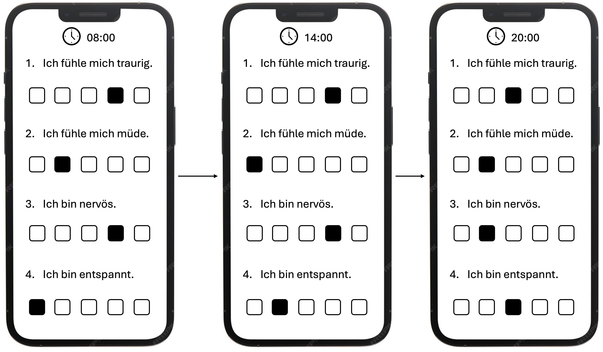
```

EMA-Erhebung von $N=1$ zu mehreren Uhrezeiten des Tages
]
]

---
class: top, left
### Einführung in Zeitreihenanalysen

#### Charakteristika von Zeitreihen

.pull-left[
* Zeitreihe: Abbilden von Schwankungen einer Variable über einen Zeitraum

* Beispiel: Stresslevel im Zeitverlauf

]


.pull-right[
.center[
```{r eval = TRUE, echo = F, out.width = "450px"}

```

EMA-Erhebung von $N=1$ zu mehreren Uhrezeiten des Tages
]
]

---
class: top, left
### Einführung in Zeitreihenanalysen

#### Charakteristika von Zeitreihen

.pull-left[
* Zeitreihe: Abbilden von Schwankungen einer Variable über einen Zeitraum

* Beispiel: Stresslevel im Zeitverlauf (inkl. Stressor/Krise)

* Mit Zeitreihendaten können wir Einblicke in die Dynamik einer Variable gewinnen. 

* Dies ist (genau genommen) mit Querschnittsdaten nicht möglich!

]


.pull-right[
.center[
```{r eval = TRUE, echo = F, out.width = "450px"}
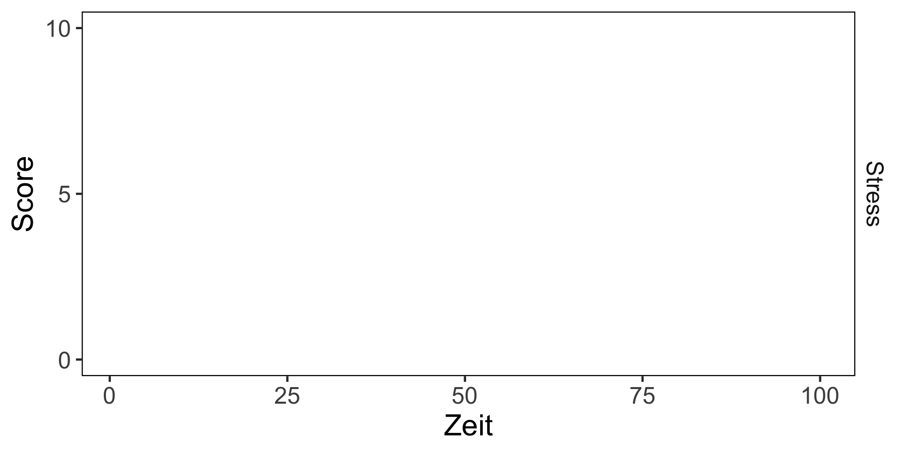
```

EMA-Erhebung von $N=1$ zu mehreren Uhrezeiten des Tages
]
]

---
class: top, left
### Einführung in Zeitreihenanalysen

#### Charakteristika von Zeitreihen

.pull-left[
* Zeitreihe: Abbilden der Schwankungen von 2 Variablen über einen Zeitraum

* Beispiel: Stresslevel und Schlaf im Zeitverlauf (inkl. Stressor/Krise)

* Mit Zeitreihendaten können wir Einblicke in die dynamischen Zusammenhänge zwischen Variablen gewinnen.

* Auch das ist mit Querschnittsdaten nicht möglich!

]


.pull-right[
.center[
```{r eval = TRUE, echo = F, out.width = "450px"}
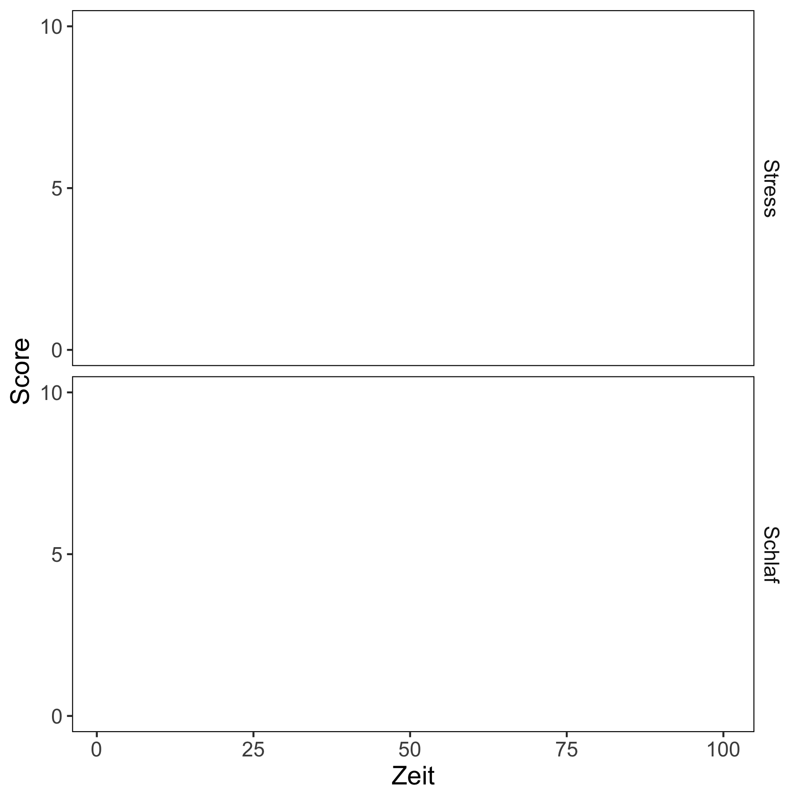
```
]
]

---
class: top, left
### Einführung in Zeitreihenanalysen

.pull-left[
#### Pathogenese - 1. Inaktives Netzwerk, stabiles Equilibrium

.center[
```{r eval = TRUE, echo = F, out.width = "2000px"}
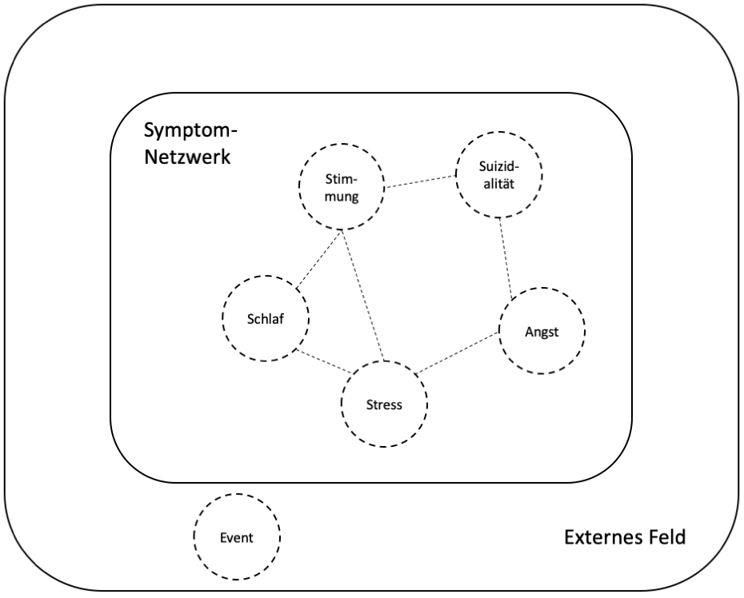
```
]


]
.pull-right[
.center[
```{r eval = TRUE, echo = F, out.width = "250px"}

```
]
]

---
class: top, left
### Einführung in Zeitreihenanalysen

.pull-left[
#### Pathogenese - 2. Netzwerk Aktivierung

.center[
```{r eval = TRUE, echo = F, out.width = "2000px"}
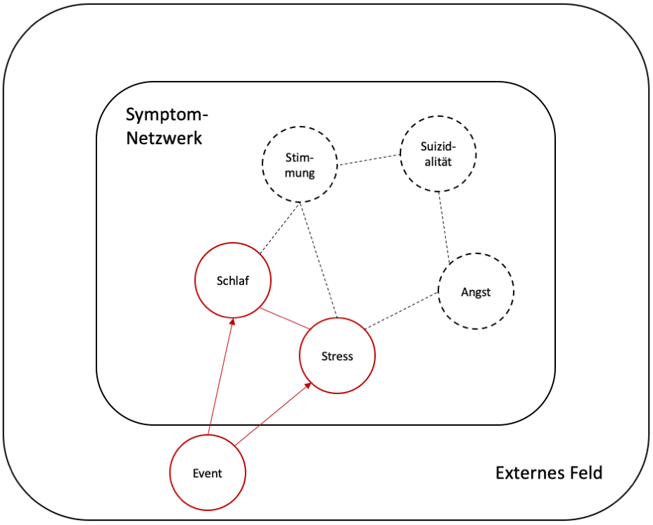
```
]
]

.pull-right[
.center[
```{r eval = TRUE, echo = F, out.width = "250px"}

```
]
]

---
class: top, left
### Einführung in Zeitreihenanalysen

.pull-left[
#### Pathogenese - 3. Symptomausbreitung

.center[
```{r eval = TRUE, echo = F, out.width = "2000px"}
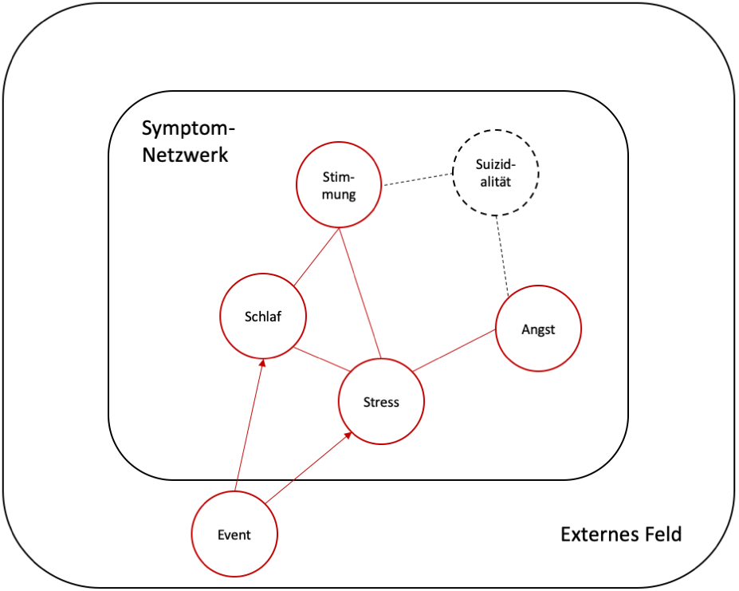
```
]
]
.pull-right[
.center[
```{r eval = TRUE, echo = F, out.width = "250px"}
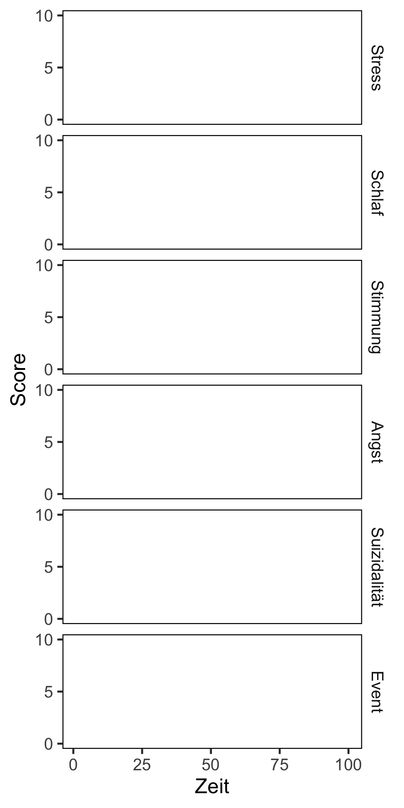
```
]
]

---
class: top, left
### Einführung in Zeitreihenanalysen

.pull-left[
#### Pathogenese - 4. Erkranktes Netzwerk, stabiles Equilibrium

.center[
```{r eval = TRUE, echo = F, out.width = "2000px"}
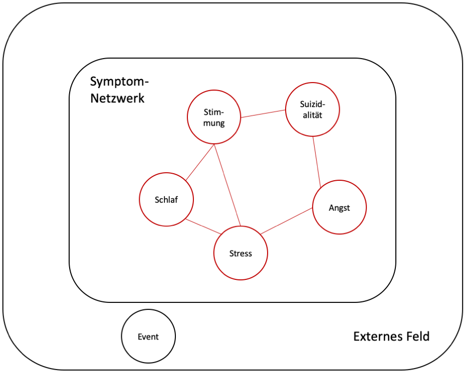
```
]
]

.pull-right[
.center[
```{r eval = TRUE, echo = F, out.width = "250px"}

```
]
]

---
class: top, left
### Einführung in Zeitreihenanalysen

#### Querschnittliche Daten und Zeitreihen

.pull-left[

.center[
```{r eval = TRUE, echo = F, out.width = "420px"}
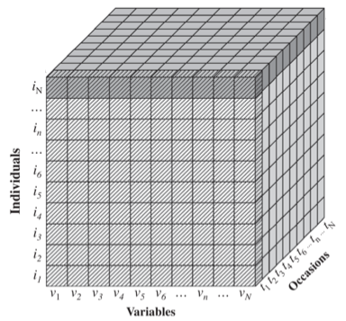
```
]
Barbot, B., & Perchec, C. (2015)
]

.pull-left[
Datenpunkte auf 3 Ebenen:

* Personen

* Variablen

* Messzeitpunkte (Zeitreihe = viele Messungen)

$\rightarrow$ Analyseansatz determiniert durch Kombination der Ebenen
]

---
class: top, left
### Einführung in Zeitreihenanalysen

#### Querschnittliche Daten und Zeitreihen

.center[
```{r eval = TRUE, echo = F, out.width = "620px"}
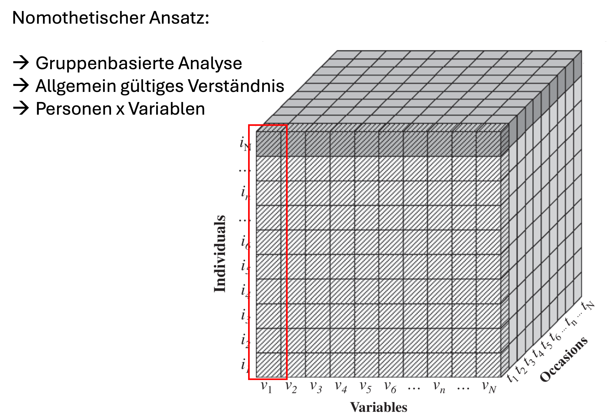
```
]

Barbot, B., & Perchec, C. (2015)

---
class: top, left
### Einführung in Zeitreihenanalysen

#### Querschnittliche Daten und Zeitreihen

.center[
```{r eval = TRUE, echo = F, out.width = "640px"}
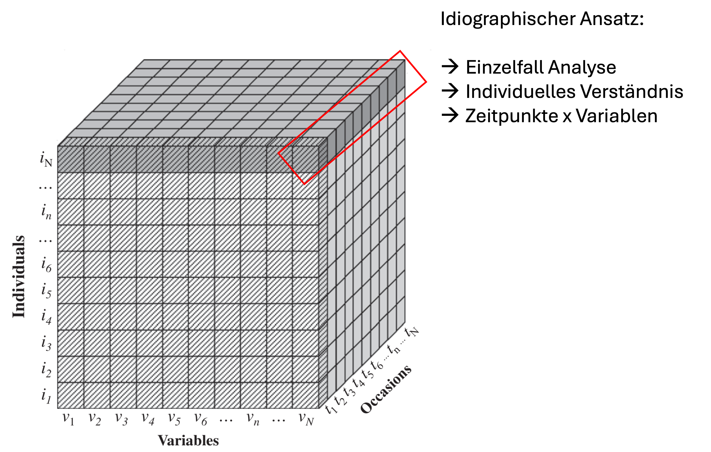
```
]

Barbot, B., & Perchec, C. (2015)

---
class: top, left
### Einführung in Zeitreihenanalysen

#### Querschnittliche Daten und Zeitreihen

.center[
```{r eval = TRUE, echo = F, out.width = "740px"}
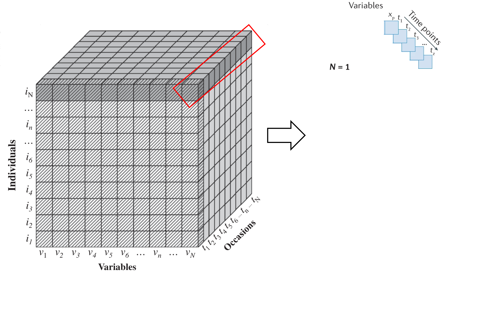
```
]


---
class: top, left
### Einführung in Zeitreihenanalysen

#### Querschnittliche Daten und Zeitreihen

.pull-left[
.center[
```{r eval = TRUE, echo = F, out.width = "740px"}
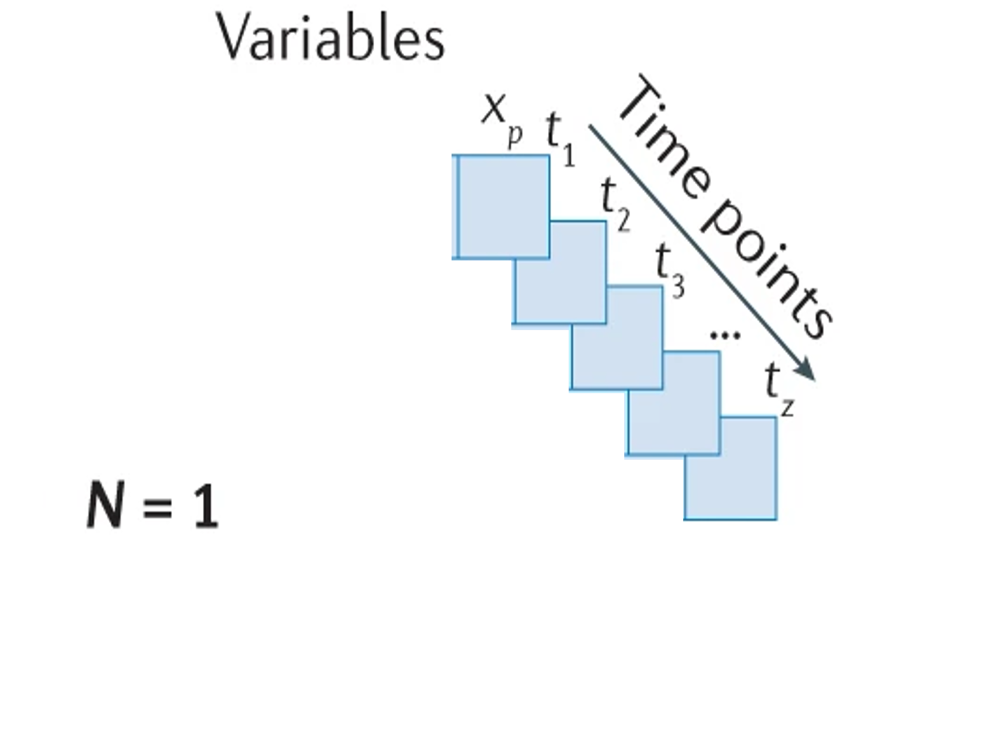
```
]
]

.pull-right[
```{r eval = TRUE, echo = F, out.width = "450px"}

```
]

---
class: top, left
### Einführung in Zeitreihenanalysen

#### Querschnittliche Daten und Zeitreihen

.center[
```{r eval = TRUE, echo = F, out.width = "740px"}
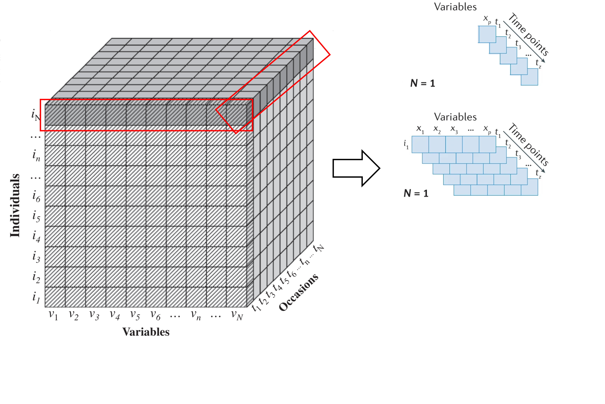
```
]

---
class: top, left
### Einführung in Zeitreihenanalysen

.pull-left[

#### Querschnittliche Daten und Zeitreihen

.center[
```{r eval = TRUE, echo = F, out.width = "740px"}
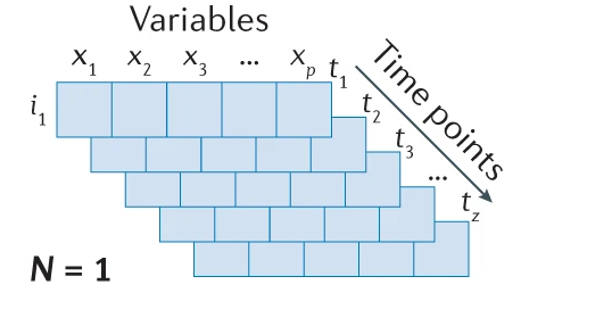
```
]
]

.pull-right[
```{r eval = TRUE, echo = F, out.width = "250px"}

```
]


---
class: top, left
### Einführung in Zeitreihenanalysen

#### Querschnittliche Daten und Zeitreihen

.center[
```{r eval = TRUE, echo = F, out.width = "740px"}
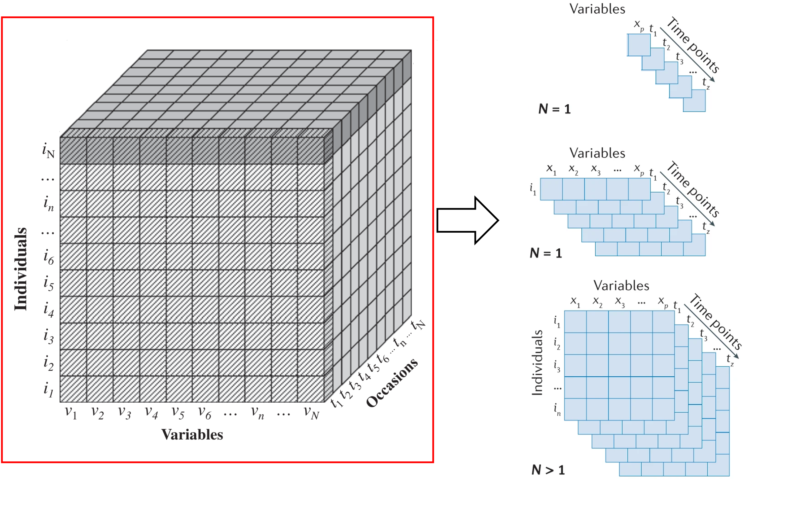
```
]

---
class: top, left
### Einführung in Zeitreihenanalysen

.pull-left[

#### Querschnittliche Daten und Zeitreihen

.center[
```{r eval = TRUE, echo = F, out.width = "740px"}
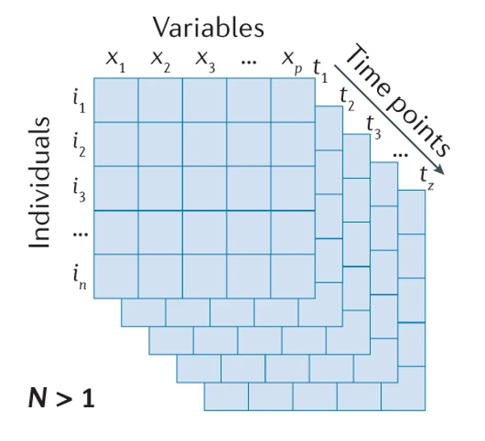
```
]
]

.pull-right[
```{r eval = TRUE, echo = F, out.width = "250px"}

```
]


---
class: top, left
### Einführung in Zeitreihenanalysen

#### Zeitreihen in R

* Zeitreihenanalyse in R nutzt oft Zeitreihenobjekte

* Diese haben einen fixen Startpunkt, ein Ende und eine Frequenz

* Nutzen oft so genannte Timestamps

* Eine Variable mit messwiederholten Werten kann mittels `ts()` in ein Zeitreihenobjekt umgewandelt werden

```{r echo=FALSE}
set.seed(123)
stress = round(as.numeric(abs(arima.sim(n = t, mean = 0.001, model = list(order = c(1,0,0), ar = 0.1))) + 3), 2)
```

.pull-left[
```{r eval=FALSE}
stress
```

.center[
```{r echo = F, out.width = "540px"}
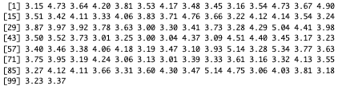
```
]

]

.pull-right[
```{r eval=FALSE}
ts(stress)
```

.center[
```{r echo = F, out.width = "540px"}
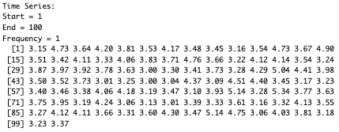
```
]
]

---
class: top, left
### Einführung in Zeitreihenanalysen

#### Zeitreihen in R

.pull-left[

* Zeitreihenobjekte haben nützliche Eigenschaften

* z.B. gibt es im Paket `forecast` eine `autoplot()` Funktion

* Diese Funktion hat alle Anpassungsmöglichkeiten von `ggplot2`
]

.pull-right[
```{r out.height = "350px"}
autoplot(ts(stress)) +
  theme(text = element_text(size = 20))
```
]

---
class: top, left
### Einführung in Zeitreihenanalysen

#### Bestandteile einer Zeitreihe

Eine Zeitreihe kann als Zusammensetzung aus vier Hauptkomponenten betrachtet werden: 

* Trend (engl. trend)

* Zyklus (engl. cycle)

* Saisonalität (engl. seasonality)

* Fehler/Residuum.(engl. error/residual part)

---
class: top, left
### Einführung in Zeitreihenanalysen

#### Bestandteile einer Zeitreihe

.center[
```{r echo = F, out.width = "740px"}

```
]

---
class: top, left
### Einführung in Zeitreihenanalysen

#### Zeitreihenzerlegung (engl. time-series decomposition)

```{r echo=FALSE}
Geburten = readr::read_rds("munich.rds")
Geburten = births + rnorm(length(Geburten),0,0.5)
Geburten <- ts(Geburten, frequency=12, start=c(1946,1))
```

.pull-left[
Beispiel:

* Geburtsraten in München 

* Dekomposition saisonaler Daten
]

.pull-right[

```{r fig.height=5}
autoplot(Geburten) +
  theme(text = element_text(size = 20))
```
]


---
class: top, left
### Einführung in Zeitreihenanalysen

.pull-left[

#### Zeitreihenzerlegung (engl. time-series decomposition)

Beispiel:

* Geburtsraten in München 

* Dekomposition saisonaler Daten

```{r}
Geburten_d <- decompose(Geburten)
```

```{r eval=FALSE}
autoplot(Geburten_d) +
  theme(text = element_text(size = 20))
```

]

.pull-right[

```{r echo = F, fig.height=7}
autoplot(Geburten_d) +
  theme(text = element_text(size = 20))
```
]


---
class: top, left
### Einführung in Zeitreihenanalysen

#### Zeitreihenzerlegung (engl. time-series decomposition)

.pull-left[
Beispiel:

* Geburtsraten in München 

* Dekomposition saisonaler Daten

```{r}
 adjusted <- Geburten - Geburten_d$seasonal
```

]

.pull-right[

```{r fig.height=5}
autoplot(adjusted) +
  theme(text = element_text(size = 20))
```
]

---
class: top, left
### Einführung in Zeitreihenanalysen

#### Autokorrelation

<small>

*	Definition:  Korrelation einer Zeitreihe mit sich selbst zu verschiedenen Zeitpunkten (Lags)  
	
*	Gibt an, wie stark aktuelle Werte von vergangenen Werten beeinflusst werden.
	
*	Interpretation: Ein hoher Autokorrelationswert deutet darauf hin, dass vergangene Beobachtungen einen starken Einfluss auf aktuelle Werte haben

* hoher Autokorrelationswert deutet auf Muster oder Trends in der Zeitreihe hin

.center[
```{r echo = F, out.width = "540px"}
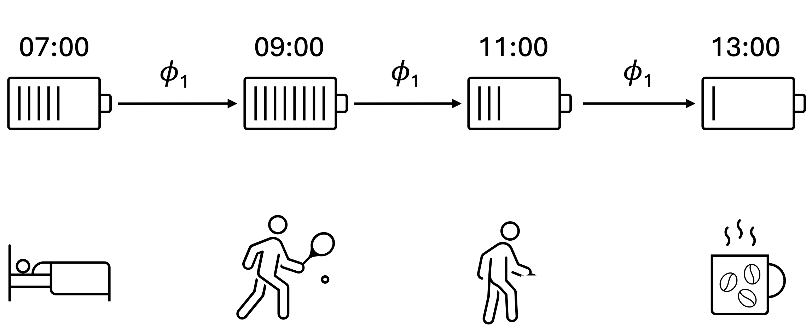
```

]

---
class: top, left
### Einführung in Zeitreihenanalysen

#### Autokorrelation in R

```{r echo=FALSE}
set.seed(123)  # Ensure reproducibility

# Generate a time series with high autocorrelation using an AR(1) process
n <- 100  # Number of observations
phi <- 0.9  # High autocorrelation coefficient

high_autocorr_series <- arima.sim(n = n, list(ar = phi))
low_autocorr_series <- rnorm(n, mean=0, sd=1)
```

.pull-left[
Niedrige Autokorrelation:

```{r echo=TRUE, fig.height=4}
autoplot(ts(low_autocorr_series)) + 
  labs(y = "Stress") +
  theme(text = element_text(size = 20))
```
]

.pull-right[
Hohe Autokorrelation:

```{r echo=TRUE, fig.height=4}
autoplot(ts(high_autocorr_series)) +  
  labs(y = "Stress") +
  theme(text = element_text(size = 20))
```
]


---
class: top, left
### Einführung in Zeitreihenanalysen

#### Autokorrelation in R

```{r echo=FALSE}
set.seed(123)  # Ensure reproducibility

# Generate a time series with high autocorrelation using an AR(1) process
n <- 100  # Number of observations
phi <- 0.9  # High autocorrelation coefficient

high_autocorr_series <- arima.sim(n = n, list(ar = phi))
low_autocorr_series <- rnorm(n, mean=0, sd=1)
```

.pull-left[
Niedrige Autokorrelation:

```{r echo=TRUE, fig.height=5}
acf(low_autocorr_series)
```
]

.pull-right[
Hohe Autokorrelation:

```{r echo=TRUE, fig.height=5}
acf(high_autocorr_series)
```
]

---
class: top, left
### Take-aways

.full-width[.content-box-gray[
*	Zeitreihen erfassen Veränderungen über die Zeit: Sie ermöglichen es, Schwankungen und Muster in psychologischen Variablen zu erkennen, die mit Querschnittsdaten nicht erfasst werden können.

*	Autokorrelation spielt eine zentrale Rolle: Datenpunkte sind zeitlich abhängig, d. h. vergangene Werte beeinflussen zukünftige Werte, was in der Analyse berücksichtigt werden muss.

*	Bestandteile einer Zeitreihe: Eine Zeitreihe setzt sich typischerweise aus Trend, Zyklus, Saisonalität und einem zufälligen Restanteil zusammen, die durch Zerlegung analysiert werden können.

*	Dekomposition hilft bei der Interpretation: Durch die Zerlegung in verschiedene Komponenten können wichtige Muster in den Daten erkannt und für Prognosen genutzt werden.
	
*	Praktische Anwendbarkeit in der Psychologie: Zeitreihenanalyse ist ein leistungsfähiges Instrument zur Untersuchung von Verhaltensmustern in natürlichen Umgebungen, z. B. durch Experience Sampling, Wearables oder Smartphone-Daten.

]
]


