```{r setup, include=FALSE}
options(htmltools.dir.version = FALSE)

library(tidyverse)
library(kableExtra)
library(ggplot2)
library(plotly)
library(htmlwidgets)
library(MASS)
library(ggpubr)
library(xaringanthemer)
library(xaringanExtra)
library(forecast)
library(MTS)

style_duo_accent(
  primary_color = "#621C37",
  secondary_color = "#EE0071",
  background_image = "blank.png"
)

source(file = "base_functions.R")

xaringanExtra::use_xaringan_extra(c("tile_view"))

use_scribble(
  pen_color = "#EE0071",
  pen_size = 4
  )

knitr::opts_chunk$set(
  fig.retina = TRUE,
  warning = FALSE,
  message = FALSE
)

source(file = "base_functions.R")
```

name: Title slide
class: middle, left
<br><br><br><br><br><br><br>
# Multivariate Verfahren
***
### Einheit 11: Zeitreihenanalyse (2)
##### `r format(as.Date(data.frame(readxl::read_excel("Multivariate Verfahren Termine.xlsx"))$Datum), "%d.%m.%Y")[11]` | Prof. Dr. Stephan Goerigk

---
class: top, left
### Einführung in Zeitreihenanalysen

#### Autokorrelation

.center[
```{r echo = F, out.width = "740px"}

```
]

*	Definition:  Korrelation einer Zeitreihe mit sich selbst zu verschiedenen Zeitpunkten (Lags)  
	
*	Gibt an, wie stark aktuelle Werte von vergangenen Werten beeinflusst werden.
	
*	Interpretation: Ein hoher Autokorrelationswert deutet darauf hin, dass vergangene Beobachtungen einen starken Einfluss auf aktuelle Werte haben

---
class: top, left
### Einführung in Zeitreihenanalysen

#### Lag in der Zeitreihenanalyse

*	Definition: Ein **Lag** bezeichnet eine vergangene Beobachtung einer Zeitreihe, die zur Vorhersage oder Analyse aktueller Werte genutzt wird.

.pull-left[
*	Notation: Ein Wert  $y_t$  mit einem Lag von 1 wird als  $y_{t-1}$  dargestellt.

 * $y_{t-1}:$ Eine Messung vor dem aktuellen Zeitpunkt
 
 * $y_{t-2}:$ Zwei Messungen vor dem aktuellen Zeitpunkt
 
 * ...

]

.pull-right[
.center[
```{r echo=FALSE}
d = data.frame(lag = c("t", "t-1", "t-2", "t-3", "..."),
               Energie = c(4, 7, 8, 11, "..."))

d %>%
  kbl() %>%
  kable_classic(full_width = T, position = "left", font_size = 18)
```

]
]

---
class: top, left
### Einführung in Zeitreihenanalysen

#### Autoregressive Modelle

.center[
```{r echo = F, out.width = "740px"}

```
]

* $y$ = Variable, von der eine Zeitreihe vorliegt

* $t-k$ = lag

* $\phi$ = Regressionsgewicht $\rightarrow$ Vorhersage künftiger Zeitpunkte $(t)$ durch vergangene Zeitpunkte $(t-k)$

* $u_k$ = Fehler/Residuum

---
class: top, left
### Einführung in Zeitreihenanalysen

#### Autoregressive Modelle: Lag-1 Modell

.center[
```{r echo = F, out.width = "740px"}
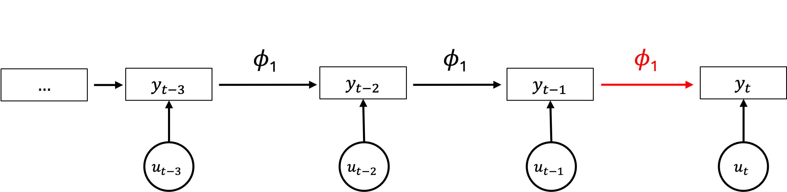
```
]

Formel Autoregressives Lag-1 Modell:

$$y_t = \phi_1 y_{t-1} + u_t$$

* Der Wert zum jeweiligen Zeitpunkt $(t)$ wird durch die direkt vorher erfolgte Messung vorhergesagt $(t-1)$

---
class: top, left
### Einführung in Zeitreihenanalysen

#### Autoregressive Modelle: Lag-2 Modell

.center[
```{r echo = F, out.width = "740px"}
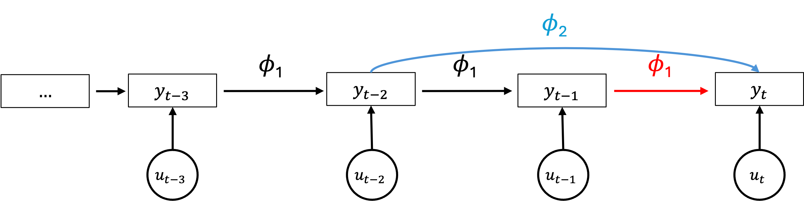
```
]

Formel Autoregressives Lag-2 Modell:

$$y_t = \phi_1 y_{t-1} + \phi_2 y_{t-2} + u_t$$

* Der Wert zum jeweiligen Zeitpunkt $(t)$ wird durch die beiden zuvor erfolgten Messungen vorhergesagt

* Wichtig: Welcher Lag gewählt wird hängt von der Fragestellung ab

* Zentrale Frage für Wahl des Lags: Wie lange dauert es in der Messreihe, bis sich ein Effekt realisiert?

* Psychologische Effekte für EMA werden oft mit Lag-1 modelliert.

---
class: top, left
### Einführung in Zeitreihenanalysen

#### Zeitreihen Regressionsmodelle $(N=1)$

Auswahl:

* Univariat:

  * Autoregressive Modelle (AR)
  
  * Moving Average Modelle (MA)
  
  * Autoregressive Moving Average Modelle (ARMA)
  
  * Autoregressive Integrated Moving Average Modelle (ARIMA)

* Multivariat:

  * Vektor Autoregressive Modelle

---
class: top, left
### Einführung in Zeitreihenanalysen

#### Zeitreihen Regressionsmodelle $(N=1)$

**Autoregressive Modelle (AR):**

*	Definition: Modelliert aktuelle Werte als lineare Funktion ihrer eigenen vergangenen Werte (Lags).

*	Formel:

$$y_t = \phi_1 y_{t-1} + \phi_2 y_{t-2} + \ldots + \phi_p y_{t-k} + \epsilon_t$$

*	Verwendung: Gut geeignet für stationäre Zeitreihen mit wiederkehrenden Mustern.

*	Beispiel: AR(1), AR(2)

---
class: top, left
### Einführung in Zeitreihenanalysen

#### Zeitreihen Regressionsmodelle $(N=1)$

**Moving Average Modelle (MA)**

* Modelliert den aktuellen Wert basierend auf vergangenen Fehlertermen (Schocks).

*	Formel für MA (Lag 1):

$$y_t = \mu + \theta_1 \epsilon_{t-1} + \epsilon_t$$

* Zentraler Unterschied: Nur Fehlervariationen (Schocks) aus der Vergangenheit bestimmen die Werte, keine direkten Lags von  $y_t$.
	

---
class: top, left
### Einführung in Zeitreihenanalysen

#### Zeitreihen Regressionsmodelle $(N=1)$

**Autoregressive Moving Average Modelle (ARMA)**

* Kombination aus AR und MA, modelliert sowohl vergangene Werte als auch Fehlerterme.

* Lag muss für Fehler und Variable gewählt werden

*	Formel für ARMA (Lag 1, Lag 1):

$$y_t = \phi_1 y_{t-1} + \theta_1 \epsilon_{t-1} + \epsilon_t$$

*	Zentraler Unterschied: Berücksichtigt sowohl eigene vergangene Werte (AR) als auch vergangene Fehler (MA).
	

---
class: top, left
### Einführung in Zeitreihenanalysen

#### Stationarität in der Zeitreihenanalyse

*	Definition: Eine stationäre Zeitreihe hat konstante statistische Eigenschaften über die Zeit.

*	Kriterien für Stationarität:

	1.	Konstanter Mittelwert: Der Erwartungswert  $E(y_t)$  bleibt über die Zeit stabil.
	
	2.	Konstante Varianz: Die Streuung der Werte bleibt konstant  $Var(y_t) = \sigma^2$.
	
	3.	Konstante Autokorrelation: Die Korrelation zwischen Werten hängt nur vom Abstand (Lag), nicht vom Zeitpunkt ab.
	
*	Warum wichtig? Viele Zeitreihenmodelle (z.B. AR, MA, ARMA) setzen Stationarität voraus.

*	Lösung bei nicht-stationären Daten: Differenzierung $(\nabla y_t = y_t - y_{t-1})$ oder Transformationen (z. B. Logarithmus).

---
class: top, left
### Einführung in Zeitreihenanalysen

#### Stationarität in der Zeitreihenanalyse

.pull-left[
*	Kriterien für Stationarität:

	1.	Konstanter Mittelwert: Der Erwartungswert  $E(y_t)$  bleibt über die Zeit stabil.
	
	2.	Konstante Varianz: Die Streuung der Werte bleibt konstant  $Var(y_t) = \sigma^2$.
	
	3.	Konstante Autokorrelation: Die Korrelation zwischen Werten hängt nur vom Abstand (Lag), nicht vom Zeitpunkt ab.
]

.pull-right[
```{r echo=FALSE, fig.height=6}
set.seed(12)

df = data.frame(Stationarität = c(rep("Ja", 1000), rep("Nein\n(linearer Trend)", 1000)),
                Zeit = c(1:1000, 1:1000),
                TS = c(abs(arima.sim(n = 1000, mean = 0.001, model = list(order = c(1,0,0), ar = 0.1))),
                       abs(arima.sim(n = 1000, mean = 0.001, model = list(order = c(1,0,0), ar = 0.1))) + 0.006 * (1:1000))
)
ggplot(df, aes(x = Zeit, y = TS, colour = Stationarität)) +
  scale_y_continuous(breaks = c(0, 5, 10)) +
  geom_line(aes(group = Stationarität)) +
  scale_color_manual(values = c("Ja" = "black",
                                "Nein\n(linearer Trend)" = "red")) +
  labs(x = "Zeit") +
  coord_cartesian(ylim = c(0,10)) +
  mytheme +
  theme(legend.position = "bottom",
        text = element_text(size = 20)) 

```
]

---
class: top, left
### Einführung in Zeitreihenanalysen

#### Stationarität in der Zeitreihenanalyse

Umgang mit Stationarität

* Linearen Trend testen:

	*	Regressiere die Variable die Zeitvariable.
	
	*	Falls der Trend signifikant ist, sollte eine Detrending-Methode angewendet werden.
	
```{r eval=FALSE}
lm_y <- lm(y ~ time, data = data)  # Lineare Regression

data$y_detrended <- residuals(lm_y)  # Ersetze y durch für linearen Trend bereinigte Residuen
```

* Wichtiger Hinweis:

  *	Diese Methode entfernt nur lineare Trends.
  *	Es garantiert nicht, dass die Zeitreihe stationär ist.
  *	Es können weiterhin andere Arten von Trends oder verschiedene Formen der Nicht-Stationarität vorliegen.

---
class: top, left
### Einführung in Zeitreihenanalysen

#### Zeitreihen Regressionsmodelle $(N=1)$

**Autoregressive Integrated Moving Average Modelle (ARIMA)**

*	Erweiterung von ARMA, berücksichtigt zusätzlich Trends durch Differenzbildung $(\nabla y_t)$.

* Auch für die Differenzbildung muss ein passender Lag gewählt werden.

*	Formel für ARIMA(Lag 1, Lag 1, Lag 1):

$$\nabla y_t = \phi_1 \nabla y_{t-1} + \theta_1 \epsilon_{t-1} + \epsilon_t$$
wobei  $\nabla y_t = y_t - y_{t-1}$.

* Zentraler Unterschied: “Integrated” (I) bedeutet, dass die Zeitreihe durch Differenzbildung stationär gemacht wird.

---
class: top, left
### Einführung in Zeitreihenanalysen

#### Zeitreihen Regressionsmodelle $(N=1)$

**Autoregressive Integrated Moving Average Modelle (ARIMA)**

**ARIMA in R:**

Ein ARIMA (Autoregressive Integrated Moving Average)-Modell wird durch drei Parameter definiert:  $p$,  $d$  und  $q$ , die die Modellstruktur bestimmen.

* $p$  – Autoregressiver (AR) Anteil

* $d$  – Differenzierungsgrad (I für Integrated)

* $q$  – Moving-Average (MA) Anteil

---
class: top, left
### Einführung in Zeitreihenanalysen

#### Zeitreihen Regressionsmodelle $(N=1)$

**Autoregressive Integrated Moving Average Modelle (ARIMA)**

**ARIMA in R:**

$p$  – Autoregressiver (AR) Anteil
	
*	Gibt an, wie viele vergangene Werte $( y_{t-k} )$ zur Vorhersage von  $y_t$  genutzt werden.

*	Höheres  p  bedeutet, dass vergangene Werte einen stärkeren Einfluss auf zukünftige Werte haben.

*	Identifiziert durch die Partielle Autokorrelationsfunktion (PACF).

Beispiel: AR(2)-Modell

$$y_t = \phi_1 y_{t-1} + \phi_2 y_{t-2} + \epsilon_t$$

* $y_t$  hängt von den zwei vorherigen Zeitpunkten ab.

---
class: top, left
### Einführung in Zeitreihenanalysen

#### Zeitreihen Regressionsmodelle $(N=1)$

**Autoregressive Integrated Moving Average Modelle (ARIMA)**

**ARIMA in R:**

<small>

$d$  – Differenzierungsgrad (I für Integrated)

*	Anzahl der Differenzierungen, um die Daten stationär zu machen.

*	Differenzieren entfernt Trends und stabilisiert die Varianz.

*	Eine erste Differenzierung ist:

$$\nabla y_t = y_t - y_{t-1}$$

*	Wird mit dem Augmented-Dickey-Fuller-Test (ADF-Test) bestimmt.

Typische Werte:
*	 $d$ = 0 : Daten sind bereits stationär.
*	 $d$ = 1 : Erste Differenzierung (bei linearen Trends).
*	 $d$ = 2 : Zweite Differenzierung (bei quadratischen Trends).
	
---
class: top, left
### Einführung in Zeitreihenanalysen

#### Zeitreihen Regressionsmodelle $(N=1)$

**Autoregressive Integrated Moving Average Modelle (ARIMA)**

**ARIMA in R:**

$q$  – Moving-Average (MA) Anteil

*	Gibt die Anzahl der vergangenen Fehlerterme $( \epsilon_{t-k} )$ an, die im Modell berücksichtigt werden.

*	Hilft, kurzfristige Schwankungen zu glätten.

*	Identifiziert durch die Autokorrelationsfunktion (ACF).

Beispiel: MA(1)-Modell

$$y_t = \mu + \theta_1 \epsilon_{t-1} + \epsilon_t$$

* $y_t$  hängt vom vorherigen Fehlerterm ab.
 
---
class: top, left
### Einführung in Zeitreihenanalysen

#### Zeitreihen Regressionsmodelle $(N=1)$

**Autoregressive Integrated Moving Average Modelle (ARIMA)**

**ARIMA in R:**

Wie wählt man  p, d, q ?

*	 $d:$ Stationarität mit dem Dickey-Fuller-Test prüfen.

*	 $p:$ Partielle Autokorrelationsfunktion (PACF) analysieren.

*	 $q:$ Autokorrelationsfunktion (ACF) analysieren.

$\rightarrow$ In R gibt es eine Funktion, die diese Anpassung automatisch übernimmt (`auto.arima()`)

---
class: top, left
### Einführung in Zeitreihenanalysen

#### Zeitreihen Regressionsmodelle $(N=1)$

**Autoregressive Integrated Moving Average Modelle (ARIMA)**

**ARIMA in R:**

.pull-left[
* Beispiel für monatliche Krankenhausaufnahmen psychiatrischer Kliniken

* Zeitreihe über mehrere Jahre

* Ziel: ARIMA Modell zur Vorhersage künftiger Patient:innenzahlen
]

.pull-right[
```{r echo=FALSE, fig.height=4}
# Load the AirPassengers dataset
data <- AirPassengers

# Convert to time series object
ts_data <- ts(data, start = c(1949,1), frequency = 12)

# Plot the time series
autoplot(ts_data) + 
  ggtitle("Monatliche Krankenhausaufnahmen") +
  xlab("Jahr") + ylab("Patienten") +
  theme_minimal()
```
]

---
class: top, left
### Einführung in Zeitreihenanalysen

#### Zeitreihen Regressionsmodelle $(N=1)$

**Autoregressive Integrated Moving Average Modelle (ARIMA)**

**ARIMA in R:**

.pull-left[
.code80[
```{r}
library(tseries)
adf_test <- adf.test(ts_data)
print(adf_test)
```
]

* Wenn der p-Wert >.05 ist Datensatz nicht stationär 
]

.pull-right[
```{r echo=FALSE, fig.height=4}
autoplot(ts_data) + 
  ggtitle("Monatliche Krankenhausaufnahmen") +
  xlab("Jahr") + ylab("Patienten") +
  theme_minimal()
```
]

---
class: top, left
### Einführung in Zeitreihenanalysen

#### Zeitreihen Regressionsmodelle $(N=1)$

**Autoregressive Integrated Moving Average Modelle (ARIMA)**

**ARIMA in R:**

.pull-left[
.code80[
```{r}
diff_data <- diff(ts_data)
```
]

* Differenzierung erster Ordnerung (1x)

* Trends entfernen um Stationarität herzustellen
]

.pull-right[
```{r echo=FALSE, fig.height=4}
autoplot(diff_data) + 
  ggtitle("Monatliche Krankenhausaufnahmen") +
  xlab("Jahr") + ylab("Patienten") +
  theme_minimal()
```
]


---
class: top, left
### Einführung in Zeitreihenanalysen

#### Zeitreihen Regressionsmodelle $(N=1)$

**Autoregressive Integrated Moving Average Modelle (ARIMA)**

**ARIMA in R:**

.code80[
```{r}
arima_model <- auto.arima(ts_data)

summary(arima_model)
```
]

---
class: top, left
### Einführung in Zeitreihenanalysen

#### Zeitreihen Regressionsmodelle $(N=1)$

**Autoregressive Integrated Moving Average Modelle (ARIMA)**

**ARIMA in R:**

.pull-left[
.code80[
```{r}
forecast_values <- forecast(arima_model, h = 24)
```
]

* Auf Basis des ARIMA Modells kann eine Vorhersage gemacht werden

* Hier für die nächsten 24 Monate (2 Jahre)

* Interpretation der Schwankungen - Mehr psychiatrische Aufnahmen in Winter 

]

.pull-right[
```{r echo=FALSE, fig.height=4}
autoplot(forecast_values) + 
  ggtitle("Monatliche Krankenhausaufnahmen (blau = vorhergesagt)") +
  xlab("Jahr") + ylab("Patienten") +
  theme_minimal()
```
]

---
class: top, left
### Einführung in Zeitreihenanalysen

#### Zeitreihen Regressionsmodelle $(N=1)$

Übersicht univariater Modelle:

<small>

<table border="1">
    <tr>
        <th>Modell</th>
        <th>Vergangenheit (Lags von y)</th>
        <th>Fehlerterme</th>
        <th>Trend-Anpassung (Differenzierung)</th>
        <th>Wann verwenden?</th>
    </tr>
    <tr>
        <td><b>AR</b> (Autoregressiv)</td>
        <td>✅ Ja</td>
        <td>❌ Nein</td>
        <td>❌ Nein</td>
        <td>Wenn aktuelle Werte stark von vergangenen Werten abhängen, aber kein Rauschen berücksichtigt werden muss.</td>
    </tr>
    <tr>
        <td><b>MA</b> (Moving Average)</td>
        <td>❌ Nein</td>
        <td>✅ Ja</td>
        <td>❌ Nein</td>
        <td>Wenn aktuelle Werte eher durch zufällige Schocks (Fehlerterme) aus der Vergangenheit beeinflusst werden.</td>
    </tr>
    <tr>
        <td><b>ARMA</b> (Autoregressive Moving Average)</td>
        <td>✅ Ja</td>
        <td>✅ Ja</td>
        <td>❌ Nein</td>
        <td>Wenn sowohl vergangene Werte als auch Fehlerterme die aktuellen Werte beeinflussen, aber kein Trend vorhanden ist.</td>
    </tr>
    <tr>
        <td><b>ARIMA</b> (Autoregressive Integrated Moving Average)</td>
        <td>✅ Ja</td>
        <td>✅ Ja</td>
        <td>✅ Ja</td>
        <td>Wenn zusätzlich zu autoregressiven und Fehler-Einflüssen ein Trend entfernt werden muss, um Stationarität herzustellen.</td>
    </tr>
</table>

---
class: top, left
### Einführung in Zeitreihenanalysen

#### Vektor-Autoregressionen $($mehrere Variablen, $N=1)$

.center[
```{r echo = F, out.width = "740px"}
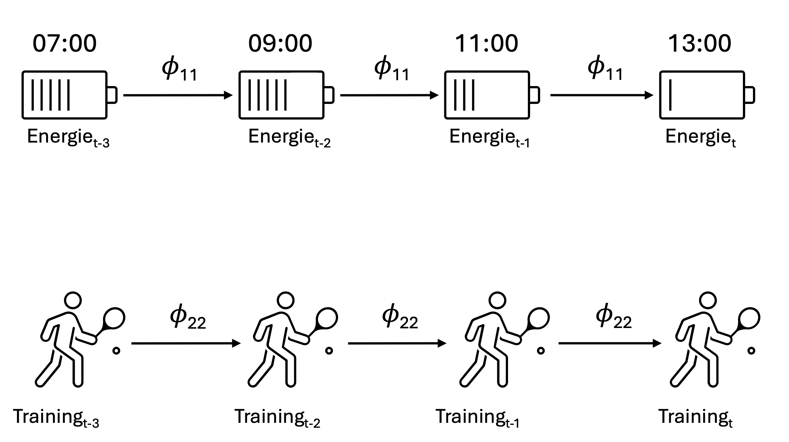
```
]

---
class: top, left
### Einführung in Zeitreihenanalysen

#### Vektor-Autoregressionen $($mehrere Variablen, $N=1)$

.center[
```{r echo = F, out.width = "740px"}
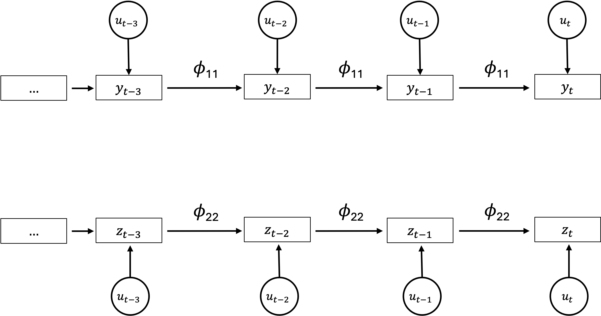
```
]

---
class: top, left
### Einführung in Zeitreihenanalysen

#### Vektor-Autoregressionen $($mehrere Variablen, $N=1)$

.center[
```{r echo = F, out.width = "740px"}
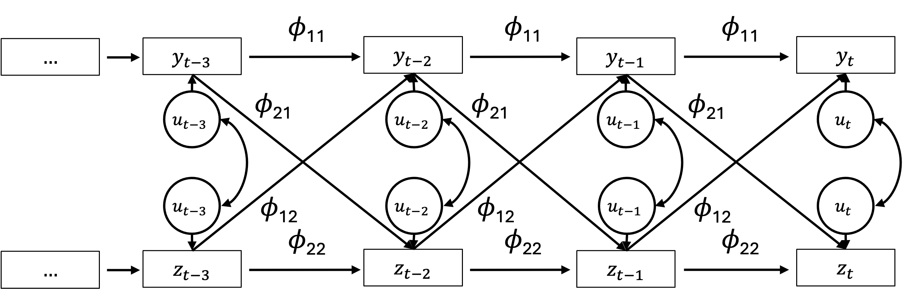
```
]

<small>

* $y$ = 1. Variable, von der eine Zeitreihe vorliegt

* $z$ = 2. Variable, von der eine Zeitreihe vorliegt

* $t-k$ = lag

* $\phi$ = Regressionsgewicht $\rightarrow$ Vorhersage künftiger Zeitpunkte $(t)$ durch vergangene Zeitpunkte $(t-k)$

* $u_k$ = Fehler/Residuum


---
class: top, left
### Einführung in Zeitreihenanalysen

#### Vektor-Autoregressionen $($mehrere Variablen, $N=1)$

.center[
```{r echo = F, out.width = "740px"}
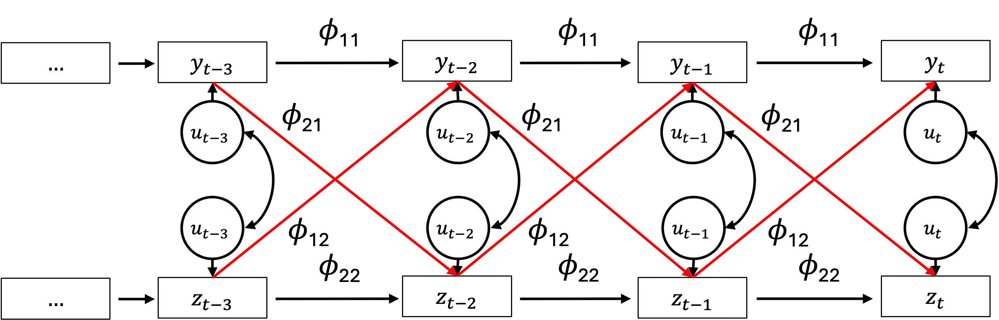
```
]

* Crossed aka Crossed-Lagged Pfade (engl. temporal effects)

* Messung einer Variable sagt nächste Messung der anderen Variable vorher

* Wenn eine Variable die andere bei der nächsten Messung vorhersagt $\rightarrow$ **Granger Kausalität**

---
class: top, left
### Einführung in Zeitreihenanalysen

#### Vektor-Autoregressionen $($mehrere Variablen, $N=1)$

**Temporal Effect:**

.pull-left[
* Messung einer Variable sagt nächste Messung der anderen Variable vorher

* Entspricht der Vorhersage von $y_t$ durch $z_{t-1}$

* „Wenn ich jetzt Sport treibe, werde ich im nächsten Zeitraum weniger energiegeladen sein."
]

.pull-right[
.center[
```{r echo = F, out.width = "340px"}
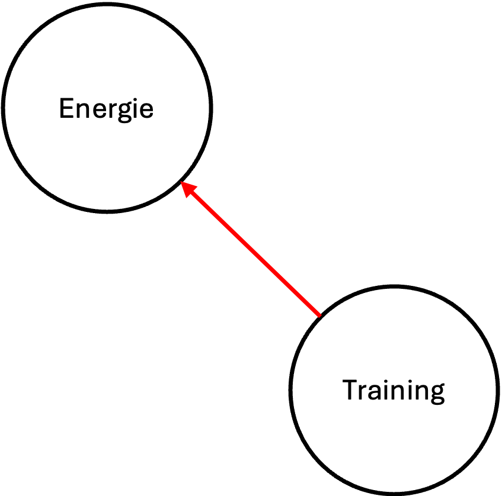
```
]
]

---
class: top, left
### Einführung in Zeitreihenanalysen

#### Vektor-Autoregressionen $($mehrere Variablen, $N=1)$

.center[
```{r echo = F, out.width = "740px"}
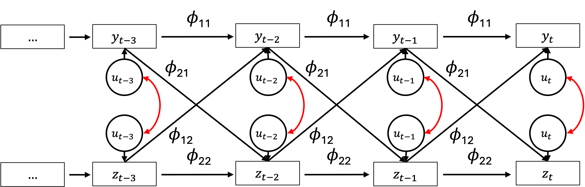
```
]

* Durchschnittliche Korrelation zwischen den Residuen

* Entspricht dem für zeitliche Effekte bereinigten Zusammenhang zwischen den Variablen

* Gleichzeitiger Effekt (engl. contemporaneous)

---
class: top, left
### Einführung in Zeitreihenanalysen

#### Vektor-Autoregressionen $($mehrere Variablen, $N=1)$

**Contemporaneous Effect:**

.pull-left[
* Durchschnittliche Korrelation zwischen den Residuen

* Entspricht dem für zeitliche Effekte bereinigten Zusammenhang zwischen den Variablen

* Gleichzeitiger Effekt (engl. contemporaneous)

* „Während ich Sport treibe, fühle ich mich energiegeladen."
]

.pull-right[
.center[
```{r echo = F, out.width = "340px"}
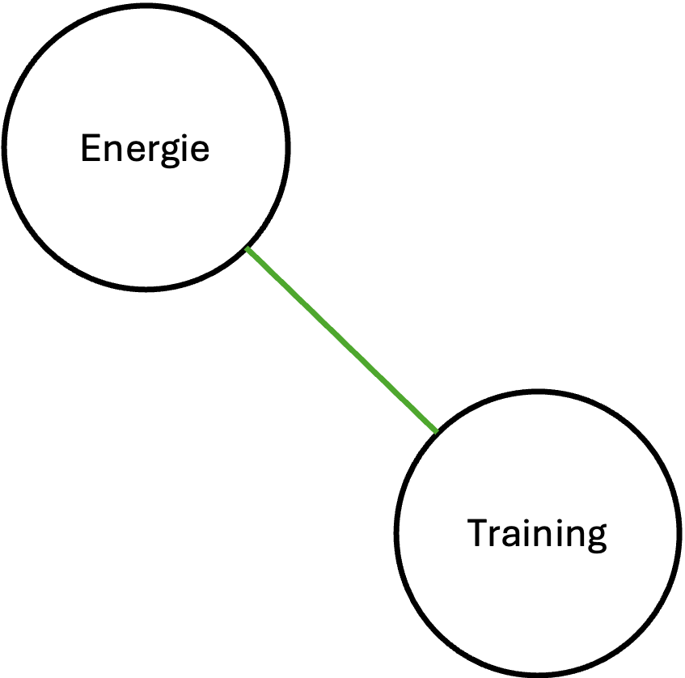
```
]
]

---
class: top, left
### Einführung in Zeitreihenanalysen

#### Vektor-Autoregressionen $($mehrere Variablen, $N=1)$

**Temporal Effect vs. Contemporaneous Effect:**

.center[
```{r echo = F, out.width = "740px"}
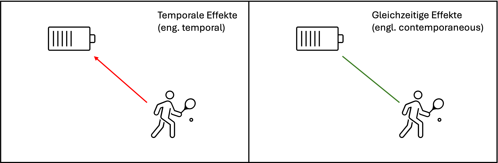
```
]

.pull-left[
„Wenn ich jetzt Sport treibe, werde ich im nächsten Zeitraum weniger energiegeladen sein."
]

.pull-right[
„Während ich Sport treibe, fühle ich mich energiegeladen."
]
---
class: top, left
### Einführung in Zeitreihenanalysen

#### Vektor-Autoregressionen $($mehrere Variablen, $N=1)$

.center[
```{r echo = F, out.width = "740px"}
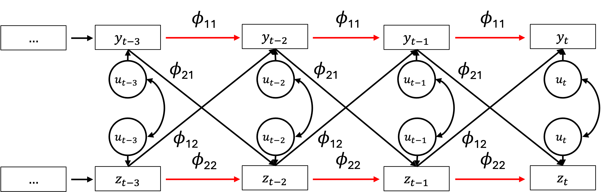
```
]

* Autoregressive Pfade

* Messung einer Variable sagt ihre nächste Messung vorher (Autokorrelation)

---
class: top, left
### Einführung in Zeitreihenanalysen

#### Vektor-Autoregressionen $($mehrere Variablen, $N=1)$

**Autoregressiver Effect:**

.pull-left[
* Autoregressive Pfade

* Messung einer Variable sagt ihre nächste Messung vorher (Autokorrelation)

* „Wenn ich jetzt energiegeladen bin, werde ich es wahrscheinlich auch im nächsten Zeitraum noch sein.“
]

.pull-right[
.center[
```{r echo = F, out.width = "340px"}
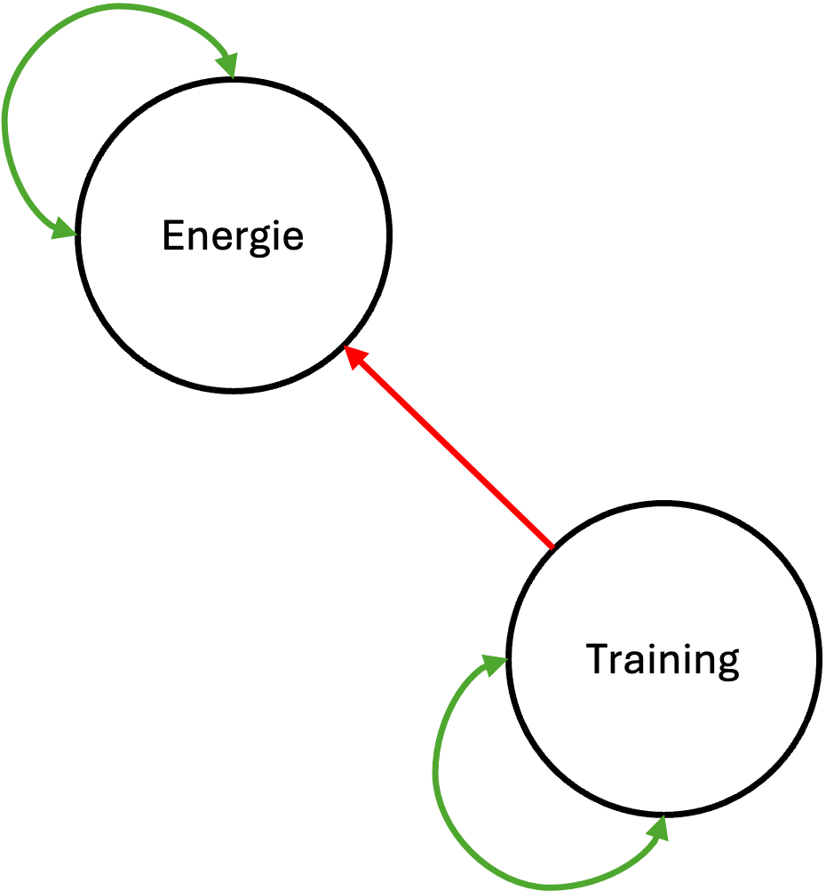
```
]
]

---
class: top, left
### Einführung in Zeitreihenanalysen

#### Mulilevel Vektor-Autoregressionen $($mehrere Variablen, $N>1)$

**VAR in R:**

.pull-left[

* Ein Vektorautoregressives (VAR) Modell wird verwendet, wenn wir mehrere Zeitreihen haben, die sich gegenseitig über die Zeit beeinflussen. 

* Im Gegensatz zu ARIMA, das eine einzelne Zeitreihe modelliert, erfasst VAR multivariate Zusammenhänge zwischen mehreren Variablen.
]

```{r echo=FALSE}
set.seed(42)

# Create time series data
n <- 100
time <- 1:n
Energie <- arima.sim(model = list(ar = 0.5), n = n)  # AR(1) process
Training <- 0.4 * Energie + arima.sim(model = list(ar = 0.3), n = n)  # x2 depends on x1

# Combine into a data frame
data <- data.frame(Time = time, Energie = Energie, Training = Training)
ts_data <- ts(data[, -1])  # Remove "Time" column
data_matrix = cbind(Energie, Training)
```

.pull-right[
```{r echo=FALSE, fig.height=5}
ggplot() +
  geom_line(data = data, aes(x = Time, y = Energie), color = "blue") +
  geom_line(data = data, aes(x = Time, y = Training), color = "red") +
  labs(title = "Rot = Trainingsintensität, Blau = Energie",
       x = "Time",
       y = "Value") +
  mytheme +
  theme(text = element_text(size = 20))
```
]

---
class: top, left
### Einführung in Zeitreihenanalysen

#### Vektor-Autoregressionen $($mehrere Variablen, $N=1)$

**VAR in R (Bringmann et al. 2013):**

```{r eval=FALSE}
Vars <- c("relaxed", "sad", "nervous","concentration", "tired", "rumination", "bodily.discomfort")
graphicalVAR(vars = Vars, dayvar = Day)
```
.center[
```{r echo = F, out.width = "640px"}
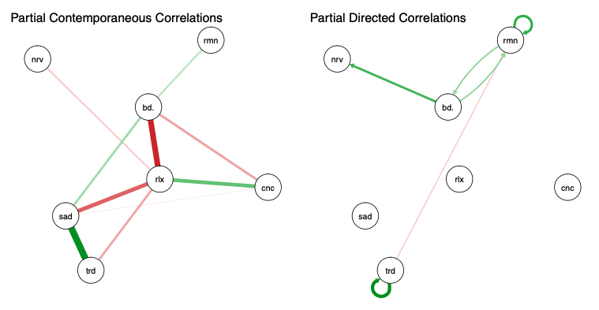
```
]


---
class: top, left
### Take-aways

.full-width[.content-box-gray[
* Zeitreihen weisen oft Abhängigkeiten zwischen aufeinanderfolgenden Messzeitpunkten auf. Autoregressive Modelle nutzen diese Struktur zur Vorhersage.

* Viele Zeitreihenmodelle (z. B. AR, MA, ARMA) setzen Stationarität voraus. Nicht-stationäre Daten müssen oft durch Differenzierung oder Transformationen angepasst werden.

* AR-Modelle nutzen vergangene Werte, MA-Modelle vergangene Fehler, ARMA kombiniert beides, und ARIMA erlaubt zusätzlich Differenzierung zur Trendanpassung.

* Die Autokorrelationsfunktion (ACF) und partielle Autokorrelationsfunktion (PACF) helfen, geeignete Modellparameter für ARIMA-Modelle zu bestimmen.

* Vektorautoregressive Modelle (VAR) ermöglichen die Modellierung von Wechselwirkungen zwischen mehreren Zeitreihen und liefern Erkenntnisse über zeitabhängige Beziehungen.

* Zeitverzögerte Effekte (“Temporal Effects”) und gleichzeitige Zusammenhänge (“Contemporaneous Effects”) sollten unterschieden werden, um dynamische Prozesse korrekt zu interpretieren.
]
]


